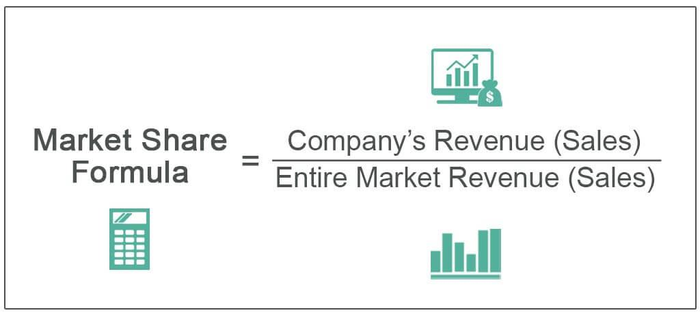

## Table of Contents

## What is market share and why is it important for a company?

Market share is the part of total sales in an industry that a company has. It is usually shown as a percentage. If a company has a big market share, it means they sell more than other companies in the same industry. For example, if a company has a 30% market share, it means they have 30% of all the sales in that industry.

Market share is important for a company because it shows how well they are doing compared to other companies. A bigger market share can mean the company is more popular or has better products. It can also help the company get more money and grow bigger. Knowing their market share helps a company see if they need to change their plans or if they are doing well.

## How can market share be calculated?

To calculate market share, you need to know two things: the total sales of the company and the total sales of the whole industry. First, find out how much the company sold. This could be in dollars or units, depending on what you want to measure. Then, find out the total sales for the entire industry. Once you have these numbers, you can calculate the market share by dividing the company's sales by the industry's total sales. After that, multiply the result by 100 to get a percentage. For example, if a company sold $50 million and the industry total was $200 million, the market share would be ($50 million / $200 million) * 100 = 25%.

Market share can also be calculated using units sold instead of dollars. For instance, if a company sold 10,000 units and the total units sold in the industry were 50,000, the market share would be (10,000 units / 50,000 units) * 100 = 20%. It's important to use the same measure (either dollars or units) for both the company and the industry to get an accurate market share. This calculation helps companies understand their position in the market and make better business decisions.

## What data is needed to determine a company's market share?

To find out a company's market share, you need to know two main things: the total sales of the company and the total sales of the whole industry. The company's sales can be measured in dollars or in the number of units sold. The industry's total sales are the sum of all sales from every company in that industry, using the same measure as the company's sales.

Once you have these numbers, you can calculate the market share by dividing the company's sales by the industry's total sales. Then, you multiply the result by 100 to turn it into a percentage. For example, if a company sold $50 million and the industry sold $200 million, the market share would be 25%. This calculation helps companies see how they are doing compared to others in the industry.

## Can market share be measured in different ways, and if so, how?

Market share can be measured in different ways, depending on what you want to look at. One common way is to use money, like dollars. You can find out how much money a company made from selling its products or services, and then compare that to the total money made by all companies in the same industry. This gives you the percentage of the market that the company has based on money.

Another way to measure market share is by counting the number of units sold. Instead of looking at dollars, you count how many products a company sold and compare that to the total number of products sold by everyone in the industry. This can be useful if you want to see how many items a company is selling, not just how much money they are making from those sales.

Both ways of measuring market share can be helpful. They give different views of a company's position in the market. Using money can show how much a company is [earning](/wiki/earning-announcement), while using units can show how popular their products are. Companies often look at both to get a full picture of their market share.

## What are the common sources of market share data?

Market share data often comes from companies themselves. They keep track of their own sales and might share this information in reports or during meetings with investors. Sometimes, companies also buy data from market research firms. These firms collect information from many places, like stores and online sales, to figure out how much of the market each company has.

Another common source of market share data is industry reports. These reports are made by research companies that study whole industries. They gather data from many companies and put it all together to show how the market is divided. Government agencies also collect and publish data that can be used to calculate market share. For example, they might have information on total sales in an industry, which can be used along with a company's own sales data to find out its market share.

Sometimes, market share data can be found in news articles and business magazines. Journalists and analysts often write about market trends and company performance, and they might include market share numbers in their stories. This information can be a quick way to get an idea of a company's position in the market, but it's important to check if the data is accurate and up-to-date.

## How does market share relate to a company's competitive position?

Market share shows how well a company is doing compared to others in the same industry. If a company has a big market share, it means they are selling more than their competitors. This can mean that their products are more popular or that they are doing a better job at selling them. A big market share can make a company stronger because it can have more money to spend on making their products even better or on advertising. It can also make it harder for new companies to start selling in the same industry because the big company already has a lot of customers.

Having a small market share can mean that a company is not doing as well as others. They might need to work harder to sell more and get more customers. Sometimes, a small market share can be a sign that the company needs to change its products or how it sells them. But, a small market share does not always mean a company is in trouble. Some companies might choose to focus on a smaller part of the market and be very good at selling to those customers. This can still be a strong position if the company knows its customers well and meets their needs better than anyone else.

## What are the limitations and potential inaccuracies in market share calculations?

Market share calculations can have some problems. One big problem is that the numbers might not be right. Companies might not share all their sales data, or the data they share might be wrong. Also, the total sales numbers for the whole industry might be hard to get or might not be up to date. If the numbers are not right, the market share calculation will also be wrong. This can make it hard for companies to know exactly how well they are doing compared to others.

Another issue is that market share only looks at sales. It does not tell you about other important things like how much money the company is making or how happy their customers are. A company might have a big market share but still have problems making money. Or, they might have a small market share but make a lot of money from each sale. Market share also does not show if the market is growing or shrinking. So, it is just one part of understanding a company's position and should be used with other information to get a full picture.

## How can a company increase its market share?

A company can increase its market share by making better products or services that people want more. They can do this by listening to what customers say and making changes to meet their needs. Sometimes, they can also add new features or make their products easier to use. Another way is to lower prices so more people can buy their products. But they need to be careful because if they lower prices too much, they might not make enough money.

Another way to grow market share is by telling more people about the company and its products. This can be done through advertising on TV, the internet, or social media. The company can also work with other businesses to sell their products in more places. Sometimes, buying another company that already has a good market share can help too. This can make the company bigger and give them more customers right away. It's important for the company to keep an eye on what their competitors are doing and try to do things better or different to stand out.

## What strategies can be used to analyze market share trends over time?

To analyze market share trends over time, a company needs to look at how their market share changes from one period to another. They can do this by keeping track of their sales and the total sales of the industry over time. By comparing these numbers from different years or quarters, they can see if their market share is going up, going down, or staying the same. Using charts and graphs can help make these trends easier to see. For example, a line graph can show how market share changes over time, making it clear if there are any big changes or patterns.

Another way to analyze market share trends is by looking at what is happening in the market and with competitors. If a company's market share is growing, they should try to figure out why. Maybe they started selling a new product, or maybe a competitor made a mistake. On the other hand, if market share is shrinking, the company needs to understand why customers are choosing other products. They can do this by talking to customers, reading reviews, and watching what competitors are doing. Understanding these reasons can help the company make better plans to keep or grow their market share in the future.

## How does market segmentation affect the calculation of market share?

Market segmentation splits a big market into smaller groups of people who have similar needs or wants. When a company calculates its market share, it can look at the whole market or just at one of these smaller groups. For example, a car company might want to know its market share in the whole car market or just in the market for electric cars. If they only look at the electric car market, their market share might be bigger than if they look at the whole car market.

Using market segmentation can make market share numbers more useful for a company. It helps them see how well they are doing in the parts of the market that are most important to them. For example, if a company sells sports drinks, they might want to know their market share among people who exercise a lot. This can help them focus their efforts on the right customers and make better plans to grow their business in those specific groups.

## What advanced statistical methods can be applied to refine market share estimates?

Advanced statistical methods can help make market share estimates more accurate. One way is to use regression analysis. This method looks at how different things, like price or advertising, affect how much a company sells. By using regression, a company can see which factors are most important for their sales and use this information to make better guesses about their market share. Another method is time series analysis, which looks at how market share changes over time. This can help a company see patterns and predict future market share based on past data.

Another useful method is cluster analysis, which can help with market segmentation. This method groups customers who are similar in their buying habits or needs. By understanding these groups better, a company can calculate their market share within each group more accurately. This can be very helpful for targeting specific parts of the market. Also, using Bayesian [statistics](/wiki/bayesian-statistics) can improve market share estimates by combining new data with what the company already knows. This method helps the company update their market share estimates as they get more information, making their predictions more reliable.

## How can international market dynamics influence a company's global market share?

International market dynamics can really change a company's global market share. Things like different countries having different laws or rules can make it hard for a company to sell their products in some places. Also, the way people in different countries like different things can mean a company needs to change their products to fit what people want. For example, if a company makes food, they might need to change the taste or ingredients to match what people in different countries like to eat. Money can also play a big role. If the money in one country gets weaker compared to another, it can make a company's products more expensive or cheaper in that country, which can change how much they sell.

Another thing that can affect a company's global market share is competition from other companies around the world. Sometimes, a company might do really well in their home country but find it hard to sell in other countries because there are already big companies there. Also, global events like a big economic problem or a health crisis can change how much people buy things everywhere. If people start buying less because they are worried about money, a company's market share can go down. So, a company needs to watch what is happening all over the world and be ready to change their plans to keep or grow their market share.

## What is Understanding Business Metrics?

Business metrics are essential quantitative tools that companies utilize to gauge various facets of their performance and make well-informed decisions. These metrics offer a numerical basis for understanding and improving business operations, enabling organizations to achieve a competitive edge in their respective markets.

Key business metrics encompass several dimensions of a company’s performance, with revenue, profit margins, and market share being among the most significant. Revenue, often termed as sales or turnover, represents the total income generated from normal business operations. It serves as a preliminary indicator of the company's success in the market, reflecting its ability to attract customers and generate sales. 

Profit margins, defined as the ratio of profit to revenue, provide insights into a company’s operational efficiency. Calculated by dividing net income by total revenue, profit margins reveal how much of each dollar earned translates into profit. This metric is crucial for assessing the financial health of a company and identifying cost-saving opportunities. The formula for profit margin is expressed as:

$$
\text{Profit Margin} = \left( \frac{\text{Net Income}}{\text{Total Revenue}} \right) \times 100
$$

Market share, another pivotal metric, indicates the size of a company relative to its competitors within a particular market or industry. It is calculated by dividing the company’s sales by the total sales of the industry, highlighting its competitiveness and market strength. A significant market share can signify customer loyalty, effective pricing strategies, and superior product offerings. The formula for market share is:

$$
\text{Market Share} = \left( \frac{\text{Company's Sales}}{\text{Total Sales in Industry}} \right) \times 100
$$

By effectively utilizing these metrics, companies can gain a comprehensive understanding of their business landscape, monitor progress, and identify areas for improvement. They are instrumental in setting strategic objectives, optimizing operations, and achieving sustainable growth. Through rigorous analysis of business metrics, organizations can make informed decisions that enhance their competitive positioning, ultimately leading to long-term success.

## What is the Importance of Market Share in Company Analysis?

Market share is a key indicator that reflects the percentage of an industry or market's total sales that is earned by a particular company over a specified time period. It serves as a powerful metric in company analysis for various reasons.

High market share is indicative of a competitive advantage. Companies that possess a substantial portion of market share often benefit from economies of scale, enabling them to operate more efficiently than competitors. This advantage can lead to lower costs and potentially higher profit margins. Moreover, a significant market share is frequently associated with superior brand recognition. Well-established brands typically attract a loyal customer base, which can act as a buffer against competitive forces and market fluctuations. 

Financial strength is another dimension where market share plays a crucial role. Companies with a dominant market share often enjoy larger revenue streams, which can provide financial stability and the capacity to invest in innovation, marketing, and expansion. This financial robustness facilitates strategic initiatives that can further reinforce a company's market position.

Additionally, tracking market share trends is instrumental in assessing a company's market position and growth potential. By analyzing shifts in market share, companies can identify changes in consumer preferences, potential threats, and opportunities in the market. These insights are critical for strategic planning and can guide resource allocation to areas with the most growth potential.

Market share analysis can also aid in competitive benchmarking. Companies can use these insights to compare their performance against competitors, evaluate strategic initiatives, and adjust their business models to enhance competitiveness. An increase in market share is typically seen as a positive indicator of growth and consumer acceptance, whereas a decline may prompt a need for strategic reassessment.

The formula for calculating market share is straightforward:

$$
\text{Market Share} = \left( \frac{\text{Company's Total Sales}}{\text{Industry's Total Sales}} \right) \times 100
$$

This formula provides a percentage that quantifies the company's influence in the market. In summary, market share is a multifaceted metric that aids companies in gauging their competitive standing, financial health, and strategic direction in an ever-evolving business environment.

## References & Further Reading

[1]: Bergstra, J., Bardenet, R., Bengio, Y., & Kégl, B. (2011). ["Algorithms for Hyper-Parameter Optimization."](https://proceedings.neurips.cc/paper/2011/file/86e8f7ab32cfd12577bc2619bc635690-Paper.pdf) Advances in Neural Information Processing Systems 24.

[2]: ["Advances in Financial Machine Learning"](https://www.amazon.com/Advances-Financial-Machine-Learning-Marcos/dp/1119482089) by Marcos Lopez de Prado

[3]: ["Evidence-Based Technical Analysis: Applying the Scientific Method and Statistical Inference to Trading Signals"](https://www.amazon.com/Evidence-Based-Technical-Analysis-Scientific-Statistical/dp/0470008741) by David Aronson

[4]: ["Machine Learning for Algorithmic Trading"](https://github.com/PacktPublishing/Machine-Learning-for-Algorithmic-Trading-Second-Edition) by Stefan Jansen

[5]: ["Quantitative Trading: How to Build Your Own Algorithmic Trading Business"](https://books.google.com/books/about/Quantitative_Trading.html?id=j70yEAAAQBAJ) by Ernest P. Chan