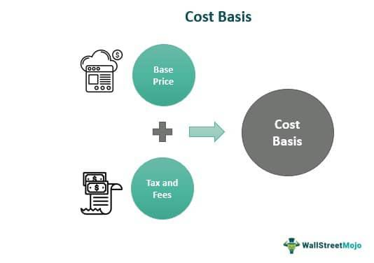

Understanding the cost basis in stock investments is crucial for any investor, as it directly influences tax liabilities and the overall profitability of trades. The cost basis is the original value of an asset for tax purposes, and adjustments over time—such as through stock splits, dividends, and capital distributions—affect this value. This foundational financial metric determines the capital gains or losses realized when an asset is sold, thus impacting the investor's tax obligations.

Algorithmic trading, which uses automated systems to execute trades based on predefined strategies, introduces additional complexity to cost basis computations. The rapid execution and frequent transactions characteristic of algorithmic trading necessitate precise and real-time cost tracking to ensure accurate profitability assessments. Efficient management of cost basis calculations in such a dynamic trading environment is essential for optimizing investment strategies and enhancing financial outcomes.



This article provides an in-depth examination of cost basis concepts, methodologies for calculation, and their application within algorithmic trading contexts. Various calculation methods—such as First-In, First-Out (FIFO), Last-In, First-Out (LIFO), and Average Cost—will be explored to illustrate their impact on capital gains computations. Additionally, the article will investigate how different investment types and market actions, including stocks, bonds, and real estate, uniquely affect the cost basis.

By the end of this discussion, readers will gain valuable insights into managing investments more efficiently. They will learn to navigate the complexities associated with different cost basis calculation methods, enabling them to make informed decisions that enhance their investment profitability and tax efficiency.

## Table of Contents

## What is Cost Basis?

Cost basis represents the original financial value assigned to an asset, which is foundational for determining the capital gain or loss when the asset is sold. This baseline value is not static; it undergoes adjustments based on corporate actions such as stock splits, dividend reinvestments, and capital distributions.

To break this down further, consider a stock with an initial purchase price of $100 per share. If a two-for-one stock split occurs, the cost basis would be adjusted to $50 per share to reflect the new structure of ownership. Similarly, when dividends are reinvested, these amounts are added to the cost basis, enhancing the original value of the stock, thus impacting future profit calculations upon sale.

Upon the sale of an asset, the cost basis is subtracted from the sale price to calculate the capital gain or loss. For example, if an asset with a cost basis of $1,000 is sold for $1,500, the capital gain is $500. This gain is subject to taxation, making precise calculation of the cost basis critical for investors aiming to understand and minimize their tax liabilities.

Python code can aid in the automation and accurate calculation of cost basis. For a simple demonstration, consider this snippet that computes the adjusted cost basis after a stock split:

```python
def adjust_cost_basis(initial_cost, shares_owned, split_factor):
    return (initial_cost / shares_owned) * split_factor

# Example usage
initial_cost = 1000  # Initial total cost of the investment
shares_owned = 100   # Number of shares owned before the split
split_factor = 2     # 2-for-1 stock split

adjusted_cost_per_share = adjust_cost_basis(initial_cost, shares_owned, split_factor)
print(f"Adjusted Cost Basis per Share: {adjusted_cost_per_share}")
```

In conclusion, accurately determining the cost basis of an asset is essential for investors to establish the actual profit or loss realized from the sale of securities. Failure to accurately account for these adjustments can lead to incorrect tax reporting and potential penalties. As such, understanding and computing the cost basis is a critical component of effective investment management.

## Methods to Calculate Cost Basis

Calculating the cost basis of an asset is essential for determining capital gains or losses, significantly impacting tax liabilities. Different methods offer various ways to handle cost basis calculations, each with unique characteristics that can lead to distinct tax outcomes.

**First-In, First-Out (FIFO)** is a method where the earliest purchased (first-in) assets are sold first (first-out). This approach is particularly beneficial in a rising market because it often results in capital gains being measured against the lower-cost basis of older purchased shares, potentially leading to higher taxable gains. For instance, if you purchased shares at $10, $15, and $20, with FIFO, the $10 shares would be considered sold first.

**Last-In, First-Out (LIFO)** assumes that the most recently acquired assets are sold first. Though not as commonly applied in tax accounting for stocks, it can be relevant in specific financial contexts. LIFO might be beneficial during a period of decreasing prices as it matches the most recent, typically higher-cost purchases with sales, potentially reducing taxable income. However, because most tax jurisdictions prefer FIFO for its straightforward approach, LIFO is rarely used outside of inventory applications.

The **Average Cost** method is widely applicable, especially for mutual funds. This method averages the cost of all shares purchased, creating a single average cost per share used to calculate both gains and losses when shares are sold. If you bought 100 shares at $10 and another 100 shares at $20, the average cost basis would be:

$$
\text{Average Cost} = \frac{(100 \times 10) + (100 \times 20)}{200} = 15
$$

This method simplifies calculations but may not always optimize for tax savings.

**Specific Identification** allows investors to select which shares to sell, providing control over which specific lots of stocks are being sold at any given time. This approach requires precise records and typically more detailed tracking systems, but it allows investors to strategically manage their capital gains and losses by choosing to sell high-basis shares first to minimize taxable gains or low-basis shares to utilize losses.

Each of these methods affects the tax outcomes of trading activities differently and requires investors to adopt precise tracking mechanisms to take full advantage of their respective benefits.

## Cost Basis in Algorithmic Trading

Algorithmic trading relies on automated systems to execute trades efficiently based on predefined strategies, which often involve completing a high [volume](/wiki/volume-trading-strategy) of transactions within short time frames. Incorporating accurate cost basis calculations into these systems is vital for making informed trading decisions and optimizing profitability.

Cost basis, in this context, refers to the original value of a security adjusted for various factors such as stock splits and dividends. Knowing the exact cost basis for each asset in a portfolio allows trading algorithms to accurately assess the potential gains or losses from a trade, which is critical for effective portfolio management and tax reporting.

For example, in a high-frequency trading environment where algorithms are buying and selling assets rapidly, maintaining an accurate and up-to-date record of the cost basis becomes complex yet imperative. By accurately tracking the cost basis, algorithms can evaluate the profitability of trades in real-time, ensuring that decisions to buy or sell a security align with the overall strategy and tax considerations.

Consider a scenario where an algorithm executes trades based on the FIFO (First-In, First-Out) method. This method assumes that the oldest shares are sold first, which can influence both the reported capital gains and the corresponding tax liabilities. By integrating cost basis tracking specifically designed for FIFO, trading systems can optimize tax outcomes by selecting which assets to sell.

For implementation, a system might utilize a Python code snippet to update cost basis records upon each transaction. Here is an illustrative example:

```python
def update_cost_basis(transactions, method='FIFO'):
    for transaction in transactions:
        if method == 'FIFO':
            # Update logic for FIFO
            pass
        elif method == 'LIFO':
            # Update logic for LIFO
            pass
        elif method == 'specific_identification':
            # Logic for specific shares
            pass
        # Additional methods can be added as needed
    return updated_records
```

Such algorithmic capabilities ensure that each trade is evaluated based on a comprehensive understanding of its cost structure, thus enabling more precise decision-making. As the trading strategy executes, the system maintains a dynamic and accurate log of the cost basis, adjusting for market actions like reinvested dividends, stock splits, and fee deductions.

Furthermore, effective integration of cost basis calculations in [algorithmic trading](/wiki/algorithmic-trading) systems allows for better alignment with regulatory requirements, reducing the risk of audit discrepancies and potential penalties related to inaccurate reporting.

In summary, precise integration of cost basis in algorithmic trading platforms not only enhances trade profitability but also ensures compliance, thereby maximizing the efficiency and reliability of these automated investment strategies.

## Investment Alternatives and Their Cost Calculations

Different investment types, including stocks, bonds, exchange-traded funds (ETFs), and real estate, each possess unique cost structures that influence their respective cost basis calculations. Accurately understanding and calculating the cost basis is crucial for investors looking to manage their portfolios efficiently and with tax optimization in mind.

### Stocks

In stock investments, the cost basis is not just the purchase price. It is adjusted for several corporate actions that can significantly impact the final cost basis. Dividends, especially reinvested dividends, can increase the number of shares held, thus altering the cost basis calculation. For example, if an investor holds stocks that pay dividends, and those dividends are automatically reinvested, the additional shares acquired may adjust the overall cost basis upwards.

Stock splits and reverse splits also affect cost basis. In a stock split, the total number of shares increases, and the cost basis per share decreases proportionately. Conversely, in a reverse stock split, the number of shares decreases while the cost basis per share increases. Mergers and acquisitions further complicate cost basis calculations, as the original shares might be replaced or exchanged for new securities or cash, necessitating recalculations based on the terms of the merger.

### Bonds and ETFs

Bonds typically have a cost basis that begins with the purchase price. However, bond premiums and discounts, which occur when bonds are purchased at above or below face value, must be amortized over the lifetime of the bond. This adjustment ensures that the cost basis reflects the bond's yield to maturity.

Exchange-Traded Funds (ETFs) operate similarly to stocks when it comes to cost basis. Since ETFs often involve frequent dividend distributions, the reinvestment of these dividends plays a crucial role in adjusting the cost basis. Additionally, like stocks, any splits or reorganizations affecting ETFs will require adjustments to the cost basis.

### Real Estate

Real estate investments have a cost basis initially determined by the purchase price plus any acquisition costs, such as legal fees and transfer taxes. Over time, the cost basis of real estate can be adjusted for capital improvements, which increase the property's value, such as renovations or new installations. Conversely, depreciation, a tax deduction that reflects the property's wear and tear, reduces the cost basis gradually over time.

### Python Example for Calculating Stock Cost Basis

To illustrate, consider the calculation of cost basis in a scenario involving dividends:

```python
def calculate_cost_basis(shares_owned, purchase_price_per_share, reinvested_dividends):
    original_cost = shares_owned * purchase_price_per_share
    # Add the cost of shares bought through dividend reinvestment
    additional_shares = reinvested_dividends / purchase_price_per_share
    new_cost_basis = original_cost + reinvested_dividends
    total_shares = shares_owned + additional_shares
    adjusted_cost_basis_per_share = new_cost_basis / total_shares
    return adjusted_cost_basis_per_share

# Example usage
shares_owned = 100
purchase_price_per_share = 50
reinvested_dividends = 200

adjusted_cost_basis = calculate_cost_basis(shares_owned, purchase_price_per_share, reinvested_dividends)
print("Adjusted Cost Basis per Share:", adjusted_cost_basis)
```

This code calculates the adjusted cost basis per share after reinvesting dividends.

Understanding these differing cost structures and appropriately adjusting the cost basis is vital for accurately assessing capital gains or losses, thereby optimizing tax liabilities and ensuring better financial management of investment portfolios.

## Examples and Case Studies

To illustrate the concept of cost basis, it is essential to consider various calculation methods such as First-In, First-Out (FIFO), Last-In, First-Out (LIFO), and the Average Cost method.

### Example 1: FIFO Method
Assume an investor purchases shares of a company as follows:

- 10 shares at $100 each in January
- 10 shares at $110 each in February
- 10 shares at $120 each in March

The investor decides to sell 15 shares in April at $130 per share. Using the FIFO method, the cost basis is calculated by assuming the first purchased shares are sold first:

Cost basis = (10 shares * $100) + (5 shares * $110) = $1,550

The capital gain in this case is calculated as:
$$
\text{Capital Gain} = (\text{Sale Price} - \text{Cost Basis}) = (15 \times 130) - 1550 = 1950 - 1550 = 400
$$

### Example 2: LIFO Method
Using the same purchase data, if the investor adopts the LIFO method:

Cost basis = (10 shares * $120) + (5 shares * $110) = $1,750

The capital gain is:
$$
\text{Capital Gain} = (\text{Sale Price} - \text{Cost Basis}) = (15 \times 130) - 1750 = 1950 - 1750 = 200
$$

### Example 3: Average Cost Method
To employ the Average Cost method, the investor calculates the average purchase price:

Average purchase price = $\frac{(10 \times 100) + (10 \times 110) + (10 \times 120)}{30} = \frac{3300}{30} = 110$

Cost basis for 15 shares = 15 shares * $110 = $1,650

Capital gain using the average cost:
$$
\text{Capital Gain} = (\text{Sale Price} - \text{Cost Basis}) = (15 \times 130) - 1650 = 1950 - 1650 = 300
$$

### Case Studies and Strategic Applications
Case studies consistently show that the choice of cost basis calculation method can significantly impact an investor's tax liabilities and investment returns. For example, a 2020 study analyzed multiple investment portfolios and found that employing FIFO could result in higher taxable gains in a bull market, while LIFO might be favorable during short-term trades to lower taxes.

Choosing the right cost basis method aligns with specific financial goals and circumstances. For instance, an investor seeking to maximize short-term [liquidity](/wiki/liquidity-risk-premium) might benefit from specific identification, allowing the selection of shares with the highest cost basis, thereby reducing capital gains tax. Meanwhile, those focused on long-term gains may prefer methods that minimize taxable gains initially.

In conclusion, selecting an appropriate cost basis method requires careful consideration of market conditions and investment goals to optimize returns and tax outcomes.

## The Role of Algorithmic Trading in Modern Investing

Algorithmic trading has become a cornerstone of modern investment strategies, fundamentally transforming how trades are executed and investment decisions are made. By utilizing sophisticated algorithms and large data sets, algorithmic trading enables rapid analysis and processing of market data, enhancing precision and profitability.

The efficiency of these algorithms is highly reliant on their capability to digest vast amounts of information from multiple sources. This includes real-time market data, historical price movements, and predictive analytics. The primary goal is to identify trading opportunities based on predefined criteria, executing trades at speeds impossible for human traders.

Algorithmic trading offers several distinct advantages. One of the most significant benefits is the ability to mitigate human error and emotional biases in trading. Algorithms operate purely on logic and data, ensuring consistency in decision-making. Moreover, these systems can operate 24/7, taking advantage of after-hours trading and international markets, which are typically less accessible to manual traders.

Despite its benefits, algorithmic trading comes with challenges that require careful management. Data integrity is a crucial concern, as the success of these algorithms depends on accurate and reliable data inputs. Erroneous data can lead to incorrect trading signals and result in substantial financial losses. Therefore, robust data verification processes are essential to ensure the validity of the data used by trading algorithms. 

System reliability is another critical consideration. Algorithms must function seamlessly under various market conditions, which requires a robust technological infrastructure capable of handling high-frequency trading operations without outages or delays. Unexpected system failures can lead to missed trading opportunities or unintended trades, which may affect an investor's portfolio negatively. Effective risk management strategies, including fail-safes and redundancies, are necessary to safeguard against such occurrences.

Furthermore, regulatory factors also play a significant role in shaping algorithmic trading environments. Financial markets across the globe have varying regulations that impact how algorithmic trading can be conducted. Adherence to these regulations is imperative to prevent legal and financial repercussions. Traders and firms must stay informed about changes in regulatory frameworks and adapt their algorithms accordingly.

In conclusion, algorithmic trading is redefining investment strategies by leveraging state-of-the-art technology to achieve more precise and profitable trading outcomes. However, successful implementation requires overcoming challenges related to data integrity and system reliability. Adhering to evolving regulations, maintaining robust infrastructure, and implementing effective risk management are essential for harnessing the full potential of algorithmic trading in the modern financial landscape.

## Conclusion

Selecting the appropriate cost basis method is fundamental for investors focusing on optimizing both tax implications and trading strategies. Each method—First-In, First-Out (FIFO), Last-In, First-Out (LIFO), Average Cost, and Specific Identification—offers distinct advantages and challenges, depending on the investor's financial goals and market scenarios. By carefully choosing the right method, investors can reduce taxable income through strategic manipulation of capital gains and losses.

Algorithmic trading systems, which rely on precise calculations and data integrity, stand to gain significantly from accurate cost basis calculations. These systems, designed to execute rapid and complex trades, require exact cost data to evaluate trade profitability and make informed buy/sell decisions. Integration of cost basis data into algorithms enhances their efficiency, allowing them to adapt swiftly to fluctuating market conditions and capitalize on trading opportunities that align with an investor's strategic objectives.

Continual learning and adaptation are essential, given the evolving nature of both markets and technology. The dynamic landscape necessitates that investors remain informed about regulatory changes, technological advancements, and shifts in market trends. Embracing new methodologies or tools, such as improved algorithms or advanced data analytics, can provide investors with a competitive edge. By staying proactive in learning and adapting, investors and traders can refine their strategies to maximize returns while minimizing risks, ensuring sustained success in an ever-changing financial environment.

## References & Further Reading

[1]: "Cost Basis: Tracking Your Tax Basis" by Charles Schwab. [Link](https://turbotax.intuit.com/tax-tips/rental-property/cost-basis-tracking-your-tax-basis/L4i1f9qB1).

[2]: "How to Determine Cost Basis" by Investopedia. [Link](https://www.investopedia.com/ask/answers/05/costbasis.asp).

[3]: Ferri, Richard A. "All About Asset Allocation" (2nd Edition), McGraw-Hill, 2010.

[4]: "Algorithmic Trading: Winning Strategies and Their Rationale" by Ernest P. Chan.

[5]: "Quantitative Finance for Dummies" by Steve Bell. 

[6]: Securities and Exchange Commission (SEC) guide on "Algorithmic Trading: What Investors Need to Know" [Link](https://www.sec.gov/files/Algo_Trading_Report_2020.pdf).