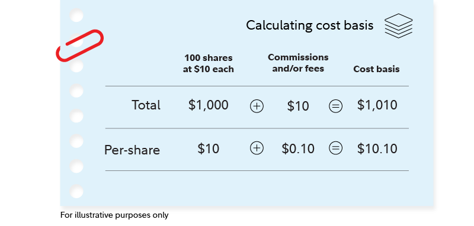

## Table of Contents

## What is the cost basis of a stock investment?

The cost basis of a stock investment is the original value of an asset for tax purposes, usually the purchase price, adjusted for stock splits, dividends, and return of capital distributions. This is important because it helps you figure out how much profit or loss you made when you sell the stock. If you bought a stock for $100 and sold it for $150, your profit would be $50, which is the difference between the selling price and the cost basis.

Sometimes, the cost basis can change due to different events. For example, if the company you invested in does a stock split, your cost basis per share will change. Also, if you receive dividends and reinvest them to buy more shares, this can affect your cost basis too. Keeping track of these changes is important for calculating your taxes correctly when you decide to sell your stocks.

## Why is it important to determine the cost basis of your stocks?

Knowing the cost basis of your stocks is important because it helps you figure out how much money you made or lost when you sell them. When you sell a stock, you need to know the difference between what you paid for it and what you sold it for. This difference is your profit or loss, and it's used to calculate how much tax you owe. If you don't know your cost basis, you might end up paying too much or too little in taxes, which can cause problems with the tax authorities.

Also, understanding your cost basis can help you make better decisions about when to sell your stocks. If you know exactly how much you paid for a stock, you can decide if it's a good time to sell based on how much profit you would make. This can be especially useful if you're trying to reach certain financial goals or if you want to minimize the taxes you have to pay. Keeping track of your cost basis makes managing your investments easier and more effective.

## How do you calculate the cost basis for stocks purchased in a single transaction?

To calculate the cost basis for stocks bought in one transaction, you just need to know how much you paid for the stocks. This includes the price per share and any fees or commissions you had to pay when you bought them. For example, if you bought 100 shares of a stock at $10 per share and paid a $10 commission, your total cost would be $1,010. Your cost basis per share would be $1,010 divided by 100 shares, which equals $10.10 per share.

Sometimes, things can change the cost basis after you buy the stock. If the company does a stock split, the number of shares you own changes, and you need to adjust your cost basis. For instance, if there's a 2-for-1 stock split, you'll have twice as many shares, but the cost basis per share will be half of what it was before. Also, if you receive dividends and use them to buy more shares, this can affect your cost basis too. Keeping track of these changes helps you know your true cost basis when you decide to sell your stocks.

## What should you do if you've bought the same stock at different times and prices?

If you've bought the same stock at different times and prices, you need to keep track of each purchase separately. This is because each purchase has its own cost basis, which is the price you paid for the stock plus any fees or commissions. For example, if you bought 50 shares at $20 each and then later bought another 50 shares at $25 each, you would have two different cost bases to consider. The first purchase would have a cost basis of $20 per share, and the second purchase would have a cost basis of $25 per share.

When you sell the stock, you need to decide which shares you're selling. There are different methods to do this, but the most common one is called the "first in, first out" (FIFO) method. With FIFO, you sell the shares you bought first before selling the shares you bought later. Using the example above, if you sold 50 shares, you would sell the ones you bought at $20 per share first. This helps you figure out your profit or loss accurately because you know exactly which shares you're selling and what their cost basis is.

## How does the method of averaging affect the cost basis calculation?

The method of averaging can change how you calculate the cost basis of your stocks. When you use averaging, you add up the total amount you spent on all your shares and divide it by the total number of shares you own. This gives you an average cost per share. For example, if you bought 50 shares at $20 each and then another 50 shares at $25 each, your total cost would be $2,250 for 100 shares. Using averaging, your cost basis would be $2,250 divided by 100 shares, which equals $22.50 per share.

Averaging can make it easier to figure out your cost basis, especially if you've bought the same stock at different times and prices. But it's important to know that the IRS might not let you use averaging for tax purposes. They usually want you to use the "first in, first out" (FIFO) method, where you sell the shares you bought first before selling the ones you bought later. So, while averaging can help you keep track of your investments, you might need to use a different method when you're calculating your taxes.

## What are the tax implications of different cost basis methods?

The way you calculate your cost basis can change how much tax you have to pay when you sell your stocks. The IRS usually wants you to use the "first in, first out" (FIFO) method. This means you sell the shares you bought first before selling the ones you bought later. If you bought shares at different times and prices, using FIFO can affect your taxes because the shares you sell first might have a different cost basis than the ones you bought later. This can make your profit or loss different, which changes how much tax you owe.

Another way to calculate cost basis is by averaging, where you add up the total cost of all your shares and divide it by the total number of shares. This gives you an average cost per share. While averaging can make it easier to keep track of your investments, the IRS might not let you use it for tax purposes. If you use averaging and the IRS doesn't allow it, you could end up paying the wrong amount of tax. It's important to check with a tax professional to make sure you're using the right method for your taxes.

## How do stock splits and dividends affect the cost basis?

Stock splits can change your cost basis. When a company does a stock split, they give you more shares, but the total value of your investment stays the same. For example, if you have 100 shares and the company does a 2-for-1 split, you'll have 200 shares. But the price per share will be half of what it was before. So, if you paid $10 per share before the split, your new cost basis per share would be $5. You still own the same amount of the company, but your cost basis per share goes down because you have more shares.

Dividends can also affect your cost basis, especially if you choose to reinvest them. When you get dividends and use them to buy more shares, those new shares add to your total cost basis. For example, if you get a $100 dividend and use it to buy 10 more shares at $10 each, your cost basis goes up by $100. But the cost basis per share stays the same for the new shares you bought with the dividend. Keeping track of these changes is important because it helps you figure out your taxes correctly when you sell your stocks.

## What records do you need to keep to accurately determine your cost basis?

To accurately figure out your cost basis, you need to keep good records of when you buy and sell your stocks. Write down the date you bought the stock, how many shares you bought, and how much you paid for each share. Don't forget to include any fees or commissions you had to pay when you bought the stock. If you get dividends and use them to buy more shares, keep track of that too. This helps you know exactly how much you spent on your stocks.

If the company does a stock split or you sell some of your shares, you need to update your records. For a stock split, write down the new number of shares you have and the new price per share. When you sell shares, note the date you sold them, how many you sold, and the price you got for each share. Keeping these records up to date helps you calculate your cost basis correctly and figure out how much tax you need to pay when you sell your stocks.

## How do you handle the cost basis for stocks received as gifts or inheritances?

When you get stocks as a gift, the cost basis can be a bit tricky. If the person giving you the stock tells you how much they paid for it, that's the cost basis you use. But if they don't tell you, you have to use the market value of the stock on the day you got it as your cost basis. If you sell the stock later, you might have to pay taxes on the difference between what you sell it for and the cost basis. It's important to keep good records of when you got the stock and what its value was at that time.

For stocks you inherit, the cost basis is usually the market value of the stock on the day the person who left it to you passed away. This is called a "stepped-up basis." It means that if the stock has gone up in value since the person bought it, you don't have to pay taxes on that increase. You only pay taxes on any increase in value that happens after you inherit the stock. Keeping track of the date of death and the stock's value on that day is really important for figuring out your taxes correctly.

## What are the differences in cost basis calculation for mutual funds versus individual stocks?

The way you figure out the cost basis for mutual funds is a bit different from individual stocks, but it's still important for knowing how much tax you owe when you sell them. For mutual funds, you need to keep track of every time you buy shares, just like with stocks. But mutual funds often have something called "reinvestment of dividends and capital gains," which means any money the fund earns gets used to buy more shares automatically. This can make your cost basis go up because you're buying more shares without spending extra money. So, you need to add the value of these reinvested dividends and capital gains to your total cost basis.

For individual stocks, you usually buy them at specific times and prices, and you can choose to reinvest dividends or not. If you do reinvest dividends, you add the value of those new shares to your cost basis, just like with mutual funds. But with stocks, you also need to watch out for stock splits, which can change your cost basis per share. Both mutual funds and stocks need good record-keeping to figure out your cost basis correctly, but mutual funds might need a bit more work because of the automatic reinvestments.

## How do you adjust the cost basis for wash sales?

A wash sale happens when you sell a stock at a loss and then buy the same or a very similar stock within 30 days before or after the sale. When this happens, you can't use the loss to lower your taxes right away. Instead, you have to add the loss to the cost basis of the new stock you bought. This means if you bought a stock for $100, sold it for $80, and then bought it again for $90 within 30 days, you would add the $20 loss to the $90 cost basis of the new stock. So, your new cost basis would be $110.

Keeping track of wash sales is important because it changes how much you paid for your stocks, which affects your taxes when you sell them later. If you don't adjust your cost basis for a wash sale, you might end up paying more taxes than you should. Always make sure to note down any wash sales and update your records so you know exactly what your cost basis is when you decide to sell your stocks again.

## What advanced strategies can be used to optimize cost basis for tax purposes?

One advanced strategy to optimize your cost basis for tax purposes is called tax-loss harvesting. This means you sell stocks that have gone down in value to get a tax break. When you sell at a loss, you can use that loss to lower your taxes. But you need to be careful not to trigger a wash sale, which happens if you buy the same or a similar stock within 30 days before or after the sale. If you do have a wash sale, you can't use the loss right away, but you can add it to the cost basis of the new stock you bought. This strategy can help you save on taxes by making your cost basis higher for the new stock.

Another strategy is to use specific identification when you sell stocks. Instead of using the "first in, first out" (FIFO) method, you can choose which shares you want to sell. This lets you pick shares with a higher cost basis to lower your taxable gain. For example, if you bought some shares at a high price and some at a low price, you can sell the ones you bought at the high price first. This makes your profit smaller, so you pay less in taxes. Keeping good records of when you bought each share and how much you paid for them is really important for this strategy to work well.

## What are the methods to calculate cost basis?

Calculating the cost basis of an asset is essential for determining capital gains or losses, significantly impacting tax liabilities. Different methods offer various ways to handle cost basis calculations, each with unique characteristics that can lead to distinct tax outcomes.

**First-In, First-Out (FIFO)** is a method where the earliest purchased (first-in) assets are sold first (first-out). This approach is particularly beneficial in a rising market because it often results in capital gains being measured against the lower-cost basis of older purchased shares, potentially leading to higher taxable gains. For instance, if you purchased shares at $10, $15, and $20, with FIFO, the $10 shares would be considered sold first.

**Last-In, First-Out (LIFO)** assumes that the most recently acquired assets are sold first. Though not as commonly applied in tax accounting for stocks, it can be relevant in specific financial contexts. LIFO might be beneficial during a period of decreasing prices as it matches the most recent, typically higher-cost purchases with sales, potentially reducing taxable income. However, because most tax jurisdictions prefer FIFO for its straightforward approach, LIFO is rarely used outside of inventory applications.

The **Average Cost** method is widely applicable, especially for mutual funds. This method averages the cost of all shares purchased, creating a single average cost per share used to calculate both gains and losses when shares are sold. If you bought 100 shares at $10 and another 100 shares at $20, the average cost basis would be:

$$
\text{Average Cost} = \frac{(100 \times 10) + (100 \times 20)}{200} = 15
$$

This method simplifies calculations but may not always optimize for tax savings.

**Specific Identification** allows investors to select which shares to sell, providing control over which specific lots of stocks are being sold at any given time. This approach requires precise records and typically more detailed tracking systems, but it allows investors to strategically manage their capital gains and losses by choosing to sell high-basis shares first to minimize taxable gains or low-basis shares to utilize losses.

Each of these methods affects the tax outcomes of trading activities differently and requires investors to adopt precise tracking mechanisms to take full advantage of their respective benefits.

## References & Further Reading

[1]: "Cost Basis: Tracking Your Tax Basis" by Charles Schwab. [Link](https://turbotax.intuit.com/tax-tips/rental-property/cost-basis-tracking-your-tax-basis/L4i1f9qB1).

[2]: "How to Determine Cost Basis" by Investopedia. [Link](https://www.investopedia.com/ask/answers/05/costbasis.asp).

[3]: Ferri, Richard A. "All About Asset Allocation" (2nd Edition), McGraw-Hill, 2010.

[4]: "Algorithmic Trading: Winning Strategies and Their Rationale" by Ernest P. Chan.

[5]: "Quantitative Finance for Dummies" by Steve Bell. 

[6]: Securities and Exchange Commission (SEC) guide on "Algorithmic Trading: What Investors Need to Know" [Link](https://www.sec.gov/files/Algo_Trading_Report_2020.pdf).