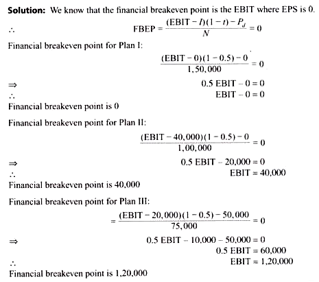

## Table of Contents

## What is EBIT and why is it important for businesses?

EBIT stands for Earnings Before Interest and Taxes. It is a way to measure how much money a business makes from its normal operations, without counting the money it spends on interest for loans or the taxes it has to pay. This number helps business owners and investors see how well the company is doing at making money from its main activities, like selling products or services.

EBIT is important for businesses because it gives a clear picture of their operating performance. By not including interest and taxes, it shows how profitable the company's core business is. This helps compare the performance of different companies more fairly, even if they have different amounts of debt or are in different countries with different tax rates. It's a useful tool for making decisions about where to invest or how to improve the business.

## How does EBIT differ from net income?

EBIT and net income are both ways to measure how much money a company makes, but they show different things. EBIT, which stands for Earnings Before Interest and Taxes, looks at the profit a company makes from its main business activities before it pays interest on loans or taxes. It helps show how well the company is doing at making money from what it mainly does, like selling things or providing services.

Net income, on the other hand, is what's left after a company pays all its expenses, including interest on loans and taxes. It's the final profit that the company keeps. Net income gives a complete picture of the company's financial health because it includes all costs. While EBIT focuses on the operating performance, net income shows the total earnings after everything is paid.

## What is EPS and how is it calculated?

EPS stands for Earnings Per Share. It tells you how much money a company makes for each share of its stock. It's a way for investors to see how profitable a company is and how much of that profit they might get if they own a share of the company.

To calculate EPS, you take the company's net income and subtract any dividends paid to preferred shareholders. Then, you divide that number by the total number of outstanding common shares. For example, if a company has a net income of $10 million, pays no preferred dividends, and has 5 million common shares, the EPS would be $10 million divided by 5 million shares, which equals $2 per share.

## Why is maintaining a constant EPS important for a company?

Keeping a steady EPS is important for a company because it shows investors that the company is doing well and making money in a reliable way. When EPS stays the same or goes up, it makes investors feel good about the company. They might want to buy more shares or keep the ones they have, which can help the company's stock price stay strong or even go up.

If EPS keeps changing a lot, it can make investors worried. They might think the company is not doing well or that it's hard to predict how much money the company will make. This can make the stock price go down, and it might be harder for the company to get money from investors in the future. So, a steady EPS helps the company look stable and trustworthy to people who might want to invest in it.

## What factors influence the level of EBIT required to maintain a constant EPS?

The level of EBIT needed to keep EPS steady can change because of a few things. One big thing is how many shares the company has. If the company decides to give out more shares, the same amount of net income gets split among more shares, so each share gets less money. To keep EPS the same, the company would need to make more money from its main business, which means a higher EBIT. Also, if the company has a lot of debt, the interest it has to pay can eat into the net income. A higher EBIT would be needed to cover these costs and still have enough left to keep EPS the same.

Another thing that can affect the EBIT needed for a steady EPS is how much the company pays in taxes. If tax rates go up, the company keeps less of its earnings after taxes, which can lower the net income. To keep EPS the same, the company would need a higher EBIT to make up for the higher taxes. Changes in how much the company spends on things like salaries, rent, or materials can also play a role. If these costs go up, the company needs a higher EBIT to cover them and still have enough left to keep EPS steady.

## How can changes in capital structure affect the EBIT needed for constant EPS?

Changes in a company's capital structure, like how much debt or equity it uses, can change the amount of EBIT needed to keep EPS the same. If a company takes on more debt, it has to pay more interest. This interest payment comes out of the company's earnings before it figures out EPS. So, to keep EPS steady, the company needs a higher EBIT to cover the extra interest and still have enough left over for the shareholders.

On the other hand, if a company decides to issue more shares instead of taking on more debt, it's using more equity. More shares mean the same amount of net income gets split among more people, so each share gets less money. To keep EPS the same, the company would need a higher EBIT to make up for the extra shares and still give each share the same amount of earnings. So, whether a company uses more debt or more equity, it can affect how much EBIT it needs to keep EPS steady.

## What role does the interest coverage ratio play in determining the EBIT level for constant EPS?

The interest coverage ratio is important for figuring out how much EBIT a company needs to keep its EPS steady. This ratio shows how well a company can pay the interest on its debts with its earnings before interest and taxes. If a company has a lot of debt, it needs to make sure its EBIT is high enough to cover the interest payments and still have money left for shareholders. A higher interest coverage ratio means the company can handle its debt better, so it might not need as high an EBIT to keep EPS the same.

If the interest coverage ratio goes down, it means the company is finding it harder to pay its interest with its earnings. This can happen if the company takes on more debt or if its earnings drop. When the interest coverage ratio is low, the company needs a higher EBIT to cover the interest and keep EPS steady. So, keeping an eye on the interest coverage ratio helps the company know how much EBIT it needs to make sure its shareholders keep getting the same earnings per share.

## How can a company use financial leverage to achieve a constant EPS?

A company can use financial leverage, which means borrowing money, to try and keep its earnings per share (EPS) steady. When a company borrows money, it has to pay interest on the loans. If the company can use the borrowed money to make more money than it has to pay in interest, it can increase its earnings. This extra money can help keep EPS the same, even if the company's main business isn't doing as well. But, using a lot of debt can be risky. If the company can't make enough money to pay the interest, its earnings will go down, and so will its EPS.

The key to using financial leverage to keep EPS steady is to find the right balance. If a company uses too much debt, it might not be able to pay the interest, and that can hurt its EPS. But if it uses just the right amount of debt, it can boost its earnings enough to keep EPS steady. It's like walking a tightrope - the company has to be careful not to fall off by using too much or too little debt. By keeping an eye on things like the interest coverage ratio, a company can figure out how much debt it can handle while still keeping its EPS steady.

## What are the potential risks associated with adjusting EBIT to maintain constant EPS?

Trying to keep EPS the same by changing EBIT can be risky. One big risk is that the company might take on too much debt to boost its earnings. If the company borrows a lot of money, it has to pay a lot of interest. If it can't make enough money to cover the interest, its earnings will drop, and so will its EPS. This can make investors worried and cause the stock price to go down. It's like trying to keep a balloon in the air by adding more weight - if you add too much, the balloon will fall.

Another risk is that the company might cut back on important things to keep EBIT high. For example, it might spend less on research and development or stop investing in new projects. This can hurt the company in the long run because it won't be able to grow or come up with new products. It's like trying to save money by not fixing a leaky roof - it might work for a while, but eventually, the problem will get worse and cost more to fix. So, while adjusting EBIT can help keep EPS steady, it's important for the company to think about the long-term effects and not just focus on the short-term numbers.

## How can different tax rates impact the calculation of EBIT for constant EPS?

Different tax rates can change how much EBIT a company needs to keep its EPS the same. When tax rates go up, the company has to pay more in taxes, which means less money is left over after taxes. This lower net income means the company needs a higher EBIT to make up for the bigger tax bill and still keep the same EPS. If tax rates go down, the company pays less in taxes, so it can keep more of its earnings. This means the company might not need as high an EBIT to keep EPS steady because there's more money left after taxes.

It's like trying to fill a bucket with water. If the bucket has a bigger hole (higher taxes), you need to pour in more water (higher EBIT) to keep the bucket full (constant EPS). But if the hole gets smaller (lower taxes), you don't need to pour in as much water to keep the bucket at the same level. So, when tax rates change, companies have to adjust their EBIT to make sure they can still give their shareholders the same earnings per share.

## What advanced financial models can be used to more accurately determine the EBIT level for constant EPS?

One advanced financial model that can help figure out the right level of EBIT to keep EPS steady is the DuPont Analysis. This model breaks down the company's return on equity into three parts: profit margin, asset turnover, and financial leverage. By looking at these parts, a company can see how changes in its operations, how well it uses its assets, and how much debt it has can affect its earnings. This helps the company understand how much EBIT it needs to keep EPS the same, even if things like tax rates or interest expenses change.

Another useful model is the Discounted Cash Flow (DCF) model. This model looks at the company's future cash flows and figures out what they're worth today. By using DCF, a company can predict how much money it will make in the future and see how different levels of EBIT might affect its EPS. This can help the company plan ahead and make sure it's doing what it needs to keep EPS steady, even if things like the economy or the market change.

## How do macroeconomic factors influence the EBIT threshold needed to keep EPS constant?

Macroeconomic factors like inflation, interest rates, and economic growth can change how much EBIT a company needs to keep its EPS steady. When inflation goes up, the costs of things like materials and labor can go up too. This means the company might need a higher EBIT to cover these extra costs and still have enough left over to keep EPS the same. Interest rates also play a big role. If interest rates go up, the company has to pay more to borrow money, which can eat into its earnings. So, a higher EBIT would be needed to cover the higher interest and keep EPS steady.

Economic growth is another important [factor](/wiki/factor-investing). When the economy is doing well, people might buy more of the company's products or services, which can boost its earnings. This might mean the company doesn't need as high an EBIT to keep EPS steady because it's making more money from its main business. But if the economy slows down, people might buy less, and the company's earnings could drop. In this case, the company would need a higher EBIT to make up for the lower sales and still keep EPS the same. So, keeping an eye on these macroeconomic factors helps a company figure out how much EBIT it needs to keep its shareholders happy with a steady EPS.

## What is the understanding of EBIT and EPS?

**Understanding EBIT and EPS**

Earnings Before Interest and Taxes (EBIT) and Earnings Per Share (EPS) are pivotal metrics in financial analysis, serving distinct yet interrelated roles. EBIT, commonly referred to as operating income, quantifies a company's ability to generate profits through its core operations. It is calculated as:

$$
\text{EBIT} = \text{Revenue} - \text{Operating Expenses}
$$

Operating expenses exclude interest and tax expenses, thus EBIT provides insight into operational efficiency regardless of capital structure and tax burdens. A high and stable EBIT indicates effective cost management and revenue generation from core business activities, making it crucial for internal management and external investors to assess a company's operational health.

EPS, on the other hand, evaluates shareholder value, reflecting the company's profitability allocated to each outstanding share of common stock. It is calculated as:

$$
\text{EPS} = \frac{\text{Net Income} - \text{Preferred Dividends}}{\text{Average Outstanding Shares}}
$$

EPS serves as a barometer for profitability on a per-share basis, offering insights for investors to gauge potential returns on their investment. A consistent or growing EPS suggests a company's ability to generate increasing profits and return value to shareholders, thereby enhancing market confidence.

The relationship between EBIT and EPS is integral for evaluating a company's financial performance and stability. EBIT impacts EPS directly as it forms the basis for calculating net income after accounting for interest and taxes. Therefore, stability in EBIT often translates into stability in EPS, providing a reliable forecast for earnings. For investors, especially in the context of equity valuation models, consistent EPS figures are essential in deriving accurate projections and making informed investment decisions.

A company's financial stability hinges on maintaining steady EBIT and EPS, allowing it to withstand market fluctuations and economic downturns. For investors, these metrics reassure them of potential long-term returns, bringing predictability and calculated risk assessment into their investment strategies.

In summary, EBIT measures core operational efficiency, while EPS gauges shareholder value. The stability of both metrics is crucial for investors in assessing the financial health and potential growth of a company, enabling informed decisions in portfolio management.

## What is EBIT-EPS Analysis?

EBIT-EPS analysis is a critical tool in financial planning and decision-making, particularly when evaluating different financing options. This analysis helps companies understand how various financing scenarios affect their earnings per share (EPS), given their earnings before interest and taxes (EBIT). This knowledge is essential for assessing the impact of debt and equity financing on shareholder value.

The analysis begins with the computation of EPS for different levels of EBIT. EPS is calculated using the formula:

$$
\text{EPS} = \frac{\text{EBIT} - \text{Interest}}{\text{Number of Shares Outstanding}}
$$

Interest in the formula refers to the cost of debt financing, and it varies depending on the amount of debt the company decides to take on. EPS analysis involves determining how changes in EBIT, which might occur due to changes in sales, operational efficiency, or market conditions, will influence the EPS under different capital structures. For example, with increased EBIT, a company can offset higher interest expenses from debt financing, leading to higher EPS. Conversely, if EBIT decreases, the EPS could decline more sharply in debt-heavy structures due to fixed interest obligations.

To illustrate, consider a company with two financing plans:

1. **Plan A (Equity Financing):** The company relies on issuing new stocks to raise capital, resulting in no interest expenses.
2. **Plan B (Debt Financing):** The company uses debt, incurring annual interest payments.

At a low EBIT level, the lack of interest in Plan A leads to higher EPS compared to Plan B. However, as EBIT increases, Plan B may result in higher EPS due to the tax shield benefits interest payments provide, making EBIT more effective in leveraging after-tax income.

The EBIT-EPS break-even point is a critical aspect of this analysis. It is the level of EBIT where both financing options yield the same EPS. Identifying this point helps in decision-making by indicating which capital structure is advantageous under specific conditions. The break-even EBIT can be found by setting the EPS of both plans equal and solving for EBIT:

$$
\frac{\text{EBIT} - \text{Interest}_B}{\text{Shares Outstanding}_B} = \frac{\text{EBIT} - \text{Interest}_A}{\text{Shares Outstanding}_A}
$$

Solving this equation provides management with a clearer understanding of the operational performance needed to make a particular financing option more favorable. It guides strategic decisions, allowing firms to align their financial strategies with expected operating conditions and market forecasts. Identifying the EBIT-EPS break-even point ensures financial stability, enabling businesses to anticipate the implications of changing market dynamics and make informed choices regarding their capital structures.

## References & Further Reading

[1]: ["Financial Trading and Investing"](https://www.investopedia.com/ask/answers/12/difference-investing-trading.asp) by John Teall

[2]: ["Algorithmic Trading and DMA: An introduction to direct access trading strategies"](https://www.amazon.com/Algorithmic-Trading-DMA-introduction-strategies/dp/0956399207) by Barry Johnson

[3]: ["Algorithmic Trading: Winning Strategies and Their Rationale"](https://www.amazon.com/Algorithmic-Trading-Winning-Strategies-Rationale-ebook/dp/B00CY5HC0U) by Ernest P. Chan

[4]: ["High-Frequency Trading: A Practical Guide to Algorithmic Strategies and Trading Systems"](https://www.ahmetbeyefendi.com/wp-content/uploads/2020/07/High-Frequency-Trading-Irene-Aldridge.pdf) by Irene Aldridge

[5]: ["Earnings Management: Emerging Insights in Theory, Practice, and Research"](https://link.springer.com/book/10.1007/978-0-387-25771-6) by Victoria Clune and Ayers Doug

[6]: Pankratov, K. (2017). ["Algorithmic Trading Strategies: Different Ways to Generate Alpha in the Market."](https://www.researchgate.net/publication/378548435_Algorithmic_Trading_and_AI_A_Review_of_Strategies_and_Market_Impact) Financial Analysts Journal.