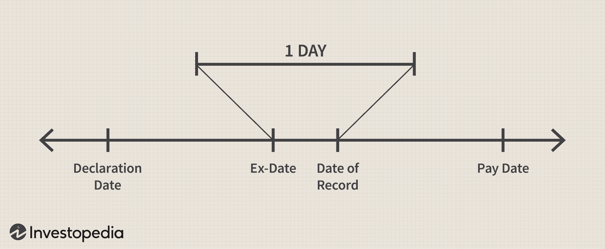

## Table of Contents

## What is a dividend?

A dividend is money that a company pays to its shareholders. It is like a reward for owning part of the company. When a company makes a profit, it can choose to share some of that profit with its shareholders by paying dividends.

Dividends are usually paid regularly, like every three months or once a year. The amount of money you get depends on how many shares you own. If you own more shares, you get more money. Companies can decide to increase, decrease, or stop paying dividends based on their financial situation.

## What is an ex-dividend date?

The ex-dividend date is an important date for shareholders. It is the first day that a stock trades without its dividend. If you buy the stock on or after this date, you won't get the next dividend payment. The company sets this date to know who gets the dividend and who doesn't.

Before the ex-dividend date, if you own the stock, you are entitled to the upcoming dividend. This is because it usually takes a couple of days for stock transactions to be settled. So, the ex-dividend date is set a few days before the actual dividend payment date to make sure the company knows who the rightful owners are when the dividend is paid out.

## How does the ex-dividend date affect stock prices?

When a stock goes ex-dividend, its price usually drops by about the amount of the dividend on the ex-dividend date. This happens because the dividend is no longer included in the stock's price. If you buy the stock on or after the ex-dividend date, you won't get the dividend, so the stock is worth a bit less.

However, the drop in price isn't always exactly the same as the dividend amount. Other things like how people feel about the market or news about the company can also affect the stock price. Sometimes, if investors think the company is doing well, the stock price might not drop as much or might even go up a bit, even on the ex-dividend date.

## How is the ex-dividend date determined?

The ex-dividend date is set by the stock exchange where the company's shares are traded. It is usually two business days before the record date, which is the date the company uses to determine which shareholders are eligible to receive the dividend. This two-day period is called the settlement period, and it's the time it takes for stock transactions to be completed.

The reason for setting the ex-dividend date two days before the record date is to make sure that the company knows who should get the dividend. If you buy the stock on or after the ex-dividend date, the transaction won't be settled in time for you to be on the company's list of shareholders by the record date. So, you won't get the dividend.

## What is the record date and how does it relate to the ex-dividend date?

The record date is the day a company uses to figure out who gets the dividend. If you own the stock on the record date, you will get the dividend. It's like a cut-off point to make sure the company knows who to send the money to.

The ex-dividend date is set two business days before the record date. This is because it takes two days for stock transactions to be settled. If you buy the stock on or after the ex-dividend date, you won't be on the company's list by the record date, so you won't get the dividend. The ex-dividend date helps make sure the right people get the dividend.

## Can you buy a stock after the ex-dividend date and still receive the dividend?

No, if you buy a stock on or after the ex-dividend date, you won't get the dividend. The ex-dividend date is set two business days before the record date. The record date is when the company checks who owns the stock to decide who gets the dividend.

If you buy the stock on or after the ex-dividend date, the transaction won't be settled in time for you to be on the company's list by the record date. So, you'll miss out on the dividend. You'll have to wait for the next dividend if the company pays one.

## What is the difference between the declaration date and the ex-dividend date?

The declaration date is when a company announces that it will pay a dividend. On this date, the company tells everyone how much the dividend will be and when it will be paid. This is important because it lets investors know what to expect and when.

The ex-dividend date is different. It's the first day that the stock trades without the dividend. If you buy the stock on or after this date, you won't get the next dividend. The ex-dividend date is set a few days before the record date, which is when the company checks who owns the stock to see who gets the dividend.

## How do stock splits affect the ex-dividend date?

A stock split doesn't directly change the ex-dividend date. The ex-dividend date is still set two business days before the record date, which is when the company checks who owns the stock to see who gets the dividend. So, even if a company decides to do a stock split, the timing of the ex-dividend date stays the same.

However, a stock split can affect how much dividend you get per share. When a company does a stock split, it increases the number of shares you own, but the total value of your investment stays the same. If the company keeps paying the same total amount of dividends after the split, the dividend per share will be smaller because it's spread out over more shares. So, while the ex-dividend date itself isn't affected, the amount of dividend you get per share after a stock split might be different.

## What are the tax implications of buying a stock just before the ex-dividend date?

When you buy a stock just before the ex-dividend date, you will get the dividend if you own the stock before that date. But, you have to pay taxes on the dividend you receive. The tax rate depends on where you live and how much money you make. In the United States, for example, dividends can be taxed as ordinary income or as qualified dividends, which have a lower tax rate.

If you buy the stock just before the ex-dividend date, you might also see the stock price drop by about the amount of the dividend on the ex-dividend date. This drop can affect your taxes too. If you sell the stock soon after buying it, you might have a capital loss or gain, depending on the price change. You need to report any capital gains or losses on your taxes as well. So, buying a stock just before the ex-dividend date can make your taxes a bit more complicated because you have to think about both the dividend and any changes in the stock's price.

## How do different countries handle the ex-dividend date?

Different countries have their own rules about the ex-dividend date, but the main idea is usually the same. The ex-dividend date is the first day that a stock trades without its next dividend. If you buy the stock on or after this date, you won't get the dividend. Most countries set the ex-dividend date a few days before the record date, which is when the company checks who owns the stock to see who gets the dividend. The exact number of days can be different from one country to another.

In the United States, the ex-dividend date is usually two business days before the record date. This is because it takes two days for stock transactions to be settled. In the United Kingdom, the ex-dividend date is also two business days before the record date. But in Australia, the ex-dividend date is set one business day before the record date. Even though the number of days might be different, the goal is the same: to make sure the right people get the dividend.

## What are the strategies investors use around the ex-dividend date?

Investors often use a strategy called "dividend capture" around the ex-dividend date. This means they buy a stock just before the ex-dividend date to get the dividend, and then sell it soon after. They hope to keep the dividend as profit. But this can be risky because the stock price usually drops by about the amount of the dividend on the ex-dividend date. So, if the stock price doesn't go back up, they might lose money overall.

Another strategy is called "dividend reinvestment." Some investors choose to use the dividends they get to buy more shares of the same stock. This can help their investment grow over time because they're using the dividends to buy more of the company. This strategy works well if the company keeps doing well and pays regular dividends. But it's important to remember that not all companies pay dividends, and the amount can change.

Some investors also look at the ex-dividend date to decide when to buy or sell stocks. They might buy a stock a few days before the ex-dividend date to make sure they get the dividend. Or, they might wait until after the ex-dividend date to buy the stock if they think the price will drop and then go back up. It's all about trying to make the most money from their investments.

## How can automated trading systems take advantage of the ex-dividend date?

Automated trading systems can use the ex-dividend date to make money by doing something called "dividend capture." These systems can buy a stock just before the ex-dividend date and then sell it right after. They do this to get the dividend. But they have to be careful because the stock price usually goes down by about the amount of the dividend on the ex-dividend date. If the stock price doesn't go back up, they might lose money. Automated systems can do this faster and more often than people, which can help them make more money if they do it right.

Another way automated trading systems can use the ex-dividend date is by looking at how the stock price changes around that date. They can use special computer programs to find patterns in how stock prices move before and after the ex-dividend date. If they find a pattern, they can use it to decide when to buy or sell stocks. This can help them make better choices and maybe make more money. But it's not always easy because the stock market can be hard to predict, and other things can affect stock prices too.

## What is the understanding of stock dividends?

Stock dividends are a fundamental aspect of investing that attracts both novice and seasoned investors. These payments are made by a corporation to its shareholders, typically in the form of cash or additional shares. Corporations distribute dividends as a portion of their earnings, providing a direct link between a company's profitability and its dividends. Thus, a stable dividend payment history can be an indicator of a company's financial health and operating success.

Dividends serve as a means for investors to generate consistent income without needing to sell their stock holdings. This characteristic is particularly appealing to income-focused investors, such as retirees, who prioritize steady cash inflow over capital appreciation. Moreover, dividend-paying stocks often belong to well-established companies with predictable earnings, offering a relatively lower-risk investment avenue.

There are several types of dividends that corporations can issue, each with its unique financial implications:

1. **Cash Dividends**: This is the most common form of dividend payment, distributed directly in cash to shareholders. The amount is typically expressed on a per-share basis and paid out of the company's profits.

2. **Stock Dividends**: Instead of cash, companies may issue additional shares as dividends. This can be advantageous, as it allows shareholders to accumulate more shares without incurring immediate tax liabilities. However, stock dividends can dilute the share value since the overall ownership remains the same despite an increase in the number of shares outstanding.

3. **Special Dividends**: These are non-recurring dividends that companies pay on top of the regular dividends, often due to extraordinary profits or an exceptional business period. While appealing, special dividends should not be counted on for regular income as they do not indicate ongoing profitability.

Understanding the benefits and risks associated with dividend investing is critical for investors. While dividends provide a steady income stream, they are not immune to cuts or suspensions, especially during economic downturns or when companies face financial challenges. Furthermore, investing heavily in dividend stocks can lead to concentration risk if the investor does not diversify across different sectors or types of dividend-yielding stocks.

Ultimately, careful assessment of a company's dividend track record, payout ratios, and economic conditions can help investors make informed decisions. The dividend payout ratio, calculated as:

$$
\text{Dividend Payout Ratio} = \left( \frac{\text{Dividends Paid}}{\text{Net Income}} \right) \times 100
$$

serves as a useful measure to gauge how sustainable a company's current dividend policy is. High payout ratios may indicate vulnerability to dividend cuts during lean periods, whereas a lower ratio may suggest potential for growth or increased dividends in the future.

Investors must balance the promise of income with the potential risks to strategically integrate dividend stocks into their portfolios.

## References & Further Reading

[1]: Bergstra, J., Bardenet, R., Bengio, Y., & Kégl, B. (2011). ["Algorithms for Hyper-Parameter Optimization."](https://papers.nips.cc/paper/4443-algorithms-for-hyper-parameter-optimization) Advances in Neural Information Processing Systems 24.

[2]: ["Advances in Financial Machine Learning"](https://www.amazon.com/Advances-Financial-Machine-Learning-Marcos/dp/1119482089) by Marcos Lopez de Prado

[3]: ["Evidence-Based Technical Analysis: Applying the Scientific Method and Statistical Inference to Trading Signals"](https://www.amazon.com/Evidence-Based-Technical-Analysis-Scientific-Statistical/dp/0470008741) by David Aronson

[4]: ["Machine Learning for Algorithmic Trading"](https://github.com/stefan-jansen/machine-learning-for-trading) by Stefan Jansen

[5]: ["Quantitative Trading: How to Build Your Own Algorithmic Trading Business"](https://www.amazon.com/Quantitative-Trading-Build-Algorithmic-Business/dp/1119800064) by Ernest P. Chan