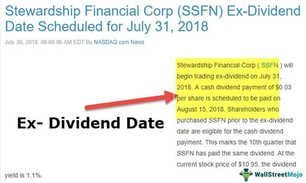

In the world of investing, dividends emerge as a reliable source of passive income, often attracting investors who seek regular earnings from their investments. Dividends represent a portion of a company's earnings distributed to shareholders, typically in the form of cash or additional shares. For investors aiming to optimize their income streams, understanding the nuances of stock dividends becomes essential. By grasping how dividends function and influence investment returns, investors can make informed decisions that align with their financial goals.

A critical component in the dividend process is the ex-dividend date, the key determinant in identifying which shareholders are entitled to the dividend payout. The ex-dividend date is the first day a stock trades without the value of its next dividend payment. To qualify for the dividend, investors must own the stock before this date. As a result, correctly identifying and acting upon the ex-dividend date is fundamental for investors looking to capitalize on dividend opportunities.



Meanwhile, algorithmic trading has revolutionized the investment landscape, providing tools and strategies that have significantly refined the way investors engage with the market. By using computer algorithms to execute trades based on predetermined criteria, investors can swiftly analyze vast quantities of data, recognize patterns, and seize opportunities for profit. Algorithmic trading can account for nuances like dividend timings, enabling more precise and effective investment strategies.

This article explores the combination of stock dividends, ex-dividend dates, and algorithmic trading as a means to construct a powerful and potentially lucrative investment strategy. Through strategic integration of these elements, investors may enhance their ability to generate consistent returns in an ever-evolving financial market.

## Table of Contents

## Understanding Stock Dividends

Stock dividends are a fundamental aspect of investing that attracts both novice and seasoned investors. These payments are made by a corporation to its shareholders, typically in the form of cash or additional shares. Corporations distribute dividends as a portion of their earnings, providing a direct link between a company's profitability and its dividends. Thus, a stable dividend payment history can be an indicator of a company's financial health and operating success.

Dividends serve as a means for investors to generate consistent income without needing to sell their stock holdings. This characteristic is particularly appealing to income-focused investors, such as retirees, who prioritize steady cash inflow over capital appreciation. Moreover, dividend-paying stocks often belong to well-established companies with predictable earnings, offering a relatively lower-risk investment avenue.

There are several types of dividends that corporations can issue, each with its unique financial implications:

1. **Cash Dividends**: This is the most common form of dividend payment, distributed directly in cash to shareholders. The amount is typically expressed on a per-share basis and paid out of the company's profits.

2. **Stock Dividends**: Instead of cash, companies may issue additional shares as dividends. This can be advantageous, as it allows shareholders to accumulate more shares without incurring immediate tax liabilities. However, stock dividends can dilute the share value since the overall ownership remains the same despite an increase in the number of shares outstanding.

3. **Special Dividends**: These are non-recurring dividends that companies pay on top of the regular dividends, often due to extraordinary profits or an exceptional business period. While appealing, special dividends should not be counted on for regular income as they do not indicate ongoing profitability.

Understanding the benefits and risks associated with dividend investing is critical for investors. While dividends provide a steady income stream, they are not immune to cuts or suspensions, especially during economic downturns or when companies face financial challenges. Furthermore, investing heavily in dividend stocks can lead to concentration risk if the investor does not diversify across different sectors or types of dividend-yielding stocks.

Ultimately, careful assessment of a company's dividend track record, payout ratios, and economic conditions can help investors make informed decisions. The dividend payout ratio, calculated as:

$$
\text{Dividend Payout Ratio} = \left( \frac{\text{Dividends Paid}}{\text{Net Income}} \right) \times 100
$$

serves as a useful measure to gauge how sustainable a company's current dividend policy is. High payout ratios may indicate vulnerability to dividend cuts during lean periods, whereas a lower ratio may suggest potential for growth or increased dividends in the future.

Investors must balance the promise of income with the potential risks to strategically integrate dividend stocks into their portfolios.

## The Importance of Ex-Dividend Dates

The ex-dividend date plays a pivotal role in the dividend payment process, fundamentally affecting who qualifies to receive a dividend payout. Essentially, this date determines the cutoff point for shareholders to be eligible for receiving declared dividends. If an investor holds shares before the ex-dividend date, they qualify for the forthcoming dividend payment. Conversely, purchasing shares on or after the ex-dividend date means the buyer will not receive the next dividend; instead, the seller retains this right.

On the ex-dividend date, stocks generally experience a price adjustment that corresponds approximately to the dividend amount. This adjustment reflects the market's anticipation that new buyers will not participate in the imminent dividend payment. For example, if a company declares a dividend of $1 per share and a stock is trading at $50, we might see the price drop to approximately $49 when the market opens on the ex-dividend date. This price decrease is not guaranteed to be exactly equal to the dividend amount due to market dynamics and other external factors, but often serves as an approximation.

Strategically, understanding the nuances of the ex-dividend date enables investors to make informed decisions regarding buying and selling stocks. An investor seeking dividend income must ensure their purchase is finalized before the ex-dividend date, while those looking to optimize capital gains may decide to sell after the ex-dividend date to include the dividend benefit. In trading strategies, executing timely trades around ex-dividend dates can significantly impact the total returns of an investment portfolio. This necessitates efficient execution to ensure trades are closed within desired time frames, optimizing the capture of dividend benefits while mitigating potential short-term price fluctuations.

While the ex-dividend date is crucial for the tactical planning of dividend-centric investment strategies, traders and investors need also to consider its implications within broader market patterns. Evaluating past price movements and turnover can provide insights into potential future behaviors around ex-dividend events, shaping more refined investment decisions.

## Algorithmic Trading and Its Role in Dividend Investing

Algorithmic trading, often involving complex computer programs, revolutionizes financial markets by leveraging algorithms to perform trades based on predefined sets of rules and strategies. These algorithms analyze immense volumes of data rapidly, detecting market patterns and identifying profit opportunities that may not be apparent through manual analysis. This method is particularly significant in dividend investing, where precise timing can substantially affect returns.

In dividend investing, the key advantage of [algorithmic trading](/wiki/algorithmic-trading) is its ability to optimize trade timing around dividend events such as the ex-dividend date. By systematically executing trades before and after dividend announcements, algorithms can secure dividend capture and benefit from potential price movements associated with dividend payouts. For instance, a well-designed algorithm can automatically purchase stocks before the ex-dividend date and sell them shortly thereafter, capitalizing on the predictable price changes that often occur.

Mathematically, traders can implement algorithms that maximize a trading strategy's utility, $U$, by evaluating potential gains from dividends and price changes against transaction costs and risks. This can be expressed as:
$$
U = \sum_{i} (P_i \cdot D_i - C_i) - \sum_{j} R_j
$$
where $P_i$ represents the price of stock $i$, $D_i$ is the dividend yield, $C_i$ stands for transaction costs, and $R_j$ is the risk associated with holding stock $j$.

Algorithms also contribute to enhanced returns by minimizing transaction costs and improving execution speed. They allow for swift and accurate trade execution, reducing the potential for human error and the market impact of trades. Algorithms can be programmed to execute high-frequency trades, taking advantage of even minor price discrepancies to lock in profits.

Developing a successful algorithm for dividend investing requires a robust understanding of both financial markets and the underlying technical programming skills. Programmers must be adept in languages like Python, which are commonly used for building and testing trading models. A basic Python code snippet for a simplistic dividend capture strategy might resemble:

```python
def dividend_capture(stocks, target_date):
    for stock in stocks:
        if stock.ex_dividend_date == target_date:
            buy(stock)
        elif stock.ex_dividend_date + timedelta(days=1) == target_date:
            sell(stock)

dividend_capture(my_stock_list, today)
```

This code assumes the existence of predefined functions for buying and selling stocks and a list of stocks with ex-dividend dates. Investing strategies are often backtested using historical data to validate their effectiveness and refine the algorithm's performance over time.

In conclusion, algorithmic trading holds a transformative role in dividend investing by enabling precise and optimized trade execution. It demands a careful blend of financial insight and programming acumen to design algorithms capable of capitalizing on dividend-related market dynamics efficiently. As technology progresses, the integration of algorithmic trading in dividend investing is likely to become even more sophisticated, offering promising avenues for maximizing investor returns.

## Synergizing Dividends, Ex-Dividend Dates, and Algo Trading

Combining stock dividend strategies with algorithmic trading offers opportunities to enhance returns by using data-driven techniques. Algorithms configured to take advantage of ex-dividend dates can optimize the timing of transactions, thus capitalizing on dividend payouts and price movements. For example, when an investor aims to buy a stock solely for its dividend, executing a purchase before the ex-dividend date is crucial. Algorithmic models can automate this process, ensuring precise timing that human traders might struggle to achieve.

To design effective algorithms, historical data on dividend distributions and stock prices can be leveraged for [backtesting](/wiki/backtesting). Backtesting involves running algorithms using historical data to simulate how they would have performed, thus offering insights into potential market behaviors and strategy effectiveness. Various programming tools like Python can be harnessed for this purpose, utilizing libraries such as Pandas for data manipulation and libraries like Backtrader for backtesting purposes.

```python
import pandas as pd
import backtrader as bt

class DividendStrategy(bt.Strategy):
    def __init__(self):
        self.ex_dividend_dates = self.data.ex_dividend_dates

    def next(self):
        if self.data.datetime.date(0) in self.ex_dividend_dates:
            self.buy(size=100)

# Placeholder for loading historical dividend data
historical_data = pd.read_csv('historical_dividends.csv')

# Implement data feed for Backtrader
data_feed = bt.feeds.PandasData(dataname=historical_data)
```

Factors such as tax implications, market conditions, and brokerage fees also play vital roles in shaping the effectiveness of a strategy. Taxes might erode returns from dividends, suggesting the need for algorithms that can optimize for post-tax returns. Furthermore, brokerage fees could diminish profits, necessitating high-frequency trading models that minimize transaction costs through optimal order execution.

Continual refinement of these algorithms is highlighted as essential for long-term success. By analyzing market feedback, investors can adapt their models to shifting market dynamics, regulatory changes, or emerging technological advancements. Refining algorithms can involve adjusting input parameters, improving execution algorithms, or even incorporating advanced AI techniques such as [machine learning](/wiki/machine-learning) for better predictive analysis.

Therefore, harnessing the synergy between stock dividend strategies, ex-dividend dates, and algorithmic trading demands careful consideration of initial conditions, ongoing adjustments, and a comprehensive understanding of market influences. This combination can lead to robust investment strategies capable of adapting to diverse market environments while maximizing returns.

## Case Studies and Examples of Successful Strategies

Examining real-world applications of dividend strategies using algorithmic trading can provide valuable insights into effective implementation. These case studies highlight both the successes and challenges faced by investors harnessing dividend-focused algorithms to achieve financial goals.

One notable case study involves a [hedge fund](/wiki/hedge-fund-trading-strategies) that developed an algorithmic strategy specifically targeting ex-dividend date fluctuations. The algorithm was designed to identify stocks with significant drops in price on their ex-dividend dates, allowing the fund to capitalize on price corrections post-dividend distribution. This approach required careful statistical analysis of historical dividend data and meticulous timing of trades to maximize returns while minimizing exposure to price [volatility](/wiki/volatility-trading-strategies). The algorithm demonstrated success by consistently outperforming market benchmarks, showcasing the potential for strategic gains via well-executed dividend capture strategies.

An essential aspect of successful algorithmic dividend strategies is their adaptability to varying market conditions. For instance, during periods of high market volatility, algorithmic strategies that incorporate parameters for volatility thresholds can adjust automatically, minimizing risk by reducing the frequency of trades or tightening price targets. This approach was effectively employed by a proprietary trading firm that adjusted its dividend-focused algorithms during the 2008 financial crisis, enabling it to maintain profitability even amidst turbulent market conditions.

However, challenges also arise in executing dividend-focused algorithms. A common issue is the impact of sudden regulatory changes, which can alter dividend distribution policies or tax treatments, potentially rendering preexisting algorithms less effective. An example of this occurred when changes in tax legislation in a specific country affected the net returns from dividends, necessitating rapid adjustments in the algorithm's decision-making framework to preserve the strategy's viability.

The robustness of an algorithm can be further evaluated by simulating its performance across diverse market scenarios using backtesting. Successful strategies often undergo extensive backtesting using historical data to evaluate their performance under various conditions, such as bull and bear markets. A research firm employing this method was able to refine its dividend strategy by identifying periods of market inefficiency where its algorithm performed best. This iterative process of refinement and adaptation is crucial for developing resilient algorithmic strategies capable of withstanding changing market dynamics.

In conclusion, the effectiveness of dividend strategies leveraging algorithmic trading lies in their ability to adapt to shifting market conditions and regulatory environments. By examining both triumphs and challenges in real-world implementations, investors can gain insights into developing adaptive and robust algorithms that consistently deliver results, enhancing portfolio performance regardless of the prevailing market climate.

## Risks and Considerations

Every investment strategy carries inherent risks that must be assessed and managed. Market volatility is a significant risk [factor](/wiki/factor-investing) that can impact the effectiveness of dividend-focused algorithmic trades. Sudden shifts in stock prices can lead to unexpected losses or gains, sometimes offsetting the stable income intended to be generated from dividends. For instance, algorithmic trading systems heavily reliant on historical data might not adapt swiftly to sharp market movements attributed to geopolitical events, economic reports, or other unforeseen factors.

Regulatory changes represent another crucial consideration. Financial markets are subject to evolving regulations that can affect dividend policies or the operation of algorithmic trading systems. Changes in tax laws, such as alterations in the taxation of dividend income, can directly influence the attractiveness of dividend stocks. Similarly, updates to securities trading regulations might impose restrictions on certain algorithmic strategies or require additional compliance measures, influencing their execution and profitability.

Technological challenges pose additional risks in algorithmic trading. System failures, network outages, or delays can significantly impact trade execution, leading to missed opportunities or unintended trades. The dependency on robust software and hardware infrastructure necessitates comprehensive contingency planning. Investors should ensure platforms are equipped with fail-safes and redundancies to mitigate these risks, especially in high-frequency trading environments where millisecond delays can have substantial financial implications.

Careful risk management and diversification are crucial to achieving long-term success in dividend-focused algorithmic trading. Diversifying across different sectors, asset types, and geographical regions can help mitigate individual stock volatility and specific market risks. Employing stop-loss orders or other automated mechanisms can further protect against significant downturns. Additionally, continuously updating algorithmic models to reflect current market conditions is essential. Investors should also consider backtesting algorithms under various hypothetical scenarios to evaluate their robustness and resilience against potential market changes.

In summary, while combining stock dividends with algorithmic trading presents significant opportunities, understanding and managing the related risks is vital. By doing so, investors can capitalize on the benefits while maintaining a balanced and precautionary approach to their investment strategy.

## Conclusion

Stock dividends, ex-dividend dates, and algorithmic trading collectively provide substantial advantages to investors by enhancing strategic decision-making and optimizing returns. By integrating these elements into an investment strategy, investors establish a more dynamic approach capable of leveraging each component's strengths. Stock dividends offer consistent income, while understanding ex-dividend dates ensures precise timing for dividend capture, and algorithmic trading allows for efficient execution and pattern recognition.

As financial markets continuously evolve, it's crucial for investors to remain informed about the advancements and changes impacting these tools. Embracing new methodologies and technologies is not only essential for capitalizing on emerging opportunities but also for mitigating potential risks. The landscape of investing is poised for ongoing innovation, promising new approaches to portfolio enhancement and management. Features such as machine learning and advanced data analytics could further refine algorithmic strategies, offering investors improved predictive capabilities and adaptive responses to market fluctuations.

Successfully navigating this intricate environment demands a commitment to analysis and continuous adaptation. Investors who approach their strategies with flexibility and a willingness to adjust based on market data and feedback are more likely to achieve sustained success. By maintaining a disciplined focus on education and strategic refinement, investors can effectively harness the potential of dividends, ex-dividend dates, and algorithmic trading to achieve their financial objectives.

## References & Further Reading

[1]: Bergstra, J., Bardenet, R., Bengio, Y., & Kégl, B. (2011). ["Algorithms for Hyper-Parameter Optimization."](https://papers.nips.cc/paper/4443-algorithms-for-hyper-parameter-optimization) Advances in Neural Information Processing Systems 24.

[2]: ["Advances in Financial Machine Learning"](https://www.amazon.com/Advances-Financial-Machine-Learning-Marcos/dp/1119482089) by Marcos Lopez de Prado

[3]: ["Evidence-Based Technical Analysis: Applying the Scientific Method and Statistical Inference to Trading Signals"](https://www.amazon.com/Evidence-Based-Technical-Analysis-Scientific-Statistical/dp/0470008741) by David Aronson

[4]: ["Machine Learning for Algorithmic Trading"](https://github.com/stefan-jansen/machine-learning-for-trading) by Stefan Jansen

[5]: ["Quantitative Trading: How to Build Your Own Algorithmic Trading Business"](https://www.amazon.com/Quantitative-Trading-Build-Algorithmic-Business/dp/1119800064) by Ernest P. Chan