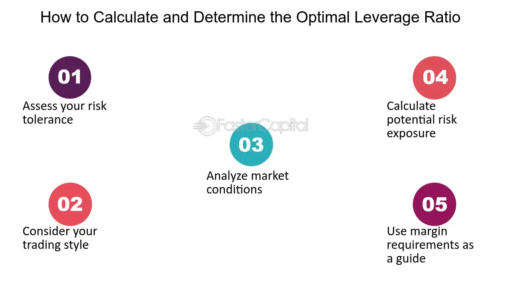

## Table of Contents

## What is leverage in forex trading?

Leverage in forex trading is like borrowing money to increase the size of your trade. It allows you to control a large position with a small amount of money. For example, with a leverage of 1:100, you can control a $100,000 position with just $1,000. This can amplify your profits if the market moves in your favor.

However, leverage can also increase your losses if the market moves against you. It's a double-edged sword. Because of this, it's important to use leverage carefully and understand the risks involved. Many traders use stop-loss orders to limit potential losses when trading with leverage.

## How does leverage affect my trading account?

Leverage can make your trading account grow faster if you make good trades. Imagine you have $1,000 and you use 1:100 leverage. This means you can trade with $100,000. If the currency you bought goes up by just 1%, you make $1,000. That's the same as your whole account! So, with leverage, small moves in the market can lead to big changes in your account.

But, leverage can also make your account smaller quickly if you make bad trades. If the currency you bought goes down by 1%, you lose $1,000, which is your entire $1,000 account. This is why using leverage is risky. You need to be careful and maybe use tools like stop-loss orders to protect your money. Always think about how much you can lose before you start trading with leverage.

## What are the risks associated with using leverage in forex trading?

Using leverage in [forex](/wiki/forex-system) trading can be risky. When you use leverage, you're borrowing money to make bigger trades. If the market moves against you, even a small change can lead to big losses. For example, if you use 1:100 leverage and the market moves just 1% against you, you could lose all the money you put in. This means you could end up owing more money than you have in your account, which is called a margin call. If you can't cover the losses, your broker might close your trades to limit their risk, and you could lose a lot of money.

Another risk is that leverage can make you feel overconfident. Because you can control big positions with little money, you might start taking bigger risks than you should. This can lead to more losses if the market doesn't go the way you expect. It's easy to forget that leverage is like a double-edged sword: it can help you make more money, but it can also make you lose more money faster. So, it's important to use leverage carefully and always think about how much you can afford to lose before you start trading.

## How can I calculate the appropriate amount of leverage for my trades?

To calculate the right amount of leverage for your trades, you need to think about how much risk you are okay with. Start by figuring out how much money you can afford to lose without it hurting you too much. This is called your risk capital. Then, look at the leverage ratio your broker offers. If you use a 1:100 leverage, you can trade with 100 times the money you put in. But remember, this also means your losses can be 100 times bigger. So, choose a leverage that matches your risk capital and comfort level with risk.

Another way to decide on leverage is to use a position size calculator. This tool helps you figure out how big your trade should be based on your account size, the leverage you want to use, and how much you're willing to risk on each trade. For example, if you have $1,000 and you're okay with risking 1% of your account on a trade, you might choose a smaller leverage to keep your risk low. By using these methods, you can find a leverage amount that fits your trading style and helps you manage your risk better.

## What is the relationship between leverage and margin requirements?

Leverage and margin requirements go hand in hand in forex trading. Leverage lets you trade with more money than you actually have in your account. For example, with 1:100 leverage, you can control a $100,000 position with just $1,000. But to use this leverage, you need to put up some of your own money as a deposit, which is called the margin. The margin is like a safety net for the broker to make sure you can cover potential losses. So, if you want to use high leverage, you'll need to meet the margin requirements set by your broker.

The margin requirement is usually a percentage of the total trade size. For instance, if the margin requirement is 1%, you need to have 1% of the $100,000 trade value, which is $1,000, in your account to open that trade with 1:100 leverage. If your trade goes against you and your account balance falls below the required margin, you'll get a margin call. This means you need to add more money to your account or close some trades to meet the margin requirement. Understanding the relationship between leverage and margin is crucial because it helps you manage your risk and avoid unexpected losses.

## How does leverage impact the potential profit and loss in forex trading?

Leverage in forex trading can make your profits bigger if the market moves the way you want. Imagine you have $1,000 and you use 1:100 leverage. This means you can trade with $100,000. If the currency you buy goes up by just 1%, you make $1,000. That's the same as your whole account! So, with leverage, even small moves in the market can lead to big changes in your account.

But, leverage can also make your losses bigger if the market moves against you. If the currency you buy goes down by 1%, you lose $1,000, which is your entire $1,000 account. This is why using leverage is risky. You need to be careful and maybe use tools like stop-loss orders to protect your money. Always think about how much you can lose before you start trading with leverage.

## What are some common leverage ratios used by forex traders?

Forex traders use different leverage ratios depending on how much risk they want to take. Some common leverage ratios are 1:50, 1:100, and 1:200. A 1:50 leverage means you can trade with 50 times the money you have in your account. For example, if you have $1,000, you can trade with $50,000. A 1:100 leverage lets you trade with 100 times your money, so with $1,000, you can trade with $100,000. And a 1:200 leverage means you can trade with 200 times your money, so with $1,000, you can trade with $200,000.

Choosing the right leverage ratio is important because it affects how much you can gain or lose. Higher leverage like 1:200 can make your profits bigger if the market moves your way, but it can also make your losses bigger if the market moves against you. Lower leverage like 1:50 is less risky because it doesn't amplify your gains or losses as much. Many traders start with lower leverage to learn the market and then maybe use higher leverage as they get more experience and understand the risks better.

## How can I use leverage effectively to manage my trading strategy?

To use leverage effectively in your trading strategy, you need to understand how it works and how much risk you're okay with. Start by choosing a leverage ratio that fits your risk level. If you're new to trading, you might want to use lower leverage like 1:50 to keep your risk small. As you learn more and feel more comfortable, you can think about using higher leverage like 1:100 or 1:200. Always remember that higher leverage can make your profits bigger, but it can also make your losses bigger if the market moves against you.

A good way to manage your trading strategy with leverage is to use tools like stop-loss orders. These orders help you limit your losses by automatically closing your trade if the market moves too far against you. Also, think about how much money you can afford to lose before you start trading. This is called your risk capital. Don't use money that you need for other things. By choosing the right leverage and using tools to manage your risk, you can trade more safely and have a better chance of making money in the long run.

## What are the regulatory limits on leverage for retail forex traders?

Different countries have different rules about how much leverage retail forex traders can use. In the United States, the Commodity Futures Trading Commission (CFTC) and the National Futures Association (NFA) set the maximum leverage at 1:50 for major currency pairs. For other currency pairs, it's even lower, at 1:20. These rules are there to help protect traders from losing too much money because leverage can make losses bigger.

In the European Union, the European Securities and Markets Authority (ESMA) has rules that limit leverage too. For major currency pairs, the maximum leverage is 1:30. For less common pairs, it's 1:20. These rules are meant to make trading safer for people by limiting how much they can borrow to trade. Always check the rules in your country because they can be different and might change over time.

## How does leverage differ between different forex brokers?

Leverage can be different from one forex broker to another because each broker has its own rules and might follow different country laws. Some brokers might offer high leverage like 1:500 or even 1:1000, while others might only offer up to 1:30 or 1:50, depending on where they are based and what the local rules say. For example, brokers in the United States usually offer a maximum leverage of 1:50 for major currency pairs because of rules set by the CFTC and NFA. On the other hand, brokers in some other countries might offer much higher leverage because their rules are different.

Choosing a broker with the right leverage for you depends on how much risk you want to take. If you like to trade with less risk, you might pick a broker with lower leverage like 1:30 or 1:50. This can help keep your losses smaller if the market moves against you. But if you're okay with taking more risk and you understand how leverage works, you might go for a broker that offers higher leverage like 1:200 or 1:500. Just remember, higher leverage can make your profits bigger, but it can also make your losses bigger, so always think about your risk level before you choose a broker.

## What advanced techniques can be used to optimize leverage in volatile markets?

In volatile markets, where prices move a lot and fast, traders can use advanced techniques to optimize their use of leverage. One way is to use dynamic leverage adjustment. This means changing the amount of leverage you use based on how much the market is moving. If the market is really jumping around, you might lower your leverage to keep your risk smaller. But if the market is calmer, you could use more leverage to try to make bigger profits. Another technique is to use [volatility](/wiki/volatility-trading-strategies)-based position sizing. This means figuring out how big your trades should be based on how much the market is moving. If the market is very volatile, you might make your trades smaller to limit your risk.

Another advanced technique is to use hedging strategies with leverage. Hedging means opening trades that can help protect you if the market moves against you. For example, if you're trading a currency pair with high leverage and the market is very volatile, you could open another trade in the opposite direction to balance out your risk. This can help you manage your exposure and limit potential losses. By combining these techniques, you can use leverage more safely in volatile markets and maybe even make better profits.

## How can I assess my risk tolerance to determine the optimal leverage for my trading style?

To figure out how much risk you can handle and decide on the best leverage for your trading, start by thinking about how much money you can lose without it hurting you too much. This is your risk capital. If losing a certain amount of money would make you really upset or cause problems for you, then that amount is too much risk for you. You can also look at how much of your account you're okay with risking on each trade. Many traders use a rule like risking only 1% or 2% of their account on any single trade. This helps them keep their overall risk low.

Once you know your risk tolerance, you can pick a leverage that fits it. If you're new to trading or if you don't like taking big risks, you might choose lower leverage like 1:30 or 1:50. This keeps your potential losses smaller. But if you're more experienced and okay with taking more risk, you might go for higher leverage like 1:100 or 1:200. Just remember, higher leverage can make your profits bigger, but it can also make your losses bigger if the market moves against you. So, always think about your risk level before you decide on the right leverage for your trading style.

## How can one build a robust algorithmic trading system?

Building a robust [algorithmic trading](/wiki/algorithmic-trading) system in forex markets involves several key steps. These steps help traders design strategies that can automate trading decisions with higher efficiency and precision.

### Steps to Developing a Successful Algorithmic Trading Strategy

1. **Define Clear Objectives**: Establishing well-defined goals is crucial. Traders need to ascertain whether they're seeking to exploit short-term market inefficiencies, trade based on long-term trends, or engage in arbitrage opportunities.

2. **Choose a Trading Model**: Models could be based on historical data analysis, statistical arbitrage, or machine learning techniques. For example, traders could employ linear regression models to predict price movements:
$$
   y = \beta_0 + \beta_1x_1 + \beta_2x_2 + \cdots + \beta_nx_n

$$

   where $y$ is the predicted price, $\beta$ coefficients represent the influence of each independent variable $x$.

3. **Data Collection and Preparation**: Gather historical data needed to train and test the trading models. The data should be relevant, high-quality, and pre-processed to remove anomalies and inconsistencies.

4. **Backtesting**: Assess the performance of the strategy on historical data to ensure the model’s effectiveness. Backtesting involves simulating the trading strategy over a past period and analyzing returns.

   Example Python code for a simple backtest might involve:

   ```python
   import pandas as pd

   def backtest_strategy(prices, signals):
       returns = prices.pct_change().shift(-1)
       strategy_returns = returns * signals
       cumulative_returns = (1 + strategy_returns).cumprod() - 1
       return cumulative_returns.iloc[-1]

   # Sample prices and buy/sell signals
   prices = pd.Series([100, 102, 105, 107, 106])
   signals = pd.Series([1, 1, 0, -1, 1])  # 1 for buy, -1 for sell
   print(backtest_strategy(prices, signals))
   ```

5. **Optimization**: Adjust the algorithm's parameters to enhance performance without overfitting. Techniques such as grid search or genetic algorithms can systematically explore parameter spaces.

6. **Validation**: Test the strategy on out-of-sample data to validate its predictive capability and confirm robustness. This step ensures that the algorithm performs well on new, unseen data.

### Incorporating Machine Learning and Other Advanced Technologies

Incorporating [machine learning](/wiki/machine-learning) can significantly enhance algorithmic trading strategies by improving predictive accuracy and adapting dynamically to market changes. Common techniques include:

- **Supervised Learning**: Algorithms like decision trees, random forests, or neural networks learn patterns from labeled datasets. They identify profitable trading signals and predict future price movements or trends.

- **Unsupervised Learning**: Clustering techniques can identify patterns or anomalies in forex data without predefined labels, which can signal potential trading opportunities.

- **Reinforcement Learning**: This involves learning an optimal trading strategy through interactions with a simulated trading environment. The algorithm iteratively selects actions that maximize cumulative rewards, akin to learning from trial and error.

- **Natural Language Processing (NLP)**: Analyzing news articles, financial reports, and social media sentiment can provide insights into market sentiment, aiding decision-making.

Incorporating these advanced technologies not only enriches algorithm design but also equips systems to handle large volumes of data and adapt to evolving market conditions. Therefore, successful algorithmic trading systems hinge on the combination of traditional strategy building frameworks with cutting-edge technologies.

## References & Further Reading

[1]: Bank for International Settlements. (2019). ["Triennial Central Bank Survey: Foreign exchange turnover in April 2019."](https://www.bis.org/statistics/rpfx19_fx.pdf) 

[2]: Investopedia. ["Foreign Exchange Market Definition."](https://www.investopedia.com/terms/forex/f/foreign-exchange-markets.asp)

[3]: Bergstra, J., Bardenet, R., Bengio, Y., & Kégl, B. (2011). ["Algorithms for Hyper-Parameter Optimization."](https://proceedings.neurips.cc/paper/2011/file/86e8f7ab32cfd12577bc2619bc635690-Paper.pdf) Advances in Neural Information Processing Systems 24.

[4]: ["Advances in Financial Machine Learning"](https://www.wiley.com/en-us/Advances+in+Financial+Machine+Learning-p-9781119482086) by Marcos Lopez de Prado

[5]: ["Evidence-Based Technical Analysis: Applying the Scientific Method and Statistical Inference to Trading Signals"](https://www.amazon.com/Evidence-Based-Technical-Analysis-Scientific-Statistical/dp/0470008741) by David Aronson

[6]: ["Machine Learning for Algorithmic Trading"](https://github.com/PacktPublishing/Machine-Learning-for-Algorithmic-Trading-Second-Edition) by Stefan Jansen

[7]: ["Quantitative Trading: How to Build Your Own Algorithmic Trading Business"](https://books.google.com/books/about/Quantitative_Trading.html?id=j70yEAAAQBAJ) by Ernest P. Chan