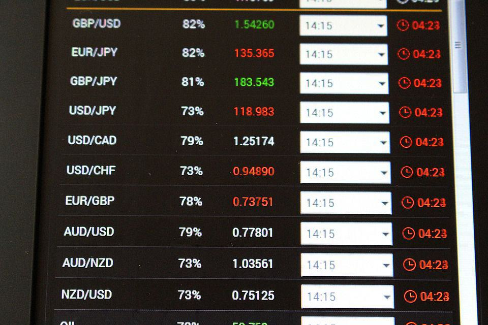

Forex trading, or foreign exchange trading, is the process of buying and selling currencies on a global decentralized market. It stands as one of the largest financial markets in the world, with a daily trading volume exceeding $6 trillion [1][2]. This high liquidity and 24-hour operation make forex trading attractive to a wide range of participants, including banks, corporations, and individual investors. The market plays a critical role in facilitating international trade and investment, allowing businesses to convert currencies for global operations and individuals to earn profits through speculative trading.

Leverage in forex trading refers to the use of borrowed funds to increase the potential return on investment. By controlling a larger position with a smaller amount of capital, traders have the opportunity to amplify their profits; however, this mechanism also increases the potential risk of significant losses. Leverage is typically expressed as a ratio, such as 100:1, meaning that for every dollar of actual capital, a trader can control $100 in the market. This strategy is crucial in forex trading, where small price movements can lead to substantial gains or losses due to the high level of leverage available.



Algorithmic trading, another vital strategy, involves using automated systems to execute trades based on predefined criteria. This method offers numerous advantages, including faster execution, reduced human error, and the ability to process large volumes of data efficiently. Traders employ various algorithms, ranging from simple moving averages to complex machine learning models, to identify opportunities and carry out trades with precision and speed.

The primary objectives of this article are to elucidate the role of leverage and algorithmic trading in forex markets, provide insights into effective strategies utilizing these concepts, and offer risk management techniques for traders. By understanding the implications and applications of leverage and algorithmic trading, traders can enhance their trading strategies and navigate the dynamic forex landscape more effectively.

References:
1. Bank for International Settlements. (2019). "Triennial Central Bank Survey: Foreign exchange turnover in April 2019." [Link](https://www.bis.org/statistics/rpfx19_fx.pdf)
2. Investopedia. "Foreign Exchange Market Definition." [Link](https://www.investopedia.com/terms/f/foreign-exchange-market.asp)

## Table of Contents

## Understanding Forex Trading Leverage

Forex trading leverage is a pivotal concept that allows traders to amplify their potential returns in the foreign exchange market. Leverage enables traders to control a larger position than what their actual capital would conventionally permit. This is achieved through borrowing additional funds from the broker, which effectively increases the trader's market exposure.

In the context of [forex](/wiki/forex-system) trading, leverage is commonly expressed as a ratio, such as 50:1, 100:1, or even 500:1. For example, a 100:1 leverage ratio means that for each dollar of the trader's own capital, the broker provides an additional $99, allowing the trader to control $100 in total. This mechanism allows traders to enter into positions that are much larger than their actual investment, potentially leading to significantly higher returns on equity.

### Leverage and Position Control

To understand how leverage facilitates the control of larger positions, consider a forex trader with $1,000 in capital using a leverage ratio of 100:1. Without leverage, the trader could only trade up to $1,000 worth of currency. However, with 100:1 leverage, the trader can control a position size of $100,000. This increased exposure implies that even small market movements can result in substantial profits.

In practice, high leverage can enable traders to take advantage of short-term market fluctuations without requiring a significant initial investment. This characteristic of leverage is particularly appealing in the forex market where currency price movements are typically small, often represented in pips (percentage in point), which is one-hundredth of one percent.

### Risks and Rewards of High Leverage

While leverage magnifies potential returns, it equally amplifies risks. High leverage can result in significant losses if the market does not move in the predicted direction. A small adverse movement in the exchange rate can quickly deplete the trader's account balance, leading to margin calls or even the automatic closure of positions by the broker to prevent further losses.

For example, using the previous scenario with a 100:1 leverage, a 1% decrease in the currency value would equate to a $1,000 loss on a $100,000 position, effectively wiping out the trader's initial capital. Such scenarios illustrate the high-risk nature of leveraged forex trading, emphasizing the necessity for effective risk management strategies to safeguard against potentially devastating losses.

Despite the risks, leverage remains a popular tool in forex trading due to its ability to generate significant returns from relatively modest investments. It is crucial, however, for traders to exercise caution and adhere to risk management practices, such as setting stop-loss orders and regularly monitoring positions, to mitigate the adverse impacts of high leverage.

In conclusion, forex trading leverage provides traders the opportunity to enhance their trading potential, but it is accompanied by substantial risk. The balance between leveraging opportunities and managing associated risks is central to successful forex trading.

## Effective Financial Strategies Using Leverage

Forex trading involves the buying and selling of currencies on the global foreign exchange market, which is the largest and most liquid financial market in the world. One of the key strategies employed by traders in this market is the use of leverage, which allows them to control a larger amount of currency with a relatively small investment. Leveraging can amplify both gains and losses, making it a powerful tool that requires careful application and understanding.

### Guidelines for Selecting the Appropriate Leverage Level Based on Risk Tolerance

Selecting the right level of leverage is crucial and should align with a trader’s risk tolerance. Leverage is often expressed as a ratio, such as 50:1 or 100:1, indicating how much capital the broker is willing to lend compared to the trader's own funds. For instance, a leverage ratio of 100:1 means that for every $1 of the trader's capital, the broker can lend $100. 

Choosing an appropriate leverage level requires evaluation of several factors:

1. **Risk Tolerance Assessment**: Traders should honestly assess their ability to withstand potential losses. A conservative trader may opt for lower leverage, minimizing the risk of significant losses, while more aggressive traders might choose higher leverage to maximize potential gains. 

2. **Experience Level**: Novice traders are typically advised to start with lower leverage to mitigate risks as they become more familiar with market dynamics and trading strategies.

3. **Market Conditions**: Volatile markets may encourage traders to use less leverage to avoid exacerbating losses. Lower leverage provides a buffer against rapid market changes that can occur unexpectedly.

### Importance of Maintaining a Proper Risk Management Strategy

Effective risk management is essential when using leverage in forex trading. Key elements include:

- **Stop-Loss Orders**: These orders automatically close positions at a predetermined price level, limiting potential losses. They are crucial in volatile markets where price swings can occur swiftly. 

- **Position Sizing**: Traders should allocate a portion of their capital to each trade, ensuring they do not overextend themselves and are able to withstand adverse market moves without catastrophic losses.

- **Diversification**: Engaging in multiple trades across different currency pairs can minimize exposure to a single asset, reducing risk through diversification. 

### Tips for Leveraging Safely in Volatile Markets

Given the inherent [volatility](/wiki/volatility-trading-strategies) in forex markets, traders can employ several strategies to leverage safely:

- **Keep Abreast of Economic Indicators**: Being informed about economic releases, geopolitical events, and other macroeconomic factors that influence currency prices can help traders anticipate market movements and adjust their leverage accordingly.

- **Regularly Review and Adjust Strategies**: As market conditions change, strategies need to evolve. Regular review of trading plans ensures they remain effective and in line with market realities.

- **Utilize Demo Accounts for Practice**: Before employing high leverage in a live environment, traders should practice with demo accounts to test strategies without risking real capital. This approach helps build confidence and refine skills.

In conclusion, leverage is a double-edged sword in forex trading, requiring careful consideration of risk tolerance, effective risk management strategies, and market conditions. By applying these principles, traders can maximize the potential benefits of leverage while mitigating its risks.

## Exploring Algorithmic Trading in Forex

Algorithmic trading, also known as algo trading, has gained considerable traction in the forex market. Its rise in popularity stems from its ability to automate and optimize the trading process, allowing traders to execute orders at speeds and frequencies that a human trader cannot achieve. This technology leverages complex mathematical models and algorithms to make decisions about buying or selling assets on an exchange, with the goal of generating profits.

One of the main advantages of [algorithmic trading](/wiki/algorithmic-trading) is its speed and precision. Algorithms can scan multiple markets and a large variety of instruments simultaneously, executing orders instantaneously based on predefined criteria. This reduces latency compared to manual trading, allowing traders to capitalize on market conditions with impeccable timing. Furthermore, algorithmic trading minimizes the impact of human emotion and error, providing a disciplined trading approach that follows a consistent set of rules.

Several types of algorithms are commonly employed in forex trading. Trend following algorithms, for example, identify and capitalize on patterns in price movements. These algorithms use various technical indicators, such as moving averages and [momentum](/wiki/momentum) indicators, to determine the direction of the market and make trades accordingly. The primary aim is to identify long-term trends and generate profits from sustained price changes.

Arbitrage algorithms, on the other hand, exploit price differentials in various markets or different forms of the same financial instrument. Arbitrageurs aim to make risk-free profits by quickly identifying and executing trades that capitalize on discrepancies in asset prices. For example, if a forex pair is priced differently on two exchanges, an algorithm can simultaneously buy on the lower-priced exchange and sell on the higher-priced one, pocketing the difference.

Algorithmic trading also includes more advanced strategies such as high-frequency trading ([HFT](/wiki/high-frequency-trading-strategies)), characterized by extremely high turnover rates and order-to-trade ratios. HFT firms use proprietary algorithms to exploit very short-term market inefficiencies, executing thousands or even millions of trades per day. 

As technology advances, [machine learning](/wiki/machine-learning) and [artificial intelligence](/wiki/ai-artificial-intelligence) are increasingly integrated into trading algorithms, enhancing their capability to adapt and learn from new data patterns. This evolution enables more sophisticated predictive analytics, potentially improving the overall profitability and robustness of trading strategies. 

The proliferation of high-speed internet and significant developments in trading technology have made algorithmic trading more accessible to retail forex traders, not just large financial institutions. As a result, it continues to grow in popularity, offering a method to tackle the challenges of the forex market with automated precision and efficiency.

## Building a Robust Algorithmic Trading System

Building a robust algorithmic trading system in forex markets involves several key steps. These steps help traders design strategies that can automate trading decisions with higher efficiency and precision.

### Steps to Developing a Successful Algorithmic Trading Strategy

1. **Define Clear Objectives**: Establishing well-defined goals is crucial. Traders need to ascertain whether they're seeking to exploit short-term market inefficiencies, trade based on long-term trends, or engage in arbitrage opportunities.

2. **Choose a Trading Model**: Models could be based on historical data analysis, statistical arbitrage, or machine learning techniques. For example, traders could employ linear regression models to predict price movements:
$$
   y = \beta_0 + \beta_1x_1 + \beta_2x_2 + \cdots + \beta_nx_n

$$

   where $y$ is the predicted price, $\beta$ coefficients represent the influence of each independent variable $x$.

3. **Data Collection and Preparation**: Gather historical data needed to train and test the trading models. The data should be relevant, high-quality, and pre-processed to remove anomalies and inconsistencies.

4. **Backtesting**: Assess the performance of the strategy on historical data to ensure the model’s effectiveness. Backtesting involves simulating the trading strategy over a past period and analyzing returns.

   Example Python code for a simple backtest might involve:

   ```python
   import pandas as pd

   def backtest_strategy(prices, signals):
       returns = prices.pct_change().shift(-1)
       strategy_returns = returns * signals
       cumulative_returns = (1 + strategy_returns).cumprod() - 1
       return cumulative_returns.iloc[-1]

   # Sample prices and buy/sell signals
   prices = pd.Series([100, 102, 105, 107, 106])
   signals = pd.Series([1, 1, 0, -1, 1])  # 1 for buy, -1 for sell
   print(backtest_strategy(prices, signals))
   ```

5. **Optimization**: Adjust the algorithm's parameters to enhance performance without overfitting. Techniques such as grid search or genetic algorithms can systematically explore parameter spaces.

6. **Validation**: Test the strategy on out-of-sample data to validate its predictive capability and confirm robustness. This step ensures that the algorithm performs well on new, unseen data.

### Incorporating Machine Learning and Other Advanced Technologies

Incorporating machine learning can significantly enhance algorithmic trading strategies by improving predictive accuracy and adapting dynamically to market changes. Common techniques include:

- **Supervised Learning**: Algorithms like decision trees, random forests, or neural networks learn patterns from labeled datasets. They identify profitable trading signals and predict future price movements or trends.

- **Unsupervised Learning**: Clustering techniques can identify patterns or anomalies in forex data without predefined labels, which can signal potential trading opportunities.

- **Reinforcement Learning**: This involves learning an optimal trading strategy through interactions with a simulated trading environment. The algorithm iteratively selects actions that maximize cumulative rewards, akin to learning from trial and error.

- **Natural Language Processing (NLP)**: Analyzing news articles, financial reports, and social media sentiment can provide insights into market sentiment, aiding decision-making.

Incorporating these advanced technologies not only enriches algorithm design but also equips systems to handle large volumes of data and adapt to evolving market conditions. Therefore, successful algorithmic trading systems hinge on the combination of traditional strategy building frameworks with cutting-edge technologies.

## Managing Risks in Forex Traders with Leverage and Algorithms

Forex trading, when combined with leverage and algorithmic systems, presents unique challenges and risks to traders. Leveraging allows traders to control larger positions with a relatively small amount of capital, magnifying both potential gains and losses. Automated systems, or algorithmic trading, execute pre-set trading instructions, which can significantly increase efficiency but also bring about specific risks if not properly managed.

**Common Risks**

1. **Market Volatility**: One of the predominant risks is heightened market volatility. Though leverage has the potential to enhance profits, it can also lead to substantial losses, especially in volatile market conditions. Rapid price swings may trigger large losses that exceed the initial investment.

2. **Algorithmic Failures**: Automated systems can malfunction or misinterpret data, leading to incorrect trading actions. This can be due to programming errors, unexpected market conditions, or connectivity issues with trading platforms.

3. **Margin Calls**: High leverage increases the probability of margin calls, where traders are required to deposit additional funds to maintain their trading position. This situation arises when losses deplete the account equity below a predefined level.

**Mitigation Strategies**

1. **Diversification**: Spreading investments across various instruments and asset classes can reduce risk. This strategy helps in minimizing the impact of adverse price movements on a single currency pair or financial instrument.

2. **Risk Management Tools**: Implement stop-loss and take-profit orders to manage potential losses and lock in profits. These tools automatically close trades when the market reaches predetermined levels, protecting trader capital from substantial losses.

3. **Regular Monitoring and Adjustments**: Continuous monitoring of both the market environment and algorithmic performance is crucial. Adjusting algorithms and leverage ratios according to market conditions can reduce potential risks significantly.

4. **Staying Informed**: Keeping abreast of the latest market trends, technological advancements, and regulatory changes helps traders anticipate and adapt to potential challenges. Engaging with trading communities and following industry insights are useful practices in staying updated.

5. **Backtesting and Simulation**: Before deploying an algorithm, backtesting against historical data is essential to evaluate its performance. This process helps identify potential risks and enables the refinement of trading strategies without incurring actual financial loss.

Here is an example of a Python script that can help simulate a stop-loss strategy:

```python
import numpy as np

# Example market data: random daily returns
np.random.seed(42)
daily_returns = np.random.randn(100) * 0.01

# Initial capital and stop-loss threshold
initial_capital = 10000
stop_loss_threshold = 0.05  # 5% stop-loss

# Simulate trading with stop-loss
capital = initial_capital
for daily_return in daily_returns:
    daily_profit_loss = capital * daily_return

    # Update capital
    capital += daily_profit_loss

    # Check for stop-loss condition
    if capital < initial_capital * (1 - stop_loss_threshold):
        print(f"Stop-loss triggered at capital: {capital:.2f}")
        break

print(f"Final capital: {capital:.2f}")
```

The code simulates trading based on random daily returns and triggers a stop-loss condition if the capital falls below a specified threshold, demonstrating a basic risk management approach.

Incorporating these risk management methods can protect against drastic losses and create a sustainable trading approach. As the forex market continually evolves, constant vigilance and adaptation remain vital for traders employing leverage and algorithmic systems.

## Case Studies and Success Stories

Forex trading strategies involving leverage and algorithmic trading have garnered significant attention due to their potential for augmented profits and streamlined execution. Below are some notable case studies and success stories that highlight how these strategies can be effectively utilized, alongside the potential pitfalls to be wary of.

### Examples of Successful Traders

#### 1. George Soros

One of the most oft-cited figures in forex trading is George Soros, who famously "broke the Bank of England" in 1992. Utilizing leveraged positions, Soros was able to speculate against the British pound, eventually forcing the UK to [exit](/wiki/exit-strategy) the European Exchange Rate Mechanism. This move reportedly earned his Quantum Fund over $1 billion in a single day. Soros's strategy underscores the power of leverage to magnify returns, provided one has a deep understanding of market mechanics and timing.

#### 2. The Medallion Fund

The Medallion Fund, managed by Renaissance Technologies, is another exemplary entity using algorithmic trading to achieve unprecedented success. Known for its secretive and sophisticated algorithms, the fund has consistently outperformed traditional markets. By leveraging advanced models and statistical trading approaches, the fund has effectively managed risks while generating significant returns. The use of leverage in their strategies allows the fund to maximize the efficacy of its algorithms, capturing profits from small inefficiencies in the market.

### Lessons Learned

From these case studies, new traders can derive several lessons:

1. **Research and Analysis**: Both Soros and Renaissance Technologies show that comprehensive research and market analysis are crucial. Traders must invest time in understanding market trends, economic indicators, and geopolitical events.

2. **Risk Management**: Though leverage can amplify gains, it equally magnifies losses. Implementing robust risk management strategies such as stop-loss orders and diversification are necessary. For instance, Soros's use of options allowed for controlled risk exposure.

3. **Adaptability and Continuous Learning**: Markets are dynamic, and strategies that work today may not yield results tomorrow. Both Soros's and Renaissance Technologies' successes are attributed to their adaptability and willingness to evolve their strategies based on market changes.

### Potential Pitfalls and Avoidance

While the successes are instructive, equally important are the mistakes made along the way:

- **Over-Leveraging**: A common mistake is over-leveraging, which can lead to catastrophic losses. Traders should maintain a leverage level that aligns with their risk appetite.

- **Neglecting Market Conditions**: Ignoring broader economic indicators can lead to misguided trades. Successful trading involves a holistic understanding of both micro and macroeconomic factors.

- **Over-Reliance on Algorithms**: While algorithmic trading offers precision, it's not infallible. Black swan events or unprecedented market conditions can lead to unexpected losses. Regular monitoring and updating of trading algorithms are essential.

In conclusion, leveraging and algorithmic trading offer substantial opportunities in forex markets. Learning from successful traders and understanding their strategies—while also learning from their mistakes—can equip new traders with a robust foundation for navigating the complexities of forex trading.

## Conclusion

Leveraging and algorithmic trading offer significant advantages and inherent risks in forex trading. Leverage allows traders to amplify their market position with a relatively small amount of capital, thereby increasing potential profits. However, it also magnifies losses, potentially exceeding the initial investment if not managed carefully. The proper use of leverage necessitates a keen understanding of one's risk tolerance and market dynamics, underscoring the importance of disciplined risk management strategies.

Algorithmic trading enhances the trading process by executing orders with speed and precision that isn't possible manually. This results in benefits like eliminating emotional biases and capturing a greater number of market opportunities. However, it also comes with risks, such as system failures, algorithmic errors, or volatile market conditions affecting automated systems' efficacy. Consequently, maintaining a robust and thoroughly tested algorithmic strategy is vital.

Looking forward, the future of forex trading strategies appears promising as technological advancements continue to reshape the industry landscape. Innovations such as artificial intelligence and machine learning are poised to further enhance algorithms, offering greater predictive capabilities and adaptive learning processes. These technologies are likely to increase the sophistication and effectiveness of trading systems, potentially opening new avenues for profitability.

Despite the potential of these strategies, traders are encouraged to apply them with caution and due diligence. Strategies should be customized to individual risk profiles, supported by comprehensive education and ongoing market analysis. As with any investment approach, maintaining a balance between leveraging opportunities and mitigating risks is crucial for long-term success. By remaining informed and adaptable, traders can potentially harness these advanced strategies to navigate the evolving forex market landscape effectively.

## Frequently Asked Questions (FAQ)

What is the best leverage ratio for a beginner in forex trading?

Leverage allows traders to control larger positions with a relatively small amount of capital, amplifying both potential gains and potential losses. For beginners in forex trading, selecting an appropriate leverage ratio is crucial to manage risk effectively. A commonly recommended leverage ratio for novice traders is 10:1. This means that for every $1 of capital, a trader can control up to $10 in forex trades. This level of leverage is generally considered conservative and allows beginners to gain experience in the market without exposing themselves to excessive risk. It's important to note that some regulatory bodies, like the Commodity Futures Trading Commission (CFTC) in the United States, have imposed restrictions on leverage to protect retail investors.

Can algorithmic trading be profitable without in-depth technical knowledge?

Algorithmic trading leverages computer programs to execute trades automatically based on predefined criteria. While it is possible for algorithmic trading to be profitable, having some technical knowledge can significantly enhance the likelihood of success. Basic programming skills, understanding of financial markets, and knowledge of data analysis techniques are valuable in developing and maintaining profitable algorithms. Moreover, many platforms offer tools and pre-built algorithms that can be used by traders with limited technical skills. However, being able to adapt and customize these tools can provide an edge in a competitive market. Beginners should consider investing time in learning programming languages like Python, which is popular for building algorithmic trading systems.

How does market volatility impact leveraged forex trading?

Market volatility refers to the degree of variation in the price of a financial instrument over time. In leveraged forex trading, volatility can have a pronounced impact due to the magnified exposure it creates. High volatility environments can lead to significant price swings, which can amplify both the gains and the losses incurred by traders. For instance, if a currency pair experiences a sudden spike in volatility, a trader using leverage might see their position's value change dramatically in a short period. This can trigger margin calls, requiring additional capital to maintain positions, or result in stop-loss orders being executed to limit potential losses. Therefore, traders must be vigilant and incorporate risk management strategies, such as setting stop-loss levels and using lower leverage ratios to mitigate the risks associated with market volatility.

## References & Further Reading

[1]: Bank for International Settlements. (2019). ["Triennial Central Bank Survey: Foreign exchange turnover in April 2019."](https://www.bis.org/statistics/rpfx19_fx.pdf) 

[2]: Investopedia. ["Foreign Exchange Market Definition."](https://www.investopedia.com/terms/forex/f/foreign-exchange-markets.asp)

[3]: Bergstra, J., Bardenet, R., Bengio, Y., & Kégl, B. (2011). ["Algorithms for Hyper-Parameter Optimization."](https://proceedings.neurips.cc/paper/2011/file/86e8f7ab32cfd12577bc2619bc635690-Paper.pdf) Advances in Neural Information Processing Systems 24.

[4]: ["Advances in Financial Machine Learning"](https://www.wiley.com/en-us/Advances+in+Financial+Machine+Learning-p-9781119482086) by Marcos Lopez de Prado

[5]: ["Evidence-Based Technical Analysis: Applying the Scientific Method and Statistical Inference to Trading Signals"](https://www.amazon.com/Evidence-Based-Technical-Analysis-Scientific-Statistical/dp/0470008741) by David Aronson

[6]: ["Machine Learning for Algorithmic Trading"](https://github.com/PacktPublishing/Machine-Learning-for-Algorithmic-Trading-Second-Edition) by Stefan Jansen

[7]: ["Quantitative Trading: How to Build Your Own Algorithmic Trading Business"](https://books.google.com/books/about/Quantitative_Trading.html?id=j70yEAAAQBAJ) by Ernest P. Chan