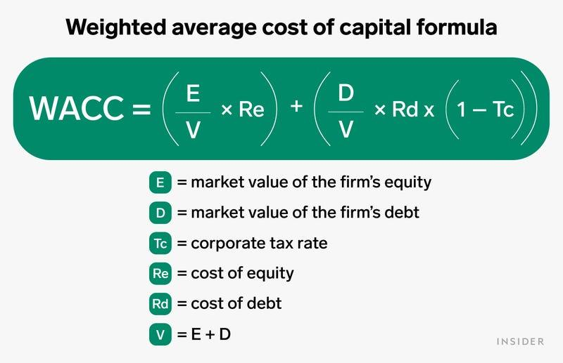

## Table of Contents

## What is the cost of capital?

The cost of capital is the return a company needs to pay to its investors for using their money. It's like the price a company pays for the funds it uses to run and grow its business. This cost comes from different sources like loans, bonds, and stock. Each source has its own cost, and the overall cost of capital is a mix of all these costs, weighted by how much the company uses each one.

Companies use the cost of capital to make decisions about new projects or investments. If a project is expected to make more money than the cost of capital, it's usually a good idea to go ahead with it. This helps the company grow and make more profit. On the other hand, if a project's return is less than the cost of capital, it might not be worth doing because it could lose money for the investors.

## Why is determining the proper weights for cost of capital important?

Determining the proper weights for the cost of capital is important because it helps a company figure out the true cost of the money it uses. Think of it like a recipe where you need to mix different ingredients in the right amounts. If a company gets the weights wrong, it might think a project is more or less profitable than it really is. This can lead to bad decisions, like starting projects that lose money or missing out on good opportunities.

Using the right weights means the company can compare the cost of capital to the returns from its projects accurately. This helps the company choose projects that will make more money than they cost, which is good for the company and its investors. If the weights are off, the company might end up paying more for its money than it needs to, which can hurt its profits and growth. So, getting the weights right is key to making smart financial decisions.

## What are the different components of the cost of capital?

The cost of capital is made up of different parts that a company uses to get money. The main parts are debt and equity. Debt is like borrowing money from a bank or issuing bonds. When a company uses debt, it has to pay interest on the money it borrows. Equity is when a company sells shares of stock to investors. In return, the company might pay dividends to the shareholders, and the stock's price can go up or down, giving investors a chance to make money.

Each part of the cost of capital has its own cost. The cost of debt is the interest rate the company has to pay on its loans or bonds. The cost of equity is trickier to figure out. It's based on what investors expect to earn from their investment in the company's stock. This can depend on things like how risky the company is and how well it's doing. To find the total cost of capital, a company mixes these costs together, using the right weights to show how much it relies on each type of money.

## How do you calculate the cost of debt?

To calculate the cost of debt, you start by looking at the interest rate a company pays on its loans or bonds. This rate is what the company has to pay back to the people or institutions that lent them the money. But, there's a catch. The interest a company pays can be written off on its taxes, which makes the real cost of debt a bit lower. So, to find the after-tax cost of debt, you take the interest rate and multiply it by one minus the company's tax rate.

For example, if a company has a loan with an interest rate of 5% and its tax rate is 30%, the after-tax cost of debt would be 5% times (1 - 0.30). That comes out to 5% times 0.70, which equals 3.5%. This 3.5% is the true cost of the debt to the company because it shows how much it really costs after getting the tax break. This number is important for figuring out the company's total cost of capital.

## How do you calculate the cost of equity?

The cost of equity is what investors expect to earn from owning a company's stock. It's a bit trickier to figure out than the cost of debt because it's not a set interest rate. One common way to calculate it is by using the Capital Asset Pricing Model (CAPM). This model says the cost of equity is equal to the risk-free rate (like what you'd get from a super safe investment like a government bond) plus a risk premium. The risk premium is based on how risky the company's stock is compared to the overall market. You find this by multiplying the stock's beta (which measures the stock's risk) by the market risk premium (the extra return investors expect for taking on more risk).

For example, if the risk-free rate is 2%, the market risk premium is 5%, and the company's beta is 1.2, the cost of equity would be 2% + (1.2 * 5%). That comes out to 2% + 6%, which equals 8%. This 8% is what investors expect to earn from the company's stock. It's important because it helps the company decide if a project is worth doing. If a project's return is higher than 8%, it might be a good investment. If it's lower, the company might want to look for something better.

## What is the weighted average cost of capital (WACC) and how is it used?

The weighted average cost of capital (WACC) is like a big mix of all the costs a company pays for the money it uses. It's called "weighted" because it takes into account how much the company uses different types of money, like loans and stock. To find the WACC, you take the cost of each type of money, like the cost of debt and the cost of equity, and then you mix them together using the right weights. The weights are based on how much of each type of money the company uses. For example, if a company uses more loans than stock, the cost of debt will have a bigger weight in the WACC.

Companies use the WACC to make smart decisions about new projects or investments. If a project is expected to make more money than the WACC, it's usually a good idea to go ahead with it. This helps the company grow and make more profit. On the other hand, if a project's return is less than the WACC, it might not be worth doing because it could lose money for the investors. So, the WACC is a really important number that helps companies figure out if they're using their money in the best way possible.

## How do you determine the appropriate weights for debt and equity in WACC?

To determine the right weights for debt and equity in the weighted average cost of capital (WACC), you look at how much of each type of money the company uses. This is usually based on the company's market values. For debt, you add up the value of all the company's loans and bonds. For equity, you look at the total value of all the company's stock. The weight of debt is the value of the debt divided by the total value of the company (debt plus equity). The weight of equity is the value of the equity divided by the total value of the company.

Using these weights makes sure that the WACC reflects how the company is actually funded. If a company uses a lot of debt, the weight of debt will be higher, and if it uses a lot of stock, the weight of equity will be higher. Getting the weights right is important because it helps the company make accurate decisions about new projects. If the weights are off, the company might think a project is more or less profitable than it really is, which can lead to bad choices. So, using the right weights helps the company use its money in the best way possible.

## What are the common methods for estimating the market value of debt and equity?

To estimate the market value of debt, you can look at the current market price of the company's bonds if they are traded publicly. If the bonds are not traded, you can use the book value of the debt, which is what the company owes according to its financial statements, and adjust it to reflect the current interest rates. Another way is to calculate the present value of all future interest and principal payments the company has to make on its debt. This method considers the time value of money and gives a more accurate picture of what the debt is worth today.

For the market value of equity, you can simply multiply the number of outstanding shares by the current stock price. This gives you the total value of the company's stock as seen by investors in the market. If the stock is not publicly traded, you might use the book value of equity, which is the company's total assets minus its total liabilities, as a rough estimate. However, this method can be less accurate because it doesn't reflect what investors might be willing to pay for the stock in the market. Both methods help companies figure out how much their debt and equity are worth, which is important for calculating the weighted average cost of capital (WACC).

## How does the capital structure of a company affect the weights in the cost of capital?

The capital structure of a company is all about how it mixes different types of money to fund its business. This mix can be debt, like loans and bonds, or equity, like stocks. When a company decides on its capital structure, it changes the weights used in the cost of capital. If a company uses more debt, the weight of debt in the cost of capital goes up. If it uses more equity, the weight of equity goes up. These weights are important because they show how much the company relies on each type of money.

The weights in the cost of capital are found by looking at the market values of the debt and equity. If a company has a lot of debt compared to equity, the cost of debt will have a bigger weight in the total cost of capital. This can make the overall cost of capital lower because debt is usually cheaper than equity, but it also makes the company riskier. On the other hand, if a company uses more equity, the cost of capital might be higher, but the company might be seen as less risky. So, the capital structure really matters because it affects how the company's money is priced and how it makes decisions about new projects.

## What are the challenges in accurately determining the weights for cost of capital?

Determining the right weights for the cost of capital can be tricky because it depends on the market values of a company's debt and equity. The market value of debt can be hard to figure out, especially if the company's bonds aren't traded often. You might have to use the book value of the debt and adjust it for current interest rates, or calculate the present value of future payments, which can be complicated. For equity, the market value is usually the stock price times the number of shares, but this can change every day. If the stock isn't traded publicly, you might have to use the book value, which might not show what investors really think the company is worth.

Another challenge is that the capital structure of a company can change over time. Companies might take on more debt or issue more stock, which changes the weights of debt and equity in the cost of capital. If these changes aren't accounted for correctly, the weights might be off, leading to a wrong cost of capital. This can make it hard for the company to make good decisions about new projects. Getting the weights right is important because it helps the company figure out if it's using its money in the best way possible, but it's not always easy to do.

## How do changes in market conditions affect the weights and cost of capital?

Changes in market conditions can shake up the weights and cost of capital for a company. Imagine the market is like the weather, and it can change from sunny to stormy. When interest rates go up, the cost of debt goes up too, because it's more expensive for companies to borrow money. This might make companies want to use less debt and more equity, changing the weights in their cost of capital. Also, if the stock market goes down, the value of a company's equity might drop, which means the weight of equity in the cost of capital could get smaller. All these shifts in the market can make the cost of capital go up or down, which affects how companies plan their projects and investments.

Another way market conditions can affect the cost of capital is through investor confidence. If investors are feeling good about the economy, they might be willing to buy more stocks, which can increase the value of a company's equity. This would make the weight of equity bigger in the cost of capital. But if investors are worried, they might want safer investments like bonds, which can make the cost of debt go down and change the weights. So, the mood of the market can really shake things up, making it harder for companies to figure out the best way to use their money. Keeping an eye on these changes helps companies make smarter decisions about their money and projects.

## What advanced techniques can be used to optimize the weights in the cost of capital for different scenarios?

To optimize the weights in the cost of capital for different scenarios, companies can use something called scenario analysis. This means they look at different possible futures, like if interest rates go up or down, or if the stock market gets better or worse. By playing out these different futures, companies can see how the weights of debt and equity might change. They might use computer models to help with this, which can run lots of different scenarios quickly. This helps them figure out the best mix of debt and equity for each situation, so they can make the best decisions about new projects.

Another advanced technique is using something called optimization algorithms. These are like smart math tools that can find the best weights for debt and equity to make the cost of capital as low as possible. The algorithms look at things like the company's risk, how much it can borrow, and what investors expect. They can adjust the weights in lots of different ways until they find the perfect mix. This is really helpful because it takes a lot of the guesswork out of figuring out the cost of capital, and it can help companies make sure they're using their money in the best way possible no matter what's happening in the market.

## What is the understanding of the Cost of Capital?

Cost of capital is a foundational concept in financial management, representing the expected return necessary to justify an investment's inherent risk. It serves as a crucial metric that informs both investment decisions and corporate financial strategies. At its core, the cost of capital integrates the cost of debt and the cost of equity, providing a benchmark rate against which investment opportunities are assessed.

The cost of debt is typically determined by prevailing interest rates and reflects the rate that a company must pay to its creditors. This component is influenced by market conditions, the borrower’s creditworthiness, and macroeconomic factors. The cost of equity, on the other hand, represents the returns demanded by equity investors. It is often estimated using models such as the Capital Asset Pricing Model (CAPM), which calculates the expected return based on the risk-free rate, the asset's beta (a measure of its sensitivity to market movements), and the equity market risk premium:

$$

\text{Cost of Equity} = R_f + \beta(E(R_m) - R_f) 
$$

where $R_f$ is the risk-free rate, $\beta$ is the beta of the asset, and $E(R_m)$ is the expected market return.

The Weighted Average Cost of Capital (WACC) is the comprehensive measure that combines the costs of both debt and equity, weighted by their respective proportions in a firm’s capital structure. WACC is calculated as:

$$

\text{WACC} = \left(\frac{E}{V}\right) \cdot \text{Cost of Equity} + \left(\frac{D}{V}\right) \cdot \text{Cost of Debt} \cdot (1-T_c)
$$

where $E$ is the market value of equity, $D$ is the market value of debt, $V$ is the total market value of the company's financing (equity and debt), and $T_c$ is the corporate tax rate. 

Accurate computation of WACC is essential for effective resource allocation, enabling firms to pursue projects and investments that yield returns exceeding this cost. A precise understanding of cost of capital supports long-term strategic planning, guiding businesses in optimizing their capital allocations and optimizing investment portfolios. It acts not only as a decision-making tool but also as a reflection of the company's risk profile to investors, influencing perceptions of corporate value and financial health.

By applying these concepts, businesses can ensure they are adequately compensated for risks undertaken, thereby aligning investment and financing choices with overarching corporate objectives. This alignment fosters enhanced investor trust and potentially increases access to capital markets under favorable terms.

## What is the Role of Cost of Capital in Financial Analysis?

Cost of capital is a fundamental metric in financial analysis, serving as a benchmark for evaluating investment opportunities. It plays a critical role in capital budgeting and financial planning by influencing the determination of Discounted Cash Flow (DCF) and Net Present Value (NPV), two essential methods for assessing project feasibility.

### Discounted Cash Flow (DCF) and Net Present Value (NPV)

The cost of capital is integral to calculating DCF, a valuation method used to estimate the value of an investment based on its expected future cash flows. These cash flows are discounted to the present value using the cost of capital, which reflects the opportunity cost of investing in a specific project instead of alternative investments. Mathematically, the NPV can be expressed as:

$$
\text{NPV} = \sum_{t=1}^{n} \frac{C_t}{(1 + r)^t} - C_0
$$

Where:
- $C_t$ denotes the cash flow at time $t$,
- $r$ represents the discount rate, or cost of capital,
- $n$ is the total number of periods,
- $C_0$ is the initial investment cost.

The NPV calculation reveals whether the expected earnings, discounted for time and risk, exceed the initial costs, thus guiding investment decisions.

### Industry Variations in Cost of Capital

Different industries experience varying capital costs, reflecting diverse risk profiles and market dynamics. Companies operating in sectors with high degrees of uncertainty, such as technology or biotech, likely encounter higher costs of capital than those in more stable industries like utilities. These variations stem from factors like market [volatility](/wiki/volatility-trading-strategies), business model predictability, and growth potential.

Variations necessitate tailored financial strategies. Firms must align their capital structures and strategic plans with industry benchmarks and investor expectations to maintain fiscal prudence and competitiveness.

### Strategic Integration in Business Planning

Strategically integrating the cost of capital into business planning aligns financial activities with external market conditions and internal performance targets. This ensures that capital is allocated efficiently across projects, maximizing shareholder value. By understanding and applying the cost of capital to financial analyses, companies can better negotiate financing terms, optimize project selections, and achieve optimal financial outcomes.

In conclusion, the cost of capital is a cornerstone of financial analysis, underpinning investment appraisals and guiding strategic financial decisions. Accurate cost assessment ensures that businesses can navigate various industry landscapes, balancing risk and opportunity to secure sustainable growth.

## How can the cost of capital be integrated with algorithmic trading strategies?

Integrating the cost of capital into algorithmic trading strategies is a decisive factor in ensuring informed investment decisions and optimizing capital utilization. The Weighted Average Cost of Capital (WACC), a key metric in this process, helps traders and firms evaluate securities' potential returns against their inherent financial constraints. By incorporating WACC into trading algorithms, investors can effectively identify trades that meet or exceed specific return thresholds, thus enhancing overall profitability.

The WACC is calculated as follows:

$$

\text{WACC} = \left( \frac{E}{V} \times R_e \right) + \left( \frac{D}{V} \times R_d \times (1 - T) \right)
$$

where:
- $E$ is the market value of equity
- $V$ is the total market value of equity and debt
- $R_e$ is the cost of equity
- $D$ is the market value of debt
- $R_d$ is the cost of debt
- $T$ is the tax rate

Trading algorithms leverage WACC by incorporating this formula to analyze and decide on potential trades. This ensures that executed trades fulfill minimum profitability requirements, thus aligning with the strategic financial goals of minimizing risks and maximizing returns.

Efficient management of trading costs and market impacts is another critical aspect. Algorithmic trading strategies are designed to optimize execution by minimizing slippage and adverse selection costs while ensuring transactions remain within the bounds of market [liquidity](/wiki/liquidity-risk-premium). This involves deploying sophisticated machine learning models to predict market behavior and adapt trading strategies accordingly. For example, Python libraries like `pandas`, `numpy`, and `scikit-learn` can be used to back-test, analyze, and refine trading strategies by simulating market conditions and computing the predicted impact of trades on market prices.

```python
import numpy as np
import pandas as pd
from sklearn.linear_model import LinearRegression

# Example of a simple linear regression to predict cost impacts
def predict_market_impact(data):
    X = data[['trade_volume', 'volatility']].values
    y = data['market_impact'].values
    model = LinearRegression()
    model.fit(X, y)
    return model.predict(X)

# Simulated dataset
data = pd.DataFrame({
    'trade_volume': np.random.rand(100),
    'volatility': np.random.rand(100),
    'market_impact': np.random.rand(100)
})

market_impact_predictions = predict_market_impact(data)
```

Case studies have demonstrated the success of integrating cost of capital considerations with algorithmic trading strategies. These examples highlight the benefits of aligning capital costs with trading operations, revealing how firms have successfully exceeded predefined return benchmarks and optimized resource allocation. Overall, by effectively merging the principles of financial management with algorithmic precision, businesses and investors can significantly enhance their financial performance and competitive position in an ever-evolving financial landscape.

## References & Further Reading

1. Fabozzi, F. J. & Markowitz, H. M. (Eds.) *The Theory and Practice of Investment Management: Asset Allocation, Valuation, Portfolio Construction, and Strategies.* This reference provides extensive insights into asset management, covering the principles and techniques used in evaluating and constructing investment portfolios. It’s an essential resource for understanding how investment strategies are developed and implemented.

2. Ross, S. A., Westerfield, R. W., & Jaffe, J. *Corporate Finance.* This book offers a comprehensive overview of corporate finance principles, emphasizing the importance of cost of capital in financial decision-making. It covers topics like capital budgeting, risk management, and financial planning, essential for anyone looking to deepen their understanding of corporate finance.

3. Damodaran, A. *Investment Valuation: Tools and Techniques for Determining the Value of Any Asset.* Damodaran's work is a fundamental resource for understanding valuation techniques. The text provides a thorough explanation of how to appraise various asset classes, dovetailing well with considerations of cost of capital in investment valuation.

4. Brealey, R. A., Myers, S. C., & Allen, F. *Principles of Corporate Finance.* This book is a cornerstone for learning the foundations of corporate finance. It investigates into theories and practical applications, including extensive discussions on calculating and applying the cost of capital, WACC, and their strategic importance in corporate activities.

5. Lopez de Prado, M. *Machine Learning for Asset Managers.* This text offers a progressive approach to integrating machine learning techniques within asset management. Given the increasing role of algorithmic trading in today's markets, this resource is pivotal for understanding how advanced analytics can augment trading strategies and decision-making processes.

These references provide a robust foundation for exploring key concepts within financial management and algorithmic trading, offering both theoretical and practical perspectives suited for professionals and scholars in finance.

