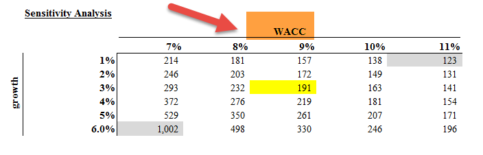

The modern financial landscape is characterized by rapid advancements and complex dynamics where financial management, cost of capital, and algorithmic trading play pivotal roles. In this environment, businesses must navigate challenges and opportunities to maintain competitive advantage. Understanding the interplay between cost of capital and financial management is crucial. The cost of capital represents the return required to justify an investment, guiding how businesses allocate resources and assess potential projects. By optimizing capital allocations, businesses can enhance their investment strategies, ensuring that investments align with long-term financial goals.

Algorithmic trading, on the other hand, represents a significant innovation in the execution of financial transactions. It leverages sophisticated algorithms to analyze market data and execute trades with precision and speed, offering opportunities for enhanced performance and risk mitigation. By incorporating concepts of financial management and cost of capital into algorithmic trading strategies, firms can optimize financial outcomes and manage risks more effectively.



This article examines the relationship between these critical concepts, emphasizing their significance in contemporary financial decision-making. In an era where precision and strategic alignment are key, understanding the integration of financial management with algorithmic trading and capital cost considerations becomes paramount. Through this exploration, we aim to shed light on how businesses can leverage these elements to make informed decisions, optimize returns, and navigate the complexities of today's financial markets successfully.

## Table of Contents

## Understanding Cost of Capital

Cost of capital is a foundational concept in financial management, representing the expected return necessary to justify an investment's inherent risk. It serves as a crucial metric that informs both investment decisions and corporate financial strategies. At its core, the cost of capital integrates the cost of debt and the cost of equity, providing a benchmark rate against which investment opportunities are assessed.

The cost of debt is typically determined by prevailing interest rates and reflects the rate that a company must pay to its creditors. This component is influenced by market conditions, the borrower’s creditworthiness, and macroeconomic factors. The cost of equity, on the other hand, represents the returns demanded by equity investors. It is often estimated using models such as the Capital Asset Pricing Model (CAPM), which calculates the expected return based on the risk-free rate, the asset's beta (a measure of its sensitivity to market movements), and the equity market risk premium:

$$

\text{Cost of Equity} = R_f + \beta(E(R_m) - R_f) 
$$

where $R_f$ is the risk-free rate, $\beta$ is the beta of the asset, and $E(R_m)$ is the expected market return.

The Weighted Average Cost of Capital (WACC) is the comprehensive measure that combines the costs of both debt and equity, weighted by their respective proportions in a firm’s capital structure. WACC is calculated as:

$$

\text{WACC} = \left(\frac{E}{V}\right) \cdot \text{Cost of Equity} + \left(\frac{D}{V}\right) \cdot \text{Cost of Debt} \cdot (1-T_c)
$$

where $E$ is the market value of equity, $D$ is the market value of debt, $V$ is the total market value of the company's financing (equity and debt), and $T_c$ is the corporate tax rate. 

Accurate computation of WACC is essential for effective resource allocation, enabling firms to pursue projects and investments that yield returns exceeding this cost. A precise understanding of cost of capital supports long-term strategic planning, guiding businesses in optimizing their capital allocations and optimizing investment portfolios. It acts not only as a decision-making tool but also as a reflection of the company's risk profile to investors, influencing perceptions of corporate value and financial health.

By applying these concepts, businesses can ensure they are adequately compensated for risks undertaken, thereby aligning investment and financing choices with overarching corporate objectives. This alignment fosters enhanced investor trust and potentially increases access to capital markets under favorable terms.

## The Role of Cost of Capital in Financial Analysis

Cost of capital is a fundamental metric in financial analysis, serving as a benchmark for evaluating investment opportunities. It plays a critical role in capital budgeting and financial planning by influencing the determination of Discounted Cash Flow (DCF) and Net Present Value (NPV), two essential methods for assessing project feasibility.

### Discounted Cash Flow (DCF) and Net Present Value (NPV)

The cost of capital is integral to calculating DCF, a valuation method used to estimate the value of an investment based on its expected future cash flows. These cash flows are discounted to the present value using the cost of capital, which reflects the opportunity cost of investing in a specific project instead of alternative investments. Mathematically, the NPV can be expressed as:

$$
\text{NPV} = \sum_{t=1}^{n} \frac{C_t}{(1 + r)^t} - C_0
$$

Where:
- $C_t$ denotes the cash flow at time $t$,
- $r$ represents the discount rate, or cost of capital,
- $n$ is the total number of periods,
- $C_0$ is the initial investment cost.

The NPV calculation reveals whether the expected earnings, discounted for time and risk, exceed the initial costs, thus guiding investment decisions.

### Industry Variations in Cost of Capital

Different industries experience varying capital costs, reflecting diverse risk profiles and market dynamics. Companies operating in sectors with high degrees of uncertainty, such as technology or biotech, likely encounter higher costs of capital than those in more stable industries like utilities. These variations stem from factors like market [volatility](/wiki/volatility-trading-strategies), business model predictability, and growth potential.

Variations necessitate tailored financial strategies. Firms must align their capital structures and strategic plans with industry benchmarks and investor expectations to maintain fiscal prudence and competitiveness.

### Strategic Integration in Business Planning

Strategically integrating the cost of capital into business planning aligns financial activities with external market conditions and internal performance targets. This ensures that capital is allocated efficiently across projects, maximizing shareholder value. By understanding and applying the cost of capital to financial analyses, companies can better negotiate financing terms, optimize project selections, and achieve optimal financial outcomes.

In conclusion, the cost of capital is a cornerstone of financial analysis, underpinning investment appraisals and guiding strategic financial decisions. Accurate cost assessment ensures that businesses can navigate various industry landscapes, balancing risk and opportunity to secure sustainable growth.

## Algorithmic Trading and Capital Calculation

Algorithmic trading employs sophisticated algorithms to execute trades efficiently and effectively by leveraging crucial financial metrics, such as the cost of capital. These algorithms are designed to automate trading decisions based on quantitative analysis, enabling traders to analyze vast amounts of financial data with speed and accuracy unattainable by human traders alone.

A cornerstone of [algorithmic trading](/wiki/algorithmic-trading) is the integration of the Weighted Average Cost of Capital (WACC) in financial decision-making processes. By incorporating WACC, trading algorithms can assess security valuations and select investment opportunities that promise optimal returns relative to the company's specific cost of capital. This approach ensures that investment decisions are economically viable and consistent with the underlying financial strategy of the firm.

Effective trading algorithms must also account for several financial and non-financial considerations to align with the firm's objectives and constraints. They must [factor](/wiki/factor-investing) in trading costs such as brokerage fees and slippage, which can erode returns if not properly managed. Additionally, market impacts—the effects that large trades can have on market prices—must be mitigated to preserve trade effectiveness and maintain alignment with capital allocation strategies.

Incorporating advanced analytics and [machine learning](/wiki/machine-learning) techniques enhances the adaptability and responsiveness of algorithmic trading systems to dynamic market conditions. Machine learning algorithms can identify patterns and trends in large datasets, providing predictive insights that inform trading decisions and improve execution quality. For instance, algorithms employing [reinforcement learning](/wiki/reinforcement-learning) can evolve over time, learning from past successes and failures to refine their strategies. Below is a Python snippet illustrating a simplified approach to integrating cost of capital in trading strategy:

```python
import numpy as np

def calculate_WACC(equity_cost, debt_cost, equity_ratio, debt_ratio, tax_rate):
    return (equity_cost * equity_ratio) + (debt_cost * debt_ratio * (1 - tax_rate))

def evaluate_investment(expected_return, WACC):
    return expected_return > WACC

# Example values
equity_cost = 0.08  # 8%
debt_cost = 0.05    # 5%
equity_ratio = 0.6  # 60% equity
debt_ratio = 0.4    # 40% debt
tax_rate = 0.3      # 30%

WACC = calculate_WACC(equity_cost, debt_cost, equity_ratio, debt_ratio, tax_rate)
investment_return = 0.10  # 10%

is_profitable = evaluate_investment(investment_return, WACC)
print(f"Investment is {'profitable' if is_profitable else 'not profitable'} based on the WACC.")

```

This script calculates the WACC using specified financial parameters and then evaluates whether an investment's expected return surpasses the WACC, indicating its profitability. By using such computational tools, algorithmic trading systems can make informed investment decisions, minimizing risks, and enhancing the firm's overall financial performance. As financial markets continue to evolve, the role of sophisticated algorithms integrating WACC and other financial metrics becomes increasingly crucial in achieving strategic financial goals.

## Integrating Cost of Capital with Algo Trading Strategies

Integrating the cost of capital into algorithmic trading strategies is a decisive factor in ensuring informed investment decisions and optimizing capital utilization. The Weighted Average Cost of Capital (WACC), a key metric in this process, helps traders and firms evaluate securities' potential returns against their inherent financial constraints. By incorporating WACC into trading algorithms, investors can effectively identify trades that meet or exceed specific return thresholds, thus enhancing overall profitability.

The WACC is calculated as follows:

$$

\text{WACC} = \left( \frac{E}{V} \times R_e \right) + \left( \frac{D}{V} \times R_d \times (1 - T) \right)
$$

where:
- $E$ is the market value of equity
- $V$ is the total market value of equity and debt
- $R_e$ is the cost of equity
- $D$ is the market value of debt
- $R_d$ is the cost of debt
- $T$ is the tax rate

Trading algorithms leverage WACC by incorporating this formula to analyze and decide on potential trades. This ensures that executed trades fulfill minimum profitability requirements, thus aligning with the strategic financial goals of minimizing risks and maximizing returns.

Efficient management of trading costs and market impacts is another critical aspect. Algorithmic trading strategies are designed to optimize execution by minimizing slippage and adverse selection costs while ensuring transactions remain within the bounds of market [liquidity](/wiki/liquidity-risk-premium). This involves deploying sophisticated machine learning models to predict market behavior and adapt trading strategies accordingly. For example, Python libraries like `pandas`, `numpy`, and `scikit-learn` can be used to back-test, analyze, and refine trading strategies by simulating market conditions and computing the predicted impact of trades on market prices.

```python
import numpy as np
import pandas as pd
from sklearn.linear_model import LinearRegression

# Example of a simple linear regression to predict cost impacts
def predict_market_impact(data):
    X = data[['trade_volume', 'volatility']].values
    y = data['market_impact'].values
    model = LinearRegression()
    model.fit(X, y)
    return model.predict(X)

# Simulated dataset
data = pd.DataFrame({
    'trade_volume': np.random.rand(100),
    'volatility': np.random.rand(100),
    'market_impact': np.random.rand(100)
})

market_impact_predictions = predict_market_impact(data)
```

Case studies have demonstrated the success of integrating cost of capital considerations with algorithmic trading strategies. These examples highlight the benefits of aligning capital costs with trading operations, revealing how firms have successfully exceeded predefined return benchmarks and optimized resource allocation. Overall, by effectively merging the principles of financial management with algorithmic precision, businesses and investors can significantly enhance their financial performance and competitive position in an ever-evolving financial landscape.

## Conclusion

Understanding the cost of capital is fundamental for both financial management and algorithmic trading, serving as a cornerstone for optimizing investment decisions and capital allocations. Integrating these metrics into trading strategies allows businesses to navigate the financial landscape with a data-driven approach, potentially increasing profitability while adeptly managing risks. Firms utilizing models like the Capital Asset Pricing Model (CAPM) and the Weighted Average Cost of Capital (WACC) in their algorithmic frameworks can identify opportunities that exceed required return thresholds.

Comprehensive knowledge of financial metrics, such as cost of capital, alongside an understanding of market dynamics, empowers firms and investors to manage resources efficiently. The use of financial metrics in conjunction with algorithmic trading strategies can lead to a more agile response to shifts in market conditions, ensuring optimal performance. By calculating key metrics accurately, businesses can secure feasible project evaluations and align with investor expectations, crucial for long-term success.

Adapting to evolving markets necessitates continual strategic planning. The integration of modern technologies, including machine learning, further enhances trading strategies, enabling faster adaptation to market changes. By staying informed and agile, businesses can maintain a competitive edge in the rapidly changing financial environment. As the financial landscape continues to transform, the ability to integrate cost of capital into strategic decision-making processes remains a vital skill for successful financial management and trading outcomes.

## References & Further Reading

1. Fabozzi, F. J. & Markowitz, H. M. (Eds.) *The Theory and Practice of Investment Management: Asset Allocation, Valuation, Portfolio Construction, and Strategies.* This reference provides extensive insights into asset management, covering the principles and techniques used in evaluating and constructing investment portfolios. It’s an essential resource for understanding how investment strategies are developed and implemented.

2. Ross, S. A., Westerfield, R. W., & Jaffe, J. *Corporate Finance.* This book offers a comprehensive overview of corporate finance principles, emphasizing the importance of cost of capital in financial decision-making. It covers topics like capital budgeting, risk management, and financial planning, essential for anyone looking to deepen their understanding of corporate finance.

3. Damodaran, A. *Investment Valuation: Tools and Techniques for Determining the Value of Any Asset.* Damodaran's work is a fundamental resource for understanding valuation techniques. The text provides a thorough explanation of how to appraise various asset classes, dovetailing well with considerations of cost of capital in investment valuation.

4. Brealey, R. A., Myers, S. C., & Allen, F. *Principles of Corporate Finance.* This book is a cornerstone for learning the foundations of corporate finance. It investigates into theories and practical applications, including extensive discussions on calculating and applying the cost of capital, WACC, and their strategic importance in corporate activities.

5. Lopez de Prado, M. *Machine Learning for Asset Managers.* This text offers a progressive approach to integrating machine learning techniques within asset management. Given the increasing role of algorithmic trading in today's markets, this resource is pivotal for understanding how advanced analytics can augment trading strategies and decision-making processes.

These references provide a robust foundation for exploring key concepts within financial management and algorithmic trading, offering both theoretical and practical perspectives suited for professionals and scholars in finance.