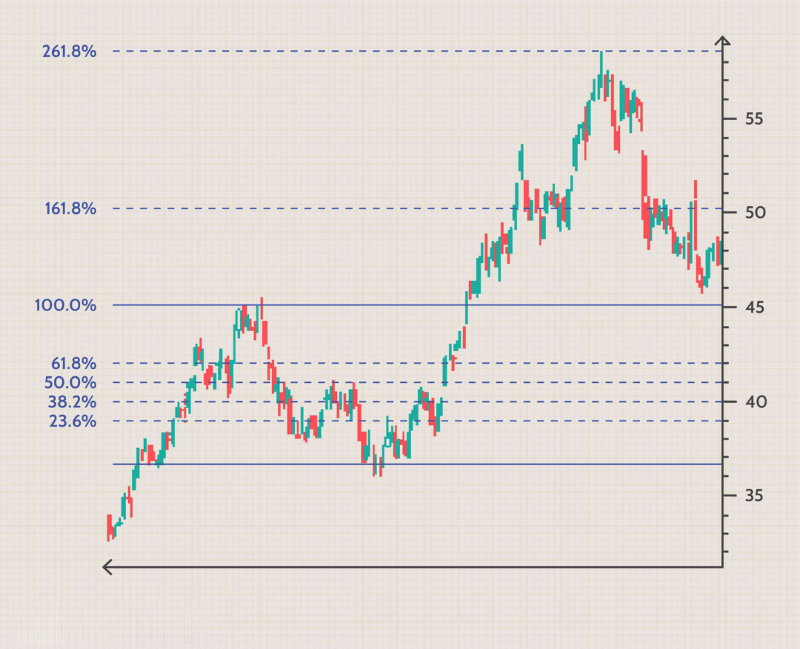

The stock market operates as a constantly shifting landscape where traders and investors attempt to predict future price movements to make informed decisions. Within this realm, one of the critical aspects of technical analysis is the identification of resistance levels and the setting of target prices. A resistance level represents a price point where an asset is expected to face significant selling pressure, often causing the price to halt its upward trajectory or reverse direction. Understanding these levels can be crucial for traders as they strategize entry and exit points for their trades.

Resistance levels are not just arbitrary points on a chart; they are established through historical price movements and market psychology. They serve as indicators of supply overcoming demand at certain price levels, creating potential barriers for further price increases. This article focuses on the complexities involved in analyzing resistance levels and target prices, alongside their application in algorithmic trading.



With the evolution of technology, both traditional and algorithmic methods are employed to determine resistance levels and target prices. Traditional methods often involve the use of technical analysis tools like trend lines, chart patterns, and moving averages, while algorithmic approaches leverage sophisticated computer programs and mathematical models. Algorithmic trading, in particular, has transformed the way traders interact with the market by employing quantitative analysis and automated trading strategies. These algorithms can swiftly process vast amounts of market data to identify patterns and generate trade signals based on predefined criteria.

Python, as a preferred programming language for algorithmic trading, offers libraries and frameworks to aid in the development of trading algorithms. These algorithms often incorporate techniques from machine learning to improve the accuracy and adaptability of predicting resistance levels and target prices.

In the sections that follow, we will explore the intricacies of resistance levels and target price analysis through both traditional and algorithmic lenses, offering insights into their crucial roles in effective trading strategies.

## Table of Contents

## Understanding Resistance Levels

A resistance level is a financial market concept where a security's price faces downward pressure, making it difficult for the price to continue rising. When the price approaches a resistance level, it is often met with increased selling activity, which can cause the price to stagnate or reverse its upward momentum. This occurs because resistance levels are perceived as price points where the asset is overvalued, prompting traders to sell and lock in profits.

Resistance levels are crucial for traders because they act as barriers to price increases, providing critical insights into potential trend reversals or pauses in an uptrend. These levels are often identified through historical price data, where previous peaks in price movements provide a logical basis for predicting future resistance. For traders, recognizing these levels is essential for designing effective strategies that optimize entry and [exit](/wiki/exit-strategy) points in trades. For instance, a trader might set a target price slightly below a known resistance level, expecting the price to stall or reverse before reaching that level.

Technical analysts employ resistance levels to craft strategic trading decisions, combining these insights with other analytical tools to anticipate price movements more accurately. These strategies might involve placing sell orders just before anticipated resistance levels or setting stop-loss orders to protect against potential reversals at these key points. Understanding how resistance levels interact with other technical indicators allows traders to develop a comprehensive view of market behavior, thereby enhancing their ability to predict future price actions.

## Methods to Identify Resistance Levels

Identifying resistance levels is a fundamental aspect of technical analysis in trading, providing traders with key insights into potential price movements. Various methods and tools exist for this purpose, each offering unique approaches and benefits.

**Chart Patterns**

Chart patterns are graphical representations of price movements over time, and they can be instrumental in identifying resistance levels. Some of the most widely used patterns include:

1. **Head and Shoulders**: This pattern typically signals a reversal of an uptrend. The "head" is formed by a peak, while the two "shoulders" are slightly lower peaks that precede and follow the head. The neckline of the pattern, connecting the lowest points between the shoulders, acts as a potential resistance level.

2. **Triangles**: Triangles are patterns formed by converging trend lines. They can be ascending, descending, or symmetrical. An ascending triangle, characterized by a flat upper resistance trend line and an ascending lower trend line, often indicates a potential breakout above resistance. In contrast, descending triangles suggest a possible downward breakout.

3. **Double Tops**: This pattern consists of two peaks at approximately the same price level, with a trough in between. The formation of a double top indicates a strong resistance level, often leading to a bearish reversal once the price falls below the trough between the peaks.

**Fibonacci Retracements and Extensions**

Fibonacci tools are based on mathematical ratios derived from the Fibonacci sequence. They are commonly used in technical analysis to predict potential support and resistance levels.

- **Fibonacci Retracement**: This technique involves plotting horizontal lines at key Fibonacci levels (23.6%, 38.2%, 50%, 61.8%, and 100%) from a peak to a trough. These levels serve as potential resistance points where the price might stall during a retracement of the previous trend.

- **Fibonacci Extensions**: Extensions predict areas of possible resistance beyond the original Fibonacci retracement levels. They are used when a price moves above the previous high or below the previous low. The common extension levels are 127.2%, 161.8%, and 261.8%. These can be calculated using the following formula:
$$
  \text{Fibonacci Extension Level} = \text{Price at Trend Start} + (\text{Price Difference} \times \text{Fibonacci Ratio})

$$

Here's a simple Python snippet to calculate Fibonacci extension levels:

```python
def fibonacci_extensions(trend_start, trend_end, ratios=[1.272, 1.618, 2.618]):
    price_diff = trend_end - trend_start
    return {ratio: trend_start + (price_diff * ratio) for ratio in ratios}

# Example usage
trend_start = 100
trend_end = 150
extensions = fibonacci_extensions(trend_start, trend_end)
print(extensions)
```

Incorporating these methods into trading strategies can provide a solid foundation for identifying resistance levels, enhancing the ability to anticipate market movements and make informed trading decisions.

## Target Price in Stock Analysis

Setting target prices is integral to stock analysis as it involves the prediction of future price levels at which traders plan to exit their positions for a profit. This approach hinges on a blend of historical price behavior assessment and the identification of support and resistance levels. Analyzing these factors helps traders determine levels where the price is likely to reverse or experience significant movements, thereby establishing potential exit points.

Historically, target prices have been reinforced by scrutinizing past price actions to discern patterns that can predict future movements. Resistance levels, as previously discussed, act as price ceilings where upward movements slow. Conversely, support levels are price floors where downward movements stall. By examining these levels, traders can gauge areas of price consolidation and [breakout](/wiki/breakout-trading), assisting in setting realistic target prices.

Technical indicators play a pivotal role in this analysis. Indicators such as the Moving Average (MA), Relative Strength Index (RSI), and Moving Average Convergence Divergence (MACD) offer quantifiable metrics to gauge price [momentum](/wiki/momentum) and potential reversal points. For instance, the MA provides a smoothed average of price over a specified period, helping traders identify long-term directional trends.

The use of trend lines further complements target price setting. Drawing trend lines involves connecting at least two price points on a chart to define a prevailing market direction. Ascending trend lines suggest a bullish market where prices reach successively higher levels, aiding traders in setting higher target prices. Conversely, descending trend lines identify bearish markets, guiding traders to set lower target prices.

Price patterns, such as triangles, head and shoulders, and flags, also inform traders about future price movements. These patterns often lead to significant price breakouts or continuations, establishing potential target prices. For example, a breakout above a descending triangle pattern could trigger a price surge, indicating a higher target price.

Python, as a programming tool, can automate target price analysis. Utilizing libraries like `pandas` for data manipulation and `matplotlib` for visualization, traders can script processes to compute technical indicators, draw trend lines, and identify price patterns. Below is a simple Python code snippet to calculate a moving average and plot it alongside historical price data:

```python
import pandas as pd
import matplotlib.pyplot as plt

# Load historical price data
data = pd.read_csv('historical_prices.csv')
data['Date'] = pd.to_datetime(data['Date'])
data.set_index('Date', inplace=True)

# Calculate moving average
data['Moving_Average'] = data['Close'].rolling(window=20).mean()

# Plot
plt.figure(figsize=(12, 6))
plt.plot(data.index, data['Close'], label='Closing Price')
plt.plot(data.index, data['Moving_Average'], label='20-Period Moving Average', color='orange')
plt.title('Price and Moving Average')
plt.xlabel('Date')
plt.ylabel('Price')
plt.legend()
plt.show()
```

In conclusion, determining target prices is a multifaceted process incorporating historical analysis, technical indicators, trend lines, and price patterns. By systematically evaluating these components, traders can set informed target prices that align with market dynamics, bolstering their trading strategies.

## Algorithmic Trading and Resistance Levels

Algorithmic trading employs computer algorithms to automate trading strategies based on predefined criteria, which frequently include technical analysis metrics such as resistance levels. These automated systems are capable of executing trades with a speed and precision that surpasses human traders, allowing for more efficient market participation and potentially higher profitability.

Advanced algorithms analyze large datasets at high speeds to identify market patterns and generate trading signals. This ability is critical for detecting resistance levels, which are pivotal in predicting where asset prices might encounter selling pressure. For instance, algorithms can scan historical price data to identify recurrent patterns like head-and-shoulders or double tops that often signal resistance points.

The integration of [machine learning](/wiki/machine-learning) into [algorithmic trading](/wiki/algorithmic-trading) systems further enhances their adaptability and accuracy. Machine learning models can be trained on historical market data to predict future price movements. Techniques such as supervised learning allow these models to recognize complex patterns and correlations that might be invisible to traditional technical analysis. For example, algorithms can implement stochastic gradient descent to minimize prediction errors by adjusting the weights of different input features that influence asset prices.

Moreover, machine learning models can continuously learn and adapt to new market conditions, which is crucial given the dynamic nature of financial markets. Reinforcement learning, a subset of machine learning, is particularly promising as it learns optimal trading strategies through trials and rewards, enabling algorithms to adjust their trading decisions based on past experiences and evolving market trends.

Python, a popular language in algorithm development, offers libraries such as TensorFlow and PyTorch for building sophisticated machine learning models. A simple implementation might involve using a feedforward [neural network](/wiki/neural-network) trained on historical price data and technical indicators to predict future prices and identify resistance levels. For example:

```python
import numpy as np
from sklearn.model_selection import train_test_split
from keras.models import Sequential
from keras.layers import Dense

# Load dataset containing historical price data
data = np.loadtxt('price_data.csv', delimiter=',')

# Split the data into input (X) and output (Y) variables
X = data[:,0:-1]
Y = data[:,-1]

# Split the dataset into training and test sets
X_train, X_test, Y_train, Y_test = train_test_split(X, Y, test_size=0.2)

# Define a simple neural network model
model = Sequential()
model.add(Dense(64, input_dim=X.shape[1], activation='relu'))
model.add(Dense(32, activation='relu'))
model.add(Dense(1, activation='linear'))

# Compile the model
model.compile(loss='mean_squared_error', optimizer='adam')

# Fit the model
model.fit(X_train, Y_train, epochs=100, batch_size=10, verbose=1)

# Evaluate the model
scores = model.evaluate(X_test, Y_test)
print(f"Model Error: {scores}")
```

This illustrates how algorithms can employ machine learning to improve predictions of resistance levels, thereby enhancing their trading strategy. As financial markets continue to evolve, algorithmic trading systems that effectively integrate technical analysis and machine learning are likely to become increasingly essential tools for traders seeking to optimize their strategies and outcomes.

## Case Studies and Real-World Applications

Examining historical case studies in algorithmic trading reveals the practical insights and potential limitations of using algorithms for identifying resistance levels. In 2010, the "Flash Crash" provided a noteworthy example of algorithmic trading's impact on market dynamics. On May 6th, a substantial sell program by a large trader interacted with high-frequency trading algorithms, briefly erasing nearly $1 trillion in market value due to rapid sell-offs and buying at incorrectly low prices. This incident highlighted both the power and [volatility](/wiki/volatility-trading-strategies) of algorithmic systems to influence resistance levels, causing sudden market shifts when multiple algorithms interact.

Another example is the application of algorithmic trading by Renaissance Technologies, one of the most successful hedge funds, which utilizes quantitative models to identify price patterns, including resistance levels. Their Medallion Fund, a quantitative [hedge fund](/wiki/hedge-fund-trading-strategies) founded by mathematician Jim Simons, reportedly earned average annual returns of about 66% from 1988 to 2018, largely relying on algorithm-based trading strategies. These models efficiently analyzed massive datasets to discern resistance and support levels that informed their trading decisions.

A practical demonstration of algorithmic trading in identifying resistance levels can be implemented in Python using libraries such as Pandas and Numpy. For instance, a simple moving average (SMA) crossover strategy could be employed to highlight resistance levels:

```python
import pandas as pd
import numpy as np

# Load historical stock data
data = pd.read_csv('stock_data.csv')

# Calculate moving averages
data['SMA_50'] = data['Close'].rolling(window=50).mean()
data['SMA_200'] = data['Close'].rolling(window=200).mean()

# Identify potential resistance when SMA_50 crosses below SMA_200
data['Resistance'] = np.where((data['SMA_50'] < data['SMA_200']) & 
                              (data['SMA_50'].shift(1) > data['SMA_200'].shift(1)), True, False)

# Extract resistance levels
resistance_levels = data[data['Resistance']]['Close']
print(resistance_levels)
```

Real-world applications illustrate both the efficacy and limits of algorithm-driven trading. For instance, the successful application of algorithms in large institutional investment firms contrasts with the challenges faced by smaller traders in replicating such complex models. Furthermore, while algorithms can quickly adapt to price changes, they may not fully appreciate the qualitative factors of market sentiment, often requiring human oversight to account for political, social, and economic events.

Combining technical data analysis with market sentiment increases strategy robustness. For example, algorithms can incorporate sentiment analysis from social media platforms or news reports into trading models to improve prediction accuracy. Such integration enhances adaptive strategies, allowing traders to anticipate resistance levels more effectively while accounting for potential market disruptions or shifts in investor behavior.

In summary, case studies show that while algorithmic trading on its own is powerful, the best results often stem from a combination of quantitative data analysis and qualitative market insights. This combinatory approach provides a comprehensive trading strategy that is sensitive to both market patterns and external sentiments, enhancing the prediction and reliability of resistance level identifications.

## Challenges and Considerations

Even with the advent of advanced technical tools and algorithmic support, accurately identifying true resistance levels and setting target prices remains a complex task. Several challenges complicate this process, requiring traders to exercise adeptness and agility in their strategies.

Firstly, market volatility significantly impacts the ability to pinpoint resistance levels. Volatility refers to the rate at which the price of a security increases or decreases for a given set of returns. A highly volatile market can result in rapid and unpredictable price movements, rendering traditional methods of resistance identification less reliable. For instance, a sudden spike in volatility can cause prices to break through established resistance levels unpredictably, leading to potential losses if traders are not quick to adjust.

Furthermore, unexpected news events, such as geopolitical tensions, economic reports, or natural disasters, can have a profound effect on market dynamics. These events can trigger sudden buying or selling pressures, altering resistance levels hastily and unexpectedly. For example, an optimistic economic report might lead to an increase in investor confidence, thus shifting perceived resistance levels upward as asset prices rise.

Changing economic conditions also contribute to the challenges in resistance level identification. Factors such as [interest rate](/wiki/interest-rate-trading-strategies) changes, inflation rates, and employment [statistics](/wiki/bayesian-statistics) can influence investor sentiment and market direction. As economic conditions fluctuate, so too do the resistance levels, necessitating continuous adaptation from traders.

To navigate these challenges, traders must employ a combination of methods when setting target prices and identifying resistance levels. This approach might involve integrating technical analysis with [fundamental analysis](/wiki/fundamental-analysis) to gain a more comprehensive view of the market. Utilizing a variety of tools, such as moving averages, trend lines, and momentum indicators, can provide additional perspectives that enhance the understanding of market dynamics.

Maintaining flexibility is crucial for traders to adjust their strategies in response to evolving market conditions. Algorithmic trading, for instance, offers a method to dynamically adapt strategies through automated systems that respond to real-time data. By updating algorithms with the latest market information and using machine learning techniques for pattern recognition, traders can improve their ability to forecast resistance levels accurately.

In conclusion, while sophisticated tools and algorithms offer significant advantages, the ever-changing landscape of the stock market demands a multifaceted and flexible approach to identify resistance levels effectively and set precise target prices.

## Conclusion

Resistance level and target price analysis are integral components of trading strategies, providing crucial insights into potential price movements of assets. Resistance levels act as barriers to price increases, while target prices enable traders to set planned exit points, optimizing profit potential. Mastery of these components allows traders to make informed decisions, minimizing risks in an ever-volatile market.

Algorithmic trading, which uses sophisticated computer programs for executing trades, has significantly enhanced the precision of identifying resistance levels and establishing target prices. By integrating detailed technical analysis metrics with computational efficiency, algorithmic systems can process vast datasets in real-time, discerning subtle patterns that may elude manual analysis. This ability not only increases the speed of reaction to market changes but also reduces the margin for error in price prediction.

Ongoing advancements in algorithmic trading, particularly with the incorporation of machine learning techniques, promise to further improve trading efficiency and accuracy. Machine learning algorithms can dynamically adapt to changing market conditions, learning from new data to refine predictions continuously. This adaptability ensures that algorithmic models remain relevant as market dynamics evolve, making them a pivotal tool for future-proof trading strategies.

These developments underscore the importance of continuous research in both algorithmic approaches and machine learning applications. As these technologies advance, they promise to make trading strategies not only more precise but also more resilient to the unpredictable nature of financial markets. As a result, traders equipped with these tools are better positioned to navigate the complexities of stock trading, achieving sustainable success.

## References & Further Reading

[1]: Bergstra, J., Bardenet, R., Bengio, Y., & Kégl, B. (2011). ["Algorithms for Hyper-Parameter Optimization."](https://dl.acm.org/doi/10.5555/2986459.2986743) Advances in Neural Information Processing Systems 24.

[2]: ["Advances in Financial Machine Learning"](https://www.amazon.com/Advances-Financial-Machine-Learning-Marcos/dp/1119482089) by Marcos Lopez de Prado

[3]: ["Evidence-Based Technical Analysis: Applying the Scientific Method and Statistical Inference to Trading Signals"](https://www.amazon.com/Evidence-Based-Technical-Analysis-Scientific-Statistical/dp/0470008741) by David Aronson

[4]: ["Machine Learning for Algorithmic Trading"](https://github.com/stefan-jansen/machine-learning-for-trading) by Stefan Jansen

[5]: ["Quantitative Trading: How to Build Your Own Algorithmic Trading Business"](https://www.amazon.com/Quantitative-Trading-Build-Algorithmic-Business/dp/1119800064) by Ernest P. Chan