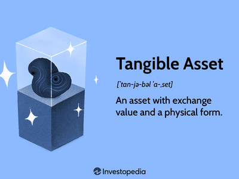

In finance, understanding assets and their valuation is crucial for making informed investment decisions. Assets, especially tangible ones, form the backbone of businesses, providing the necessary infrastructure and resources for operational success. Tangible assets, such as real estate, machinery, and inventory, hold intrinsic value and are fundamental in assessing a company's financial health and potential for revenue generation.

Asset valuation is a critical process that determines the worth of these tangible assets, taking into account market conditions, usage, and expected returns. Proper valuation allows businesses and investors to make strategic decisions about the acquisition, disposition, and utilization of assets to optimize financial outcomes.



Another important consideration is the useful life of assets, which refers to the period an asset is expected to function effectively and contribute to business operations. Understanding the useful life of an asset aids in accurate financial planning and management, influencing depreciation calculations and financial reporting.

Algorithmic trading, or 'algo trading', represents a modern financial strategy that revolutionizes how trading is conducted. By leveraging computer algorithms, algo trading facilitates automated, high-speed trade executions, minimizing emotional biases and enhancing decision-making through data-driven analysis.

This article explores the interaction between these elements—tangible assets, asset valuation, useful life, and algo trading—highlighting their roles in shaping contemporary investment strategies. By integrating these components, investors and businesses can effectively navigate the complexities of today's financial landscape, enhancing profitability and strategic asset management.

## Table of Contents

## Understanding Tangible Assets

Tangible assets are physical, concrete items that an organization owns and uses in its operations to produce economic value. These include real estate, machinery, equipment, and inventory. Their intrinsic value lies in their physical form and ability to generate revenue or provide material benefits over time. 

One of the fundamental aspects of tangible assets is their role in underpinning business operations. Real estate, for example, often serves as the physical premises where business activities are conducted. Machinery and equipment facilitate production processes, contributing directly to the creation of goods and services. Inventory, encompassing raw materials and finished products, is essential for meeting market demand and ensuring smooth business operations.

The valuation of tangible assets is crucial for both financial reporting and investment decision-making. A common approach to valuing tangible assets is the cost approach, which calculates an asset's value based on the cost to acquire or reproduce it, accounting for depreciation. This method is particularly useful for assets with readily ascertainable costs. Market-based valuation involves comparing the asset with similar items sold in the open market, providing a more dynamic assessment aligned with current market conditions. Income-based valuation, although more commonly associated with intangible assets, can also apply when tangible assets produce standalone income streams, focusing on the present value of expected future cash flows generated by the asset.

Tangible assets also play a significant role within financial markets. They often serve as collateral in lending arrangements, giving lenders security against defaults. Additionally, tangible assets are key components in business valuations during mergers and acquisitions, where their accurate assessment ensures fair trading terms.

For businesses, effectively managing tangible assets involves regular appraisal and maintenance, ensuring that they continue to contribute value over time. Depreciation accounting, a common practice, systematically reduces the recorded value of an asset over time on balance sheets, aligning with its useful life. This process impacts financial statements, influencing both reported earnings and tax liabilities.

Overall, tangible assets underpin both operational capacity and financial stability, serving as critical elements in the asset portfolio of any business. Their management and valuation require careful consideration, reflecting their significant impact on both revenue generation and broader financial strategies.

## Asset Valuation and Useful Life

Valuing tangible assets is a critical aspect of financial management that involves assessing their worth through several methodologies, notably market conditions, utility, and potential income generation capabilities. This valuation is essential for determining the balance sheet value and assessing overall financial health. Methods such as comparable market analysis, income capitalization, and cost approach are frequently employed. 

1. **Market Conditions**: Market-based valuation involves comparing the asset with similar items recently sold in the open market. This comparative analysis helps determine a fair market value, assuming a willing buyer and seller under normal conditions. For instance, real estate properties are often valued using the sales comparison approach, where recently sold properties of similar characteristics in the area are considered.

2. **Use and Utility**: The utility of an asset dictates its practical application and productivity within business operations. Assets with higher utility are likely to retain value better due to their indispensable role in revenue generation. Machinery, for example, might be valued based on its output potential and technological relevance.

3. **Potential Revenue Generation**: This method considers the income an asset can generate over time. The income approach involves forecasting future cash flows from the asset and discounting them to their present value. The formula used is generally:
$$
   PV = \frac{CF_1}{(1+r)^1} + \frac{CF_2}{(1+r)^2} + \ldots + \frac{CF_n}{(1+r)^n}

$$

   where:
   - $PV$ is the present value.
   - $CF_n$ is the cash flow in year $n$.
   - $r$ is the discount rate.

Determining the useful life of an asset is closely tied to its depreciation, which is the systematic allocation of an asset's cost over its useful life. The useful life is an estimate of the time span during which the asset is expected to be productive. This determination affects an organization's financial statements and tax obligations. Common methods to calculate useful life include:

1. **Straight-Line Depreciation**: This method assumes that the asset will lose an equal amount of value each year over its useful life. The formula for annual depreciation expense is:
$$
   \text{Depreciation Expense} = \frac{\text{Cost of Asset} - \text{Salvage Value}}{\text{Useful Life}}

$$

2. **Declining Balance Method**: This accelerated depreciation method calculates depreciation based on a constant percentage of the asset's book value each year. It reflects the higher utility or earning potential in the early years of an asset's life.

3. **Units of Production Method**: Particularly applied to machinery, this method ties depreciation to the level of activity (e.g., hours of use, units produced), providing a more dynamic and realistic depreciation schedule.

The estimation of useful life influences asset depreciation, altering both the income statement (through depreciation expense) and the balance sheet (through accumulated depreciation). This, in turn, impacts financial ratios and assessments, which are crucial for stakeholders in making informed decisions. Therefore, accurately valuing assets and estimating their useful life remains integral to transparent and precise financial reporting.

## Tangible Assets and the IRS

The Internal Revenue Service (IRS) plays a pivotal role in the financial strategy regarding tangible assets by providing clear guidelines on their useful life and depreciation. These guidelines have significant implications for businesses as they directly influence both tax calculations and financial reporting.

### Depreciation of Tangible Assets

Depreciation represents the loss of value of tangible assets over time due to factors such as wear and tear, obsolescence, or usage. The IRS allows businesses to deduct this depreciation from their taxable income, acknowledging that tangible assets decline in value as they are used for business operations. This is most commonly accomplished through the Modified Accelerated Cost Recovery System (MACRS), which sets forth specific asset class guidelines to determine the applicable depreciation period.

For example, assets like office furniture are typically classified under a 7-year recovery period, while machinery and equipment may fall under a 5-year one. Real estate generally extends over a 27.5-year lifespan for residential properties or 39 years for commercial real estate. 

### Useful Life Determination

The IRS does not determine the exact useful life of an asset but rather provides a general classification schedule that companies can use. This schedule aims to standardize the allocation of the cost of tangible assets over their useful lives. Correctly assessing an asset's useful life is crucial as it impacts the annual depreciation expense that can be claimed. An accurate determination can affect cash flow management and tax liability.

### Implications for Tax Calculations

By adhering to IRS depreciation schedules, companies can benefit from reduced taxable income through allowable depreciation expenses. This reduction enhances a company’s overall cash flow by lowering its immediate tax obligations. However, it is important for companies to be careful in their classifications and calculations, as errors can lead to penalties and interest due to underpayment of taxes.

### Implications for Financial Reporting

Depreciation and useful life estimates affect balance sheets and income statements. Since depreciation is a non-cash expense, properly accounting for it maintains the insight into a company's earnings before taxes, thus offering stakeholders a clearer picture of operational efficiency. Misreporting these figures can result in misstated earnings and mislead investors about the company's financial health.

In summary, IRS regulations on tangible assets influence tax liabilities and financial documentation. Businesses must carefully follow these guidelines to maximize financial advantages and compliance, impacting both the strategic and operational facets of asset management.

## Algo Trading: A Modern Approach

Algorithmic trading, commonly known as algo trading, utilizes computer algorithms to automatically execute trading orders, minimizing human intervention and maximizing trading efficiency. The primary advantage of algo trading lies in its ability to perform trades with precision and speed, which human traders cannot match. By leveraging complex mathematical models and statistical methods, algorithms quickly identify and act on market opportunities, ensuring optimal execution of trades.

One of the central aspects of algo trading is its capacity to minimize emotional biases, which can often cloud decision-making processes in finance. Human traders may be influenced by fear, greed, or other emotions, leading to suboptimal trades. In contrast, algorithms operate based entirely on data-driven strategies, ensuring consistency and objectivity.

Algo trading relies heavily on data analysis to anticipate market trends and inform trading decisions. Complex algorithms process vast amounts of market data, analyze historical trends, and evaluate numerous variables to identify patterns that might predict future market movements. This high level of data processing enables traders to customize and refine their trading strategies continuously.

The impact of algo trading on various asset classes is substantial. For instance, in equities, algorithms can efficiently manage large volumes of transactions, reducing transaction costs and improving market [liquidity](/wiki/liquidity-risk-premium). Similarly, in foreign exchange and commodities markets, algo trading algorithms can identify [arbitrage](/wiki/arbitrage) opportunities and execute trades at optimal prices.

Python has become a preferred programming language for developing trading algorithms due to its simplicity and extensive libraries for data analysis and financial computation. Below is a simplistic example of a moving average crossover strategy, a basic and widely used [algorithmic trading](/wiki/algorithmic-trading) strategy:

```python
# Simple Moving Average Crossover Strategy

import pandas as pd
import numpy as np

# Sample DataFrame with stock prices
data = pd.DataFrame({'Close': [100, 102, 104, 106, 108, 110, 112, 114, 113, 115]})

# Calculate moving averages
short_window = 3
long_window = 5

data['Short_MA'] = data['Close'].rolling(window=short_window).mean()
data['Long_MA'] = data['Close'].rolling(window=long_window).mean()

# Identify signals
data['Signal'] = 0
data.loc[data['Short_MA'] > data['Long_MA'], 'Signal'] = 1  # Buy signal
data.loc[data['Short_MA'] < data['Long_MA'], 'Signal'] = -1 # Sell signal

print(data)
```

This script calculates the short-term and long-term moving averages of a stock's closing prices and generates buy or sell signals based on their crossovers. While simple, this strategy exemplifies how algorithms can identify potential trading opportunities by analyzing historical data. More sophisticated algorithms incorporate [machine learning](/wiki/machine-learning) and advanced statistical methods to enhance predictive accuracy and trading outcomes. With the continuous evolution of financial markets, algo trading remains a pivotal tool for modern investors seeking to optimize their trading strategies across different asset classes.

## Integrating Algo Trading with Tangible Assets

The integration of algorithmic trading with tangible assets management exemplifies a significant evolution in financial strategies, enhancing efficiency and accuracy while minimizing human error. Algorithmic trading uses computer algorithms to automate and optimize trading decisions, leveraging vast datasets to execute trades with accuracy and speed that would be unattainable through manual processes. When applied to tangible assets, algorithmic trading offers several benefits, particularly in enhancing asset management processes and identifying profitable market opportunities.

Firstly, algorithmic trading enables investors to maintain and analyze extensive portfolios of tangible assets efficiently. By employing algorithms, investors can model various scenarios and predict potential outcomes based on historical data, current market trends, and economic indicators. This predictive capability allows for more informed decision-making processes, enabling investors to adjust their tangible asset allocations in anticipation of market shifts.

For instance, a Python program could be developed to continuously analyze asset performance and market conditions, alerting investors to rebalance their portfolios when necessary. A sample code snippet might involve the use of libraries like Pandas and NumPy to process data:

```python
import pandas as pd
import numpy as np

# Load historical asset data
asset_data = pd.read_csv('asset_data.csv')

# Calculate moving averages
asset_data['20_day_ma'] = asset_data['Close'].rolling(window=20).mean()
asset_data['50_day_ma'] = asset_data['Close'].rolling(window=50).mean()

# Detecting crossover points for buy/sell signals
buy_signals = np.where(asset_data['20_day_ma'] > asset_data['50_day_ma'], 1, 0)
sell_signals = np.where(asset_data['20_day_ma'] < asset_data['50_day_ma'], -1, 0)

asset_data['signals'] = buy_signals + sell_signals

# Outputs a DataFrame with buy/sell signals based on moving averages crossover strategy
print(asset_data[['Date', 'Close', '20_day_ma', '50_day_ma', 'signals']])
```

Furthermore, algorithmic strategies can optimize the operational aspects of managing tangible assets. Algorithms can be employed to schedule maintenance for machinery, manage inventory turnovers, or even time the sale or lease of real estate properties based on peak market conditions. Such applications reduce operational costs and maximize the return on investment for tangible asset portfolios.

Additionally, algorithmic trading enhances risk management for tangible assets by facilitating robust assessment and mitigation strategies. Algorithms can account for various risk factors by simulating different economic conditions, adjusting weightings in real-time, which is particularly valuable in volatile markets. Algorithms can quickly assess currency risks, interest rates, and geopolitical events, enabling preemptive reallocation of resources and protection of asset value.

Finally, by utilizing algo trading in tangible asset markets, investors can exploit market inefficiencies and capitalize on arbitrage opportunities. Algorithms can identify pricing discrepancies across different geographic locations or asset types, enabling rapid transactions that capture value before market corrections occur.

In conclusion, the synthesis of algorithmic trading and tangible asset management not only refines decision-making processes and operational efficiencies but also opens new avenues for profitability through advanced analytical tools. As technology continues to evolve, the capability to combine these strategies will likely become increasingly integral to successful asset management in the financial sector.

## Conclusion

In the constantly evolving financial landscape, a nuanced understanding of tangible assets, asset valuation, useful life, and algo trading is crucial for achieving financial success. Each of these components plays a distinct role in shaping modern investment strategies, yet their true potential is realized when they are considered as a cohesive whole.

Tangible assets, such as real estate, machinery, and inventory, serve as the backbone for many businesses. Their valuation is not just about gauging market value but also about understanding their contribution to a company's operations and potential revenue generation. Knowing the useful life of these assets is vital, as it determines their depreciation over time, affecting financial statements and tax obligations. This influences decision-making regarding asset acquisition, maintenance, and replacement strategies, thereby impacting overall financial health.

Algorithmic trading represents the technological advancement in trading mechanisms, capitalizing on data analysis to execute trades at speeds and efficiencies beyond human capability. By automating the trading process, algo trading minimizes emotional biases, allowing for more consistent and objective decision-making. This is especially beneficial when managing portfolios that include tangible assets, as the integration of algorithmic trading strategies can lead to optimized asset allocation and risk management.

Combining these elements creates a robust framework for investment and asset management. For instance, applying algorithmic strategies to analyze market trends can help predict shifts in asset values, allowing for timely decisions about asset retention or liquidation. Moreover, integrating tangible asset management with algo trading enables investors to explore new opportunities and maximize returns by efficiently navigating market complexities.

In summary, a comprehensive understanding and integration of tangible assets, asset valuation, useful life, and algorithmic trading can significantly enhance investment outcomes. This multidisciplinary approach promotes efficiency and profitability, positioning investors and businesses to better adapt and thrive in today's intricate financial environment.

## References & Further Reading

[1]: ["International Financial Reporting Standards (IFRS) - IAS 16 Property, Plant, and Equipment."](https://www.ifrs.org/content/dam/ifrs/publications/pdf-standards/english/2021/issued/part-a/ias-16-property-plant-and-equipment.pdf) IFRS Foundation.

[2]: Damodaran, A. (2012). ["Investment Valuation: Tools and Techniques for Determining the Value of Any Asset."](https://books.google.com/books/about/Investment_Valuation.html?id=5SRHAAAAQBAJ) Wiley Finance.

[3]: Chan, E. (2009). ["Quantitative Trading: How to Build Your Own Algorithmic Trading Business."](https://github.com/ftvision/quant_trading_echan_book) Wiley Trading.

[4]: Lopez de Prado, M. (2018). ["Advances in Financial Machine Learning."](https://www.amazon.com/Advances-Financial-Machine-Learning-Marcos/dp/1119482089) Wiley.

[5]: Staubus, G. J. (1989). ["Asset Valuation."](https://www.accountingin.com/accounting-historians-journal/volume-7-number-1/asset-valuation-an-historical-perspective/) The Accounting Review.