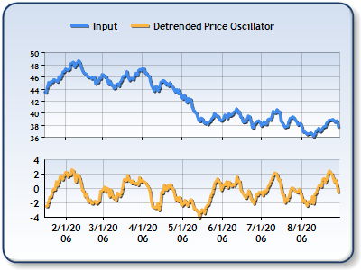

The Detrended Price Oscillator (DPO) is a technical analysis tool prominently used in algorithmic trading to refine trading decisions by focusing on cycle identification rather than momentum. Distinct from traditional momentum-based indicators, the DPO strips away price trends, allowing traders to better estimate the length and potential turning points of price cycles. This oscillator offers insights into potential buying and selling points by highlighting the cyclical nature of asset prices.

The significance of the DPO lies in its ability to center price data and reveal patterns within a specified range, typically over 20 to 30 periods. As a non-momentum oscillator, it provides a unique perspective on market dynamics by tracking price movements from peak to peak or trough to trough. This focus makes it a valuable tool for traders aiming to uncover hidden cyclicality in assets, thereby enhancing their strategy formulation and execution.



In this article, we aim to provide a detailed understanding of the DPO, illustrating its calculation and application within trading strategies. By exploring its mechanical workings, traders can appreciate its role in pinpointing potential entry and exit points, thereby improving overall trading accuracy. The exploration of the DPO's relevance in algorithmic trading will highlight its utility as an essential component in crafting sophisticated trading systems. As we examine the DPO, readers will gain insight into its contribution to refining trade timing and identifying cyclical trends, thereby equipping themselves with knowledge to integrate this tool effectively into their trading operations.

## Table of Contents

## What is a Detrended Price Oscillator (DPO)?

The Detrended Price Oscillator (DPO) is a technical analysis tool used to remove trends from price data, thereby revealing the underlying price cycles within a specific asset. The primary purpose of the DPO is to estimate the cycle length by analyzing the distance from peak to peak or trough to trough within a price series. Unlike momentum indicators, which focus on the rate and direction of price changes, the DPO centers on detecting the cyclical highs and lows, assisting traders in identifying optimal entry and exit points based on the historical cyclical patterns of asset prices.

The DPO differs significantly from oscillators such as the stochastic oscillator or the Moving Average Convergence Divergence (MACD) in that it does not measure momentum. Instead, the DPO emphasizes the cyclicity of prices, making it an effective tool for articulating patterns in price movements that may not be immediately visible when longer-term trends are accounted for. It typically analyzes a fixed number of time periods, commonly ranging between 20 and 30, to accentuate potential reversals or turning points in price actions that may be leveraged for trading decisions.

The calculation of the DPO involves removing the simple moving average (SMA) from the price data, thereby focusing on deviations from this average. This process effectively shifts the data into the past, producing an oscillator that illustrates the above or below-average conditions over the specified period, making cyclical patterns more discernible.

By providing insights into likely buy and sell points through historical cycle patterns, the DPO serves as a valuable component within a broader technical analysis framework, especially when analyzing markets with identifiable cyclical behavior. However, it should be noted that while the DPO is adept at identifying cycles, its effectiveness can be contingent on the market's structural stability and periodicity. Thus, traders often use the DPO in conjunction with other indicators to account for both cyclical and trend-based perspectives in market analysis.

## How to Calculate the DPO

The Detrended Price Oscillator (DPO) serves as a tool to isolate the cycle component from the market prices, eliminating the impact of long-term trends. Calculating the DPO involves several straightforward steps. 

First, select a lookback period; a period of 20 is frequently used in practice. Next, identify the closing price from half of the lookback period plus one additional period ago. For example, if the lookback period is 20, you would take the closing price 11 periods ago ($\frac{20}{2} + 1 = 11$).

Following this, calculate the Simple Moving Average (SMA) over the chosen lookback period. The SMA is computed as follows:

$$
\text{SMA} = \frac{1}{N} \sum_{i=0}^{N-1} P_i
$$

where $N$ is the lookback period and $P_i$ represents the closing prices over that period.

Finally, subtract the SMA value from the identified closing price to determine the DPO value:

$$
\text{DPO} = P_t - \text{SMA}(t - \frac{N}{2} - 1)
$$

Here, $P_t$ is the closing price at $t - \frac{N}{2} - 1$, centering the price data around the average and revealing cyclical patterns in the price data.

For those interested in automation, Python can be used to calculate the DPO efficiently. Below is a simple example using Python:

```python
import numpy as np

def calculate_dpo(prices, period=20):
    # Calculate SMA
    sma = np.convolve(prices, np.ones(period)/period, mode='valid')

    # DPO is calculated by taking the closing price from half the period plus one
    offset = period // 2 + 1
    dpo = prices[offset:len(sma)+offset] - sma

    return dpo

# Example usage
closing_prices = [100, 102, 104, 105, 107, 110, 108, 107, 112, 114, 115, 116, 119, 117, 120, 122, 124, 123, 121, 119, 118]
dpo_values = calculate_dpo(closing_prices, period=20)
print(dpo_values)
```

This computational approach allows for quick and accurate determination of the DPO over large datasets, making cyclical price patterns more evident. Utilizing this method within trading strategies can enhance the understanding and prediction of price cycles.

## Using the DPO in Trading

The Detrended Price Oscillator (DPO) is a valuable tool for identifying potential buy and sell points by analyzing the alignment of peaks and troughs with the indicator. Traders rely on the historical pattern of these peaks and troughs to predict future movements within a similar timeframe. This predictive capability is enhanced in cyclical markets, where prices are known to fluctuate within identifiable bounds.

When analyzing market cycles with the DPO, the spacing between troughs can signal potential buying opportunities. For instance, when the DPO indicates that a trough of a price cycle has occurred, traders may infer a potential price increase and consider buying. Conversely, when the DPO reveals a peak, this might suggest a selling point as it indicates the high of the cycle, and a potential price decline could follow.

The DPO's utility extends beyond identifying buy and sell points; it also helps traders determine the duration of long or short trades. By understanding the cycle identified by the DPO, traders can estimate how long a particular trend might last and adjust their trading strategies accordingly. This aspect is particularly beneficial in cyclical markets where the length and frequency of cycles can be more predictable.

To illustrate, consider a trader analyzing a 20-period DPO. If the DPO signals a trough followed by consistent upward movement towards a peak, the trader might initiate a long position at the trough and consider closing it as the DPO approaches a peak. This strategy allows traders to exploit the cyclic nature of price movements effectively.

While the DPO is a powerful tool, traders should remain aware that its effectiveness is contingent upon the market being observed. It works best in markets with well-defined cycles and may require complimentary indicators for comprehensive trading strategies.

## Backtesting DPO Strategies

Backtesting a DPO-based strategy is a critical step in validating its effectiveness in trading. The primary goal is to assess how well the Detrended Price Oscillator (DPO) can predict potential buying and selling points by using historical price data. 

To begin, establish specific rules for entering and exiting trades based on the DPO. A common approach is to enter a trade when the DPO crosses certain thresholds, indicating overbought or oversold conditions. For instance, a positive DPO value might suggest an overbought condition, signaling a potential sell point, whereas a negative value could indicate an oversold condition, suggesting a buying opportunity.

Implementing risk management parameters is vital to mitigate potential losses and maximize profitability. Traders should set stop-loss and take-profit levels that align with their risk tolerance and investment goals. These parameters help safeguard against significant losses and lock in profits when favorable price movements occur.

Analyzing the DPO's performance across diverse asset classes and various timeframes is essential to ensure the robustness of the strategy. This involves testing the DPO on different financial instruments such as stocks, commodities, or [forex](/wiki/forex-system) pairs, and assessing its effectiveness over short, medium, and long-term periods. Such comprehensive testing reveals the DPO's adaptability and reliability under varied market conditions.

Backtesting involves fine-tuning the strategy to determine optimal parameters for the DPO, such as the lookback period. Adjusting these variables can enhance the strategy's accuracy and efficiency. Additionally, the process provides insights into potential risks associated with the strategy, allowing traders to anticipate and plan for adverse market scenarios.

To automate the [backtesting](/wiki/backtesting) process, one could use a Python script leveraging libraries like `pandas` and `numpy`. Here's a simple outline of how this could be done:

```python
import pandas as pd
import numpy as np

# Load historical price data into a DataFrame
data = pd.read_csv('historical_data.csv')
prices = data['Close']

# Set the lookback period
lookback_period = 20

# Calculate the DPO
sma = prices.rolling(window=lookback_period).mean()
lag = int(lookback_period / 2 + 1)
dpo = prices.shift(lag) - sma

# Define trading rules
buy_signal = (dpo < -1.0) # Example threshold for oversold
sell_signal = (dpo > 1.0) # Example threshold for overbought

# Initialize positions and returns
positions = np.where(buy_signal, 1, np.where(sell_signal, -1, 0))
returns = prices.pct_change().shift(-1) * positions

# Calculate strategy performance
strategy_returns = returns.cumsum().apply(np.exp)
print(strategy_returns)
```

Adopting such a systematic approach assists traders in developing a well-grounded trading strategy using the DPO, supporting more informed and confident trading decisions.

## DPO vs. Other Indicators

The Detrended Price Oscillator (DPO) and other technical indicators such as the Commodity Channel Index (CCI) are often employed to interpret cyclic patterns in financial markets. However, they serve distinct purposes and utilize different calculation methodologies.

The DPO is primarily focused on timing the cycle from one peak to the next or from one trough to the next. This makes it especially useful for determining when to enter or [exit](/wiki/exit-strategy) trades based not on [momentum](/wiki/momentum) but on the cyclical nature of price movements. The DPO does this by removing long-term trends from price data, allowing the underlying cycles to become more apparent.

Conversely, the Commodity Channel Index (CCI) is designed to identify potential beginnings or endings of trends by measuring a security’s deviation from its statistical mean. CCI can signal potential trend reversals or breakouts when it moves beyond certain thresholds, typically +100 and -100, where readings above +100 may indicate overbought conditions and those below -100 may suggest oversold conditions. The calculation for the CCI involves comparing the current price level to an average level over a specified period, adjusting for mean deviation.

Understanding these distinct functionalities is crucial for traders who aim to optimize their use of technical indicators based on their trading strategy needs. For instance, traders focusing on cycle detection might choose DPO, while trend-followers might favor CCI. Incorporating multiple indicators such as combining DPO with a momentum indicator can provide a more comprehensive analysis of market dynamics. This multi-indicator approach can enhance decision-making by offering different perspectives on price action, helping traders to mitigate risks and seize opportunities effectively. By leveraging the unique attributes of each indicator, traders can develop a holistic trading strategy that adapts to various market conditions.

## Limitations of the DPO

The Detrended Price Oscillator (DPO) is primarily designed to strip out the effects of long-term trends from price data, thereby focusing on identifying cycles from peak to peak or trough to trough. While this is beneficial for detecting cyclic patterns, the DPO has its limitations, primarily because it does not consider prevailing market trends.

One of the main limitations of the DPO arises from its reliance on historical cycles. Market conditions are dynamic; hence, past cycles may not always accurately predict future price movements due to inherent market [volatility](/wiki/volatility-trading-strategies). This dependency on historical data may lead to inaccurate projections, particularly during periods of significant market change or volatility when cycles do not repeat as expected.

Furthermore, the DPO is not ideal for real-time trend assessment because it is calculated using past data and, therefore, provides a view that is somewhat lagged. Traders often find that the indicator is displaced into the past, which might result in delayed responses to ongoing market conditions. Consequently, while the DPO can effectively identify potential turning points in historical cycles, it may not offer timely signals for capitalizing on current market trends.

To counterbalance these limitations, traders typically combine the DPO with other trend-following indicators, such as Moving Averages or the Relative Strength Index (RSI), to achieve a more comprehensive market analysis. This combination allows traders to capture both the prevailing trend and potential cyclic reversals, improving decision making and timing.

The effectiveness of the DPO is also highly dependent on specific market conditions. In markets where prices exhibit clear cyclic behavior, the DPO can be quite informative. However, in erratic or trending markets, its effectiveness is diminished. Traders must, therefore, remain flexible and ready to adjust their strategies to suit the current market environment. Regular evaluation and adaptation of strategies that include the DPO are crucial to leveraging its full potential while mitigating risks associated with its inherent limitations.

## Conclusion and Practical Considerations

The Detrended Price Oscillator (DPO) is an essential tool for traders aiming to identify cyclical patterns in price movement, thereby gaining insight into potential market reversals. By stripping out longer-term trends, the DPO emphasizes shorter cycles, allowing traders to spot opportunities for potential buying or selling within the established rhythm of the market. This focus on cycles becomes particularly valuable in markets characterized by repeated price movements within certain boundaries.

Despite its effectiveness, the DPO should not be relied upon in isolation. Its strength lies in highlighting possible trading opportunities within existing cycles, making it a complementary tool when paired with other technical indicators. Combining multiple tools enables traders to achieve a holistic understanding of market conditions, covering both cyclical patterns and overarching trends.

Traders must maintain an adaptive approach, continually assessing their strategies in the face of dynamically changing market environments. Markets are inherently unpredictable, and historical cycles may not always repeat due to various factors including economic news, geopolitical events, and changing market sentiment. Therefore, the ability to modify strategies based on current conditions and new data is critical.

Understanding the foundational principles of the DPO can enhance the effectiveness of trading systems. This involves not only recognizing the cyclicity the DPO reveals but also integrating this knowledge into broader trading strategies. Traders should invest in ongoing education and stay abreast of new analytical methods to fine-tune their use of the DPO.

Lastly, consistent evaluation and adaptation are vital for successfully integrating the DPO into one's trading toolkit. Regular backtesting of DPO-based strategies against historical data can help in refining these strategies, ensuring they remain robust across different market conditions. By continuously assessing performance and making necessary adjustments, traders can better manage risks and capitalize on cyclical opportunities highlighted by the DPO.

## References & Further Reading

[1]: ["Topics in Advanced Quantitative Analysis Of Finance: Polynomials, Robust Factor Models & Applications"](https://link.springer.com/article/10.1007/s00780-016-0304-4) by Marcos López de Prado

[2]: ["Technical Analysis of the Financial Markets: A Comprehensive Guide to Trading Methods and Applications"](https://drive.google.com/file/d/1OcDrGakDhaejT7J7xGEE3HHKy7xmrafy/preview) by John J. Murphy

[3]: Achelis, S. B. (2001). ["Technical Analysis from A to Z"](https://archive.org/details/technicalanalysi00ache). McGraw-Hill.

[4]: Kirkpatrick, C. D., & Dahlquist, J. R. (2010). ["Technical Analysis: The Complete Resource for Financial Market Technicians"](https://ptgmedia.pearsoncmg.com/images/9780134137049/samplepages/9780134137049.pdf). FT Press.

[5]: Pring, M. J. (2002). ["Technical Analysis Explained"](https://www.amazon.com/Technical-Analysis-Explained-Fifth-Successful/dp/0071825177). McGraw-Hill.