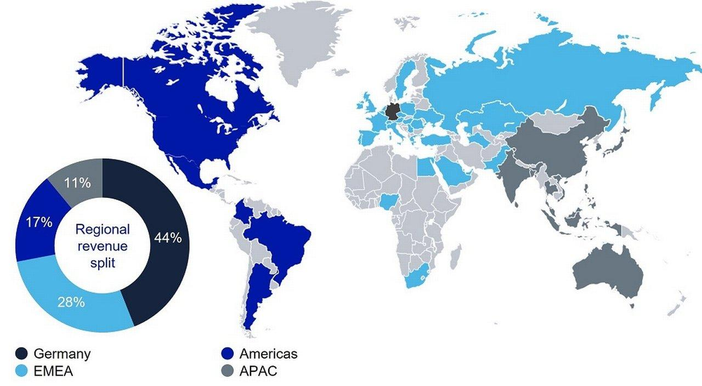

## Table of Contents

## What is Deutsche Bank and when was it founded?

Deutsche Bank is a big bank from Germany. It helps people and businesses with their money. They offer things like savings accounts, loans, and ways to invest money. The bank works all over the world, not just in Germany.

Deutsche Bank was started a long time ago, in 1870. It was founded in Berlin, the capital city of Germany. Since then, it has grown a lot and become one of the biggest banks in the world.

## What are the main services offered by Deutsche Bank?

Deutsche Bank offers many services to help people and businesses with their money. They have savings accounts where people can keep their money safe and earn a little interest. They also give out loans, which means they lend money to people or businesses who need it, and then those people pay it back over time with interest. Another service is investment banking, where Deutsche Bank helps companies raise money by selling stocks or bonds. They also help with managing big amounts of money for rich people or big organizations, which is called asset management.

Besides these, Deutsche Bank also helps with moving money around the world. This is called international transfers, and it's useful for people who need to send money to different countries. They also offer ways to pay for things easily, like credit cards and online banking. For businesses, Deutsche Bank provides special services like helping them manage their cash flow and giving advice on how to grow their business. All these services are designed to make handling money easier and more secure for their customers.

## How does Deutsche Bank operate globally?

Deutsche Bank operates all over the world, not just in Germany. They have offices in many countries, including the United States, the United Kingdom, and many places in Asia and Europe. This helps them serve customers no matter where they are. They work with big companies, small businesses, and regular people, helping them with their money needs everywhere.

To make sure they can help people in different countries, Deutsche Bank uses a big network of branches and online services. They can move money quickly from one country to another, which is very useful for businesses that work in many places. They also make sure to follow the rules in each country they work in, so they can offer their services safely and legally. This way, Deutsche Bank can be a big help to people and businesses all around the world.

## What is the current market position of Deutsche Bank?

Deutsche Bank is one of the biggest banks in Europe and has a strong place in the global financial market. It is known for its investment banking and corporate banking services, which are important for big companies around the world. Even though it faces tough competition from other big banks, Deutsche Bank keeps a solid position by offering a wide range of services and working in many countries.

In recent years, Deutsche Bank has been working to improve its business and make it stronger. They have been focusing on areas like investment banking and managing money for big clients. This has helped them stay competitive, but they still face challenges like making sure they follow all the rules and keeping their customers happy. Overall, Deutsche Bank is still a major player in the banking world, but they are always working to get better and keep their strong market position.

## Who are the key competitors of Deutsche Bank?

Deutsche Bank has many big competitors, especially in Europe and around the world. Some of the main ones are banks like JPMorgan Chase, Goldman Sachs, and Citigroup from the United States. These banks are very strong in investment banking and work with big companies, just like Deutsche Bank does. In Europe, banks like BNP Paribas from France and UBS from Switzerland are also important competitors. They offer similar services and try to attract the same customers.

Another big competitor is Bank of America, which is also from the United States. Bank of America is known for its big size and the many services it offers to both people and businesses. In Germany, Deutsche Bank competes with local banks like Commerzbank and DZ Bank. These banks focus on serving customers in Germany but also work internationally. All these competitors make the banking world very competitive, and Deutsche Bank has to work hard to keep its strong position.

## What has been the financial performance of Deutsche Bank in recent years?

In recent years, Deutsche Bank has had some ups and downs with its money. The bank has been trying to make more profit and become stronger. They've been focusing on making their investment banking and corporate banking better, which has helped them earn more money. But they've also had to spend a lot on fixing problems and making sure they follow all the rules. This means their profits have not been as high as they want, and sometimes they even lost money.

Even with these challenges, Deutsche Bank is still working hard to do better. They've been cutting costs and changing how they do business to make it more efficient. This has helped them make some progress, but it's a slow process. Overall, they are still a big and important bank, but they need to keep working on their financial performance to stay strong in the future.

## How has Deutsche Bank's strategy evolved over the last decade?

Over the last ten years, Deutsche Bank has changed its strategy a lot to try to do better. They used to focus on many different things, but they realized they needed to focus more on what they do best. So, they decided to work more on investment banking and helping big companies with their money. This meant they had to cut down on some other parts of their business that were not making as much money. They also started to use more technology to make their services better and faster.

Another big change was that Deutsche Bank started to be more careful with their money. They wanted to make sure they were not taking too many risks. This meant they had to spend less money and be smarter about where they put their money. They also worked hard to follow all the rules better, because they had some problems with this before. By focusing on these things, Deutsche Bank hoped to become stronger and more profitable in the future.

## What are the major regulatory challenges faced by Deutsche Bank?

Deutsche Bank has faced many regulatory challenges over the years. One big problem was fines they had to pay for not following the rules properly. For example, they were fined for not doing enough to stop money laundering, which is when people try to hide where their money comes from. They also had to pay for not following rules about how they could trade and invest money. These fines cost them a lot of money and made it harder for them to make a profit.

To fix these problems, Deutsche Bank had to spend a lot of time and money to make their systems better and follow the rules more closely. They hired more people to check that everything was being done right and put in new technology to help them keep track of their business better. Even though they have made a lot of progress, keeping up with all the rules around the world is still a big challenge for them. They have to be very careful to make sure they don't make the same mistakes again and keep their customers and the people who watch over them happy.

## How does Deutsche Bank manage risk and compliance?

Deutsche Bank works hard to manage risk and follow all the rules. They have special teams that watch over the bank's activities to make sure everything is done the right way. These teams check that the bank is not taking too many risks with its money and that it's following all the laws and rules in the places where it works. They use computer systems to keep track of what's going on and to spot any problems early. This helps them to fix things before they become big issues.

To make sure they are doing a good job, Deutsche Bank also trains its employees a lot. They teach them about the rules they need to follow and how to do their jobs without taking too many risks. They also do regular checks to see if everything is working well. If they find something that's not right, they fix it quickly. By doing all these things, Deutsche Bank tries to keep its customers' money safe and make sure it's always following the law.

## What technological innovations has Deutsche Bank implemented?

Deutsche Bank has been using new technology to make their services better and faster. They have made a big online platform where people can do their banking from home or on their phones. This platform helps customers check their money, move it around, and even invest it without going to a bank branch. They also use special computer programs to help them make better decisions about where to put their money and how to help their customers. These programs use a lot of data to find the best ways to make money and keep it safe.

Another big change is how Deutsche Bank uses technology to keep their business safe and follow the rules. They have systems that watch for anything strange or risky, like someone trying to move money in a sneaky way. These systems help them stop problems before they get big. They also use technology to make sure all their workers are following the rules. By doing this, Deutsche Bank can make sure they are doing everything the right way and keeping their customers' money safe.

## What are the future growth strategies of Deutsche Bank?

Deutsche Bank is planning to grow by focusing more on investment banking and helping big companies with their money. They want to make these parts of their business even stronger because they think it will help them earn more money. To do this, they are going to keep working on making their services better and faster. They also want to use more technology to help them make good decisions and serve their customers better. By doing these things, Deutsche Bank hopes to become more important and successful in the future.

Another way Deutsche Bank plans to grow is by being more careful with their money. They want to make sure they are not taking too many risks so they can stay strong and safe. This means they will keep working on following all the rules and making their business more efficient. They also want to find new ways to make money and expand into new places around the world. By focusing on these things, Deutsche Bank aims to keep growing and becoming a bigger and better bank.

## How does Deutsche Bank contribute to sustainable finance and ESG goals?

Deutsche Bank is working hard to help the world become more sustainable and reach environmental, social, and governance (ESG) goals. They do this by offering special loans and investments that help projects which are good for the environment, like renewable energy or energy-saving buildings. They also have rules to make sure they only work with companies that follow good ESG practices. This way, they encourage businesses to be more responsible and help the planet.

Besides that, Deutsche Bank helps their customers understand how to invest in a way that is good for the world. They give advice and create special funds that focus on sustainable investments. By doing this, they want to make sure that money is used to help the environment and society, not hurt them. They believe that by focusing on sustainability, they can make a positive difference and help build a better future for everyone.

## References & Further Reading

[1]: Aldridge, I. (2013). ["High-Frequency Trading: A Practical Guide to Algorithmic Strategies and Trading Systems,"](https://www.wiley.com/en-us/High+Frequency+Trading%3A+A+Practical+Guide+to+Algorithmic+Strategies+and+Trading+Systems%2C+2nd+Edition-p-9781118343500) 2nd Edition, John Wiley & Sons.

[2]: Duhigg, C. (2009). ["The Secretive World of Trading Hit a High During the Market Crisis."](https://admiredleadership.com/book-summaries/supercommunicators/) The New York Times.

[3]: Somakian, A. (2013). ["Deutsche Bank Algorithmic Trading Research."](https://www.finextra.com/pressarticle/71991/deutsche-bank-rolls-out-new-ai-based-equities-algorithmic-platform-in-apac) Deutsche Bank Research.

[4]: Durden, T. (2016). ["The Deutsche Bank 'Flash Crash': When HFT Faltered, It's Time To Stop Pretending."](https://pdfs.semanticscholar.org/f9f6/8601d785e8fb6c63fa456022654e6b8f24aa.pdf) ZeroHedge.

[5]: Alon, B. (2015). ["Algorithmic Trading Insights."](https://www.researchgate.net/publication/378548435_Algorithmic_Trading_and_AI_A_Review_of_Strategies_and_Market_Impact) Journal of Computing and Security.

[6]: Bertsimas, D., & Lo, A. W. (1998). ["Optimal Control of Execution Costs."](http://web.mit.edu/dbertsim/www/papers/Finance/Optimal%20control%20of%20execution%20costs.pdf) Operations Research.