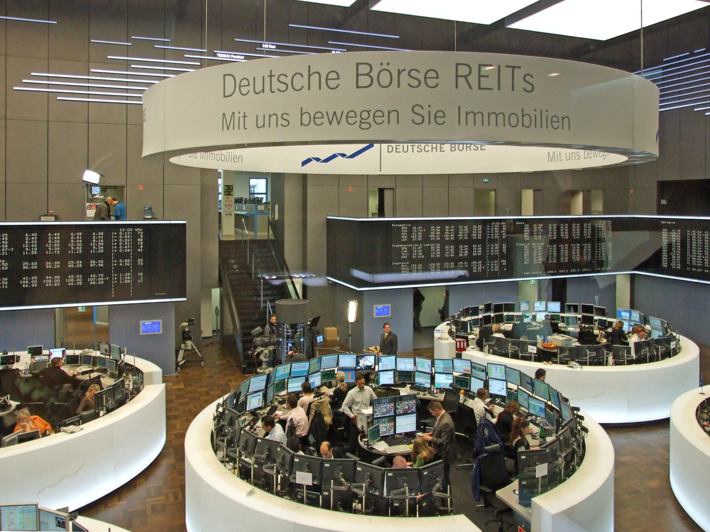

## Table of Contents

## What is Deutsche Börse Group?

Deutsche Börse Group is a company from Germany that runs a big stock exchange. This means they help people and companies buy and sell shares of businesses. The main stock exchange they run is called the Frankfurt Stock Exchange, which is one of the biggest in the world. They also do other things like help with trading in different financial products, and they offer services to make trading easier and safer.

Besides running the stock exchange, Deutsche Börse Group also provides important information about the market. They collect and share data that helps people understand how the market is doing. This information is useful for investors who want to make smart decisions about buying and selling. They also work on developing new technologies to improve how trading works, making sure it's fast and reliable.

## When was Deutsche Börse Group founded?

Deutsche Börse Group was founded in 1992. Before that, the Frankfurt Stock Exchange, which is a big part of Deutsche Börse, started way back in 1585. But it was in 1992 that they made the group to bring together different parts of the stock exchange business.

The group was created to make trading easier and more organized. They wanted to use new technology to help people buy and sell shares quickly and safely. Since then, Deutsche Börse Group has grown a lot and now does many things to help the financial world work better.

## What are the main services offered by Deutsche Börse Group?

Deutsche Börse Group offers many services that help with buying and selling shares and other financial products. One of their main services is running the Frankfurt Stock Exchange, which is a big place where people trade shares of companies. They also help with trading in other financial products like bonds and funds. They make sure that all this trading happens quickly and safely by using special technology.

Another important service they provide is giving out information about the market. They collect a lot of data and share it with people who want to know how the market is doing. This helps investors make smart choices about buying and selling. They also offer services that help keep trading safe and fair, like checking that everything is done correctly and stopping any cheating.

Deutsche Börse Group also works on developing new technologies to make trading even better. They use these technologies to create new ways for people to trade and to make sure that the trading systems are fast and reliable. This helps the whole financial world work more smoothly and efficiently.

## How does Deutsche Börse Group impact the global financial market?

Deutsche Börse Group has a big impact on the global financial market because it runs one of the world's biggest stock exchanges, the Frankfurt Stock Exchange. This exchange helps people and companies from all over the world buy and sell shares. When people trade shares on this exchange, it affects the prices of stocks everywhere, not just in Germany. This means that what happens on the Frankfurt Stock Exchange can influence how the global market works.

Another way Deutsche Börse Group impacts the global financial market is by providing important market data. They collect and share a lot of information about how the market is doing. Investors all over the world use this data to make decisions about buying and selling. This helps keep the global market stable and fair because everyone has access to the same information. By making sure trading is safe and reliable, Deutsche Börse Group helps keep the whole financial system running smoothly.

## What are the key subsidiaries of Deutsche Börse Group?

Deutsche Börse Group has several key subsidiaries that help it do its work. One important subsidiary is Clearstream, which helps with settling trades and keeping financial products safe. Another big one is Eurex, which runs a big market for trading futures and options. These are special kinds of financial products that people use to bet on what might happen in the future.

Another important subsidiary is Xetra, which is a trading system that helps people buy and sell shares quickly and easily. Qontigo is also a key part of Deutsche Börse Group, and it provides important data and tools that help investors understand the market better. All these subsidiaries work together to make trading easier, safer, and more efficient for everyone around the world.

## How is Deutsche Börse Group structured organizationally?

Deutsche Börse Group is organized in a way that helps it run its different businesses smoothly. At the top, there's the Executive Board, which makes the big decisions for the whole group. Below them, the group is split into different parts, called segments, that focus on specific areas of the business. These segments are like teams that work on things like trading, clearing, and providing market data.

Each segment has its own leaders and teams that work together to make sure everything runs well. For example, the Trading & Clearing segment includes important subsidiaries like Eurex and Xetra, which handle trading and clearing activities. The Data & Analytics segment, with Qontigo, focuses on providing data and tools to help investors. By organizing this way, Deutsche Börse Group can manage its different businesses efficiently and make sure each part is doing its job well.

## What role does Deutsche Börse Group play in the European economy?

Deutsche Börse Group plays a big role in the European economy by running the Frankfurt Stock Exchange, one of the biggest stock markets in Europe. This exchange helps companies raise money by selling shares to people and other businesses. When companies get this money, they can grow and create jobs, which helps the whole economy. The trading that happens on the Frankfurt Stock Exchange also helps set prices for stocks across Europe, making the market work better for everyone.

Another way Deutsche Börse Group helps the European economy is by making trading safe and fair. They use technology and rules to make sure that when people buy and sell shares, everything is done correctly. This builds trust in the market, which is important for the economy to grow. They also provide important information about the market, which helps investors make smart choices. This information helps keep the European economy stable and strong.

## How does Deutsche Börse Group ensure market integrity and transparency?

Deutsche Börse Group works hard to keep the market honest and clear. They do this by making strict rules that everyone has to follow when they trade on the Frankfurt Stock Exchange. These rules stop people from cheating or doing anything unfair. They also use special technology to watch the market all the time. This technology can spot anything strange or wrong and can stop it quickly. By making sure everyone plays by the rules, Deutsche Börse Group helps keep the market a safe place for everyone.

Another way they keep things clear is by giving out a lot of information about what's happening in the market. They collect data about how stocks are doing and share it with everyone. This helps investors see what's going on and make good choices about buying and selling. When everyone has the same information, it makes the market fair. Deutsche Börse Group also works with other groups and governments to make sure their rules and information are the best they can be. This helps keep the whole European market strong and trustworthy.

## What are some of the major technological innovations introduced by Deutsche Börse Group?

Deutsche Börse Group has introduced many important technological innovations to make trading better. One big innovation is their trading system called Xetra. Xetra helps people buy and sell shares very quickly and easily. It uses special technology to make sure that trades happen fast and without any mistakes. This system is used by many people and companies around the world, and it helps make the market work smoothly.

Another important innovation is their work with blockchain technology. Blockchain is a new way of keeping records that is very safe and hard to change. Deutsche Börse Group is using blockchain to make trading even more secure and to create new ways for people to trade. They are also working on other new technologies to keep improving how trading works, making sure it stays fast, reliable, and safe for everyone.

## How has Deutsche Börse Group expanded its operations internationally?

Deutsche Börse Group has grown its business to many countries around the world. They did this by buying other companies and making deals with them. For example, they bought a big part of Clearstream, which helps with trading in many countries. They also work with other stock exchanges in places like the United States and Asia. This helps them reach more people and companies, making their business bigger and stronger.

By expanding internationally, Deutsche Börse Group can offer their services to more people. They help companies from different countries raise money by selling shares on the Frankfurt Stock Exchange. They also share important market information with investors all over the world. This makes the global market more connected and helps the economy grow in many places.

## What are the recent financial performance highlights of Deutsche Börse Group?

Deutsche Börse Group has been doing well in recent years. In 2022, they made a lot of money, with their total revenue reaching about 4.5 billion euros. This was more than the year before, showing that their business was growing. They also made a good profit, around 1.4 billion euros, which means they were able to keep a lot of the money they earned after paying for everything they needed.

One reason they did so well is because more people were using their trading services. The Frankfurt Stock Exchange, which they run, saw a lot of trading activity. Also, their other services, like providing market data and helping with clearing trades, did well too. This shows that Deutsche Börse Group is doing a good job at helping the financial world work better and making money while doing it.

## What are the future strategic plans and growth areas for Deutsche Börse Group?

Deutsche Börse Group is looking to grow by focusing on new technology and expanding into new areas. They want to keep using and improving their trading systems like Xetra and Eurex to make trading faster and safer. They are also working on using blockchain technology to create new ways for people to trade. This can help them reach more customers and offer new services that are very secure and reliable.

Another big plan for Deutsche Börse Group is to grow their business in other countries. They want to work more with other stock exchanges around the world, like in the United States and Asia. By doing this, they can help more companies raise money and give more investors access to their services. This international growth can help them make more money and become even more important in the global financial market.

## References & Further Reading

[1]: Deutsche Boerse Group - Overview. Retrieved from [https://www.deutsche-boerse.com](https://www.deutsche-boerse.com/dbg-en/about-us/deutsche-boerse-group/organisation)

[2]: Euronext - Our History. Retrieved from [https://www.euronext.com/en](https://www.euronext.com/en/news/building-leading-european-market-infrastructure)

[3]: London Stock Exchange Group - About. Retrieved from [https://www.lseg.com](https://www.londonstockexchange.com/discover/london-stock-exchange-group)

[4]: European Securities and Markets Authority (ESMA) - Mission and Vision. Retrieved from [https://www.esma.europa.eu](https://www.esma.europa.eu/about-esma)

[5]: Lopez de Prado, M. (2018). ["Advances in Financial Machine Learning"](https://www.amazon.com/Advances-Financial-Machine-Learning-Marcos/dp/1119482089). Wiley.

[6]: Chan, E. P. (2009). ["Quantitative Trading: How to Build Your Own Algorithmic Trading Business"](https://github.com/ftvision/quant_trading_echan_book). Wiley.

[7]: Jansen, S. (2018). ["Machine Learning for Algorithmic Trading"](https://github.com/stefan-jansen/machine-learning-for-trading). Packt Publishing.

[8]: Aronson, D. (2007). ["Evidence-Based Technical Analysis: Applying the Scientific Method and Statistical Inference to Trading Signals"](https://www.amazon.com/Evidence-Based-Technical-Analysis-Scientific-Statistical/dp/0470008741). Wiley.