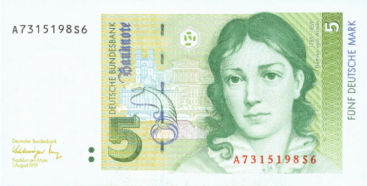

## Table of Contents

## What was the Deutschmark?

The Deutschmark was the official currency of West Germany from 1948 until 1990, and then of a reunified Germany until it was replaced by the Euro in 2002. It was introduced to help rebuild the German economy after World War II. The Deutschmark helped make the German economy strong and stable. It was a symbol of Germany's recovery and growth.

After the fall of the Berlin Wall in 1989, East and West Germany were reunified. The Deutschmark became the currency for all of Germany. It was used until the Euro was introduced. Many people in Germany still remember the Deutschmark fondly because it represented a time of economic success and stability.

## When was the Deutschmark introduced?

The Deutschmark was first introduced on June 20, 1948. This was a big step to help West Germany recover after World War II. The old currency, the Reichsmark, was replaced because it had lost its value. The new Deutschmark was meant to stop inflation and make the economy strong again.

The introduction of the Deutschmark was a success. It helped West Germany rebuild and grow into a strong economy. People started to trust the new currency, and it became a symbol of Germany's recovery and success.

## What was the purpose of introducing the Deutschmark?

The Deutschmark was introduced to help West Germany recover after World War II. The old currency, the Reichsmark, had lost its value because of inflation. The new Deutschmark was meant to stop inflation and make the economy strong again. It was introduced on June 20, 1948, as part of a plan to rebuild the country.

The introduction of the Deutschmark was a big success. It helped West Germany rebuild and grow into a strong economy. People started to trust the new currency, and it became a symbol of Germany's recovery and success. The Deutschmark was used until it was replaced by the Euro in 2002, but many people still remember it fondly.

## How did the Deutschmark impact the German economy?

The Deutschmark had a big impact on the German economy. When it was introduced in 1948, it helped stop the high inflation that was hurting the old currency, the Reichsmark. This made people trust the new money, which helped businesses grow and people to start spending again. As a result, the economy of West Germany got stronger and started to recover from the damage of World War II.

Over time, the Deutschmark became a symbol of Germany's success. It helped make the country's economy one of the strongest in the world. When East and West Germany reunited in 1990, the Deutschmark was used for all of Germany. It kept the economy stable until it was replaced by the Euro in 2002. Many people still remember the Deutschmark fondly because it represented a time when Germany was doing well.

## What were the different denominations of the Deutschmark?

The Deutschmark came in different sizes of money. There were coins and paper money. The coins were 1 Pfennig, 2 Pfennig, 5 Pfennig, 10 Pfennig, 50 Pfennig, 1 Deutschmark, 2 Deutschmark, and 5 Deutschmark. The Pfennig was a smaller unit of money, like cents in the United States. So, 100 Pfennig made 1 Deutschmark.

The paper money, or banknotes, came in bigger amounts. They were 5 Deutschmark, 10 Deutschmark, 20 Deutschmark, 50 Deutschmark, 100 Deutschmark, 200 Deutschmark, 500 Deutschmark, and 1000 Deutschmark. These banknotes were used for bigger purchases or to save money. Over time, the designs of the coins and banknotes changed, but these were the main sizes of the Deutschmark.

## How did the Deutschmark evolve over time?

The Deutschmark changed a lot over the years. When it started in 1948, it helped West Germany's economy get better after World War II. At first, there were coins and banknotes in different amounts. The coins were from 1 Pfennig up to 5 Deutschmark, and the banknotes went from 5 Deutschmark to 1000 Deutschmark. The designs of the money changed over time. New designs were made to make it harder to copy and to show important people or places in Germany.

After Germany was reunited in 1990, the Deutschmark became the money for all of Germany, not just the West. It kept the economy strong until the Euro came in 2002. The Deutschmark was important because it showed how Germany got better and stronger. Even though it is not used anymore, many people in Germany still think of the Deutschmark as a symbol of good times and a strong economy.

## What was the exchange rate of the Deutschmark to other major currencies?

The exchange rate of the Deutschmark (DM) changed over time compared to other major currencies. For example, in the 1970s, 1 DM was about 0.40 US dollars. By the 1990s, the exchange rate had changed, and 1 DM was worth about 0.60 US dollars. This shows that the Deutschmark got stronger over time compared to the US dollar.

The Deutschmark was also compared to other currencies like the British pound and the Japanese yen. In the 1980s, 1 DM was worth around 0.30 British pounds. By the 1990s, this changed to about 0.35 British pounds. Against the Japanese yen, 1 DM was worth around 100 yen in the 1980s, but this increased to about 120 yen in the 1990s. These changes show how the Deutschmark's value went up and down compared to other countries' money.

## How did the Deutschmark contribute to Germany's post-war recovery?

The Deutschmark helped Germany get better after World War II. It was introduced in 1948 to replace the old money, the Reichsmark, which had lost its value because of inflation. The new Deutschmark made people trust the money again. This helped businesses grow and people start spending. As a result, West Germany's economy got stronger and started to recover from the war. The Deutschmark stopped the high inflation and gave people hope that things would get better.

Over time, the Deutschmark became a symbol of Germany's success. It helped make the country's economy one of the strongest in the world. When East and West Germany reunited in 1990, the Deutschmark was used for all of Germany. It kept the economy stable until it was replaced by the Euro in 2002. Many people still remember the Deutschmark fondly because it represented a time when Germany was doing well. It was a big part of how Germany recovered and grew after the war.

## What role did the Deutschmark play in the European Monetary System?

The Deutschmark played a big role in the European Monetary System (EMS). The EMS started in 1979 to make the money of different European countries more stable. The Deutschmark was important because it was one of the strongest currencies in Europe. Many countries used the Deutschmark as a guide for their own money. This helped keep the value of their money steady and made it easier for them to trade with each other.

Because the Deutschmark was so strong and stable, it helped other countries in the EMS keep their economies stable too. If a country's money got too weak, they could use the Deutschmark to help make it stronger. This made the EMS work better and helped Europe's economy grow. The Deutschmark was a big reason why the EMS was successful until it was replaced by the Euro in 2002.

## When and why was the Deutschmark replaced by the Euro?

The Deutschmark was replaced by the Euro on January 1, 2002. This change happened because many European countries wanted to use the same money to make it easier to trade and travel between countries. The Euro was part of a bigger plan called the European Union, where countries work together to make life better for everyone. By using the same money, it was easier for businesses to sell things in different countries and for people to go on trips without worrying about changing money.

The Deutschmark was a strong and trusted currency, but the idea of the Euro was to bring Europe closer together. Even though many people in Germany liked the Deutschmark and remembered it fondly, the Euro helped make the whole of Europe stronger. The switch to the Euro was a big step towards a more united Europe, where countries could help each other more easily.

## What were the economic effects of replacing the Deutschmark with the Euro?

When Germany switched from the Deutschmark to the Euro, it had a big effect on the economy. At first, some people were worried because they liked the Deutschmark and thought it was strong. But the Euro helped Germany trade more easily with other countries in Europe. It made it simpler for businesses to buy and sell things across borders without worrying about changing money. This helped the economy grow because more trade meant more jobs and more money moving around.

Over time, the Euro also made prices more stable across Europe. This meant that prices in Germany did not go up and down as much as they might have with the Deutschmark. But there were also some challenges. Some people in Germany felt that the Euro was not as strong as the Deutschmark, and they missed the old currency. Overall, though, the switch to the Euro helped Germany be a bigger part of the European economy and made it easier for the country to work with its neighbors.

## How is the Deutschmark remembered in German history and culture?

The Deutschmark is remembered fondly in German history and culture as a symbol of the country's recovery and success after World War II. When it was introduced in 1948, it helped stop the high inflation that was hurting the old currency, the Reichsmark. This made people trust the new money, which helped businesses grow and people to start spending again. As a result, the economy of West Germany got stronger and started to recover from the war. The Deutschmark became a symbol of Germany's success and stability, and many people still remember it as a time when the country was doing well.

Even after the Deutschmark was replaced by the Euro in 2002, many Germans still think of it with nostalgia. They remember it as a strong and trusted currency that represented a time of economic growth and stability. The Deutschmark is often talked about in stories and memories of the older generation, who lived through the time when Germany was rebuilding and becoming strong again. It holds a special place in German culture as a reminder of the country's journey from the ruins of war to becoming one of the world's leading economies.

## References & Further Reading

[1]: Spahn, Heinz-Peter. (2001). "The Deutschmark in East and West, and the transformation of the German monetary order." In History of Economic Thought, 13(1), 45-68.

[2]: Ahamed, Liaquat. (2009). ["Lords of Finance: The Bankers Who Broke the World."](https://www.amazon.com/Lords-Finance-Bankers-Broke-World/dp/0143116800) Penguin Press.

[3]: Bundesbank. (1999). ["50 Years of the Deutsche Mark - Central Bank and the Currency in Germany since 1948."](https://academic.oup.com/book/51845) Deutsche Bundesbank.

[4]: Aldridge, Irene. (2013). ["High-Frequency Trading: A Practical Guide to Algorithmic Strategies and Trading Systems."](https://books.google.com/books/about/High_Frequency_Trading.html?id=6l0DDQAAQBAJ) Wiley.

[5]: James, Harold. (1999). ["Germany's Economic Challenge."](https://en.wikipedia.org/wiki/Harold_Wilson) Cambridge University Press.