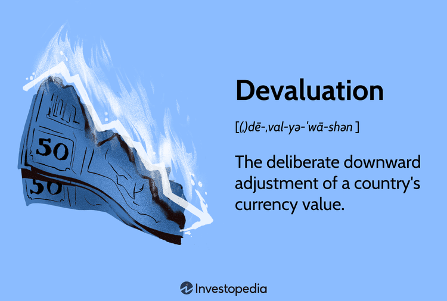

In today's globalized economy, economic policy stands as a critical element influencing various financial markets and instruments. Economic policy encompasses a range of government measures that impact a nation's economic direction, including fiscal policies, monetary controls, and trade regulations. One noteworthy aspect of economic policy is the devaluation of currency, a strategic tool employed by governments to recalibrate their economic standing. Currency devaluation involves lowering the value of a country's currency relative to others. By making exports cheaper and thus more attractive to foreign buyers, devaluation can stimulate domestic economic growth, although it also carries risks such as inflation and reduced consumer purchasing power.

Parallel to these developments, algorithmic trading has significantly transformed trading activities within financial markets. Utilizing computer programs to execute trades according to pre-set instructions, algorithmic trading capitalizes on speed and efficiency, offering traders the ability to respond swiftly to market changes. This method has come to dominate many areas of trading due to advancements in technology and increased market complexity, presenting new opportunities, as well as challenges, for market participants.



This article aims to explore the complex relationship between economic policy, currency devaluation, and algorithmic trading. The interaction between these factors is essential in understanding their collective impact on the global economy. For investors, traders, and policymakers, comprehending how these elements relate and influence each other is crucial for navigating today's intricate economic landscape. As economic conditions and technological capabilities continue to evolve, the implications of these relationships will be increasingly significant.

## Table of Contents

## Understanding Economic Policy and Currency Devaluation

Economic policy encompasses a variety of measures implemented by government authorities to guide and influence their country's economic performance. These actions are crafted to manage the economy's structural aspects like taxation, government budgets, the money supply, interest rates, and the labor market. Currency devaluation is one of the significant tools under this broader policy umbrella, where a nation deliberately reduces its currency's value relative to foreign currencies.

Currency devaluation can serve as a strategic maneuver to stimulate economic benefits primarily through the enhancement of export competitiveness. When a country's currency is devalued, its goods and services become cheaper for foreign buyers. This competitive pricing can escalate export volumes, stimulate domestic production, and potentially lead to economic growth. Alongside boosting exports, devaluation can also aid in reducing a trade deficit and increasing foreign exchange reserves.

However, currency devaluation is not without its attendant risks and drawbacks. One primary consequence is inflation. As the domestic currency loses value, importing goods becomes more expensive, which can embroil an economy in spiraling price increases. This, in turn, reduces consumer purchasing power as the cost of living rises without a matching increase in incomes. Additionally, while devaluation can enhance exports, it might also adversely affect international confidence in a country's economic stability, potentially deterring foreign investment.

Historical case studies provide valuable insights into the impacts of currency devaluation. Argentina, for instance, has experienced several currency devaluation episodes, notably during its 2001–2002 economic crisis. Facing overwhelming debt and fiscal deficits, the Argentine currency was dramatically devalued, leading to hyperinflation, severe contraction in output, and widespread social unrest. Similarly, Zimbabwe provides another example where excessive currency devaluation resulted in hyperinflation, rendering the local currency virtually worthless and forcing the country to abandon its currency entirely.

These historical scenarios underscore the delicate balance that governments must maintain when employing currency devaluation as a policy tool. While it can be a catalyst for economic recovery and competitiveness, if not managed prudently, it can exacerbate economic instability and undermine the standard of living. As such, policymakers must consider comprehensive strategies and potential repercussions when contemplating currency devaluation in their economic toolkit.

## The Rise of Algorithmic Trading

Algorithmic trading has transformed the financial markets by leveraging computer programs that execute orders based on predefined criteria. This evolution in trading methodologies arises largely from two major factors: technological advancements and the increasing complexity of financial markets.

### How Algorithmic Trading Operates

At its core, [algorithmic trading](/wiki/algorithmic-trading) utilizes computer algorithms to automate the process of buying and selling securities. These algorithms are programmed to follow specific instructions regarding timing, price, or quantity, allowing for the efficient and rapid execution of trades. Automation eliminates human errors and significantly speeds up the trading process, enabling traders to exploit market opportunities that may last only a fraction of a second.

Consider the basic structure of an algorithmic trading strategy in Python:

```python
def moving_average_strategy(data, short_window, long_window):
    data['short_mavg'] = data['price'].rolling(window=short_window, min_periods=1).mean()
    data['long_mavg'] = data['price'].rolling(window=long_window, min_periods=1).mean()
    data['signal'] = 0
    data['signal'][short_window:] = np.where(data['short_mavg'][short_window:] > data['long_mavg'][short_window:], 1, 0)
    data['positions'] = data['signal'].diff()
    return data
```

This simple strategy calculates two moving averages—a short-term and a long-term—and generates buy or sell signals based on their crossover.

### Advantages of Algorithmic Trading

Algorithmic trading offers several significant advantages:

- **Speed and Efficiency**: Algorithms can analyze vast amounts of data and execute trades rapidly, outperforming human capabilities. This speed allows traders to capture fleeting opportunities and manage large volumes of trades efficiently.

- **Liquidity and Pricing**: By automating large numbers of trades, algorithms contribute to market liquidity, creating more competitive pricing and tighter spreads. Enhanced liquidity typically results in less market volatility.

- **Reduced Transaction Costs**: By minimizing the need for manual interventions, algorithmic trading can lower transaction costs. Automation also helps in executing trades at the most opportune moments, optimizing costs.

### Types of Algorithmic Trading

There are various types of algorithmic trading, each tailored to different strategies and objectives:

- **High-Frequency Trading (HFT)**: One of the most well-known forms of algorithmic trading, HFT involves executing a large number of orders at extremely high speeds. The focus is on small price discrepancies that may exist for only a short time.

- **Statistical Arbitrage**: This involves identifying and exploiting statistical mispricing in one or more markets. It typically uses quantitative models to identify trading opportunities based on historical price movements and correlations.

- **Trend Following**: This strategy follows market trends and executes trades in the direction of the prevailing trend. Indicators like moving averages or momentum are often used to determine entry and exit points.

### Enhancing Liquidity and Market Pricing

Algorithmic trading plays a crucial role in enhancing [liquidity](/wiki/liquidity-risk-premium) and providing better market pricing. By facilitating faster order placement, algorithms help to absorb market orders, narrowing bid-ask spreads. This process also ensures that pricing reflects the most current market conditions, benefiting traders and improving market efficiency.

Algorithmic trading's rise is a testament to the transformative potential of technology in financial markets, driving efficiency, reducing costs, and enhancing liquidity. As technology continues to advance and markets grow more complex, algorithmic trading is expected to play an increasingly dominant role in trading activities globally.

## Impact of Currency Devaluation on Algorithmic Trading

Currency devaluation, a significant economic event, can substantially impact financial markets and disrupt trading strategies employed by algorithmic traders. Algorithmic trading, driven by computer programs that execute trades based on pre-defined criteria, often relies on stable market conditions to operate effectively. However, when a currency devaluation occurs, it introduces significant [volatility](/wiki/volatility-trading-strategies) and uncertainty into the market, which can both challenge and create opportunities for algorithmic traders.

Algorithmic traders adjust their trading algorithms in response to changes in currency values by incorporating new parameters that account for increased volatility and potential shifts in market trends. For instance, [machine learning](/wiki/machine-learning) models within these algorithms are often retrained to recognize new patterns resulting from devaluation. Consider a simplified linear regression model used for predicting currency exchange rates:

```python
from sklearn.linear_model import LinearRegression
import numpy as np

# Historical data with features and target
X = np.array([[1.1, 2.3], [1.2, 2.1], [1.3, 2.5]])
y = np.array([4.5, 4.8, 5.1])

# Create and train the model
model = LinearRegression()
model.fit(X, y)

# Adjustments for new volatility data
new_data = np.array([[1.4, 2.8]])
predicted = model.predict(new_data)
```

In the event of a devaluation, traders may augment the model with new data reflecting recent trends, effectively recalibrating their strategies in response to altered market conditions.

Sudden currency devaluation often leads to increased market volatility, presenting algo traders with unique [arbitrage](/wiki/arbitrage) opportunities. These opportunities arise due to discrepancies in currency prices across different markets or platforms, a phenomenon more pronounced during volatile periods. Algo trading can take advantage of these price differences with speed and precision that human traders are unable to match. High-frequency trading ([HFT](/wiki/high-frequency-trading-strategies)), a subset of algorithmic trading, particularly benefits from such situations. HFT systems are designed to execute trades in fractions of a second, capitalizing on fleeting arbitrage prospects created by the rapid market movements that accompany currency devaluations.

While algorithmic trading systems can exploit these conditions to achieve higher returns, they can also exacerbate market movements. As large volumes of trades are executed almost simultaneously, the liquidity provided by algorithmic traders can lead to amplified price swings. This phenomenon was observed during the Swiss Franc devaluation in 2015, where the unexpected removal of the currency cap led to dramatic market movements, heightened by the swift reactions of algorithmic traders.

Case studies of markets that have experienced currency devaluation highlight diverse algorithmic trading strategies. During Argentina's currency crisis in the early 2000s, algorithmic traders adjusted their models to account for new government policies and economic indicators, allowing for more adaptive and resilient trading strategies in an uncertain economic environment.

In summary, currency devaluation influences algorithmic trading strategies by necessitating adaptive responses to heightened market volatility and emerging opportunities. While algo trading offers advantages in speed and execution, it also poses risks by potentially amplifying market movements, emphasizing the need for robust risk management practices.

## Challenges and Considerations

The integration of economic policy, currency devaluation, and algorithmic trading introduces a complex array of challenges and considerations which are paramount for market participants and regulatory bodies.

Economic policies, particularly those involving currency devaluation, can lead to significant regulatory concerns in the domain of algorithmic trading. Market fairness becomes a point of debate when high-frequency trading (HFT) firms leverage technological advantages to anticipate and react more swiftly than traditional investors. This advantage can result in disproportionate profits, potentially leading to accusations of market manipulation. Regulatory bodies, such as the U.S. Securities and Exchange Commission (SEC) and the European Securities and Markets Authority (ESMA), continuously work on frameworks to ensure markets remain transparent and equitable, mitigating the chances of manipulative strategies exploiting policy-induced market conditions.

Ethical concerns surface with the application of high-speed algorithms in volatile market situations, particularly those affected by abrupt policy changes like currency devaluation. The ability of algorithms to execute thousands of trades in seconds could exacerbate market volatility, triggering rapid price swings harmful to market stability. Ethically, traders are confronted with the responsibility of ensuring their algorithms do not contribute to such instability, necessitating a balance between profit and ethical trading practices.

Risk management is a critical area for algorithmic traders and policymakers dealing with currency devaluation. For traders, the implementation of robust risk management strategies is essential to navigate the risks associated with sudden currency shifts. This can include the use of stop-loss orders, diversification of trading instruments, and the constant recalibration of algorithms to adapt to real-time market shifts. Policymakers, on the other hand, must consider the broader economic impacts of their decisions, weighing the benefits of devaluation against potential drawbacks like inflation and capital flight, which can be intensified by algorithmic trading activities.

The future of economic policy and algorithmic trading is intricately linked to technological advancements. As technology evolves, so does the potential for more sophisticated algorithmic strategies, which could further influence market dynamics in unprecedented ways. Policymakers will need to anticipate these changes, adapting regulatory measures to ensure the stability and fairness of the financial markets. Additionally, advances in [artificial intelligence](/wiki/ai-artificial-intelligence) and machine learning could lead to the development of more nuanced algorithms, capable of making complex decisions based on a broader range of economic indicators and policy changes.

In summary, while algorithmic trading offers significant efficiencies and opportunities, it also presents serious challenges in terms of regulation, ethics, and risk management. As technology and global economic policies evolve, maintaining a balance between innovation and market integrity will be crucial for the stability and sustainability of financial markets.

## Conclusion

Economic policy, currency devaluation, and algorithmic trading are deeply interconnected components of modern financial markets. These elements influence one another, creating a dynamic environment that requires a nuanced understanding for investors, traders, and policymakers to successfully navigate.

Currency devaluation, while presenting significant risks such as inflation and decreased consumer purchasing power, also creates opportunities for algorithmically savvy traders. By adjusting trading strategies, particularly those involving foreign exchange and commodities, algo traders can exploit devaluation scenarios for profitable outcomes. For instance, algorithmic models can be programmed to detect and respond to currency fluctuations more rapidly than human traders, increasing the potential for gain.

Effective regulation and strategic risk management are critical to maintaining stability in market conditions constantly affected by policy adjustments and devaluation incidents. Regulatory frameworks must evolve to address the speed and complexity brought by algorithmic trading, ensuring fairness and minimizing risks of market manipulation. Similarly, robust risk management practices can shield financial systems from excessive volatility and systemic risks, thereby preserving market integrity.

As economic policies and trading technologies evolve, staying informed becomes crucial for leveraging potential benefits. Advances in financial technology, data analytics, and machine learning present numerous opportunities for optimizing trading strategies in line with economic changes. Yet, these advancements also underline the importance of continually reassessing regulatory practices and risk frameworks to align with the innovations shaping the future of financial markets.

## References & Further Reading

[1]: ["Advances in Financial Machine Learning"](https://www.amazon.com/Advances-Financial-Machine-Learning-Marcos/dp/1119482089) by Marcos Lopez de Prado

[2]: Bergstra, J., Bardenet, R., Bengio, Y., & Kégl, B. (2011). ["Algorithms for Hyper-Parameter Optimization."](https://dl.acm.org/doi/10.5555/2986459.2986743) Advances in Neural Information Processing Systems 24.

[3]: ["Evidence-Based Technical Analysis: Applying the Scientific Method and Statistical Inference to Trading Signals"](https://www.amazon.com/Evidence-Based-Technical-Analysis-Scientific-Statistical/dp/0470008741) by David Aronson

[4]: ["Machine Learning for Algorithmic Trading"](https://github.com/stefan-jansen/machine-learning-for-trading) by Stefan Jansen

[5]: ["Quantitative Trading: How to Build Your Own Algorithmic Trading Business"](https://www.amazon.com/Quantitative-Trading-Build-Algorithmic-Business/dp/1119800064) by Ernest P. Chan