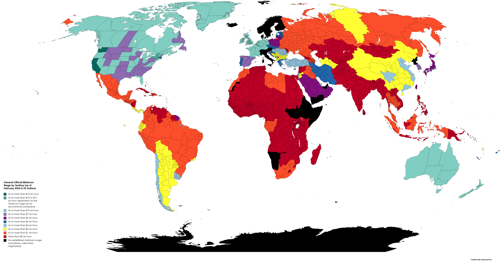

## Table of Contents

## What is a minimum wage?

A minimum wage is the lowest amount of money that employers are legally allowed to pay their workers for each hour of work. It is set by the government to make sure that workers earn enough to live on, and to prevent businesses from paying very low wages. Different countries have different minimum wage rates, and sometimes the rate can be different for different regions within a country.

In some places, the minimum wage might be the same for everyone, but in other places, it can be different depending on the type of job or the age of the worker. For example, some countries have a lower minimum wage for teenagers or for workers in certain industries. The idea behind a minimum wage is to protect workers and help reduce poverty, but there are also debates about whether it can lead to fewer job opportunities if businesses find it too expensive to hire workers at the minimum wage rate.

## Which developed countries do not have a national minimum wage?

Some developed countries do not have a national minimum wage. One of these countries is Sweden. In Sweden, they believe that unions and employers should decide wages together, not the government. They think this way works better for everyone. Another country without a national minimum wage is Denmark. Like Sweden, Denmark relies on agreements between unions and employers to set wages.

In both Sweden and Denmark, the absence of a national minimum wage does not mean workers earn less. Many workers in these countries have good salaries because of strong unions and good agreements with employers. These countries believe that this system helps keep more people working and makes the economy strong.

## How do these countries ensure fair wages without a minimum wage law?

In Sweden and Denmark, they use a different way to make sure workers get fair pay. Instead of the government setting a minimum wage, they let unions and employers talk and agree on wages. Unions are groups of workers who work together to make sure their members get good pay and working conditions. They meet with the people who own the businesses and make deals about how much workers should be paid. This system is called collective bargaining.

This way of setting wages works well in Sweden and Denmark because they have strong unions. Most workers in these countries are part of a union, so they can have a big say in how much they get paid. The agreements between unions and employers cover many workers and make sure that even the lowest-paid workers get enough money to live on. This system helps keep wages fair and also helps keep more people working, which is good for the economy.

## What are the arguments for not having a minimum wage in these countries?

In Sweden and Denmark, they think not having a minimum wage set by the government is better because it lets unions and employers work together to decide on fair pay. They believe this way, called collective bargaining, makes sure that workers get good wages without the government telling them what to do. It's like letting the people who know the most about the jobs and the businesses decide what is fair, instead of having a one-size-fits-all rule.

They also think that not having a minimum wage helps keep more people working. If the government sets a minimum wage too high, some businesses might not be able to afford to hire as many workers. But with unions and employers making their own deals, they can find a good balance that keeps wages fair and keeps people employed. This is important for a strong economy where everyone can have a job and earn enough to live well.

## How do wage levels in these countries compare to those with minimum wage laws?

In Sweden and Denmark, even without a national minimum wage, workers often earn good wages. This is because unions and employers make deals to set fair pay. Many workers in these countries are in unions, so they have a strong voice in deciding their wages. As a result, the average wages in Sweden and Denmark are high compared to many other countries. Workers in these countries usually earn enough to live well, even if there's no government-set minimum wage.

Countries with minimum wage laws, like the United States or the United Kingdom, also aim to ensure workers earn enough. The minimum wage in these countries sets a floor for pay, which can help protect the lowest-paid workers. However, the actual wages can vary a lot depending on the job and the region. In some cases, the minimum wage might not be enough for a good standard of living, especially in expensive cities. Overall, while minimum wage laws provide a safety net, the wage levels in Sweden and Denmark often remain competitive and sometimes even higher due to their strong collective bargaining system.

## What industries or sectors in these countries are most affected by the absence of a minimum wage?

In Sweden and Denmark, the industries most affected by not having a minimum wage are those where workers are less likely to be in unions. For example, some workers in the service industry, like restaurants or hotels, might not be in a union. Without a minimum wage, their pay depends a lot on the deals made between their union and the employer. If they're not in a union, they might earn less than workers in other industries where unions are strong.

However, even in these industries, wages are often still good because many workers are part of unions. In Sweden and Denmark, unions cover a lot of workers, even in service jobs. So, even without a minimum wage, these workers can still get fair pay through agreements made with their employers. This helps make sure that most people in these countries earn enough to live well, no matter what industry they work in.

## What are the economic impacts of not having a minimum wage in these developed countries?

Not having a minimum wage in Sweden and Denmark can help keep more people working. Without a set minimum wage, businesses can hire more workers because they can pay them based on what they can afford. This can make the economy stronger because more people have jobs and can spend money. When unions and employers make deals about wages, they can find a good balance that keeps wages fair but also keeps businesses able to hire people. This can help lower unemployment and make the economy grow.

On the other hand, not having a minimum wage can also make some workers worried about their pay. If they are not in a union, they might earn less than workers in countries with a minimum wage. But in Sweden and Denmark, many workers are in unions, so most people still get fair pay. The strong unions help make sure that even without a minimum wage, workers earn enough to live well. This system can be good for the economy because it keeps wages fair and keeps more people working.

## How do social welfare systems in these countries support workers in the absence of a minimum wage?

In Sweden and Denmark, the social welfare systems help a lot to support workers even if there is no minimum wage. These countries have strong social safety nets that give people money if they lose their job or if they can't work because they are sick. This means that even if someone is not [earning](/wiki/earning-announcement) a lot from their job, they can still get help from the government to make sure they have enough to live on. This support helps take away some of the worry that workers might have about not having a minimum wage.

Also, the social welfare systems in Sweden and Denmark help make sure that everyone can have a good life, no matter how much they earn. They offer things like free healthcare, education, and help with housing costs. This means that workers don't have to worry as much about big expenses, even if their wages are not high. By having these strong social supports, Sweden and Denmark can make sure that their workers are taken care of, even without a minimum wage law.

## What are the historical reasons behind these countries' decisions not to implement a minimum wage?

Sweden and Denmark have not had a national minimum wage for a long time because they believe in a different way of deciding how much workers should earn. A long time ago, they started using a system called collective bargaining. This means that groups of workers, called unions, talk with the people who own the businesses to agree on fair wages. They think this way is better because the people who know the most about the jobs and the businesses can decide what is fair. They started doing this many years ago and it has worked well for them.

In these countries, they also have strong social welfare systems that help take care of people if they don't earn a lot of money. This makes it less important to have a minimum wage because the government helps people in other ways. They believe that their system keeps more people working and makes the economy strong. So, they decided to keep doing things this way instead of having the government set a minimum wage for everyone.

## How do labor unions and collective bargaining influence wage levels in these countries?

In Sweden and Denmark, labor unions and collective bargaining play a big role in deciding how much workers get paid. Unions are groups of workers who come together to talk with the people who own the businesses. They make deals about wages, working hours, and other things that matter to workers. Because many workers in these countries are in unions, they have a strong voice in deciding their pay. This means that even without a minimum wage set by the government, workers can still get good wages because unions help them make fair deals with their bosses.

The system of collective bargaining helps keep wages fair for everyone. When unions and employers sit down to talk, they can find a balance that works for both sides. This way, businesses can still make money, but workers also earn enough to live well. In Sweden and Denmark, this system has worked well for a long time. It helps keep more people working because businesses can afford to hire workers, and it makes sure that workers are paid fairly. This is why these countries decided not to have a minimum wage set by the government.

## What are the potential future implications of not having a minimum wage in these developed countries?

Not having a minimum wage in Sweden and Denmark could keep things going the way they are now. The system of unions and employers making deals about wages might keep working well. This could mean that most workers still get fair pay and many people stay employed. The strong social welfare systems in these countries would keep helping people who don't earn a lot, so everyone can still have a good life. If things stay the same, these countries might keep being good places to work and live.

In the future, there could be changes too. If fewer people join unions, it might be harder for workers to get fair wages. This could make some workers worry about earning enough. But if unions stay strong, they can keep making good deals with employers. Also, if the economy changes a lot, the government might start thinking about a minimum wage. But for now, Sweden and Denmark seem happy with their way of doing things, and it might keep working well for a long time.

## How do these countries' approaches to minimum wage align with international labor standards?

Sweden and Denmark's way of not having a minimum wage set by the government is a bit different from what many international labor standards suggest. The International Labour Organization (ILO), which is a big group that helps make rules about work around the world, says that countries should have a minimum wage to make sure workers earn enough to live on. But Sweden and Denmark think their way of letting unions and employers talk and agree on wages works better for them. They believe this helps keep more people working and makes the economy strong.

Even though they don't follow the ILO's suggestion about having a minimum wage, Sweden and Denmark still try to make sure workers are treated fairly. They have strong unions that help workers get good pay through deals with their bosses. Plus, their social welfare systems help people who don't earn a lot, so everyone can have a good life. This way, they meet the spirit of international labor standards by making sure workers are taken care of, even if they do it differently than what the ILO says.

## References & Further Reading

[1]: Schmitt, J., and Rosnick, D. (2011). ["The Wage and Employment Impact of Minimum-Wage Laws in Developed Countries."](https://www.semanticscholar.org/paper/The-Wage-and-Employment-Impact-of-Minimum-Wage-Laws-Schmitt-Rosnick/9380d4af49cd8542461598360e201302f8265f86) Center for Economic and Policy Research.

[2]: Organisation for Economic Co-operation and Development (OECD). (2015). ["Minimum Wages After the Crisis: Making Them Pay."](https://www.oecd-ilibrary.org/employment/oecd-employment-outlook-2015/recent-labour-market-developments-with-a-focus-on-minimum-wages_empl_outlook-2015-5-en) OECD Employment Outlook.

[3]: Dube, A. (2019). ["Impacts of Minimum Wages: Review of the International Evidence."](https://assets.publishing.service.gov.uk/government/uploads/system/uploads/attachment_data/file/844350/impacts_of_minimum_wages_review_of_the_international_evidence_Arindrajit_Dube_web.pdf) National Bureau of Economic Research.

[4]: Neumark, D., and Wascher, W. (2008). ["Minimum Wages and Employment."](https://www.nber.org/papers/w12663) Foundations and Trends® in Microeconomics.

[5]: Hendershott, T., & Riordan, R. (2013). ["Algorithmic Trading and the Market for Liquidity."](https://www.jstor.org/stable/43303831) Journal of Financial and Quantitative Analysis, 48(4), 1001-1024.

[6]: Kirilenko, A. A., Kyle, A. S., Samadi, M., & Tuzun, T. (2017). ["The Flash Crash: High-Frequency Trading in an Electronic Market."](https://onlinelibrary.wiley.com/doi/abs/10.1111/jofi.12498) Journal of Finance, 72(3), 967-998.

[7]: Aldridge, I. (2013). ["Algorithmic Trading: Winning Strategies and Their Rationale."](https://www.wiley.com/en-us/Algorithmic+Trading%3A+Winning+Strategies+and+Their+Rationale-p-9781118460146) John Wiley & Sons.

[8]: Allegretto, S., Dube, A., and Reich, M. (2017). ["Minimum Wages, Poverty, and Material Hardship: Evidence from the Current Population Survey."](https://pmc.ncbi.nlm.nih.gov/articles/PMC6774472/) Industrial Relations.

[9]: Thelen, K. (2014). ["Varieties of Liberalization and the New Politics of Social Solidarity."](https://assets.cambridge.org/97811070/53168/frontmatter/9781107053168_frontmatter.pdf) Cambridge University Press.

[10]: Adams, Z., Bishop, L., and Deakin, S. (2016). ["Capping employer liability in employment disputes: Australia and the United Kingdom compared."](https://pmc.ncbi.nlm.nih.gov/articles/PMC9180776/) Journal of Industrial Relations.