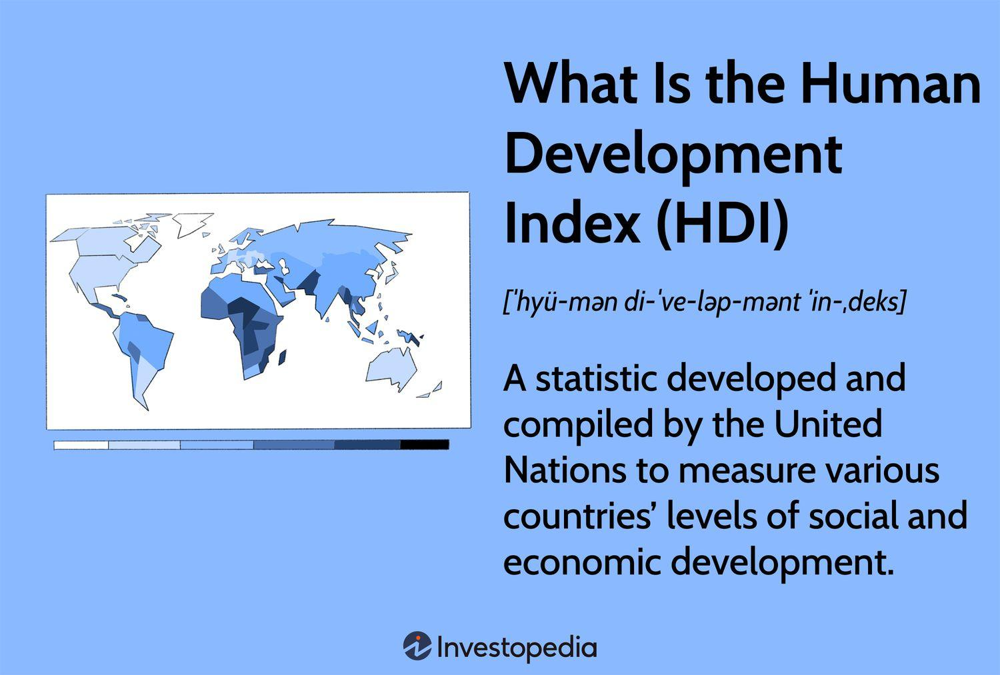

Economic development is a pivotal concept in understanding how countries evolve and improve the living standards of their populations. It encompasses a multidimensional process that includes increased industrialization, improved healthcare, education, and rising per capita income. Developed economies, such as those of the United States, Germany, and Japan, are characterized by high levels of infrastructure, technological advancements, and robust policy frameworks that support sustained growth and prosperity.

The Human Development Index (HDI) serves as an essential tool in measuring the overall development of a nation, extending beyond mere economic metrics. By considering health, education, and income, HDI offers a holistic view of a nation's progress. In this context, HDI not only aids in evaluating the effectiveness of a country's developmental policies but also facilitates international comparisons.

Simultaneously, the landscape of global financial markets is being transformed by algorithmic trading—a subset of trading in which computers execute multiple orders at speeds and frequencies beyond human capabilities. This practice uses sophisticated mathematical models and high-speed trading platforms to determine and capitalize on market inefficiencies. As globalization tightens economic interdependencies, the integration of socio-economic indicators such as HDI into algorithmic trading strategies becomes increasingly significant.

The article aims to unravel the interconnected web of economic development, developed economies, HDI, and algorithmic trading, highlighting their collective impact on global markets. Readers can expect to understand how these elements interact to influence investment decisions and how they serve as indicators of a nation's economic health. Additionally, the article will explore how algorithmic trading could potentially align with sustainable economic development goals by integrating broader development data like HDI.

## Table of Contents

## Understanding Economic Development

Economic development refers to the process by which a nation improves the economic, political, and social well-being of its people. It is a multi-dimensional concept that encompasses a broad spectrum of factors contributing to an increase in the standard of living and quality of life within a country. The significance of economic development lies in its potential to reduce poverty, enhance income distribution, and improve employment opportunities, ultimately leading to a more equitable and sustainable society.

Key indicators are instrumental in measuring economic development, providing a quantitative assessment of a nation's progress in this arena. Gross Domestic Product (GDP) is one of the primary indicators, reflecting the total value of goods and services produced within a country during a specific period. GDP serves as a broad measurement of a nation's overall economic activity and health.

Another critical indicator is Gross National Income (GNI), which complements GDP by considering the total domestic and foreign output claimed by residents of a country. GNI includes GDP along with net income from abroad, providing a comprehensive view of economic performance. These indicators, while powerful, need to be evaluated in the context of poverty rates, which give insight into the proportion of a population living below the poverty line and struggling to meet basic needs.

Economic development is not solely the pursuit of developing countries aiming to transition to higher income levels. It is equally significant for developed economies, which focus on sustaining growth, reducing economic disparities, and addressing new challenges such as technological change, population aging, and environmental sustainability. For both developing and developed nations, the goal of economic development extends beyond mere economic expansion. It encompasses the creation of equitable opportunities, improvement in social structures, and the fostering of an environment where all citizens can thrive.

The pursuit of economic development requires a balanced approach that combines economic growth with social policies aimed at redistributing income and reducing inequality. It often involves governmental intervention through policies aimed at promoting education, health care, infrastructure development, and technology advancement, ensuring that economic gains translate into improved living conditions for the broader population.

## Characteristics of a Developed Economy

Developed economies are characterized by various distinctive attributes that set them apart from their developing counterparts. These include high levels of industrialization, robust infrastructure, and advanced technological capabilities. These foundations contribute to higher living standards and greater economic stability and resilience.

### Industrialization and Economic Output

One of the primary attributes of a developed economy is a significant degree of industrialization. Economies like the United States, Germany, and Japan exemplify this attribute with their substantial manufacturing sectors. For instance, Germany is renowned for its automotive industry, hosting major manufacturers like Volkswagen, BMW, and Mercedes-Benz. The United States boasts a diversified industrial base ranging from aerospace and technology to pharmaceuticals and consumer goods. Japan, with companies such as Toyota and Sony, has established itself as a leader in both automotive production and electronics.

### Robust Infrastructure

Another critical feature of developed economies is their robust infrastructure, which supports economic activities and enhances productivity. Developed countries have extensive transportation networks, including highways, railways, and airports, facilitating efficient movement of goods and people. For example, Japan's Shinkansen (bullet train) network is a symbol of advanced infrastructure that significantly reduces travel time across regions, thereby enhancing connectivity and economic integration.

### Advanced Technological Capabilities

Technological innovation is a hallmark of developed economies. These countries often lead in research and development, resulting in cutting-edge technologies and a high degree of digital infrastructure. The United States, for instance, is home to Silicon Valley, a global hub for technological innovation, where companies such as Google, Apple, and Facebook reside. These advancements contribute to increased productivity and the ability to maintain competitive advantages in international markets.

### Policy Choices and Economic Maintenance

Policy choices play an essential role in sustaining developed economies. Governments in these nations typically implement policies that foster economic growth, promote trade, and ensure financial stability. Regulatory frameworks, investment in education, and support for innovation are crucial in maintaining their economic status. For example, Germany’s commitment to vocational training and its dual education system ensures a steady stream of skilled labor, essential for its industrial prowess. Additionally, policies aimed at maintaining open markets and fostering international trade are vital for developed economies to access broader markets and resources.

### Conclusion

The characteristics of a developed economy—industrialization, infrastructure, technological capabilities, and strategic policy choices—form the backbone of their economic strength. These elements not only facilitate high living standards but also ensure resilience against economic challenges, ultimately contributing to sustained economic prosperity.

## The Role of the Human Development Index (HDI)

The Human Development Index (HDI) is a metric used to assess the overall development of countries by examining three fundamental components: health, education, and income. These elements are combined to provide a comprehensive measure of human well-being and potential.

Health is a critical component of HDI, and it is measured by life expectancy at birth. This indicator reflects the ability of individuals in a country to live long and healthy lives, which is a fundamental aspect of human development. Life expectancy is influenced by various factors, including healthcare access, nutrition, and living conditions.

Education is assessed through a combination of mean years of schooling for adults aged 25 and older and expected years of schooling for children entering school. Education empowers individuals, increases productivity, and is pivotal for economic growth. Educational attainment affects various aspects of life, including employment opportunities and political participation.

Income, the third component, is evaluated through Gross National Income (GNI) per capita. GNI per capita provides an insight into the economic resources available to individuals, influencing their quality of life and access to services. It reflects the average income of a country's citizens and signifies the economic dimension of human development.

The HDI provides a nuanced view of a country's prosperity beyond traditional economic metrics like GDP. By integrating health, education, and income, HDI offers insights into whether economic growth translates into improved living conditions for the population. This comprehensive perspective enables comparisons between countries, highlighting disparities in development and assisting in identifying areas for improvement.

For policymakers, HDI is a valuable tool in strategic planning and policy formulation. It underscores the importance of balanced investments across health, education, and economic sectors. By analyzing HDI data, decision-makers can allocate resources efficiently, prioritize interventions, and monitor progress in enhancing human well-being. Additionally, HDI comparisons can inspire countries to emulate successful policies implemented by nations with higher rankings, ultimately fostering global development.

In summary, the HDI's multifaceted approach to human development aids in capturing the intricacies of a nation's advancement, providing an essential framework for assessing progress and informing policy directions.

## Algorithmic Trading and HDI

Algorithmic trading, a prominent component of modern financial markets, utilizes computer algorithms to execute trades at high speeds and with great efficiency, often surpassing human capabilities. These algorithms can analyze vast amounts of data, make trading decisions in milliseconds, and execute orders without human intervention. The impact of [algorithmic trading](/wiki/algorithmic-trading) on global markets is significant, as it enhances [liquidity](/wiki/liquidity-risk-premium), narrows bid-ask spreads, and ensures more efficient price discovery. However, it has also been associated with increased market [volatility](/wiki/volatility-trading-strategies) and systemic risks, as evidenced by flash crashes and rapid market anomalies. 

In recent years, traders have begun to explore the integration of broader socio-economic indicators, such as the Human Development Index (HDI), into algorithmic trading strategies. The HDI, which measures a country's achievements in health, education, and income, provides a multidimensional perspective on development that transcends purely economic figures. By incorporating HDI data, algorithmic traders can gain insights into the long-term socio-economic prospects of different markets, potentially identifying future growth areas or risks that might not be apparent through traditional financial metrics alone.

Traders can use HDI as a complementary indicator in the development of trading algorithms. For instance, markets in countries with improving HDI scores may attract more substantial international investments due to perceived improvements in social and economic stability. Conversely, a decline in HDI may signal underlying social issues that could affect market confidence and long-term investments. Thus, using HDI data could help to refine risk assessments and enhance decision-making processes.

Integrating HDI into algorithmic trading systems, however, presents several challenges. One notable issue is the difficulty in obtaining real-time HDI data. Unlike stock prices or economic indicators like GDP or inflation rates, HDI is typically updated on an annual basis, limiting its applicability to real-time trading strategies. Moreover, HDI data requires contextualization; changes in HDI may have different implications based on regional and cultural contexts, which an algorithm needs to account for effectively.

There are potential benefits to addressing these challenges. Algorithms that successfully incorporate HDI data can offer nuanced trading strategies that account for a deeper understanding of a market's socio-economic dynamics. Moreover, aligning trading practices with human development goals could promote more responsible and sustainable investment behaviors, which are increasingly demanded by socially conscious investors.

The incorporation of HDI and similar socio-economic indicators into algorithmic trading thus represents a frontier with promising opportunities, though it requires overcoming significant practical hurdles to realize its full potential. By leveraging these data strategically, traders can enhance the sophistication of their trading models and contribute to a more aligned global market ecosystem.

## Interconnections Between Economic Development and Algorithmic Trading

Economic development indicators and the Human Development Index (HDI) play a significant role in influencing trading decisions within financial markets, particularly those driven by algorithmic trading. Economic development indicators such as Gross Domestic Product (GDP), levels of industrialization, and infrastructure quality provide quantitative metrics that algorithmic trading systems can utilize to assess market viability and stability. Simultaneously, HDI offers insights into the socio-economic conditions of a nation, which can affect market dynamics and investor sentiment.

Economic stability, as reflected in consistent economic development, is often a key [factor](/wiki/factor-investing) in attracting investments. Algorithmic trading systems are adept at processing large datasets and can analyze economic stability indicators to identify favorable market conditions. These systems might, for instance, look for countries with rising GDP growth rates and robust infrastructure, often indicative of stable investment environments. Algorithmic trading, with its capacity for rapid execution and precision, is well-suited to respond to positive trends in economic stability, positioning investors to capitalize on emerging opportunities in such markets.

As global financial markets increasingly focus on sustainability, future trends may see algorithmic trading systems more closely aligned with sustainable economic development goals. This can be achieved by integrating sustainability metrics and HDI trends into trading algorithms. These systems may consider factors like renewable energy investments, social equity metrics, or long-term environmental impacts when making trading decisions, aligning financial strategies with broader global development goals.

The potential for algorithmic trading to use HDI and other socio-economic indicators more integratively opens the door to a nuanced approach where trading decisions are informed not just by immediate economic data but also by longer-term development trends. This alignment could result in a more sustainable approach to investment, encouraging practices that support global development aspirations while still achieving financial returns.

## Conclusion

The integration of economic development indicators, the Human Development Index (HDI), developed economies, and algorithmic trading underscores a multifaceted approach to understanding and improving global markets. Economic development is crucial for elevating living standards and is measured through various indices like GDP, GNI, and poverty rates. HDI enriches this perspective by incorporating health, education, and income dimensions, offering a holistic look at a nation's progress. Developed economies, characterized by industrialization, infrastructure, and technology, provide benchmarks for growth models worldwide. These elements demonstrate the complexities involved in elevating a country's status and influence.

Algorithmic trading, shaping modern financial markets with speed and data-driven decisions, represents the convergence of technology and finance. It leverages socio-economic indicators like the HDI to refine trading strategies, potentially aligning short-term financial objectives with long-term developmental goals. As algorithmic trading evolves, its use of comprehensive datasets including those reflecting HDI factors can enhance sustainable investment strategies.

Given the interdependencies among these elements, financial strategies should incorporate multiple facets of development. This is pivotal not only for maximizing investment returns but also for contributing to global development goals. Encouraging an ongoing exploration of these interconnections can foster a balanced approach where investment endeavors support broader economic and social progress. As the financial sector continues to innovate, aligning practices with global development targets remains essential for sustainable growth. This alignment requires continuous scrutiny and adaptation of trading strategies to ensure inclusivity and resilience in an ever-evolving global market landscape.

## References & Further Reading

1. **Economic Development**

   - Todaro, Michael P., and Stephen C. Smith. "Economic Development." Pearson, 2015. This textbook offers a comprehensive overview of economic development theories and practices, covering essential concepts and metrics.
   - Sen, Amartya. "Development as Freedom." Alfred A. Knopf, 1999. This book explores the concept of development beyond economic growth, focusing on human freedoms and capabilities.

2. **Human Development Index (HDI)**

   - United Nations Development Programme (UNDP). "Human Development Report." Available at: [hdr.undp.org](http://hdr.undp.org). The annual reports provide data and analysis on global human development and HDI rankings.
   - Klugman, Jeni, Francisco Rodríguez, and Hyung-Jin Choi. "The HDI 2010: New Controversies, Old Critiques." Journal of Economic Inequality, vol. 9, no. 2, 2011, pp. 249-288. This paper examines the evolution and critiques of the HDI since its inception.

3. **Algorithmic Trading**

   - Chan, Ernest P. "Algorithmic Trading: Winning Strategies and Their Rationale." Wiley, 2009. This book presents algorithmic trading strategies and their underlying principles.
   - Kissell, Robert. "The Science of Algorithmic Trading and Portfolio Management." Academic Press, 2013. A detailed guide to the mechanics and techniques of algorithmic trading.

4. **Interconnections Between Economic Development and Algorithmic Trading**

   - Hirsa, Ali. "Computational Methods in Finance." CRC Press, 2012. This book offers insights into the computational techniques used in financial decision-making.
   - Johnson, Barry. "Algorithmic Trading & DMA: An Introduction to Direct Access Trading Strategies." 4Myeloma Press, 2010. An introductory text on algorithmic trading and direct market access strategies.

**Further Reading Suggestions:**

- Acemoglu, Daron, and James A. Robinson. "Why Nations Fail: The Origins of Power, Prosperity, and Poverty." Crown Business, 2012. This work investigates into the political and economic factors influencing the success of nations.
- Piketty, Thomas. "Capital in the Twenty-First Century." Harvard University Press, 2014. Piketty's analysis of wealth concentration and distribution over the past few centuries.
- UNDP Human Development Reports. Available at: [hdr.undp.org/en/reports](http://hdr.undp.org/en/reports) for the latest insights and in-depth analysis on human development indices and their implications.

