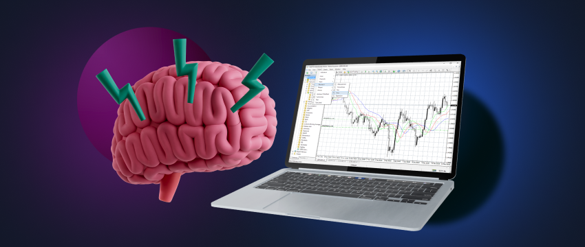

## Table of Contents

## What is a trading brain and why is it important for traders?

A trading brain refers to the mental and psychological skills that traders need to succeed in the financial markets. It includes things like being able to handle stress, making quick decisions, and keeping emotions in check. For traders, having a strong trading brain is important because the markets can be unpredictable and stressful. If a trader can't manage their emotions or make clear decisions under pressure, they might make bad choices and lose money.

Having a good trading brain also means being able to learn from past trades and adapt to new situations. This is important because the market is always changing, and what worked yesterday might not work today. Traders with a strong trading brain can analyze their past performance, figure out what they did wrong, and change their strategies to do better in the future. This ability to adapt and learn is key to long-term success in trading.

## How does a beginner start developing a trading brain?

To start developing a trading brain, a beginner should first focus on learning the basics of trading. This means understanding how markets work, what different financial instruments are, and how to read charts and indicators. It's important to start with small, manageable amounts of money and practice trading in a demo account before using real money. This helps beginners get used to the ups and downs of the market without risking too much.

Next, a beginner should work on managing their emotions. Trading can be stressful, and it's easy to feel scared or excited, which can lead to bad decisions. To build a strong trading brain, beginners should practice staying calm and sticking to their trading plan, even when things get tough. One way to do this is by keeping a trading journal where they write down their thoughts and feelings before and after each trade. This helps them see patterns in their emotions and learn how to control them better over time.

Finally, continuous learning and adaptation are key. A beginner should always be looking to improve their knowledge and skills. This can be done by reading [books](/wiki/algo-trading-books), taking courses, or joining trading communities where they can learn from more experienced traders. It's also important to review past trades regularly to see what worked and what didn't, and to adjust strategies accordingly. By consistently learning and adapting, a beginner can develop a strong trading brain that will serve them well in the long run.

## What are the key psychological traits of successful traders?

Successful traders often have a strong sense of discipline. This means they stick to their trading plan and don't let emotions like fear or greed make them do something different. They know that trading is a long-term game, so they don't get too excited about quick wins or too upset about losses. Instead, they focus on following their rules and making decisions based on careful thinking, not feelings.

Another important trait is patience. Successful traders understand that good opportunities don't come every day, so they wait for the right moment to make a move. They also know that it's okay to sit on the sidelines and not trade if the market isn't right. This patience helps them avoid making rushed decisions that could lead to mistakes.

Lastly, successful traders are good at managing risk. They know how much they can afford to lose on each trade and they set limits to protect themselves. They also learn from their mistakes and use that knowledge to improve their strategies. This ability to handle risk and learn from experience helps them stay in the game for the long haul.

## How can one improve their decision-making skills in trading?

To get better at making choices in trading, it's important to practice and learn from what you do. Start by making a clear plan that says when you will buy or sell things. Stick to this plan even when the market gets crazy. Over time, look back at your trades to see what worked and what didn't. This helps you understand why you made certain choices and how you can do better next time. Keep a journal where you write down your thoughts and feelings before and after each trade. This can show you patterns in your thinking and help you make smarter decisions in the future.

Another way to improve is by learning from others. Join groups or online communities where people talk about trading. Listening to what experienced traders say can give you new ideas and help you see things from different angles. It's also good to read books or take courses on trading. These can teach you new strategies and ways to think about the market. The more you know, the better you can decide what to do when the market changes. Remember, good decision-making in trading comes from both knowledge and experience, so keep learning and practicing.

## What role does emotional intelligence play in trading?

Emotional intelligence is really important for trading because it helps traders understand and manage their feelings. When you trade, it's easy to get scared or too excited, which can make you do things you shouldn't. Emotional intelligence lets you notice these feelings and stop them from messing up your plans. For example, if you feel scared because the market is going down, you might want to sell everything quickly. But if you have good emotional intelligence, you can stay calm and stick to your plan instead of making a hasty decision.

Another way emotional intelligence helps is by making it easier to learn from your mistakes. If you can look at your past trades without getting upset, you can see what went wrong and how to do better next time. This means you can keep improving and getting better at trading. Emotional intelligence also helps you understand other people's feelings, which can be useful if you're trading with others or talking about the market with friends. Overall, being good at handling emotions can make a big difference in how well you do as a trader.

## How can traders manage stress and maintain mental health?

Managing stress and keeping your mind healthy is really important for traders. One good way to do this is by taking breaks. Trading can be intense, so stepping away from the screen for a bit can help you feel less stressed. You could go for a walk, read a book, or just relax and do something you enjoy. It's also helpful to have a routine where you set specific times for trading and times for relaxing. This helps you balance your life and not let trading take over everything.

Another important thing is to talk to people. It can be really helpful to share your feelings and experiences with friends, family, or other traders. Joining a trading community can give you a place to talk about what's going on and get support from others who understand what you're going through. Also, don't forget to take care of your body. Eating well, getting enough sleep, and exercising can make a big difference in how you feel and handle stress. When your body is healthy, it's easier to keep your mind healthy too.

Lastly, it's okay to ask for help if you need it. If you're feeling really stressed or down, talking to a professional like a therapist can be a good idea. They can give you tools and advice to manage your feelings better. Remember, taking care of your mental health is just as important as making smart trading decisions. By looking after yourself, you'll be in a better position to handle the ups and downs of the market.

## What advanced techniques can be used to enhance focus and concentration during trading?

One advanced technique to enhance focus and concentration during trading is mindfulness meditation. This involves sitting quietly and focusing on your breath, noticing when your mind wanders, and gently bringing it back to your breathing. By practicing mindfulness regularly, you can train your brain to stay focused on the present moment, which is crucial when making quick decisions in trading. It also helps you manage stress better, so you can stay calm even when the market gets wild.

Another technique is the Pomodoro Technique, which breaks your trading time into short, focused intervals, usually 25 minutes long, followed by a 5-minute break. During these intervals, you concentrate solely on trading without any distractions. After four intervals, you take a longer break of about 15 to 30 minutes. This method helps keep your mind fresh and prevents burnout, making it easier to maintain concentration throughout the day. By using these techniques, you can improve your focus and make better trading decisions.

## How do experienced traders use cognitive biases to their advantage?

Experienced traders know that everyone has cognitive biases, which are ways our brains trick us into thinking or acting a certain way. Instead of letting these biases hurt them, smart traders use them to their advantage. One common bias is the fear of missing out (FOMO). Traders might see others making money and feel like they need to jump in quickly. But experienced traders use this to their advantage by waiting for the right moment. They know that when everyone else is rushing in because of FOMO, it might be a good time to sell, because the market could be overvalued.

Another bias is confirmation bias, where people look for information that supports what they already believe. Traders can use this by paying attention to what other traders are focusing on. If everyone is talking about how great a certain stock is, it might be a sign that the stock is overhyped and due for a drop. Experienced traders can then make trades that go against the crowd, selling when others are buying. By understanding and using cognitive biases, traders can spot opportunities that others might miss and make better decisions.

## What are some effective strategies for continuous learning and adaptation in trading?

One effective strategy for continuous learning and adaptation in trading is to keep a trading journal. In this journal, write down what you do each day, why you made certain choices, and what happened as a result. By looking back at your journal, you can see patterns in your trading and learn from your mistakes. This helps you figure out what works and what doesn't, so you can change your strategies to do better. Also, reading books and taking courses can give you new ideas and keep you up-to-date with the latest trading methods. Joining trading communities or forums is another great way to learn because you can talk to other traders and share tips and experiences.

Another important strategy is to always be ready to change your approach. The market is always moving and changing, so what worked last week might not work this week. Successful traders stay flexible and are willing to try new things. They might test out different strategies in a demo account to see what works best without risking real money. It's also helpful to use technology, like trading software and apps, to analyze data and find new opportunities. By staying curious and open to learning, traders can keep improving and adapting to whatever the market throws at them.

## How can traders develop and refine their trading strategies using psychological insights?

Traders can use psychological insights to develop and refine their trading strategies by understanding how their own minds work and how other people think. One way to do this is by learning about cognitive biases, like the fear of missing out (FOMO) or confirmation bias. By knowing these biases, traders can watch out for them in themselves and others. For example, if a trader notices that everyone is excited about a certain stock because of FOMO, they might decide to sell that stock instead of buying it. This can help them make smarter choices and avoid following the crowd into bad trades.

Another way traders can use psychological insights is by keeping a trading journal. Writing down their thoughts and feelings before and after each trade helps them see patterns in their behavior. If they notice they often make impulsive decisions when they're stressed, they can work on staying calm and sticking to their plan. They can also use their journal to learn from their mistakes and improve their strategies over time. By understanding their own psychology and how it affects their trading, traders can create better, more disciplined strategies that lead to more success in the long run.

## What are the latest research findings on neuroplasticity and its impact on trading performance?

Recent research on neuroplasticity shows that our brains can change and adapt over time, even into adulthood. This is good news for traders because it means they can train their brains to get better at trading. Studies have found that practicing mindfulness and meditation can help traders improve their focus and decision-making skills. When traders do these exercises regularly, they can change the way their brains work, making it easier to stay calm and make smart choices during stressful times in the market.

Another important finding is that learning new things and trying different trading strategies can also help improve a trader's performance. Neuroplasticity allows the brain to form new connections and pathways when it's exposed to new experiences. So, when traders keep learning and adapting, they're actually helping their brains grow and get better at trading. This means that by staying curious and open to new ideas, traders can use neuroplasticity to their advantage and become more successful over time.

## How can expert traders mentor others to develop their trading brain?

Expert traders can mentor others to develop their trading brain by sharing their own experiences and insights. They can talk about the ups and downs they've faced and explain how they learned to handle stress and emotions. By showing new traders how to keep a trading journal, expert traders can help them see their own patterns and learn from their mistakes. They can also teach beginners about cognitive biases and how to use them to make better trading decisions. This kind of guidance helps new traders understand their own minds better and make smarter choices.

Another way expert traders can help is by encouraging continuous learning and adaptation. They can suggest books, courses, and trading communities where beginners can learn more about the market. Expert traders can also show new traders how to use technology and software to analyze data and find new opportunities. By being a good role model and showing the importance of staying curious and flexible, expert traders can help others build a strong trading brain that will serve them well in the long run.

## References & Further Reading

[1]: Bergstra, J., Bardenet, R., Bengio, Y., & Kégl, B. (2011). ["Algorithms for Hyper-Parameter Optimization."](https://dl.acm.org/doi/10.5555/2986459.2986743) Advances in Neural Information Processing Systems 24.

[2]: ["Advances in Financial Machine Learning"](https://www.amazon.com/Advances-Financial-Machine-Learning-Marcos/dp/1119482089) by Marcos Lopez de Prado

[3]: ["Evidence-Based Technical Analysis: Applying the Scientific Method and Statistical Inference to Trading Signals"](https://www.amazon.com/Evidence-Based-Technical-Analysis-Scientific-Statistical/dp/0470008741) by David Aronson

[4]: ["Machine Learning for Algorithmic Trading"](https://github.com/stefan-jansen/machine-learning-for-trading) by Stefan Jansen

[5]: ["Quantitative Trading: How to Build Your Own Algorithmic Trading Business"](https://www.amazon.com/Quantitative-Trading-Build-Algorithmic-Business/dp/1119800064) by Ernest P. Chan