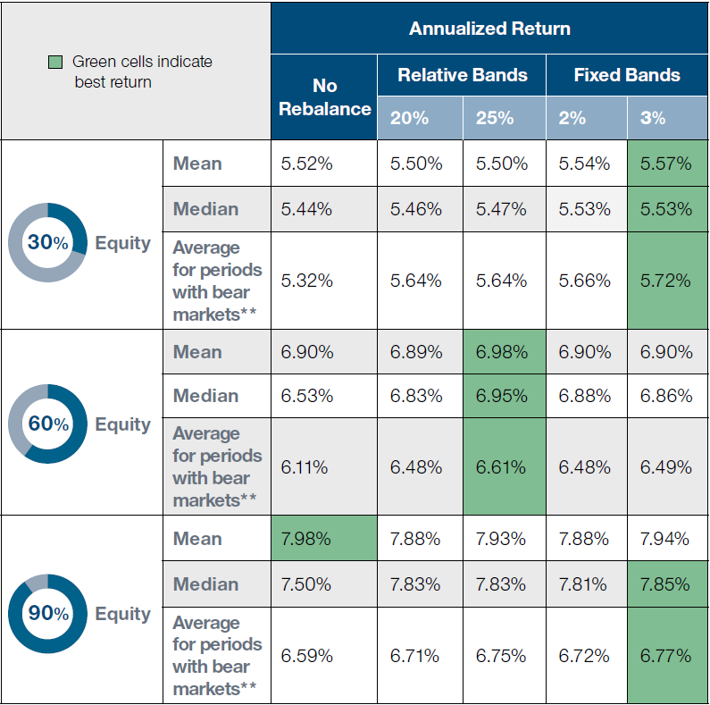

## Table of Contents

## What is an annual rebalancing strategy and why is it important?

An annual rebalancing strategy is when you check and adjust your investment portfolio once a year. This means you look at how much of your money is in different investments like stocks, bonds, or other assets, and you make changes to keep the mix the way you want it. For example, if you decided you want 60% of your money in stocks and 40% in bonds, but after a year, stocks did really well and now you have 70% in stocks, you would sell some stocks and buy bonds to get back to your 60/40 mix.

Rebalancing is important because it helps you stick to your investment plan. Over time, some investments can grow faster than others, which can change the balance of your portfolio. If you don't rebalance, you might end up with more risk than you're comfortable with, or you might miss out on opportunities to buy more of an investment when its price is low. By rebalancing once a year, you make sure your investments stay in line with your goals and risk tolerance, which can help you feel more secure and potentially improve your returns over the long run.

## How often should you rebalance your investment portfolio?

Rebalancing your investment portfolio once a year is a common choice for many people. This means you check your investments every year and make changes to keep them in line with your plan. Doing it once a year is easy to remember and doesn't take too much time. It also gives your investments enough time to grow and change, so you can see if you need to adjust them.

However, some people might choose to rebalance more often, like every six months or even every three months. This can be helpful if the market is changing a lot or if you want to keep a very close eye on your investments. But rebalancing too often can lead to more fees and taxes, and it might not always be worth the extra work. So, it's important to think about how often you want to check and adjust your portfolio based on your goals and how much time you want to spend on it.

## What are the key steps involved in developing an annual rebalancing strategy?

Developing an annual rebalancing strategy starts with setting your investment goals and figuring out how much risk you are willing to take. You need to decide on the mix of investments, like how much you want in stocks, bonds, or other types of assets. This mix should match your goals and how comfortable you are with risk. Once you have your plan, you need to check your portfolio at the same time every year to see if it still matches your plan. This could be on your birthday, the start of the new year, or any date that is easy for you to remember.

When you check your portfolio, look at how much each part of it has grown or shrunk. If the balance has changed a lot, you will need to make some trades to get back to your original plan. This might mean selling some investments that have done well and buying more of the ones that haven't grown as much. It's important to keep an eye on any fees or taxes that come with these trades. After you make your adjustments, keep track of what you did so you can learn from it and make better decisions next time. Remember, the goal is to keep your investments in line with your long-term plan.

## What types of assets should be considered in an annual rebalancing?

When you're thinking about what types of assets to include in your annual rebalancing, you should look at a mix of different kinds of investments. These can include stocks, which are shares in companies and can grow a lot but are also riskier; bonds, which are like loans to companies or governments and are usually safer but don't grow as much; and cash or cash equivalents, like savings accounts or money market funds, which are very safe but don't grow much at all. You might also want to consider other types of assets like real estate investment trusts (REITs) if you're interested in property, or commodities like gold if you want to protect against inflation.

When you rebalance your portfolio, you want to make sure each type of asset is still at the level you want it to be. If stocks have done really well and now make up a bigger part of your portfolio than you planned, you might sell some stocks and buy more bonds or cash to get back to your original mix. This helps keep your investments in line with your goals and how much risk you're okay with. Remember, the key is to keep your portfolio balanced so it matches what you want to achieve over the long term.

## How do you assess your current asset allocation?

To assess your current asset allocation, start by looking at all your investments and figuring out how much of your money is in each type of asset. This means checking how much you have in stocks, bonds, cash, and any other investments like real estate or commodities. You can do this by looking at your investment statements or using an online tool that shows you the breakdown of your portfolio. Once you have all the numbers, add them up to see the total value of your investments. Then, you can calculate the percentage of your portfolio that each type of asset represents. For example, if you have $60,000 in stocks out of a total portfolio of $100,000, then stocks make up 60% of your portfolio.

After you know the current percentages, compare them to the percentages you set in your original investment plan. This will show you if your portfolio has drifted away from your target allocation. If stocks have grown a lot and now make up a bigger part of your portfolio than you wanted, you might need to sell some stocks and buy more of the other assets to get back to your plan. It's important to do this check regularly, like once a year, to make sure your investments are still in line with your goals and how much risk you're comfortable with. By keeping your asset allocation in check, you can stay on track with your long-term investment strategy.

## What are the common methods for rebalancing a portfolio?

One common method for rebalancing a portfolio is the percentage-based approach. This means you look at the percentages of each type of investment in your portfolio and compare them to your target percentages. If they are different, you sell some of the investments that have grown too much and buy more of the ones that haven't grown enough. For example, if you want 60% in stocks and they now make up 70%, you would sell some stocks and buy more bonds or other assets to get back to 60%.

Another method is the time-based approach, where you rebalance your portfolio at set times, like once a year or every six months. This is easier to remember and helps you stick to a regular schedule. You check your investments at these times and make adjustments if needed. Both methods help keep your investments in line with your goals, but the time-based approach can be simpler because you don't have to keep checking your percentages all the time.

A third method is the threshold-based approach. With this method, you decide on a certain percentage change that you're okay with, like 5% or 10%. If any part of your portfolio goes beyond that threshold, you rebalance. For example, if your target for stocks is 60% and they go above 65% or below 55%, you would make changes. This method can help you react to big changes in the market faster than waiting for a set time, but it might mean you need to check your portfolio more often.

## How can tax implications affect your rebalancing strategy?

When you rebalance your portfolio, you might have to pay taxes on the money you make from selling investments. This can happen if you sell stocks or other assets that have gone up in value. If you do this inside a regular investment account, not a special tax-free account like an IRA or 401(k), you'll owe taxes on the profit. This can make rebalancing more expensive, so you need to think about how much tax you might have to pay when you decide to sell and buy investments.

One way to deal with taxes is to try to rebalance using new money you're adding to your portfolio. Instead of selling investments that have gone up, you can use new money to buy more of the investments that haven't grown as much. This way, you don't have to sell anything and you won't have to pay taxes on profits. Another way is to do your rebalancing inside tax-advantaged accounts like an IRA, where you won't have to worry about taxes when you make changes to your investments. By thinking about taxes, you can make your rebalancing strategy work better for you and keep more of your money growing over time.

## What role does risk tolerance play in annual rebalancing?

Risk tolerance is how much risk you are okay with when you invest your money. When you do your annual rebalancing, you need to think about your risk tolerance to make sure your investments still match how you feel about risk. If you are okay with a lot of risk, you might want more stocks in your portfolio because they can go up a lot but they can also go down a lot. If you don't like risk, you might want more bonds or cash because they are safer but they don't grow as much.

During your annual rebalancing, you check to see if the balance of your investments has changed. If stocks have done really well and now make up a bigger part of your portfolio, it might be riskier than you want. You would then sell some stocks and buy more bonds or cash to bring the risk back to a level you are comfortable with. By keeping an eye on your risk tolerance and adjusting your investments each year, you can make sure your portfolio stays in line with how you feel about risk and helps you reach your long-term goals.

## How can you use software tools to assist with rebalancing?

Software tools can make rebalancing your investments a lot easier. These tools can look at all your investments and show you how much of your money is in stocks, bonds, and other things. They can tell you if your investments have changed a lot and need to be adjusted to match your plan. Some tools can even do the rebalancing for you, selling and buying investments to get back to your target mix. This can save you time and help you make sure your investments stay in line with what you want.

Using software can also help you see what might happen if you make different choices. These tools can show you how your portfolio might grow or shrink over time, and how much risk you might be taking. This can help you decide if you need to change your plan or if you're happy with how things are going. By using these tools, you can keep your investments balanced without having to do all the math and planning yourself.

## What are the potential pitfalls of rebalancing and how can they be avoided?

Rebalancing your investments can be tricky. One big problem is that you might have to pay taxes if you sell investments that have gone up in value. This can make rebalancing more expensive than you planned. Another issue is that rebalancing too often can lead to more fees and costs, which can eat into your profits. If you're not careful, you might also make changes at the wrong time, like selling when the market is low, which can hurt your returns.

To avoid these pitfalls, think about using new money to rebalance instead of selling investments. This way, you won't have to pay taxes on profits. Also, try to rebalance on a set schedule, like once a year, so you don't do it too often and rack up more fees. It's important to stick to your plan and not let short-term market changes make you rebalance too soon. By being mindful of taxes, fees, and timing, you can make rebalancing work better for you and help your investments grow over time.

## How do market conditions influence the timing and approach to rebalancing?

Market conditions can change how often and how you rebalance your investments. If the market is going up and down a lot, you might want to check your portfolio more often to make sure it's still balanced the way you want. For example, if stocks are doing really well and now make up a bigger part of your portfolio than you planned, you might need to sell some stocks and buy more bonds to get back to your target mix. On the other hand, if the market is calm and not changing much, you might not need to rebalance as often because your investments are staying close to your plan.

The approach to rebalancing can also be affected by what's happening in the market. If the market is going down, you might be tempted to wait and see if it goes back up before you rebalance. But waiting too long can mean your portfolio gets out of balance and becomes riskier than you want. It's important to stick to your plan and rebalance even when the market is down, so you can buy more of the investments that are cheaper and sell the ones that are more expensive. By keeping an eye on market conditions and sticking to your rebalancing schedule, you can make sure your investments stay in line with your goals.

## What advanced techniques can be employed to optimize an annual rebalancing strategy?

One advanced technique for optimizing your annual rebalancing strategy is called tax-loss harvesting. This means you look for investments that have lost value and sell them to offset the taxes you owe on the investments that have made money. By doing this, you can lower your tax bill and keep more of your money growing. Another technique is using a banding approach, where you set a range, like plus or minus 5%, around your target asset allocation. If any part of your portfolio moves outside this range, you rebalance. This way, you only make changes when they are really needed, which can help you avoid unnecessary trading and save on fees.

Another advanced method is to use a cash flow rebalancing approach. Instead of selling investments to rebalance, you use new money you add to your portfolio to buy more of the investments that are underweight. This can help you avoid taxes and fees from selling and buying. You can also consider using asset location strategies, where you put different types of investments in different types of accounts based on their tax treatment. For example, you might keep bonds in a tax-deferred account like an IRA, where the interest they earn won't be taxed right away, and keep stocks in a taxable account where you can benefit from lower long-term capital gains rates. By using these advanced techniques, you can make your annual rebalancing more effective and keep more of your money working for you over time.

## References & Further Reading

[1]: Han, Y., Noe, T. H., & Rebello, M. J. (2012). ["Rebalancing Under Portfolio Autocorrelation."](https://papers.ssrn.com/sol3/papers.cfm?abstract_id=2024769) The Review of Financial Studies, 27(5), 1516-1557.

[2]: Michaud, R. O., & Michaud, R. (2008). ["Efficient Asset Management: A Practical Guide to Stock Portfolio Optimization and Asset Allocation."](https://academic.oup.com/book/52209) Oxford University Press.

[3]: Sharpe, W. F. (1994). ["The Sharpe Ratio."](https://web.stanford.edu/~wfsharpe/art/sr/SR.htm) The Journal of Portfolio Management, 21(1), 49-58.

[4]: Pástor, L., & Stambaugh, R. F. (2002). ["Investing in Equity Mutual Funds."](https://www.sciencedirect.com/science/article/pii/S0304405X0200065X) Journal of Financial Economics, 63(3), 351-380.

[5]: Chan, E. P. (2009). ["Quantitative Trading: How to Build Your Own Algorithmic Trading Business."](https://github.com/ftvision/quant_trading_echan_book) Wiley Trading.

[6]: Lopez de Prado, M. (2018). ["Advances in Financial Machine Learning."](https://www.amazon.com/Advances-Financial-Machine-Learning-Marcos/dp/1119482089) Wiley.

[7]: Carroll, R. J., & Ruppert, D. (1988). ["Transformation and Weighting in Regression."](https://www.taylorfrancis.com/books/mono/10.1201/9780203735268/transformation-weighting-regression-david-ruppert-raymond-carroll) Chapman and Hall/CRC.

[8]: Vanguard Research. (2019). ["Best Practices in Portfolio Rebalancing."](https://corporate.vanguard.com/content/corporatesite/us/en/corp/what-we-think/research-library.html)