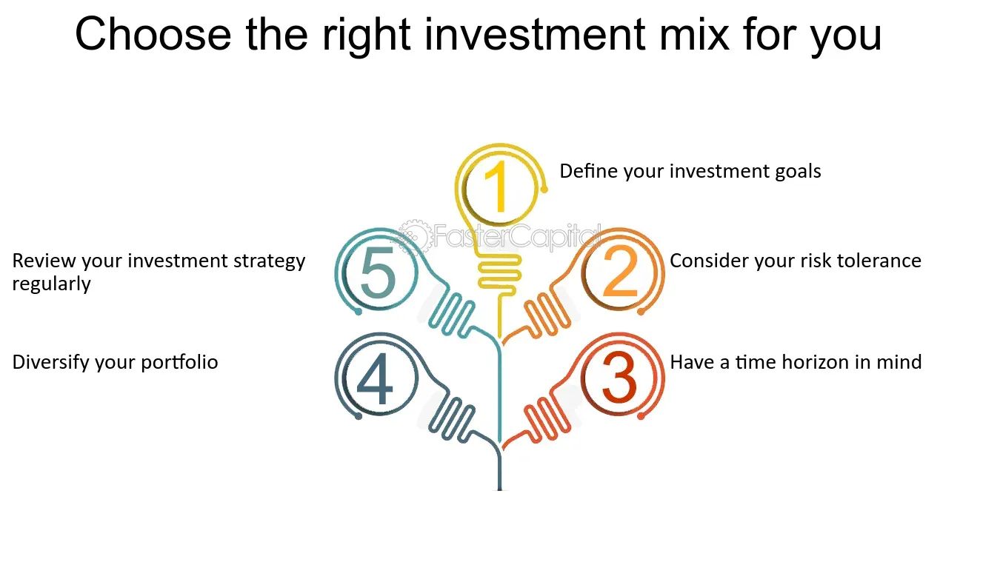

## Table of Contents

## What is an investment strategy and why is it important?

An investment strategy is a plan that helps people decide where to put their money to make it grow over time. This plan can include things like buying stocks, bonds, real estate, or even saving money in a bank account. The goal is to choose investments that will increase in value or provide regular income, depending on what the person wants to achieve. Having a strategy is important because it helps people stay focused on their long-term goals and avoid making quick decisions based on short-term market changes.

Having a clear investment strategy is important because it helps manage risk. By spreading money across different types of investments, people can protect themselves if one investment does not perform well. This is called diversification. A good strategy also takes into account how much risk a person is willing to take and how long they plan to keep their money invested. This way, they can choose the right mix of investments that match their comfort level and financial goals.

## How can beginners start developing their first investment strategy?

Beginners can start developing their first investment strategy by first figuring out what they want to achieve with their money. This could be saving for a house, retirement, or just growing their wealth over time. Once they know their goals, they should think about how long they can leave their money invested. If they need the money soon, they might choose safer investments. If they can wait a long time, they might be okay with riskier options that could grow more.

Next, beginners should learn about different types of investments like stocks, bonds, and mutual funds. They can start by investing small amounts in a few different things to spread out the risk. This is called diversification. It's also a good idea to keep learning and maybe talk to a financial advisor to get some help. Over time, they can adjust their strategy as they learn more and as their goals change.

## What are the key components of an effective investment strategy?

An effective investment strategy starts with clear goals. You need to know what you want to achieve, like saving for a house, retirement, or just growing your money. Once you know your goals, you can decide how long you can leave your money invested. If you need the money soon, you might choose safer investments. If you can wait a long time, you might be okay with riskier options that could grow more.

Another key part of an effective investment strategy is diversification. This means spreading your money across different types of investments, like stocks, bonds, and real estate. This way, if one investment does not do well, you won't lose all your money. It's also important to think about how much risk you are comfortable with. Some people are okay with big risks for the chance of big rewards, while others prefer to play it safe. Your investment strategy should match your comfort level with risk.

Lastly, an effective investment strategy needs to be flexible. As you learn more and as your life changes, you might need to adjust your strategy. This could mean changing the types of investments you have or how much risk you are willing to take. It's also a good idea to keep learning about investing and maybe talk to a financial advisor for help. By regularly reviewing and adjusting your strategy, you can stay on track to meet your financial goals.

## How do risk tolerance and investment goals influence strategy development?

Risk tolerance and investment goals are like the two main pillars that hold up your investment strategy. Your risk tolerance is how much you're okay with losing money in the short term for the chance to make more money in the long term. If you're scared of losing money, you'll want to stick to safer investments like savings accounts or bonds. But if you're okay with some risk, you might choose stocks or real estate, which can go up and down a lot but can also grow a lot over time. Knowing your risk tolerance helps you pick investments that won't keep you up at night worrying about your money.

Your investment goals are what you want to achieve with your money, like buying a house, saving for retirement, or just growing your wealth. These goals help you decide how long you can leave your money invested. If you need the money soon, you'll want safer investments that you can count on. But if you can wait a long time, you might go for riskier investments that could grow more. Your goals and risk tolerance work together to shape your investment strategy, making sure it fits what you want and how much risk you can handle.

## What are the differences between short-term and long-term investment strategies?

Short-term investment strategies focus on making money quickly, usually within a few months or a year. These strategies often involve more risk because you're trying to take advantage of quick changes in the market. People might use short-term strategies to save up for something they want soon, like a vacation or a new car. They might invest in things like day trading stocks or short-term bonds. But because the market can be unpredictable, short-term investments can be riskier and might not always pay off.

Long-term investment strategies are about growing your money over many years, often for big goals like retirement or buying a house. These strategies usually involve less risk because you can ride out the ups and downs of the market over time. Long-term investors might choose things like stocks, real estate, or retirement accounts. The idea is to let your investments grow slowly but steadily. Because you're not trying to make quick money, long-term strategies can be more stable and help you reach your big financial goals without as much worry about short-term market changes.

## How can diversification be used to enhance an investment strategy?

Diversification means spreading your money across different types of investments. It's like not putting all your eggs in one basket. If you only invest in one thing and it goes down, you could lose a lot of money. But if you spread your money out, some investments might go down, but others might go up. This can help balance out the risk and make your overall investment strategy stronger.

By using diversification, you can protect your money from big losses. For example, if you invest in both stocks and bonds, when the stock market goes down, your bonds might still be doing okay. This way, you don't lose as much money all at once. Diversification also lets you take advantage of different opportunities. Some investments might grow faster than others, and by having a mix, you can benefit from the ones that are doing well while still being safe overall.

## What role do market research and analysis play in shaping an investment strategy?

Market research and analysis are like your roadmap when you're building an investment strategy. They help you understand what's going on in the economy and the markets. By looking at things like stock prices, interest rates, and economic reports, you can figure out which investments might be good choices right now. For example, if you see that a certain industry is growing fast, you might want to invest in companies in that industry. Market research helps you make smarter choices by giving you the information you need to pick the right investments.

Analysis is also important because it helps you understand the risks and rewards of different investments. When you analyze data, you can see patterns and trends that might not be obvious at first. This can help you decide if an investment is worth the risk. For example, if you see that a company's stock has been going up steadily, you might feel more confident about investing in it. By using market research and analysis, you can build a strategy that's based on real information, which can help you reach your financial goals more effectively.

## How should one adjust their investment strategy in response to economic changes?

When the economy changes, you need to adjust your investment strategy to keep your money safe and growing. If the economy is doing well, you might want to invest more in stocks because they can grow a lot during good times. But if the economy starts to slow down or there's a recession, you might want to move some of your money into safer investments like bonds or savings accounts. These changes help you protect your money from big losses and take advantage of new opportunities that come up.

It's also important to keep an eye on things like interest rates and inflation. If interest rates go up, borrowing money gets more expensive, which can slow down the economy. This might be a good time to move some of your money into investments that do well when interest rates are high, like certain types of bonds. On the other hand, if inflation is high, you might want to invest in things like real estate or commodities that can keep up with rising prices. By staying informed and adjusting your strategy, you can make sure your investments are working hard for you no matter what the economy is doing.

## What advanced techniques can be used to optimize an investment strategy?

One advanced technique to optimize your investment strategy is using something called asset allocation. This means deciding how much of your money to put into different types of investments like stocks, bonds, and real estate. By choosing the right mix, you can balance risk and reward. For example, if you're younger and can handle more risk, you might put more money into stocks. But if you're closer to retirement, you might want more bonds to keep your money safe. Another technique is rebalancing, which means checking your investments regularly and making changes to keep your asset allocation the way you want it. If one type of investment grows a lot, you might sell some of it and buy more of another type to keep things balanced.

Another advanced technique is using technical analysis. This involves looking at charts and patterns to predict how investments will move in the future. It can help you decide when to buy or sell based on what the market is doing right now. For example, if you see a stock's price making a certain pattern that usually means it's going to go up, you might buy it. Another technique is fundamental analysis, which means looking at a company's financial health to decide if it's a good investment. You look at things like profits, debts, and how the company is growing. By combining these techniques, you can make smarter choices and optimize your investment strategy to meet your goals.

## How do tax considerations affect investment strategy decisions?

Tax considerations are really important when you're making your investment strategy. Different investments get taxed in different ways. For example, if you invest in stocks, you might have to pay capital gains tax when you sell them for a profit. But if you invest in a retirement account like an IRA or a 401(k), you might get a tax break now or when you take the money out later. Knowing how taxes will affect your investments can help you pick the best ones for your goals and save money on taxes.

It's also good to think about how long you plan to keep your money invested when you're thinking about taxes. If you hold onto an investment for more than a year, you might pay a lower capital gains tax rate than if you sell it sooner. This can make a big difference in how much money you keep. By planning your investments with taxes in mind, you can make smarter choices that help your money grow and keep more of it for yourself.

## What are the common pitfalls to avoid when developing an investment strategy?

One common pitfall when developing an investment strategy is not having clear goals. If you don't know what you want to achieve, like saving for a house or retirement, it's hard to pick the right investments. Another mistake is not understanding your risk tolerance. If you invest in things that are too risky for you, you might panic and sell when the market goes down, which can hurt your returns. It's also important to avoid chasing after hot trends or trying to time the market. These strategies often lead to buying high and selling low, which is the opposite of what you want to do.

Another pitfall is not diversifying your investments. If you put all your money into one thing and it goes down, you could lose a lot. Spreading your money across different types of investments can help protect you from big losses. Lastly, many people forget to review and adjust their strategy over time. Your life and goals can change, and so can the market. If you don't update your strategy, it might not work as well as it could. By avoiding these common mistakes, you can build a better investment strategy that helps you reach your financial goals.

## How can performance metrics and benchmarks be used to refine an investment strategy?

Performance metrics and benchmarks are like report cards for your investments. They help you see how well your investments are doing compared to what you hoped for or compared to other investments. For example, if you're investing in stocks, you might compare your returns to a stock market index like the S&P 500. If your investments are doing better than the index, that's great. But if they're doing worse, it might be time to make some changes. By looking at these metrics, you can figure out what's working and what's not, and adjust your strategy to do better.

Benchmarks also help you set realistic goals for your investments. If you know that the average return for a certain type of investment is 5%, you can use that as a guide to see if your investments are on track. If your investments are consistently falling short of the benchmark, you might need to rethink your strategy. Maybe you need to diversify more or take on a bit more risk. By using performance metrics and benchmarks, you can keep your investment strategy on track and make smart changes to help your money grow.

## References & Further Reading

[1]: Bergstra, J., Bardenet, R., Bengio, Y., & Kégl, B. (2011). ["Algorithms for Hyper-Parameter Optimization."](https://dl.acm.org/doi/10.5555/2986459.2986743) Advances in Neural Information Processing Systems 24.

[2]: ["Advances in Financial Machine Learning"](https://www.amazon.com/Advances-Financial-Machine-Learning-Marcos/dp/1119482089) by Marcos Lopez de Prado

[3]: ["Evidence-Based Technical Analysis: Applying the Scientific Method and Statistical Inference to Trading Signals"](https://www.amazon.com/Evidence-Based-Technical-Analysis-Scientific-Statistical/dp/0470008741) by David Aronson

[4]: ["Machine Learning for Algorithmic Trading"](https://github.com/stefan-jansen/machine-learning-for-trading) by Stefan Jansen

[5]: ["Quantitative Trading: How to Build Your Own Algorithmic Trading Business"](https://www.amazon.com/Quantitative-Trading-Build-Algorithmic-Business/dp/1119800064) by Ernest P. Chan