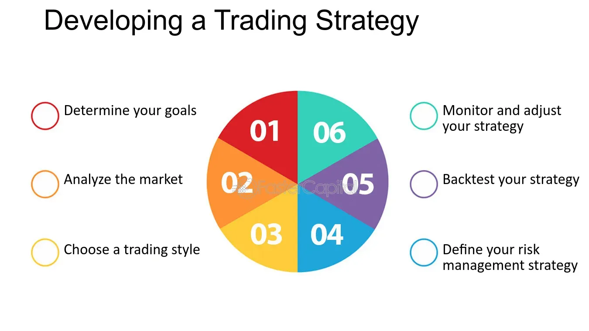

## Table of Contents

## What is a trading strategy and why is it important for beginners?

A trading strategy is a set of rules and guidelines that a trader follows when buying and selling financial instruments like stocks, currencies, or commodities. It helps traders decide when to enter and exit trades, how much money to invest, and how to manage risks. Think of it as a game plan that keeps you organized and focused, rather than making random decisions based on emotions or gut feelings.

For beginners, having a trading strategy is super important because it provides a clear roadmap to follow. Without a strategy, new traders might feel overwhelmed and make costly mistakes. A good strategy helps beginners learn the ropes, understand the market better, and build confidence. It also teaches them how to manage their money wisely and avoid big losses, which is crucial for long-term success in trading.

## How can a beginner start developing a simple trading strategy?

To start developing a simple trading strategy, a beginner should first decide what they want to trade, like stocks, forex, or cryptocurrencies. Next, they need to set clear goals. Are they looking to make quick profits or are they in it for the long haul? Once they know their goals, they can start choosing simple indicators to help them make decisions. For example, they might use moving averages to spot trends or the Relative Strength Index (RSI) to see if a stock is overbought or oversold.

After [picking](/wiki/asset-class-picking) their indicators, beginners should practice their strategy using a demo account. This lets them trade with fake money and see how their strategy works without risking real cash. It's a safe way to learn and tweak their plan. As they practice, they should keep a trading journal to write down what works and what doesn't. Over time, they can refine their strategy based on what they learn from their journal and their demo trades. This step-by-step approach helps beginners build a solid trading strategy that suits their goals and comfort level.

## What are the key components of a trading strategy?

A trading strategy has several key components that help traders make smart decisions. One important part is the entry and [exit](/wiki/exit-strategy) rules. These rules tell you when to buy and when to sell. For example, you might decide to buy a stock when its price goes above a certain level and sell it when it drops below another level. Another key component is risk management. This means deciding how much money you're willing to lose on each trade. You might set a stop-loss order to automatically sell a stock if it falls too much, so you don't lose more than you can afford.

Another important piece is the choice of indicators. These are tools that help you understand what's happening in the market. For example, moving averages can show you if a stock's price is trending up or down, and the RSI can tell you if a stock is overbought or oversold. Lastly, a trading strategy should include a plan for money management. This means deciding how much of your total money to put into each trade. It's important not to bet too much on one trade, so you have money left to keep trading if things don't go your way.

## How do you identify your trading goals and risk tolerance?

To identify your trading goals, start by thinking about what you want to achieve with your trading. Are you looking to make quick profits, or are you more interested in growing your money over time? Maybe you want to save for something specific, like a new car or a vacation. Once you know what you want, set clear goals that you can measure. For example, you might aim to make a certain amount of money each month or to grow your account by a specific percentage over a year. Writing down your goals helps you stay focused and motivated.

Next, figuring out your risk tolerance is all about understanding how much money you're comfortable losing. Everyone is different – some people can handle bigger risks, while others prefer to play it safe. To find your risk tolerance, think about how you'd feel if you lost money on a trade. Would it keep you up at night, or could you shrug it off and move on? A good way to test your risk tolerance is to start with small trades and see how you react. As you gain experience, you can slowly increase your risk if you feel comfortable. Remember, the key is to find a balance that lets you sleep well at night while still giving you a chance to reach your trading goals.

## What are the most common types of trading strategies for intermediate traders?

Intermediate traders often use a few common types of trading strategies to make money. One popular strategy is swing trading. Swing traders hold onto their trades for a few days to a few weeks, trying to catch the "swings" in a stock's price. They use technical analysis to find good entry and exit points, looking at charts and indicators to see when a stock might be about to move up or down. Another common strategy is [day trading](/wiki/day-trading-spy). Day traders buy and sell stocks within the same day, trying to make quick profits from small price changes. They need to be fast and pay close attention to the market all day long.

Another strategy that intermediate traders might use is [trend following](/wiki/trend-following). Trend followers try to spot when a stock's price is moving in a clear direction, either up or down, and then jump on that trend to make money. They use tools like moving averages to help them see the trend and decide when to buy or sell. Lastly, some intermediate traders use a strategy called [scalping](/wiki/gamma-scalping). Scalpers make lots of small trades throughout the day, trying to make tiny profits on each one. It's a fast-paced way of trading that requires quick thinking and a good understanding of the market.

## How can technical analysis be used to enhance a trading strategy?

Technical analysis can really help improve a trading strategy by giving traders useful information about what the market might do next. It uses charts and indicators to look at past price movements and patterns. For example, if a trader sees that a stock's price is going up and it keeps bouncing off a certain moving average, they might decide to buy the stock because it looks like it's in an uptrend. Or, if they see that the Relative Strength Index (RSI) is over 70, they might think the stock is overbought and decide to sell it before the price drops. By using technical analysis, traders can find better times to buy and sell, making their strategy more effective.

Another way technical analysis helps is by giving traders a way to manage their risks better. For instance, if a trader uses support and resistance levels, they can set stop-loss orders just below a support level to limit their losses if the price falls. They can also use indicators like the Average True Range (ATR) to figure out how much the price might move, which helps them set their profit targets and stop-losses more accurately. By combining these technical tools with their trading strategy, intermediate traders can make smarter decisions and improve their chances of making money in the market.

## What role does fundamental analysis play in developing a trading strategy?

Fundamental analysis is like looking under the hood of a company to see if it's a good investment. It involves studying things like a company's earnings, its debts, how much it's growing, and even the overall economy. By understanding these details, traders can figure out if a stock is priced right or if it's a bargain. For example, if a company's earnings are growing fast and it's not too expensive, a trader might decide to buy its stock because it looks like a good deal. This kind of analysis helps traders make smarter choices about which stocks to buy and when to buy them.

Using [fundamental analysis](/wiki/fundamental-analysis) can also help traders hold onto their investments for the long term. If a trader knows a company is strong and likely to do well in the future, they might be more willing to keep the stock even if the price goes up and down a bit. This can be really helpful for traders who want to build wealth over time rather than just making quick profits. By combining fundamental analysis with their trading strategy, traders can have a more complete picture of the market and make better decisions about their investments.

## How can an advanced trader use backtesting to refine their trading strategy?

Backtesting is a way for advanced traders to check if their trading strategy works well. They do this by using old market data to see how their strategy would have done in the past. It's like playing a game where you can see what would have happened if you made certain moves. By running their strategy through different time periods and market conditions, traders can find out if it's good at making money or if it needs some changes. This helps them feel more confident about using their strategy in real trading.

After [backtesting](/wiki/backtesting), advanced traders can make their strategy better by looking at the results. If the strategy made money in the past, they might keep it the same or make small tweaks. But if it lost money, they can figure out why and fix it. Maybe they need to change when they buy or sell, or maybe they need to use different indicators. By testing and adjusting their strategy over and over, traders can make it stronger and more likely to work well in the future.

## What are the psychological aspects to consider when developing and following a trading strategy?

When developing and following a trading strategy, it's important to think about the psychological side of trading. One big thing is managing your emotions. Trading can be stressful, and it's easy to get scared or excited, which might make you do things you shouldn't. For example, if you see your stock going down, you might panic and sell it too soon. Or if you're doing well, you might get too confident and take bigger risks. To handle this, it helps to stick to your plan and not let your feelings take over. Keeping a cool head and following your strategy, even when things get tough, is key to doing well in trading.

Another psychological aspect is dealing with losses. Every trader loses money sometimes, and it's important to accept this and move on. If you get too upset about losing, it can mess up your next trades. That's why having a good risk management plan is so important. It helps you know how much you can lose and still be okay. Also, keeping a trading journal can help. Writing down what you did and how you felt can show you where you might be letting your emotions get in the way. By understanding your feelings and working on them, you can become a better trader and stick to your strategy more easily.

## How can an expert trader incorporate algorithmic trading into their strategy?

An expert trader can use [algorithmic trading](/wiki/algorithmic-trading) to make their strategy better and easier to follow. Algorithmic trading means using computer programs to buy and sell stocks based on a set of rules. The trader can put their strategy into the computer, and the program will do the trading for them. This is really helpful because it can find good times to trade much faster than a person can. It also takes away the emotions that can mess up a trader's decisions. By letting the computer do the work, the trader can focus on making their strategy even better and watching how it does in the market.

To start using algorithmic trading, an expert trader needs to turn their trading rules into code that a computer can understand. They might use things like moving averages or other indicators to tell the computer when to buy or sell. After they have the code ready, they can test it with old market data to see how it would have worked in the past. This is called backtesting. If the backtesting shows good results, the trader can start using the algorithm in real trading. They should keep an eye on how it's doing and make changes if needed. This way, algorithmic trading can help the trader make smarter and quicker decisions, and possibly make more money.

## What are the latest trends and technologies impacting trading strategy development?

The latest trends and technologies in trading strategy development are all about using computers and data to make better decisions. One big trend is [machine learning](/wiki/machine-learning). This is when computers learn from past data to predict what might happen next in the market. Traders can use machine learning to find patterns that they might not see on their own. Another trend is using big data. This means looking at huge amounts of information from different places, like social media, news, and financial reports, to get a better picture of the market. By using big data, traders can make more informed choices about when to buy and sell.

Another important technology is cloud computing. This lets traders use powerful computers over the internet to run their trading strategies without needing expensive equipment at home. Cloud computing makes it easier to test and run strategies quickly. Also, there's a growing use of mobile trading apps. These apps let traders keep an eye on the market and make trades from their phones, which is really handy for staying on top of things no matter where they are. Together, these trends and technologies are helping traders develop smarter and more effective strategies.

## How can an expert continuously evaluate and adapt their trading strategy to market changes?

An expert trader needs to keep an eye on how well their trading strategy is doing and change it when the market changes. They can do this by always checking their trades and seeing if they are making money or losing it. If the market starts acting differently, like if prices start moving in new ways or if there are big news events, the trader should look at their strategy again. They might need to change their rules for buying and selling or use different tools to understand the market better. By keeping a close watch on their strategy and the market, the expert can make sure their plan stays good and keeps working well.

Another way to keep a trading strategy up to date is by using backtesting and forward testing. Backtesting means using old market data to see how the strategy would have done in the past. If the strategy didn't work well before, the trader can fix it and try again. Forward testing is when the trader uses the strategy in real time but with a small amount of money to see how it does. This helps them see if the changes they made are working without risking too much. By doing these tests often and making small changes when needed, an expert trader can keep their strategy strong and ready for whatever the market does next.

## What is the importance of investment planning?

Investment planning serves as a crucial guide for individuals and institutions aiming to achieve their financial goals. In financial markets, a fundamental aspect of effective investment planning is understanding one’s risk tolerance, which involves gauging the capacity and willingness to endure financial loss. Accurately assessing risk tolerance enables investors to align their portfolios with their comfort levels and investment objectives. 

Successful investment planning further encompasses diversification, which involves spreading investments across various asset classes to mitigate risk. Diversification reduces the impact of any single asset’s poor performance on the overall portfolio, thus enhancing stability. An appropriately diversified portfolio may include different asset classes such as equities, bonds, real estate, or commodities. The formula for calculating the expected return of a diversified portfolio, $E(R_p)$, can be expressed as:

$$

E(R_p) = \sum_{i=1}^{n} w_i \cdot E(R_i) 
$$

where $w_i$ represents the weight of each asset in the portfolio, and $E(R_i)$ is the expected return of each asset.

Asset allocation, often considered the cornerstone of a solid investment plan, involves distributing investments across various categories to align with an investor's risk tolerance, time horizon, and financial goals. This process helps manage risk and optimize returns by balancing growth-oriented assets with income-generating or protective assets. The strategic allocation of assets must take into account market trends and economic conditions to maximize returns while minimizing risk.

Understanding market trends is another integral component of investment planning. By analyzing economic indicators, geopolitical factors, and historical data, investors can make informed predictions about future market movements. This foresight allows them to adjust their portfolios proactively, positioning them advantageously as market conditions evolve.

To construct a robust investment plan supporting trading success, investors should establish clear financial objectives, evaluate their risk tolerance, and regularly review and adjust their strategies in response to changing market conditions. Utilizing tools such as financial planning software or collaborating with financial advisors can provide additional insights and enhance decision-making processes. In sum, the integration of risk assessment, diversification, asset allocation, and market trend analysis forms the backbone of strategic investment planning, paving the way for achieving both short-term and long-term financial aspirations.

## What is the relationship between Risk Management and Technical Analysis?

Effective risk management and technical analysis are pivotal for trading success in financial markets. Risk management encompasses strategies such as diversification and dynamic portfolio allocation, which are essential to mitigate losses and stabilize returns.

Diversification involves spreading investments across various asset classes to reduce exposure to any single asset or risk. This strategy can protect portfolios from significant losses that might occur if one investment performs poorly. Dynamic portfolio allocation further refines this by adjusting asset allocation in response to changing market conditions and individual financial goals. For example, employing a mix of equities, bonds, and commodities can balance risk and return.

Technical analysis, on the other hand, helps traders forecast future price movements by evaluating historical price data and identifying market patterns. This analysis is underpinned by the use of technical indicators and chart patterns.

**Moving Averages**: These are employed to smooth out price data by creating a constantly updated average price. There are two common types: the simple moving average (SMA) and the exponential moving average (EMA). While the SMA is the arithmetic mean of a given set of prices over a specific period, the EMA gives more weight to recent prices and reacts faster to price changes. 

$$
\text{SMA} = \frac{P_1 + P_2 + \cdots + P_n}{n}
$$

$$
\text{EMA} = \left( \frac{P_t - \text{EMA}_{t-1}}{\text{N} + 1} \right) + \text{EMA}_{t-1}
$$

**Relative Strength Index (RSI)**: RSI is a momentum oscillator that measures the speed and change of price movements on a scale of 0 to 100. It is used to identify overbought or oversold conditions. An RSI value above 70 suggests that an asset might be overbought, while a value below 30 indicates it might be oversold.

$$
\text{RSI} = 100 - \left( \frac{100}{1 + \frac{\text{Average Gain}}{\text{Average Loss}}} \right)
$$

**Candlestick Patterns**: These patterns help traders interpret price movements and potential future price directions. For example, patterns like the "hammer" or "shooting star" can signal potential reversals in price trends.

The integration of risk management with technical analysis can significantly enhance trading strategies. By employing technical analysis tools, traders can better identify entry and exit points, improving the timing of trades. When combined with effective risk management techniques such as stop-loss orders, which automatically sell a security when it reaches a certain price, traders can protect against unfavorable market moves.

Overall, understanding and applying risk management along with technical analysis can enhance a trader's ability to make informed decisions, manage risk effectively, and capitalize on market opportunities. Continuous education and adaptation to market conditions are necessary to refine these strategies and achieve long-term financial success.

## References & Further Reading

[1]: Bergstra, J., Bardenet, R., Bengio, Y., & Kégl, B. (2011). ["Algorithms for Hyper-Parameter Optimization."](https://papers.nips.cc/paper/4443-algorithms-for-hyper-parameter-optimization) Advances in Neural Information Processing Systems 24.

[2]: ["Advances in Financial Machine Learning"](https://www.amazon.com/Advances-Financial-Machine-Learning-Marcos/dp/1119482089) by Marcos Lopez de Prado.

[3]: ["Evidence-Based Technical Analysis: Applying the Scientific Method and Statistical Inference to Trading Signals"](https://www.amazon.com/Evidence-Based-Technical-Analysis-Scientific-Statistical/dp/0470008741) by David Aronson.

[4]: ["Machine Learning for Algorithmic Trading"](https://github.com/PacktPublishing/Machine-Learning-for-Algorithmic-Trading-Second-Edition) by Stefan Jansen.

[5]: ["Quantitative Trading: How to Build Your Own Algorithmic Trading Business"](https://books.google.com/books/about/Quantitative_Trading.html?id=j70yEAAAQBAJ) by Ernest P. Chan.