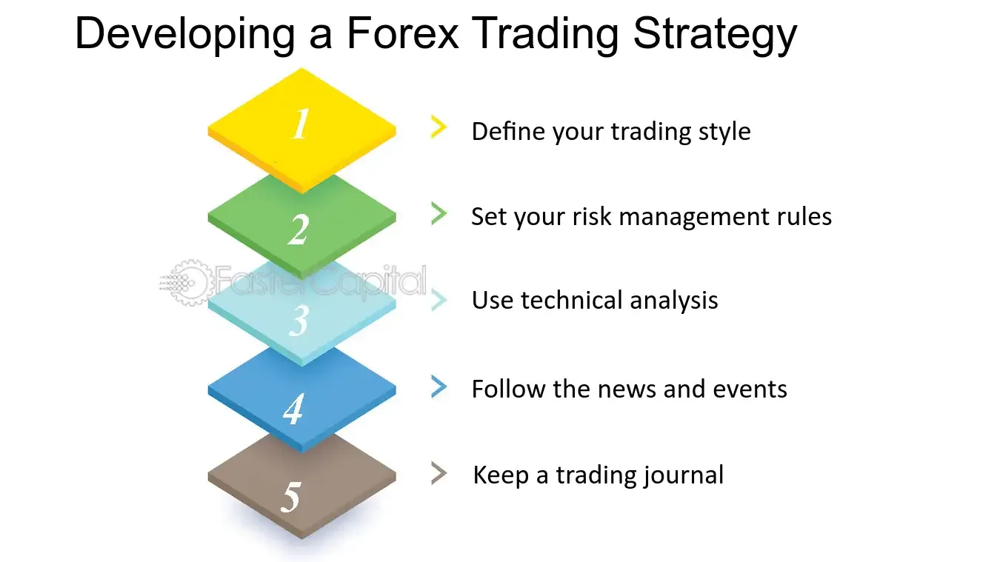

## Table of Contents

## What is a Forex trading strategy and why is it important for beginners?

A Forex trading strategy is a set of rules and guidelines that a trader follows when buying and selling currencies in the foreign exchange market. This strategy helps traders decide when to enter and exit trades, how much money to risk on each trade, and which currency pairs to focus on. Think of it like a roadmap that helps you navigate the complex world of Forex trading, making it easier to make decisions and stick to a plan.

Having a Forex trading strategy is especially important for beginners because it provides structure and discipline in a market that can be overwhelming and unpredictable. Without a strategy, new traders might make impulsive decisions based on emotions like fear or greed, which can lead to big losses. A good strategy helps beginners manage their risks better, learn from their trades, and build confidence as they gain more experience in the Forex market.

## How do you choose the right Forex trading strategy based on your risk tolerance and financial goals?

Choosing the right Forex trading strategy starts with understanding your risk tolerance. Risk tolerance is how much money you're okay with losing. If you don't like taking big risks, you might want a strategy that focuses on small, steady gains. This could mean using a strategy like scalping, where you make many small trades to slowly build up profits. On the other hand, if you're okay with bigger risks for the chance of bigger rewards, you might go for a strategy like swing trading, where you hold onto trades for longer periods to catch bigger price movements.

Your financial goals also play a big role in [picking](/wiki/asset-class-picking) a strategy. If your goal is to make a little extra money each month, you might choose a conservative strategy that aims for small, consistent profits. But if you're looking to grow your money quickly, you might be more willing to try a high-risk, high-reward strategy. It's important to match your strategy to your goals so you can stay motivated and stick with your plan over time. Remember, there's no one-size-fits-all strategy; it's all about finding what works best for you.

## What are the basic components of a Forex trading strategy?

The first basic component of a Forex trading strategy is entry and [exit](/wiki/exit-strategy) rules. These rules tell you when to buy and sell a currency pair. For example, you might decide to enter a trade when a currency's price reaches a certain level, and exit when it hits another level or after a set amount of time. Having clear entry and exit rules helps you make decisions based on your plan, not on emotions.

The second component is risk management. This is about how much money you're willing to risk on each trade. You might use a stop-loss order to limit your losses if the trade goes against you. Risk management also involves deciding how much of your total money to use for trading, often called position sizing. Good risk management keeps you from losing too much money on any single trade.

The third component is the timeframe and trading style. This means deciding if you want to trade over short periods, like a few minutes or hours, or longer periods, like days or weeks. Your choice affects which strategy you use. For example, [scalping](/wiki/gamma-scalping) is for short timeframes, while swing trading is for longer ones. Your trading style should match your lifestyle and how much time you can spend watching the market.

## How can you use technical analysis in developing your Forex trading strategy?

Technical analysis is a way to look at past price movements and patterns to help you make better trading decisions. You can use it to find good times to buy or sell currencies. For example, you might look at charts to see if a currency's price is going up or down. You can also use tools called indicators, like moving averages or the Relative Strength Index (RSI), to help you see trends and figure out if a currency is overbought or oversold. By using these tools, you can make a plan for when to enter and exit trades based on what the charts are telling you.

In your Forex trading strategy, you can use technical analysis to set clear rules for your trades. For example, you might decide to buy a currency when its price breaks above a certain moving average, and sell it when it falls below another moving average. You can also use technical analysis to set stop-loss and take-profit levels, which help you manage risk. By sticking to these rules, you can keep emotions out of your trading and make decisions based on what the charts show. This way, technical analysis helps you create a structured and disciplined approach to trading in the Forex market.

## What role does fundamental analysis play in Forex trading strategies?

Fundamental analysis looks at the big picture stuff that can move currency prices, like a country's economy, interest rates, and big news events. In Forex trading, you use this to guess which way a currency might go. For example, if a country's economy is doing well, its currency might get stronger. So, you might decide to buy that currency if you think it will keep going up. On the other hand, if a country is having problems, its currency might get weaker, and you might want to sell it or avoid it.

In your Forex trading strategy, [fundamental analysis](/wiki/fundamental-analysis) helps you make long-term decisions. It's good for figuring out trends that last for weeks or months. You can use it to pick which currencies to trade and when to make big moves. But remember, fundamental analysis works best when you mix it with technical analysis. Technical analysis looks at short-term price movements, while fundamental analysis looks at the bigger picture. Together, they help you make smarter trades by understanding both the short-term and long-term factors that move the market.

## How do you backtest a Forex trading strategy to ensure its effectiveness?

Backtesting a Forex trading strategy means testing it on past data to see if it would have worked well. You use old price data to pretend you're trading with your strategy, and then you see how much money you would have made or lost. This helps you find out if your strategy is good or if you need to change it. To do this, you can use special software or a trading platform that lets you run your strategy on historical data. Make sure you use enough data from different times to get a good idea of how your strategy works in different market conditions.

When you backtest, it's important to be honest and careful. Don't just look at the good times; look at the bad times too. This way, you can see if your strategy can handle tough markets. Also, keep track of things like how often you win, how much you win or lose on each trade, and how much risk you're taking. If your [backtesting](/wiki/backtesting) shows that your strategy makes money more often than it loses money, and the wins are bigger than the losses, then you might have a good strategy. But remember, past results don't guarantee future success, so keep learning and adjusting your strategy as you go.

## What are common mistakes to avoid when developing a Forex trading strategy?

One common mistake when developing a Forex trading strategy is not having a clear plan. It's easy to get excited and start trading without thinking through your entry and exit rules, risk management, and what you want to achieve. Without a clear plan, you might make decisions based on emotions instead of a solid strategy. This can lead to big losses because you're not sticking to a set of rules that you've tested and trust. Always take the time to write down your strategy and test it before you start trading with real money.

Another mistake is ignoring risk management. Some new traders focus too much on making money and not enough on protecting their money. They might risk too much on each trade or not use stop-loss orders to limit their losses. This can wipe out their trading account if a few trades go bad. Always decide how much you're willing to lose on each trade and stick to it. Use stop-loss orders and don't risk more than you can afford to lose. Good risk management is key to staying in the game long enough to learn and improve.

Lastly, many traders fall into the trap of overtrading. They might think that trading more often will lead to more profits, but it often leads to more losses. Overtrading can make you tired and stressed, which can cloud your judgment and lead to bad decisions. Stick to your strategy and only trade when the conditions are right according to your plan. Remember, patience and discipline are important in Forex trading.

## How can you adapt your Forex trading strategy to different market conditions?

Adapting your Forex trading strategy to different market conditions means changing your plan based on what's happening in the market. Sometimes the market can be really calm, with prices moving slowly and steadily. During these times, you might want to use a strategy that focuses on small, steady gains, like scalping. But other times, the market can be wild, with prices jumping around a lot. When this happens, you might switch to a strategy that can handle big moves, like [trend following](/wiki/trend-following) or [breakout](/wiki/breakout-trading) trading. The key is to watch the market and be ready to change your approach when things shift.

One way to adapt your strategy is by using different timeframes. In a fast-moving market, you might look at shorter timeframes to catch quick moves. But in a slow market, longer timeframes can help you spot trends that last longer. Another way to adapt is by adjusting your risk management. In a choppy market, you might want to use tighter stop-losses to protect your money from big swings. And in a stable market, you might be able to take on a bit more risk because things are more predictable. By staying flexible and adjusting your strategy to fit the current market, you can keep trading successfully no matter what's happening.

## What advanced tools and indicators can enhance a Forex trading strategy?

Advanced tools and indicators can really help you make better trading decisions in Forex. One useful tool is the Fibonacci retracement, which helps you find good places to buy or sell based on past price movements. It uses special levels to show where the price might go next. Another helpful indicator is the Moving Average Convergence Divergence (MACD), which can show you when a trend might be starting or ending. It does this by looking at the difference between two moving averages. These tools can give you more information to use with your trading strategy, helping you spot good opportunities and manage your trades better.

You can also use more advanced charting tools like Ichimoku Cloud, which gives you a lot of information in one chart. It shows support and resistance levels, trend direction, and [momentum](/wiki/momentum) all at once. This can help you see the big picture of the market and make smarter trades. Another useful tool is the Relative Vigor Index (RVI), which measures the strength of a price move. It can help you tell if a move is strong enough to keep going or if it might reverse soon. By using these advanced tools and indicators, you can fine-tune your Forex trading strategy to work better in different market conditions and make more informed decisions.

## How do you manage and optimize a Forex trading strategy over time?

Managing and optimizing a Forex trading strategy over time means keeping an eye on how well it's doing and making changes when needed. You should always keep a trading journal where you write down every trade you make, including why you made it, how much you risked, and what happened. This helps you see what's working and what's not. If you notice that your strategy isn't making money like it used to, or if the market has changed, it's time to think about making some tweaks. Maybe you need to adjust your entry and exit rules, change how much risk you're taking, or try a different trading style. The key is to stay flexible and always be learning.

Optimizing your strategy also involves testing new ideas and seeing if they make your trading better. You can do this by backtesting changes to your strategy on past data to see if they would have worked. Sometimes, you might want to try a new indicator or tool to see if it helps you make better decisions. It's also important to keep up with news and events that can affect the Forex market, as these can change how well your strategy works. By regularly reviewing and adjusting your strategy based on what you learn, you can keep improving and stay ahead in the ever-changing world of Forex trading.

## What psychological factors should be considered when managing a Forex trading strategy?

Managing a Forex trading strategy involves dealing with many psychological factors. One big one is emotions like fear and greed. When you're trading, it's easy to get scared and sell too soon if the market goes down, or get greedy and hold on too long hoping for more profits. These feelings can make you stray from your plan and lead to bad decisions. That's why it's important to stick to your strategy and not let emotions take over. Having clear rules for when to enter and exit trades can help you stay calm and make decisions based on your plan, not how you feel at the moment.

Another psychological [factor](/wiki/factor-investing) is discipline. It's tough to keep following your strategy, especially when things aren't going well. You might be tempted to try something new or give up if you hit a losing streak. But sticking with your plan, even when it's hard, is key to long-term success. It's also important to handle losses well. Every trader loses sometimes, but the best ones learn from their losses and keep going. By staying disciplined and learning from your mistakes, you can manage your Forex trading strategy better and keep improving over time.

## How can expert traders integrate automated systems and algorithms into their Forex trading strategies?

Expert traders can use automated systems and algorithms to make their Forex trading strategies work better. These systems can follow the trader's rules without getting tired or letting emotions get in the way. For example, a trader might set up an algorithm to buy a currency when it hits a certain price and sell it when it reaches another price. This can help the trader stick to their plan and trade more often without having to watch the market all the time. The trader can also use these systems to test their strategy on past data, which helps them see if their plan would have worked well in different market conditions.

Using automated systems can also help expert traders manage their time better. Instead of watching the market all day, they can let the algorithm do the work and focus on other things. But it's important for traders to keep an eye on how the system is doing and make changes if needed. Markets change over time, so the trader might need to update the algorithm to keep it working well. By mixing their own knowledge with the power of automation, expert traders can make their Forex trading strategies more effective and efficient.

## References & Further Reading

[1]: ["Advances in Financial Machine Learning"](https://www.amazon.com/Advances-Financial-Machine-Learning-Marcos/dp/1119482089) by Marcos Lopez de Prado

[2]: ["Evidence-Based Technical Analysis: Applying the Scientific Method and Statistical Inference to Trading Signals"](https://www.amazon.com/Evidence-Based-Technical-Analysis-Scientific-Statistical/dp/0470008741) by David Aronson

[3]: ["Machine Learning for Algorithmic Trading"](https://github.com/stefan-jansen/machine-learning-for-trading) by Stefan Jansen

[4]: ["Quantitative Trading: How to Build Your Own Algorithmic Trading Business"](https://github.com/LucindaYa/quant-resources/blob/master/Quantitative%20Trading%20How%20to%20Build%20Your%20Own%20Algorithmic%20Trading%20Business.pdf) by Ernest P. Chan

[5]: Bergstra, J., Bardenet, R., Bengio, Y., & Kégl, B. (2011). ["Algorithms for Hyper-Parameter Optimization."](https://dl.acm.org/doi/10.5555/2986459.2986743) Advances in Neural Information Processing Systems 24.