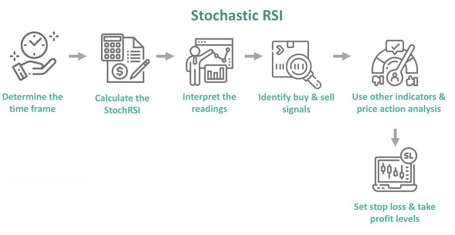

In today's trading environment, identifying profitable trading patterns is paramount for success. Among the numerous tools available, the Stochastic RSI is a central technical indicator for traders. This indicator combines the insights of the Stochastic Oscillator and the Relative Strength Index (RSI) to provide a more sensitive measure of an asset's momentum and price trend. This article will explore how traders can utilize Stochastic RSI to construct a profitable trading strategy, with a focus on algorithmic trading.

The Stochastic RSI integrates the relative momentum strength of an asset with the stochastic oscillator concept, delivering values that help traders identify potential entry and exit points in their trading strategy. By generating a scale from 0 to 1, it highlights when an asset is overbought or oversold—essential for making informed trading decisions. In this guide, we combine theoretical knowledge, practical examples, and algorithmic integration techniques. Whether you're just beginning your trading journey or are a seasoned expert, this guide will equip you with the skills to employ Stochastic RSI effectively, potentially enhancing your overall profitability.



## Table of Contents

## Understanding Stochastic RSI

The Stochastic RSI (StochRSI) is a sophisticated tool that builds on the principles of the Relative Strength Index (RSI) to help traders identify the overbought or oversold conditions of an asset. While the RSI itself is used to determine these conditions by measuring the velocity and magnitude of directional price movements, the StochRSI takes this analysis further by applying the stochastic oscillator formula to the RSI values.

Mathematically, the StochRSI is computed as follows:

$$
\text{StochRSI} = \frac{\text{RSI}_{\text{current}} - \text{RSI}_{\text{min}}}{\text{RSI}_{\text{max}} - \text{RSI}_{\text{min}}}
$$

In this equation, $\text{RSI}_{\text{current}}$ is the current RSI value, while $\text{RSI}_{\text{min}}$ and $\text{RSI}_{\text{max}}$ represent the lowest and highest RSI values over a specified period, typically 14 days. The result is a value that oscillates between 0 and 1, where readings below 0.2 suggest oversold conditions and readings above 0.8 imply overbought conditions.

This indicator is particularly useful in volatile market environments where traditional RSI might offer insufficient insights due to its static nature. By normalizing RSI values, the StochRSI provides a more sensitive measure that can help spot short-term trends and potential reversals more accurately.

In practice, traders look for convergence or divergence between price movements and StochRSI readings to predict potential trend shifts. For instance, when a security’s price reaches a new high and the StochRSI does not, it could signal that the price may soon decline—a phenomenon known as bearish divergence. Conversely, bullish divergence occurs when prices hit a new low while StochRSI climbs, indicating a potential upward trend.

Overall, understanding the StochRSI allows traders to fine-tune their market entry and [exit](/wiki/exit-strategy) strategies, taking advantage of precise overbought or oversold signals that are often missed by simpler indicators.

## Implementing Stochastic RSI in Trading Strategies

Implementing the Stochastic RSI into a trading strategy focuses primarily on identifying overbought and oversold signals that can guide market entry and exit points. The Stochastic RSI functions by generating signals through its key values; typically, readings below 0.2 suggest oversold conditions, while values above 0.8 point to overbought scenarios. Traders harness these signals to make informed trading decisions, tailoring the use of the Stochastic RSI to different market conditions, such as trending or sideways markets. 

In trending markets, the Stochastic RSI can help traders spot potential reversal points. For instance, in an uptrend, a reading below 0.2 might signal that the asset is undervalued temporarily, suggesting a potential buying opportunity on the expectation of a continuing uptrend. Conversely, in a downtrend, a reading above 0.8 could indicate that an asset is overvalued, pointing towards a potential selling opportunity. The key in these scenarios is to confirm that the market's primary trend is still valid before initiating a trade, thus reducing the risk of acting on premature reversal signals.

In sideways markets, where prices oscillate within a defined range, the Stochastic RSI is equally effective. Traders can employ the indicator to buy near the lower boundary and sell near the upper limit of this range. It's vital, however, to confirm these signals by ensuring that the range remains intact and is not subject to [breakout](/wiki/breakout-trading) conditions. This might involve waiting for additional confirmation indicators or patterns, such as price breaking through support or resistance levels, before executing a trade.

Price confirmation is crucial when using the Stochastic RSI to minimize false signals. Traders should look for additional indicators or patterns that corroborate the Stochastic RSI signals. For example, candlestick patterns or moving averages crossing over can provide added validation for a trade. These confirmation methods offer a systematic trading approach that reduces the chance of anomalies affecting the strategy. 

Sample Python code to determine oversold and overbought conditions with the Stochastic RSI might look as follows:

```python
import pandas as pd
import ta

# Assuming df is your pandas DataFrame containing 'Close' prices
df['stoch_rsi'] = ta.momentum.StochasticOscillator(
    close=df['Close'], 
    window=14, # Default RSI window length
    smooth_window=3 # Default smoothing length
).stoch()

df['signal'] = 'Hold'
df.loc[df['stoch_rsi'] < 0.2, 'signal'] = 'Buy'  # Oversold
df.loc[df['stoch_rsi'] > 0.8, 'signal'] = 'Sell' # Overbought

print(df[['Close', 'stoch_rsi', 'signal']])
```

This sample script calculates the Stochastic RSI and assigns buy or sell signals based on oversold or overbought conditions, respectively. However, this is a simplified model. Successful traders often employ additional filters and risk management strategies to enhance reliability and profitability, ensuring that trades are backed by comprehensive data analysis and market context.

## Algorithmic Trading with Stochastic RSI

Algorithmic trading leverages computational algorithms to automate the execution of buy and sell orders in financial markets. The use of the Stochastic RSI (StochRSI) within these algorithms can significantly enhance trading strategies by capitalizing on overbought and oversold signals. It provides a finer granularity of the market sentiment, thus offering opportunities to optimize entry and exit points in the trading process.

### Programming Stochastic RSI in Trading Algorithms

Incorporating the StochRSI into an [algorithmic trading](/wiki/algorithmic-trading) strategy involves coding rules that interpret StochRSI readings to generate trade signals. The process typically begins with setting appropriate thresholds that define overbought and oversold conditions based on the StochRSI values. Common thresholds are 0.8 for overbought conditions and 0.2 for oversold conditions.

Below is a basic example of how you could implement a StochRSI-based trading strategy in Python, using the popular `pandas` and `talib` libraries. This script assumes a DataFrame `df` containing historical price data with columns 'close', 'high', 'low', and '[volume](/wiki/volume-trading-strategy)'.

```python
import pandas as pd
import talib

# Load or prepare data
df = pd.read_csv('historical_data.csv')

# Calculate Stochastic RSI
df['stoch_rsi'] = talib.STOCHRSI(df['close'], timeperiod=14)

# Define thresholds
overbought = 0.8
oversold = 0.2

# Generate signals
df['signal'] = 0
df.loc[df['stoch_rsi'] > overbought, 'signal'] = -1  # Sell signal
df.loc[df['stoch_rsi'] < oversold, 'signal'] = 1     # Buy signal

# Strategy logic
df['position'] = df['signal'].shift()
df['strategy_returns'] = df['position'] * df['close'].pct_change()

# Evaluate strategy performance
strategy_performance = df['strategy_returns'].cumsum()
print(strategy_performance.iloc[-1])
```

### Trading Platform Options

Several trading platforms support the integration of custom indicators like the StochRSI within their algorithmic trading frameworks:

1. **MetaTrader 4 and 5**: These platforms offer robust environments for automating trading strategies. In MetaTrader, the MQL4/MQL5 scripting languages can be used to develop Expert Advisors (EAs) that implement Stochastic RSI signals.

2. **TradingView**: Known for its versatile Pine Script language, TradingView allows traders to create and backtest custom strategies using StochRSI.

3. **Interactive Brokers API**: Through the use of languages like Python with the `ib_insync` library, traders can programmatically access market data and execute trades based on Stochastic RSI signals.

By effectively implementing these algorithmic strategies, traders can achieve efficient execution and capitalize on Stochastic RSI insights with speed and precision, enhancing their overall trading performance.

## Case Study: Profitable Trades with Stochastic RSI

In this case study, we will explore how the Stochastic RSI can be utilized to identify profitable trading opportunities in a declining market. The Stochastic RSI's function is its ability to provide early signals for potential reversals or continuation trends. To demonstrate this, let's consider a practical example using real market data.

### Scenario Analysis

Imagine a scenario where a stock has been in a bearish trend, continuously hitting lower lows. Using the Stochastic RSI, a trader aims to identify the optimal point to enter a long position, anticipating a trend reversal.

#### Step 1: Data Preparation

We'll first import historical price data for the stock. The data must include closing prices, as the Stochastic RSI calculation relies on it.

```python
import pandas as pd
import numpy as np
import matplotlib.pyplot as plt
from ta.momentum import StochRSIIndicator

# Fetch historical price data (normally you'd use an API or a CSV file)
data = pd.read_csv('stock_data.csv')  # Placeholder for actual data source
data['Close'] = data['Close'].astype(float)

# Calculate Stochastic RSI
stoch_rsi = StochRSIIndicator(close=data['Close'], window=14, smooth1=3, smooth2=3)
data['StochRSI'] = stoch_rsi.stochrsi()

plt.figure(figsize=(14,7))
plt.title('Stock Price and Stochastic RSI')
plt.plot(data['Close'], label='Close Price')
plt.plot(data['StochRSI'], label='Stochastic RSI')
plt.axhline(0.2, linestyle='--', color='red', label='Oversold threshold')
plt.axhline(0.8, linestyle='--', color='green', label='Overbought threshold')
plt.legend()
plt.show()
```

#### Step 2: Identifying Signals

- **Oversold Condition**: The Stochastic RSI dips below 0.2, indicating that the asset may be oversold. Here, traders watch for reversal signals.
- **Signal Confirmation**: A reversal is more likely to occur when the Stochastic RSI crosses back above the 0.2 mark, especially if reinforced by an upward price movement.

#### Step 3: Executing the Trade

Once the Stochastic RSI moves above 0.2 following a period of being oversold, a long position is considered. For additional confirmation, traders may look for candlestick patterns suggesting a bullish market (such as a bullish engulfing pattern).

#### Result Analysis

Once these conditions are met and a trade is executed, it is crucial to set a stop-loss to manage risk. Profit targets can be set based on recent resistance levels or a risk-to-reward ratio.

### Example Outcome

Let's assume our stock's price rebounded sharply following the identified reversal point, moving against the previous trend. This would result in a profitable trade, primarily because the Stochastic RSI effectively signaled the market's oversold condition. Statistical validation and [backtesting](/wiki/backtesting) can be done using historical data to refine these strategies further.

In this case study, the critical takeaway is that the Stochastic RSI can provide actionable insights in declining markets, aiding traders in identifying potential reversals. Nonetheless, accompanying technical analysis and risk management strategies are essential to improving success rates.

## Advanced Techniques: Combining Indicators

For improved accuracy in trading strategies, the Stochastic RSI (StochRSI) is often coupled with other technical indicators. This combination can help filter out false signals and increase the probability of successful trades. Below are several indicators that are frequently synergized with StochRSI to enhance its effectiveness.

### 1. **Moving Averages**

Moving averages, including the Simple Moving Average (SMA) and the Exponential Moving Average (EMA), serve as fundamental tools for trend identification. When integrated with StochRSI, moving averages can help validate the direction of the market. For instance, a common approach is to execute a trade only if the StochRSI indicates an overbought or oversold condition that aligns with the moving average trend direction. If the price is above the moving average, a StochRSI signal to buy might be more reliable.

### 2. **Volume Analysis**

Volume analysis plays a crucial role in confirming price movements. High volume during a StochRSI signal can substantiate the strength of the trend, while low volume might indicate a weak or false signal. For example, if a stock reaches an overbought level on the StochRSI but with declining volume, a trader might be cautious about entering a long position. Conversely, strong volume in conjunction with an oversold condition could suggest a robust buying opportunity.

### 3. **Candlestick Patterns**

Candlestick patterns are valuable for understanding market sentiment. The "Three Black Crows" is a bearish pattern that may present a compelling case when it follows an overbought signal from the StochRSI. Conversely, bullish patterns, such as the "Morning Star," could be coupled with an oversold StochRSI signal for considering long positions. Analyzing these patterns with StochRSI readings can enhance the indication of market reversals or continuations.

### 4. **MACD (Moving Average Convergence Divergence)**

The MACD is another valuable indicator for traders aiming to confirm StochRSI signals. The MACD measures the relationship between two moving averages of a stock's price, typically a 12-period EMA and a 26-period EMA. A crossover in the MACD can be a strong signal that supports a StochRSI reading. For example, using the MACD to confirm a StochRSI overbought condition could potentially signal a reliable shorting opportunity.

### Example Implementation

Here is a simple Python code snippet that demonstrates how to combine StochRSI with a moving average crossover strategy:

```python
import pandas as pd
import numpy as np

def calculate_stoch_rsi(close_series, period=14):
    delta = close_series.diff()
    loss = np.where(delta < 0, -delta, 0)
    gain = np.where(delta > 0, delta, 0)

    avg_gain = pd.Series(gain).rolling(period).mean()
    avg_loss = pd.Series(loss).rolling(period).mean()

    rs = avg_gain / avg_loss
    rsi = 100 - (100 / (1 + rs))

    stoch_rsi = (rsi - rsi.rolling(period).min()) / (rsi.rolling(period).max() - rsi.rolling(period).min())
    return stoch_rsi

def moving_average(series, n=30):
    return series.rolling(window=n).mean()

data = pd.read_csv('historical_data.csv')
data['StochRSI'] = calculate_stoch_rsi(data['Close'])
data['SMA50'] = moving_average(data['Close'], 50)
data['SMA200'] = moving_average(data['Close'], 200)

buy_signals = (data['StochRSI'] < 0.2) & (data['SMA50'] > data['SMA200'])
sell_signals = (data['StochRSI'] > 0.8) & (data['SMA50'] < data['SMA200'])

data['Buy'] = np.where(buy_signals, 1, 0)
data['Sell'] = np.where(sell_signals, 1, 0)
```

By incorporating other indicators with StochRSI, traders can construct strategies that not only respond to immediate market conditions but are also robust across various market scenarios. This multifaceted approach allows traders to optimize their decision-making processes and manage risks more effectively.

## Common Pitfalls and How to Avoid Them

When using the Stochastic RSI as a trading indicator, traders face several challenges that can undermine their strategy's effectiveness if not properly managed. Understanding common pitfalls and implementing risk management strategies can help mitigate potential losses.

One of the primary errors traders can make with the Stochastic RSI is relying on it in isolation. The Stochastic RSI, being a [momentum](/wiki/momentum) oscillator, can produce false signals, especially in volatile or trendless markets. The readings below 0.2 or above 0.8 might suggest oversold or overbought conditions, respectively, but these signals can be misleading without the context of other market indicators or confirmations. Traders should integrate Stochastic RSI with additional tools, such as trend indicators or volume analysis, to filter out noise and improve signal reliability.

Another common pitfall is overtrading based on Stochastic RSI signals. Since this indicator can trigger frequent buy and sell signals in rapid market movements, traders may make reactionary trades without sufficient verification. It is important to wait for price confirmations—such as breakouts in trend lines or support and resistance zone validations—before executing trades based on Stochastic RSI signals. This approach helps to confirm the authenticity of the signals.

Additionally, traders must be aware of the inherent lag in technical indicators like the Stochastic RSI. Lag occurs because these indicators are derived from historical price data. Consequently, traders should avoid placing excessive trust in current readings to predict future market movements accurately.

Risk management is crucial in mitigating the downside of false signals. Effective techniques include setting stop-loss orders to limit potential losses, using position sizing to manage exposure, and establishing profit-taking strategies. Traders should also consider diversifying their trading strategies to avoid relying solely on the Stochastic RSI.

Comprehensive backtesting is essential for evaluating the effectiveness of a Stochastic RSI-based strategy. By running simulations on historical data, traders can analyze the indicator's performance across different market conditions and timeframes. Python, with libraries such as Backtrader or pyti, offers an accessible platform for creating and testing such strategies. Here is a simple example using Python:

```python
import pandas as pd
import numpy as np
import matplotlib.pyplot as plt
from pyti.stochastic import stochastic_relative_strength_index as stochrsi

# Sample historical data
data = pd.read_csv('historical_data.csv')
prices = data['Close'].values

# Calculate Stochastic RSI
stoch_rsi_values = stochrsi(prices, period=14)

# Plot the results
plt.figure(figsize=(12, 6))
plt.plot(data['Date'], stoch_rsi_values, label='Stochastic RSI')
plt.axhline(0.2, color='red', linestyle='--')
plt.axhline(0.8, color='green', linestyle='--')
plt.title('Stochastic RSI Over Time')
plt.xlabel('Date')
plt.ylabel('Stochastic RSI')
plt.legend()
plt.show()
```

Finally, traders must continually evaluate and refine their strategies. This process involves monitoring the Stochastic RSI's effectiveness as market dynamics evolve and adjusting settings or integrating new indicators as necessary. By avoiding common pitfalls, leveraging thorough backtesting, and applying robust risk management, traders can improve their likelihood of utilizing the Stochastic RSI effectively and profitably.

## Conclusion: Mastering Trading with Stochastic RSI

The Stochastic RSI stands as a versatile and insightful technical indicator for traders aiming to optimize their trading strategies. Throughout the article, we've explored the fundamental aspects of Stochastic RSI, its mathematical foundation, and its practical applications in trading. By understanding its ability to pinpoint overbought and oversold conditions, traders can craft more informed decisions.

The journey of leveraging Stochastic RSI begins with recognizing its value as a more sensitive derivative of the classic RSI. This sensitivity allows traders to detect potential trend reversals and continuations with greater precision. We observed that readings below 0.2 suggest oversold conditions, presenting buying opportunities, while those above 0.8 indicate overbought conditions, often signaling an impending sell-off.

Implementing Stochastic RSI in trading strategies involves marrying technical analysis with market conditions. It requires keen observation and patience for price confirmations before executing trades, ensuring that signals align with broader market patterns. This approach minimizes impulsive decision-making and capitalizes on validated opportunities.

Incorporating Stochastic RSI into algorithmic trading presents another layer of sophistication. Automating transactions based on pre-defined conditions not only streamlines the trading process but also removes emotional biases, allowing for consistent execution. Sample code snippets highlight the ease of integration, empowering traders to transition from theory to practice efficiently.

Moreover, a case study provided practical insights, demonstrating how Stochastic RSI can foresee potential market shifts. Reading and interpreting historical data underscore its ability to inform actionable trades that harness market dynamics.

To enhance decision-making further, combining Stochastic RSI with other indicators can amplify accuracy. By aligning it with trend indicators, volume analysis, and candlestick patterns, traders can construct a multi-dimensional analytic framework.

However, it is crucial to acknowledge the limitations of Stochastic RSI. Like all technical indicators, it is not immune to false signals. Risk management strategies, rigorous backtesting, and iterative refinement of strategies are essential to mitigate potential losses and harness its full potential.

In conclusion, mastering the Stochastic RSI requires continuous learning and adaptation to evolving market conditions. Its strength lies in its flexibility and capacity to be integrated into diverse trading strategies. By honing skills and remaining vigilant to market changes, traders can effectively utilize Stochastic RSI to enhance their profitability, ensuring it remains a cornerstone of their trading arsenal.

## References & Further Reading

[1]: Kahn, Michael. (2006). ["Technical Analysis Plain and Simple: Charting the Markets in Your Language."](https://ptgmedia.pearsoncmg.com/images/9780137042012/samplepages/0137042019.pdf) FT Press.

[2]: Wilder, J. Welles. (1978). ["New Concepts in Technical Trading Systems."](https://archive.org/details/newconceptsintec00wild) Trend Research.

[3]: Constance Brown. (2007). ["Technical Analysis for the Trading Professional."](https://www.amazon.com/Technical-Analysis-Trading-Professional-Second/dp/007175914X) McGraw-Hill Education.

[4]: Murphy, John J. (1999). ["Technical Analysis of the Financial Markets."](https://archive.org/details/technicalanalysi0000murp) New York Institute of Finance.

[5]: Pring, Martin J. (2002). ["Technical Analysis Explained: The Successful Investor's Guide to Spotting Investment Trends and Turning Points."](https://www.amazon.com/Technical-Analysis-Explained-Fifth-Successful/dp/0071825177) McGraw-Hill Education.

[6]: ["Developing Trading Strategies with Stochastic Oscillator and RSI"](https://tradingstrategyguides.com/best-stochastic-trading-strategy/) - Investopedia Article

[7]: Kirkpatrick, Charles D., and Dahlquist, Julie R. (2015). ["Technical Analysis: The Complete Resource for Financial Market Technicians."](https://www.amazon.com/Technical-Analysis-Complete-Financial-Technicians/dp/0134137043) FT Press.