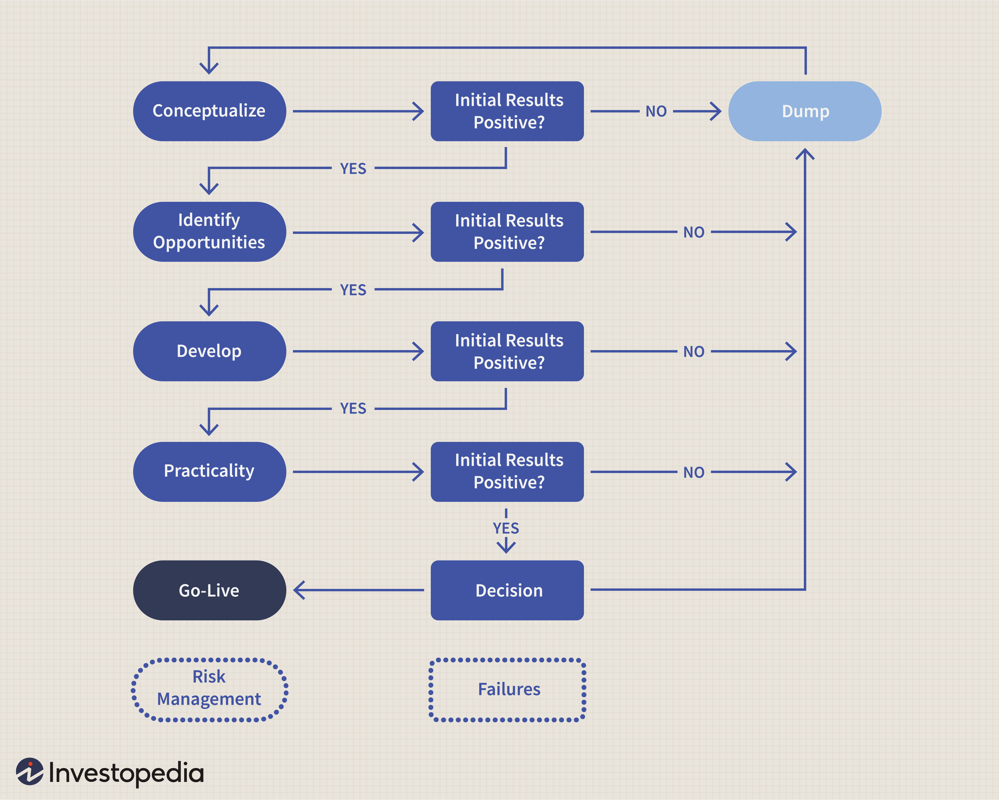

Trading model investment is a crucial aspect of modern financial markets, offering compelling profitability potential for investors. At its core, a trading model is a systematic framework that guides investment decisions, aimed at maximizing returns while managing risk. These models utilize historical data, mathematical algorithms, and statistical analysis to forecast future price movements and identify profitable trading opportunities. The adoption of algorithmic trading has transformed traditional trading paradigms, enhancing precision, speed, and efficiency in executing trades.

Algorithmic trading, a critical component of contemporary financial markets, automates the entire trading process. By using complex algorithms and high-speed data processing, it enables traders to execute orders at the optimum price, minimizing human errors and emotional biases. The evolution of technology and the availability of big data have further propelled the significance of algorithmic trading, as it facilitates sophisticated strategy implementations that are not feasible through manual trading. 



This guide aims to provide a comprehensive examination of trading model investments, focusing on building robust trading models, understanding essential strategy components, and leveraging algorithmic trading for maximized returns. Key objectives include equipping traders with the necessary tools to develop profitable strategies, highlighting the importance of automation in trading, and underscoring effective risk management techniques. By offering a detailed exploration of these elements, the guide seeks to enhance the reader's proficiency in navigating the complexities of trading models and algorithmic trading in the highly dynamic financial markets.

## Table of Contents

## Understanding Trading Models

Trading models play a crucial role in modern investment strategies by providing a structured framework for financial transactions. These models encompass predefined rules formulated to assist investors, traders, and financial institutions in making efficient decisions. The primary purpose of trading models is to enhance the predictability and profitability of trading activities by leveraging quantitative data and analytics.

**Defining Trading Models and Their Purpose in Investments**

Trading models are algorithmic frameworks that utilize historical market data, statistical theories, and computational algorithms to forecast future price movements. Their objective is to identify profitable trading opportunities while minimizing risks and maximizing returns. By employing a systematic approach, trading models aim to reduce the noise inherent in human decision-making processes, often influenced by emotions and biases.

These models are integral to diversifying investment portfolios, optimizing entry and [exit](/wiki/exit-strategy) points for trades, and managing overall risk exposure. They serve as invaluable tools for traders by streamlining processes such as asset allocation, timing strategies, and execution methods.

**The Role of Trading Models in Streamlining Decision-Making Processes**

The decision-making process in trading is complex and multifaceted, with a multitude of variables influencing market outcomes. Trading models simplify this complexity by providing rule-based systems that can react to market events with speed and accuracy. They efficiently process large datasets, enabling traders to make informed decisions faster than manual analysis allows.

One of the key features is the ability to incorporate real-time data into trading strategies. Advanced computational algorithms can analyze market trends, track economic indicators, and evaluate securities' performance in milliseconds, ensuring that decisions are made based on the most current information. This automation in the decision-making process significantly reduces the potential for human error and emotional interference.

**Benefits of Using Trading Models: Emotionless and Rule-Based Trading**

A significant advantage of using trading models is their emotionless nature. Human traders are prone to emotional biases such as fear and greed, which can lead to irrational decision-making. Trading models operate on pre-programmed rules and algorithms, maintaining consistency regardless of market conditions. This rule-based trading ensures that decisions adhere strictly to the defined strategy, thereby increasing the likelihood of achieving desired financial outcomes.

Additionally, trading models provide transparency and replicability. Since every decision is based on an algorithmic rule set, it is easy to review and audit trades, facilitating compliance and strategic assessments. This feature is particularly valuable for institutional traders who require accountability and precision in high-stakes trading environments.

In summary, trading models are indispensable in today's financial markets due to their ability to streamline decision-making, eliminate emotional biases, and operate on reliable, data-driven strategies. These attributes not only enhance the efficiency of trading but also significantly contribute to the overall success of investment portfolios.

## Building a Solid Trading Model

Creating a trading model involves structured steps that incorporate strategic planning, data analysis, and continuous adjustment. This systematic approach enhances decision-making and optimizes trading performance.

### Step-by-Step Guide to Creating a Trading Model

1. **Define Objectives and Scope**: Establish the primary goals of your trading model. This includes specifying your trading style (e.g., day trading, swing trading), financial instruments (stocks, forex, commodities), and the markets in which you will operate.

2. **Data Collection and Preparation**: Gather historical data for your chosen financial instruments. This data is critical for developing and backtesting your model. Ensure your data set is comprehensive and includes price data, volume, and potentially other factors such as economic indicators.

3. **Hypothesis Development**: Formulate a hypothesis on market behavior that your trading model will exploit. This could be based on trends, mean reversion, or patterns recognized in historical data.

4. **Model Design**: Construct the mathematical framework of the model. Determine the specific technical indicators (e.g., Moving Averages, RSI) and trading rules to implement these. For instance, a Moving Average crossover strategy might involve buying when a short-term average crosses above a long-term average.

   Example in Python for a simple Moving Average crossover:
   ```python
   import pandas as pd

   def moving_average_crossover(data, short_window, long_window):
       data['Short_MA'] = data['Close'].rolling(window=short_window, min_periods=1).mean()
       data['Long_MA'] = data['Close'].rolling(window=long_window, min_periods=1).mean()
       data['Signal'] = 0
       data.loc[data['Short_MA'] > data['Long_MA'], 'Signal'] = 1
       data.loc[data['Short_MA'] < data['Long_MA'], 'Signal'] = -1
       return data
   ```

5. **Backtesting**: Test your model on historical data to evaluate performance. This step gauges the profitability and robustness of the model. Key metrics to consider include the Sharpe Ratio, maximum drawdown, and total return. Backtesting results guide adjustments and enhancements.

6. **Optimization**: Refine the model by adjusting parameters to improve performance. However, avoid overfitting—optimizing too specifically to historical data, which may degrade live performance.

7. **Risk Management**: Integrate risk management strategies to minimize potential losses. Define your risk tolerance and implement stop-loss orders, position sizing rules, and diversification strategies.

8. **Implementation and Monitoring**: Deploy the model in a simulated environment initially (paper trading) to ensure functionality in live conditions. Regularly monitor and update the model to adapt to changing market conditions and incorporate new data and insights.

### Importance of Backtesting and Data Analysis

Backtesting offers a retrospective analysis of how a trading strategy would have performed, crucial for validating the model's effectiveness before deployment. Data analysis allows traders to derive insights from market trends, honing strategies to exploit inefficiencies. Robust [backtesting](/wiki/backtesting) coupled with extensive data analysis mitigates risk and potential financial loss by assessing a model’s edge in historical contexts.

### Factors to Consider

- **Risk Tolerance**: Clearly define the level of risk you are willing to assume with your investments. This can vary considerably between conservative and aggressive strategies.

- **Market Conditions**: Account for volatility, liquidity, and other market-specific conditions that may impact model performance.

- **Trading Objectives**: Align your model with your financial goals, whether focusing on short-term profits or long-term growth. Factors like transaction costs and capital requirements must also be integrated into the trading strategy.

Building a trading model is inherently iterative, requiring ongoing refinement and vigilance against external variables and market changes to maintain profitability and sustainability.

## Essential Elements of Profitable Strategies

### Essential Elements of Profitable Strategies

In financial trading, the construction of profitable strategies depends significantly on understanding and applying technical indicators, trend analysis, market patterns, and effectively balancing risk and reward.

#### Technical Indicators and Their Significance

Technical indicators are mathematical calculations based on historic price, [volume](/wiki/volume-trading-strategy), or open interest information that traders use to predict future price movements. Some widely-used technical indicators include moving averages (e.g., Simple Moving Average [SMA], Exponential Moving Average [EMA]), Relative Strength Index (RSI), Moving Average Convergence Divergence (MACD), and Bollinger Bands.

Moving averages smooth price data to identify the direction of the trend. For instance, an EMA applies weighting factors which decrease exponentially. The formula for EMA is:

$$
\text{EMA}_t = \left( \frac{\text{Price}_t - \text{EMA}_{t-1}}{\text{k}} \right) + \text{EMA}_{t-1}
$$

where $\text{k} = 2/(\text{N}+1)$, and N is the number of days.

The RSI, a [momentum](/wiki/momentum) oscillator, measures the speed and change of price movements, providing signals about overbought or oversold conditions. The RSI formula is:

$$
\text{RSI} = 100 - \frac{100}{1 + \text{RS}}
$$

where $\text{RS} = \frac{\text{Average Gain}}{\text{Average Loss}}$.

These indicators help traders discern market conditions, identify entry and exit points, and make informed trading decisions.

#### Incorporating Trend Analysis and Market Patterns

Trend analysis and pattern recognition are essential for understanding market directions and making predictions. Traders employ various techniques such as identifying trendlines and using chart patterns like head and shoulders, flags, and double tops/bottoms to predict market behavior.

Trend lines are graphical representations of support and resistance in any time frame, which helps in determining the general direction of the market. Recognizing bullish or bearish patterns can allow traders to anticipate potential breakouts or reversals, thus refining their strategy.

Candlestick patterns also provide critical insights into market sentiment, showing traders how buyers and sellers influence the price. Common candlestick patterns include the Doji, Hammer, and Engulfing patterns, each offering its own implication of potential market movements.

#### Balancing Risk and Reward in Strategy Development

Balancing risk and reward is a fundamental aspect of developing a profitable trading strategy. One effective way to manage this is by employing a risk-reward ratio, which compares the potential loss of a trade to the potential gain. A ratio of 1:3, for instance, means that for every dollar risked, the potential reward is three dollars.

Risk management tactics may include setting stop-loss orders, which automatically close a position at a predetermined price to prevent further losses. Position sizing is another critical risk management tool where traders allocate a portion of the portfolio to each trade based on the risk they are willing to take.

It's important to consider [volatility](/wiki/volatility-trading-strategies) and correlation among securities to ensure that risk is dispersed appropriately across different market conditions. Diversification across asset classes or sectors can also mitigate risk by not having exposure solely to one segment of the market.

In summary, the synthesis of technical indicators, trend and pattern recognition, and a tailored approach to balancing risk and reward forms the backbone of lucrative trading strategies. Traders continuously refine these elements in line with market dynamics and their personal risk tolerance to maximize profitability.

## Algorithmic Trading: Automation and Execution

Algorithmic trading refers to the use of computer algorithms to execute trading orders, leveraging rules and mathematical models to make trading decisions. It offers significant advantages over manual trading, primarily due to its speed, precision, and ability to process complex data efficiently. By eliminating human errors associated with manual trading — such as emotional decision-making and slow response times — [algorithmic trading](/wiki/algorithmic-trading) provides a systematic approach to capital markets.

One of the principal benefits of algorithmic trading is its ability to analyze large volumes of data and execute transactions at speeds far beyond human capability. This is crucial in high-frequency trading ([HFT](/wiki/high-frequency-trading-strategies)), where the success of a strategy often depends on executing trades within fractions of a second. Algorithms can scan numerous markets simultaneously, identify [arbitrage](/wiki/arbitrage) opportunities, and execute trades automatically, all while minimizing the possibility of manual errors.

Several popular algorithmic trading strategies are employed by traders and financial institutions. Among them, trend-following strategies, which aim to capitalize on upward or downward market trends, are among the simplest and most widely implemented. These strategies rely on technical indicators such as moving averages to identify the beginning and end of a trend. Another common strategy is [statistical arbitrage](/wiki/statistical-arbitrage), which involves the simultaneous buying and selling of securities to exploit price inefficiencies. This method often uses pairs trading, where two correlated stocks are traded based on the assumption that their relative prices will converge over time.

Market-making algorithms provide [liquidity](/wiki/liquidity-risk-premium) in financial markets by continuously quoting buy and sell prices and profiting from the bid-ask spread. These algorithms require complex modeling to manage inventories and adjust pricing strategies in response to market conditions and order flow. Execution-based strategies, such as VWAP and TWAP, are designed to execute large orders with minimal market impact by mimicking a security's typical trading pattern over time.

The incorporation of [artificial intelligence](/wiki/ai-artificial-intelligence) (AI) and [machine learning](/wiki/machine-learning) (ML) has further enhanced algorithmic trading by enabling the development of more adaptive and intelligent trading models. AI-powered algorithms can analyze historical data, recognize patterns, and make predictions with unprecedented accuracy. Machine learning models, particularly [deep learning](/wiki/deep-learning) techniques, are adept at identifying nuanced patterns and relationships in data that traditional methods might overlook. These models continuously learn from new data, allowing for ongoing refinement and optimization of trading strategies.

Python is frequently used to implement algorithmic trading strategies due to its rich ecosystem of data analysis and machine learning libraries. For instance, the following Python snippet demonstrates a simple moving average crossover strategy using the popular pandas library:

```python
import pandas as pd

# Assume 'data' is a DataFrame with a 'Close' column for closing prices
data['SMA_50'] = data['Close'].rolling(window=50).mean()
data['SMA_200'] = data['Close'].rolling(window=200).mean()

# Signal generation
data['Signal'] = 0
data.loc[data['SMA_50'] > data['SMA_200'], 'Signal'] = 1
data.loc[data['SMA_50'] < data['SMA_200'], 'Signal'] = -1

# Positions based on the signals
data['Position'] = data['Signal'].shift()

# Display relevant columns
print(data[['Close', 'SMA_50', 'SMA_200', 'Signal', 'Position']])
```

This example illustrates how a simple rule-based strategy can be implemented to generate trading signals based on moving average crossovers. By layering machine learning models over such strategies, traders can enhance their predictive capabilities, adapt to changing market conditions, and potentially increase profitability.

In conclusion, algorithmic trading leverages advanced computational techniques to improve trading efficiency and accuracy. With ongoing advances in AI and machine learning, algorithmic trading continues to offer increasingly sophisticated tools for analyzing market dynamics, optimizing trade execution, and managing financial risk.

## Practical Considerations and Risk Management

Implementing trading models in real-world scenarios presents various challenges that traders and investors need to navigate. One major challenge is the complexity of financial markets, characterized by fluctuating conditions and a multitude of influencing factors. Additionally, the transparency and trustworthiness of data can significantly affect the outputs and reliability of trading models. Managing these challenges requires a keen understanding of risk management and a commitment to staying informed about the latest market trends and technological advancements.

### Techniques for Effective Risk Management and Mitigation

Risk management is a pivotal aspect of executing trading models effectively. It involves strategies that minimize potential losses while maximizing returns. Several techniques are employed to manage risk:

1. **Diversification**: Spreading investments across a variety of assets to reduce exposure to any single asset's risk. This approach can mitigate the negative impact of a poor-performing asset on the overall portfolio.

2. **Position Sizing**: This refers to determining the appropriate amount of capital to allocate to a specific trade, taking into account the trader's risk tolerance and the trade's potential impact on the portfolio.

3. **Stop-Loss Orders**: These are predetermined levels at which a position is automatically closed if the market moves unfavorably. Stop-loss orders protect against significant losses by ensuring trades are exited before losses accumulate excessively.

4. **Value at Risk (VaR)**: This statistical method assesses the potential loss in value of a portfolio and the probability of that loss occurring within a given timeframe. VaR assists traders in understanding the risks involved in their positions and portfolio.

5. **Monte Carlo Simulation**: This method uses random sampling and statistical modeling to forecast the potential outcomes of an investment or trading strategy. It enables traders to assess the variability and potential success of their strategies under different market conditions.

By implementing these techniques, traders can not only protect their capital but also ensure that their trading models operate within acceptable risk parameters.

### Importance of Staying Updated with Market Trends and Technological Advancements

Financial markets are dynamic and influenced by a multitude of factors including economic indicators, geopolitical events, and technological innovations. Staying informed about these trends is crucial for the efficacy of trading models. Traders and investors must actively monitor market conditions, utilizing resources such as financial news outlets, economic reports, and social media channels to gain insights.

Technological advancements, particularly in artificial intelligence and machine learning, are reshaping how trading models are developed and implemented. These technologies enable more sophisticated data analysis, pattern recognition, and predictive modeling, enhancing the accuracy and performance of trading strategies. Keeping abreast of these advancements allows traders to leverage new tools and technologies, optimizing their models for better results.

Moreover, continual learning and adaptation are essential as markets evolve. Engaging with educational materials, attending industry conferences, and participating in professional networks can facilitate ongoing development and adaptation to new market environments.

In conclusion, addressing real-world challenges in trading model implementation requires robust risk management and a commitment to continuous learning. By employing effective risk mitigation techniques and staying informed about market and technological changes, traders can enhance the resilience and profitability of their trading endeavors.

## Case Studies and Examples

### Case Studies and Examples

In the field of trading model investment, practical examples illuminate the efficacy and adaptability of various strategies across diverse market conditions. By examining real-life case studies, investors and developers can glean insights into both successful paradigms and lessons from less effective approaches.

#### Real-Life Examples of Successful Trading Strategies

1. **Momentum-Based Strategies**: One of the most renowned examples of a successful trading strategy is the momentum-based paradigm employed by many hedge funds and institutional investors. This strategy capitalizes on the tendency of asset prices to persist in a particular direction for some time. A case in point is the stellar performance of the AQR Capital Management's Momentum Fund, which leveraged systematic momentum strategies to achieve above-average returns over the years. The fund's approach underscores the potential of momentum strategies in capturing short- to medium-term market movements.

2. **Statistical Arbitrage**: Another example is statistical arbitrage, as employed by quantitative hedge funds such as Renaissance Technologies. This strategy utilizes statistical models to exploit price divergences among correlated securities, typically over short time horizons. By employing vast datasets and complex algorithms, these funds execute trades that balance risk and reward with high precision, demonstrating success in both volatile and stable market conditions.

3. **Market Making Algorithms**: Citadel Securities is a prime example of using market-making algorithms effectively. These algorithms continuously provide bid and ask quotes, profiting from the spread between these prices. Despite their exposure to significant short-term volatility, Citadel Securities leverages its high-speed trading infrastructure to manage risks effectively and maintain profitability.

#### Analysis of Strategies Based on Different Market Conditions

The adaptability of trading models to varying market conditions significantly influences their success:

- **Bull Markets**: In a bullish market, strategies such as long-only momentum or trend-following often excel, riding the upward wave of asset prices. These strategies perform optimally when there is a clear, sustained uptrend, allowing traders to capitalize on continuous positive price movements.

- **Bear Markets**: During market downturns, mean-reversion strategies become highly pertinent. These strategies assume that prices, after diverging from their long-term average, will revert over time. In bearish conditions, implementing strategies that short overvalued stocks or indices can provide substantial returns.

- **Sideways Markets**: In periods of market consolidation or minimal movement, strategies focusing on statistical arbitrage or volatility trading can be profitable. By identifying inefficiencies and mispricings, such strategies exploit minor price movements for consistent gains.

#### Lessons Learned from Profitable and Failed Models

Successful models offer several insights:

- **Adaptability and Diversification**: Profitable strategies often exhibit flexibility to adapt to shifting market conditions and leverage diversification to spread risk. For instance, a model that employs a blend of momentum and mean-reversion strategies is more resilient against market volatility.

- **Robust Risk Management**: Effective risk management is a hallmark of successful trading models. By implementing stop-loss orders, position sizing rules, and periodic rebalancing, traders can protect against unexpected market reversals and preserve capital.

Conversely, less successful models highlight pitfalls to avoid:

- **Overfitting**: A common mistake is overfitting a model to historical data, leading to impressive backtest results that fail in live markets. Simplifying models to focus on key predictive factors can mitigate this risk.

- **Ignoring Market Regime Changes**: Models that do not account for shifts in market regimes often falter. Including regime-switching mechanisms or deploying model ensembles can increase robustness in variable market environments.

These examples and insights emphasize the importance of strategy design that is informed by historical performance, adaptable to future changes, and supported by rigorous risk management.

## Conclusion and Future Outlook

This guide has examined the intricate landscape of trading model investments, underscoring the significant role that algorithmic trading plays in the modern financial markets. By constructing effective trading models, investors can streamline their decision-making processes, yielding emotionless, rules-based strategies that improve trading efficiency. Key elements essential for profitability, such as technical indicators, trend analysis, and the balance of risk and reward, have been dissected to enable comprehensive strategy development.

Emerging trends in trading models and algorithmic strategies suggest a future that leans heavily on advanced technologies. The integration of artificial intelligence (AI) and machine learning (ML) into these models is rapidly transforming how trading strategies are developed and executed. AI-driven models are not only optimizing existing strategies but are also creating new ones by learning from vast datasets that human analysts might find overwhelming. Such technologies provide predictive insights that are crucial for anticipating market movements, enabling traders to act promptly and accurately.

Moreover, the rapid evolution of algorithmic trading emphasizes the need for continuous learning and adaptation. As markets grow more complex and interconnected, the ability of traders to stay abreast of technological advancements and market dynamics becomes increasingly critical. Adopting a mindset of lifelong learning and remaining agile in strategy adjustment ensures that investors can capitalize on market opportunities while mitigating potential risks.

In summary, trading model investment is more than just a financial endeavor—it's a dynamic interplay of technology, analysis, and strategic execution. As the industry advances, equipping oneself with knowledge and adaptability remains paramount for achieving sustained success in the ever-evolving landscape of financial trading.

## References & Further Reading

[1]: Bergstra, J., Bardenet, R., Bengio, Y., & Kégl, B. (2011). ["Algorithms for Hyper-Parameter Optimization."](https://dl.acm.org/doi/10.5555/2986459.2986743) Advances in Neural Information Processing Systems 24.

[2]: ["Advances in Financial Machine Learning"](https://www.amazon.com/Advances-Financial-Machine-Learning-Marcos/dp/1119482089) by Marcos Lopez de Prado

[3]: ["Evidence-Based Technical Analysis: Applying the Scientific Method and Statistical Inference to Trading Signals"](https://www.amazon.com/Evidence-Based-Technical-Analysis-Scientific-Statistical/dp/0470008741) by David Aronson

[4]: ["Machine Learning for Algorithmic Trading"](https://github.com/stefan-jansen/machine-learning-for-trading) by Stefan Jansen

[5]: ["Quantitative Trading: How to Build Your Own Algorithmic Trading Business"](https://github.com/LucindaYa/quant-resources/blob/master/Quantitative%20Trading%20How%20to%20Build%20Your%20Own%20Algorithmic%20Trading%20Business.pdf) by Ernest P. Chan