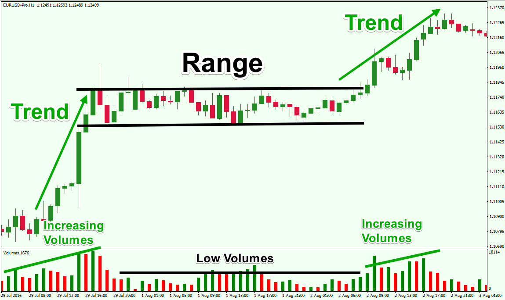

## Table of Contents

## What is range-bound trading and how does it differ from other trading strategies?

Range-bound trading is a strategy where traders buy and sell assets within a specific price range. They look for a stock or other asset that tends to stay between a high price and a low price over time. When the price gets close to the low end of the range, traders buy the asset, hoping to sell it later when the price goes up to the high end of the range. This strategy works well in markets that are not moving a lot and are stable.

This strategy is different from trend-following strategies, where traders try to make money by following the general direction of the market. In trend-following, if the market is going up, traders buy and hold assets to sell them later at a higher price. If the market is going down, they might sell or short sell assets. Range-bound trading doesn't focus on the overall market direction but on the predictable ups and downs within a set range. It can be less risky than trend-following because it doesn't rely on big market moves, but it also might not make as much money in a strongly trending market.

## How can a beginner identify a range-bound market?

A beginner can identify a range-bound market by looking at a price chart of the asset they are interested in. They should look for a pattern where the price moves up and down between two levels without breaking out of those levels for a while. These two levels are called the resistance (the top of the range) and the support (the bottom of the range). If the price keeps bouncing between these two levels over time, it's a good sign that the market is range-bound.

To make it easier, beginners can use tools like trend lines on their charts. They can draw a line along the highs of the price to see the resistance and another line along the lows to see the support. If these lines are pretty flat and the price stays between them for a few weeks or months, it's likely a range-bound market. Watching the price over time and seeing if it stays within these lines will help a beginner feel more sure about identifying a range-bound market.

## What are the key indicators used to confirm a range-bound market?

To confirm a range-bound market, traders often use a few key indicators. One of the main indicators is the moving average. If the price of an asset stays between two moving averages, like the 50-day and 200-day moving averages, and doesn't break out of them often, it might be in a range-bound market. Another useful indicator is the Relative Strength Index (RSI). If the RSI stays between 30 and 70 without going to the extremes, it can show that the market is not moving much and is likely range-bound.

Another important indicator is the Bollinger Bands. These bands show the highest and lowest prices of an asset over a set time. If the price stays within these bands without breaking out often, it suggests a range-bound market. Also, watching the [volume](/wiki/volume-trading-strategy) can help. If the trading volume is low and the price isn't moving much, it's another sign that the market might be range-bound. By using these indicators together, traders can feel more confident about identifying a range-bound market.

## How do you set entry and exit points in a range-bound trading strategy?

To set entry and [exit](/wiki/exit-strategy) points in a range-bound trading strategy, you first need to find the support and resistance levels on the price chart. The support level is the lowest price where the asset tends to stop falling and start going up again. The resistance level is the highest price where the asset tends to stop rising and start falling again. Once you have these levels, you can set your entry point near the support level. This means you buy the asset when its price is close to the bottom of the range, hoping it will go up again. 

For the exit point, you set it near the resistance level. This means you sell the asset when its price is close to the top of the range, before it starts to go down again. It's important to keep an eye on the price and be ready to adjust your entry and exit points if the range changes. Also, using stop-loss orders can help protect your money. A stop-loss order automatically sells your asset if the price drops to a certain level, so you don't lose too much if the market moves against you.

## What are the common mistakes to avoid when starting with range-bound trading?

One common mistake beginners make in range-bound trading is not setting clear entry and exit points. They might buy too early when the price is still falling or sell too late when the price has already started dropping. It's important to wait for the price to reach the support level before buying and to sell when it gets close to the resistance level. Another mistake is not using stop-loss orders. Without them, you could lose a lot of money if the price suddenly breaks out of the range and goes down a lot.

Another mistake is not keeping an eye on the market and not being ready to change your plan. Markets can change, and the range you're trading in might not stay the same. If you don't watch the market and adjust your entry and exit points, you might miss out on making money or lose more than you planned. Also, beginners sometimes trade too much, trying to make money on every little move in the range. This can lead to a lot of fees and not much profit. It's better to be patient and wait for the right times to buy and sell.

## How can risk management be effectively applied in range-bound trading?

Risk management in range-bound trading is all about protecting your money while you try to make profits. One important way to do this is by using stop-loss orders. A stop-loss order means you tell your trading platform to sell your asset if the price drops to a certain level. This helps you limit how much money you could lose if the price suddenly breaks out of the range and goes down a lot. It's like having a safety net that stops you from losing too much.

Another way to manage risk is by only risking a small part of your money on each trade. Don't put all your money into one trade, even if you think the range is very clear. Instead, decide on a small percentage of your money, like 1% or 2%, to use for each trade. This way, if one trade doesn't work out, you won't lose everything. Also, always keep an eye on the market and be ready to change your plan. If the range starts to change, adjust your entry and exit points to match the new range. This helps you stay safe and keep making smart trades.

## What advanced techniques can be used to enhance a range-bound trading strategy?

One advanced technique to enhance a range-bound trading strategy is using technical indicators like the Average True Range (ATR) to gauge the [volatility](/wiki/volatility-trading-strategies) of the asset. The ATR helps you understand how much the price is likely to move within the range. By knowing this, you can set your entry and exit points more accurately, making sure you're not too far from the support and resistance levels. This can help you make more money and lose less when the price moves within the range. Another useful indicator is the Stochastic Oscillator, which can help you see if the asset is overbought or oversold within the range. If the Stochastic shows the asset is overbought near the resistance, it might be a good time to sell. If it shows the asset is oversold near the support, it might be a good time to buy.

Another advanced technique is using multiple time frames to confirm the range. Instead of just looking at one chart, like a daily chart, you can also look at weekly or hourly charts. If the same range shows up on different time frames, it's more likely to be a real range-bound market. This can give you more confidence in your trades. Also, you can use a technique called "scaling in and out." Instead of buying all at once near the support and selling all at once near the resistance, you can buy a little bit at a time as the price goes up and sell a little bit at a time as it goes down. This can help you get a better average price and make more money from the range.

## How does market volatility affect range-bound trading and how should strategies be adjusted?

Market volatility can change how well range-bound trading works. When the market is very volatile, the price of an asset might move a lot more than usual. This can make it hard to keep the same range you were trading in. If the price breaks out of the range because of high volatility, you might lose money if you don't adjust your strategy. So, it's important to watch the market's volatility and be ready to change your trading plan if the range starts to break.

To handle high volatility, you can use tools like the Average True Range (ATR) to see how much the price is moving. If the ATR shows more volatility, you might want to make your range bigger or move your entry and exit points further apart. Another way to adjust is by using stop-loss orders to protect your money. If the price suddenly moves a lot, the stop-loss can help you sell before you lose too much. By staying alert and adjusting your strategy, you can keep trading in a range-bound market even when it gets more volatile.

## Can you explain the psychological aspects of trading within a range and how to manage them?

Trading within a range can be tough on your mind because it can make you feel impatient and unsure. When you see the price moving up and down in the same range over and over, you might start to feel like you're not making progress. It's easy to get tempted to trade too much, trying to catch every little move in the range. But this can lead to making bad choices and losing money. You might also feel scared that the range will break and the price will go down a lot, which can make you second-guess your trades.

To manage these feelings, it's important to stay calm and stick to your plan. Remember that range-bound trading is about waiting for the right moments to buy and sell, not about making quick moves all the time. It can help to take breaks from watching the market all the time and to remind yourself that it's okay to miss some trades. Using tools like stop-loss orders can also give you peace of mind because they help protect your money if things go wrong. By staying patient and following your strategy, you can handle the ups and downs of range-bound trading without letting your emotions get in the way.

## What are some backtesting methods for validating a range-bound trading strategy?

Backtesting a range-bound trading strategy means looking at how well it would have worked in the past. You use old price data to see if your plan of buying near the bottom of the range and selling near the top would have made money. To do this, you can use a computer program that lets you put in your rules for when to buy and sell. The program will then go through the old data and show you how much money you would have made or lost. It's important to test your strategy over a long time, like a few years, to make sure it works in different market conditions.

One good way to backtest is to use a simple spreadsheet. You can list the dates when the price hit the support and resistance levels and see if your strategy would have made money. Another way is to use special trading software that has [backtesting](/wiki/backtesting) tools built in. These programs can do the math for you and show you charts and numbers that help you understand how well your strategy worked. No matter which method you use, the key is to be honest with yourself about the results. If your strategy didn't make money in the past, it might not work well in the future either.

## How can algorithmic trading be integrated into a range-bound strategy for better results?

Algorithmic trading can make range-bound trading better by using computers to do the trading for you. You can set up rules in the computer program that tell it when to buy and sell based on the price hitting the support and resistance levels. The computer can watch the market all the time and make trades faster than you can. This means it won't miss good chances to buy low or sell high. Also, the computer can use math to figure out the best times to trade, which can help you make more money and lose less.

To use [algorithmic trading](/wiki/algorithmic-trading) in a range-bound strategy, you need to choose the right software and set it up correctly. You can use programs that let you write your own trading rules, or you can use ready-made strategies that other people have made. It's important to test your algorithm with old data to see if it works well before you start using it for real. Once it's set up, the algorithm can help you stick to your plan and not let your feelings get in the way of making smart trades. By letting the computer do the work, you can trade more often and make better use of the range-bound market.

## What are the latest trends and tools that expert traders are using to improve their range-bound trading strategies?

Expert traders are using new tools and trends to make their range-bound trading strategies better. One big trend is using [machine learning](/wiki/machine-learning) to help find and predict range-bound markets. Machine learning can look at a lot of data quickly and find patterns that people might miss. This can help traders know when to buy and sell with more confidence. Another tool that's becoming more popular is algo-trading platforms that let traders set up their strategies with just a few clicks. These platforms can automatically make trades when the price hits the support and resistance levels, so traders don't have to watch the market all the time.

Another trend is using social trading networks, where traders can share their strategies and learn from each other. This can help new traders improve their range-bound strategies by seeing what works for others. Also, more traders are using advanced charting tools that show more details about the market, like volume and volatility. These tools can help traders see the range more clearly and make better decisions about when to buy and sell. By using these new trends and tools, expert traders can make their range-bound trading strategies more successful.

## References & Further Reading

[1]: Bergstra, J., Bardenet, R., Bengio, Y., & Kégl, B. (2011). ["Algorithms for Hyper-Parameter Optimization."](https://dl.acm.org/doi/10.5555/2986459.2986743) Advances in Neural Information Processing Systems 24.

[2]: ["Advances in Financial Machine Learning"](https://www.amazon.com/Advances-Financial-Machine-Learning-Marcos/dp/1119482089) by Marcos Lopez de Prado

[3]: ["Evidence-Based Technical Analysis: Applying the Scientific Method and Statistical Inference to Trading Signals"](https://www.amazon.com/Evidence-Based-Technical-Analysis-Scientific-Statistical/dp/0470008741) by David Aronson

[4]: ["Machine Learning for Algorithmic Trading"](https://github.com/stefan-jansen/machine-learning-for-trading) by Stefan Jansen

[5]: ["Quantitative Trading: How to Build Your Own Algorithmic Trading Business"](https://www.amazon.com/Quantitative-Trading-Build-Algorithmic-Business/dp/1119800064) by Ernest P. Chan