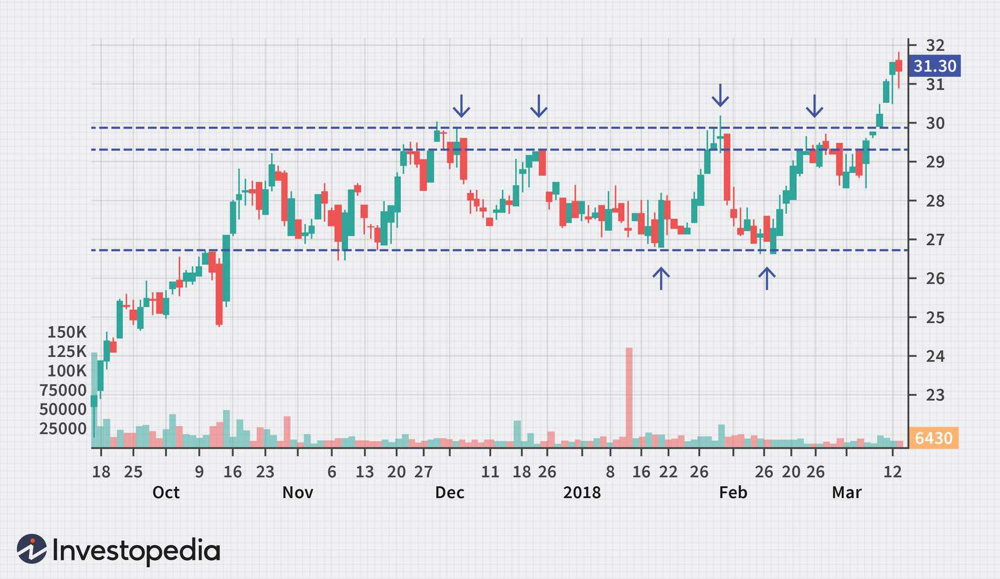

Range-bound trading and algorithmic strategies are integral components of contemporary financial markets, offering traders distinct methodologies for navigating diverse market conditions. Range-bound trading is characterized by the identification and exploitation of price movements within predetermined support and resistance levels. Traders operating within this framework aim to capitalize on price fluctuations between these boundaries, seeking to buy at support and sell at resistance. This approach starkly contrasts with trend trading, which focuses on profiting from sustained directional price movements.

Algorithmic trading, or algo trading, refers to the use of computer algorithms to automate trading decisions, encompassing a wide spectrum of financial instruments. Algorithms can process vast amounts of data at high speed, executing trades with precision that manual trading cannot match. When applied to range-bound markets, algorithmic strategies can enhance trading efficiency and accuracy by systematically executing trades based on predefined criteria.



The integration of automated strategies in range-bound trading presents numerous benefits. Automation eliminates emotional decision-making, a common pitfall in human trading, allowing for consistent application of strategy. Algorithms can also operate continuously, capturing trading opportunities across different time zones without fatigue. Additionally, these strategies can be backtested against historical data, offering insights into potential performance even before real-world implementation.

The significance of combining range-bound trading with algorithmic strategies lies in their potential to generate stable returns in markets lacking clear trends. As markets frequently exhibit sideways movements, adeptly navigating these conditions can lead to consistent profitability. A trader employing algorithmic strategies can systematically identify range patterns, execute trades precisely, and manage risks more efficiently, reinforcing the importance of adopting technology-driven approaches in financial markets.

## Table of Contents

## Understanding Range-Bound Trading

Range-bound trading is a strategy employed in financial markets where traders aim to capitalize on securities that consistently fluctuate within a specific price range. This type of trading is characterized by the identification of key support and resistance levels, where support refers to a price level at which a security tends to stop falling and start rising, and resistance is a level where it tends to stop rising and start falling. The primary goal of range-bound traders is to buy near the lower boundary of the range (support) and sell near the upper boundary (resistance), thereby profiting from the repeated oscillations of the asset price between these two levels.

Range-bound trading is distinct from trend trading, where traders seek to profit from securities moving in a sustained direction — either upward or downward. Unlike trend trading, range-bound trading focuses on capturing profits from markets that exhibit little to no clear directional movement and instead form sideways patterns. Range-bound markets typically present predictable price swings, making them suitable for strategies that rely on consistent price reversion to the mean or to established levels. This can be advantageous because the lack of strong trends often results in lower volatility, reducing the risk of large unexpected price movements.

The preference for range-bound strategies arises from their potential to generate consistent profits in sideways markets. Many financial instruments, particularly in stable economic environments, spend significant periods within well-defined price ranges. This offers opportunities for traders who develop and fine-tune strategies to exploit these patterns. While range-bound trading may limit the potential for outsized gains typical of [momentum](/wiki/momentum) or trend-following strategies, it compensates through the predictability and frequency of trading opportunities.

Traders who favor range-bound strategies often utilize technical analysis to identify potential ranges and to assess the strength of support and resistance levels. Utilizing historical price data, traders can deploy indicators such as Bollinger Bands, Relative Strength Index (RSI), and Moving Averages to refine their strategy and confirm the validity of identified ranges. Additionally, these strategies may incorporate stop-loss orders to manage unexpected breakouts from the established range, thereby preserving capital.

A basic Python script to simulate a range-bound trading strategy might use historical data to test potential trades around support and resistance levels. Here's a simplified example:

```python
import numpy as np
import pandas as pd

# Load historical data
data = pd.read_csv('historical_data.csv')  # Import historical data
prices = data['Close'].values

# Define support and resistance levels
support_level = np.percentile(prices, 25)  # Use 25th percentile for support
resistance_level = np.percentile(prices, 75)  # Use 75th percentile for resistance

# Simulate range-bound strategy
capital = 10000  # Initial capital
position = 0  # Initial position (0 indicates not holding the asset)

for price in prices:
    if price < support_level and position == 0:
        # Buy signal
        position = capital / price
        capital = 0
        print(f"Buying at {price}")
    elif price > resistance_level and position > 0:
        # Sell signal
        capital = position * price
        position = 0
        print(f"Selling at {price}")

print(f"Final capital: {capital}")
```

This example illustrates a basic approach where buy and sell signals are generated when prices cross predetermined support and resistance levels. By adhering to disciplined strategies, traders can make the most of range-bound markets, leveraging their characteristics for steady gains.

## Effective Strategies for Range-Bound Trading

Range-bound trading involves capitalizing on price movements that fluctuate between established support and resistance levels without significant [breakout](/wiki/breakout-trading) trends. A fundamental strategy within this approach involves buying near the support and selling near the resistance. This tactic is based on the idea that prices tend to reverse at these technical levels, allowing traders to generate profits through anticipated price retractions. 

**Buying at Support and Selling at Resistance:**

Support is the price level at which demand is strong enough to prevent the price from declining further. When an asset reaches this level, traders anticipate a rebound and may initiate buy orders. Conversely, resistance is a price level where selling pressure exceeds buying, preventing further upward movement. The strategy involves short-selling or taking profits near this threshold. Traders commonly use historical data and technical indicators like moving averages or Bollinger Bands to identify these levels.

**Use of Options in Range-Bound Trading:**

Options offer additional flexibility in executing range-bound strategies. One common approach is to use strangles or straddles, where traders buy both call options and put options at similar strike prices, often centered around the current price, betting on [volatility](/wiki/volatility-trading-strategies) within the range. Alternatively, traders might sell options at these key support or resistance levels to earn premium income. For example, selling a call at resistance and a put at support can be profitable, provided the underlying asset remains within the specified range. This strategy capitalizes on the asset's lack of movement, enabling the trader to capture the decay of the option premium due to time passage (theta decay).

**Confirming Range Patterns to Avoid False Signals:**

Accurate identification of support and resistance levels is crucial to avoid entering or exiting positions based on false signals, which can result from temporary price spikes. Traders employ a combination of technical tools to confirm these patterns. Moving averages and oscillators, such as the Relative Strength Index (RSI) or the Moving Average Convergence Divergence (MACD), can provide insights into overbought or oversold conditions, reinforcing the validity of support and resistance levels. Volume analysis also plays a role, as significant [volume](/wiki/volume-trading-strategy) often accompanies genuine breakouts or rebounds within a range. Proper confirmation reduces the likelihood of falling victim to market noise and enhances the effectiveness of range-bound strategies.

By employing these strategies thoughtfully, traders can potentially exploit price stability within defined ranges, achieving consistent returns while minimizing exposure to significant trends or volatilities.

## Algorithmic Trading in Range-Bound Markets

Algorithmic trading involves the use of computer algorithms designed to execute investment strategies at precise timings, driven by pre-determined criteria and mathematical models. In range-bound markets, where prices fluctuate within a particular set of limits—known as resistance and support levels—[algorithmic trading](/wiki/algorithmic-trading) proves to be particularly beneficial. Algorithms can efficiently operate within these constraints to capitalize on predictable movements.

The implementation of algorithms in range-bound markets offers several advantages. Primarily, algorithms facilitate increased speed and precision in trade execution. Speed is crucial in financial markets where prices can shift within milliseconds. An algorithm can swiftly place trades at the identified support or resistance points, thus taking advantage of short-term price variations more effectively than a human trader might manage manually. Such precision ensures that trading actions adhere strictly to the pre-defined strategy without deviation.

Another benefit of algorithmic trading is the ability to minimize human bias, which can often distort trading decisions. For traders employing a range-bound strategy, algorithms can help sustain objectivity by making consistent decisions based purely on data and statistical inputs. The algorithm can be programmed to follow a set of rules even during volatile conditions, maintaining discipline in the trading process.

Further enhancing its utility, algorithmic trading systems can automate the detection of range-bound conditions. By employing sophisticated mathematical models and statistical methods, algorithms can analyze historical price data to ascertain whether a market is indeed range-bound. This involves calculating metrics such as the standard deviation of prices or using indicators like the Relative Strength Index (RSI) to confirm a lack of trending behavior.

Consider the following Python snippet, which leverages a simple moving average (SMA) and RSI to detect range-bound conditions:

```python
import pandas as pd

def is_range_bound(prices, short_window=40, long_window=100, rsi_threshold=(30, 70)):
    data = pd.DataFrame(prices, columns=['Close'])

    data['SMA_short'] = data['Close'].rolling(window=short_window).mean()
    data['SMA_long'] = data['Close'].rolling(window=long_window).mean()
    data['RSI'] = 100 - (100 / (1 + data['Close'].pct_change().apply(np.exp).rolling(window=14).mean()))

    # Check if the SMAs are close and RSI is neutral.
    sma_convergence = (abs(data['SMA_short'] - data['SMA_long']) / data['SMA_long']).iloc[-1] < 0.01
    rsi_neutral = rsi_threshold[0] < data['RSI'].iloc[-1] < rsi_threshold[1]

    return sma_convergence and rsi_neutral

prices = [...]  # Historical price data
is_range = is_range_bound(prices)
```

This program examines the convergence of short and long-term SMAs and a neutral RSI range to suggest a range-bound market condition. With this automated approach, traders ensure that they only engage in the market when the conditions fit the designated criteria, optimizing the chances of successful market entries and exits.

Overall, algorithmic trading significantly enhances the efficacy of trading strategies in range-bound markets by ensuring swift, bias-free, and precise trading decisions, ultimately aiding traders in extracting consistent profits from sideways markets.

## Developing a Range-Bound Algorithmic Trading Strategy

To develop a range-bound algorithmic trading strategy, several key elements must be considered to ensure efficacy and reliability. These elements include data analysis, [backtesting](/wiki/backtesting), the utilization of robust trading platforms and APIs, and potentially integrating [machine learning](/wiki/machine-learning) techniques to enhance the strategy's performance.

**Data Analysis and Backtesting**

Effective data analysis is foundational for any algorithmic trading strategy, and range-bound trading is no exception. Traders should utilize historical price data to identify patterns where asset prices have moved within a certain range, identifying key support and resistance levels. This data assists in verifying the historical accuracy of proposed strategies and predicting future behavior.

Backtesting is another critical component, allowing traders to simulate their strategies against historical data to evaluate performance. Key metrics to analyze during backtesting include the strategy's return on investment (ROI), drawdowns, and the frequency of profitable versus unprofitable trades. A well-tested strategy will show consistent profitability when applied to the data set, indicating its potential success in live trading scenarios.

Example of a simple backtesting strategy in Python:

```python
import pandas as pd
import numpy as np

# Sample historical data
data = pd.read_csv('historical_price_data.csv')
prices = data['Close']

# Define range boundaries
support_level = prices.min() + 0.01 * (prices.max() - prices.min())
resistance_level = prices.max() - 0.01 * (prices.max() - prices.min())

# Strategy logic: buy at support, sell at resistance
signals = np.where(prices < support_level, 1, 0) - np.where(prices > resistance_level, 1, 0)
data['Signal'] = signals

# Calculate returns
data['Return'] = data['Signal'].shift(1) * (data['Close'].pct_change())
cumulative_return = (1 + data['Return']).cumprod()

print(f"Cumulative Return: {cumulative_return.iloc[-1] - 1:.2%}")
```

**Trading Platforms and APIs**

Using robust trading platforms and APIs is crucial for executing a range-bound strategy effectively. These tools provide access to real-time market data, fast order execution, and automated monitoring. Platforms like MetaTrader, [Interactive Brokers](/wiki/interactive-brokers-api), and specialized APIs such as Alpaca or QuantConnect enable traders to deploy their algorithms with precision. These tools also support integration with various programming languages, facilitating the automation of strategy updates and decision-making processes in real-time.

**Machine Learning in Range-Bound Strategies**

Machine learning (ML) can significantly enhance a range-bound trading strategy by identifying non-obvious patterns and improving decision-making processes. Techniques such as supervised learning can be employed to predict the probability of price movements within ranges, while unsupervised learning can cluster similar range-bound behaviors for further analysis.

An example of incorporating machine learning might involve using a classification model to predict whether the price will touch the support or resistance level next, based on historical indicators:

```python
from sklearn.model_selection import train_test_split
from sklearn.ensemble import RandomForestClassifier

# Example features and labels for model
features = data[['Previous Close', 'Moving Average', 'Volume']]
labels = data['Signal'].shift(-1)

# Split data into training and testing sets
X_train, X_test, y_train, y_test = train_test_split(features, labels, test_size=0.2)

# Train the model
model = RandomForestClassifier()
model.fit(X_train, y_train)

# Make predictions
predictions = model.predict(X_test)
```

Incorporating machine learning allows for more nuanced decision-making, effectively managing the complex and often nonlinear relationships between market variables. However, it is important to mitigate risks such as overfitting, which can significantly impact the strategy's robustness when applied to new data.

By validating range-bound strategies through comprehensive data analysis, leveraging advanced trading tools, and potentially integrating machine learning, traders can develop algorithmic approaches that are both precise and adaptive to the complexities of financial markets.

## Risk Management and Common Pitfalls

Range-bound trading poses several risks, which can be effectively managed using algorithmic strategies. One primary concern is the risk associated with false signals that occur when price fluctuations breach set support or resistance levels, leading to potential losses. Algorithms can address these false breaks by incorporating filters, such as volume confirmation or the Average True Range (ATR), to ascertain the validity of a breakout before executing trades.

Transaction costs and slippage significantly impact range-bound trading's effectiveness, especially given the frequent trades involved. Algorithms can mitigate these by optimizing trade sizes and entry points using techniques like VWAP (Volume Weighted Average Price) or TWAP (Time Weighted Average Price), which distribute orders in a way that minimizes market impact and aligns execution prices more closely with target entry or [exit](/wiki/exit-strategy) values.

Another critical risk is overfitting in algorithmic strategy development. Overfitting occurs when an algorithm is excessively tailored to historical data, resulting in poor performance in live markets. To prevent this, strategies should be backtested and validated on out-of-sample data, ensuring they adapt well to new market conditions without relying too heavily on past price patterns.

Diversification is a crucial strategy to reduce risk within range-bound trading. By not relying solely on a single pair or market, traders can spread exposure across different assets, reducing the impact of unfavorable movements in any one range. Algorithms can facilitate diversification by scanning multiple markets simultaneously, identifying multiple range-bound conditions, and distributing capital across them to balance risk. 

The combination of these algorithmic strategies—efficient order execution, prudent risk controls, and diversified exposure—helps in effectively managing the inherent risks of range-bound trading, providing a buffer against losses and improving the prospect for consistent returns.

## Conclusion

Algorithmic strategies in range-bound trading offer numerous advantages within financial markets. One of the primary benefits is the potential for consistent returns. Automated systems enforce a disciplined approach, systematically executing trades based on pre-defined criteria. This removes emotional decision-making, which often leads to errors and inconsistencies in manual trading.

The predictability of range-bound markets, characterized by well-defined support and resistance levels, enhances the effectiveness of algorithmic strategies. Algorithms can efficiently capitalize on these predictable price moves, executing trades with greater speed and precision than human traders. This speed allows for exploiting small price oscillations within the range, often overlooked in manual trading.

Additionally, the integration of cutting-edge technology is crucial for maximizing the effectiveness of range-bound trading strategies. Advanced trading platforms provide real-time data, robust backtesting capabilities, and access to sophisticated order types. These tools, combined with the power of machine learning, can refine algorithms, enabling them to adapt to subtle market changes and improve their predictive accuracy.

Machine learning models, such as support vector machines or neural networks, can be employed to identify and predict range-bound conditions more accurately. For instance, a Python implementation utilizing libraries like TensorFlow or scikit-learn can enhance the detection of market patterns, ensuring the algorithm adapts swiftly to changing market dynamics.

Traders are encouraged to explore range-bound trading strategies, leveraging technology to optimize their trading systems. By embracing algorithmic trading within defined price ranges, traders can harness the full potential of automated systems, potentially achieving consistent profitability. This approach melds the analytical power of algorithms with the systematic nature of range-bound strategies, paving the way for more reliable and efficient trading in financial markets.

## References & Further Reading

[1]: Bergstra, J., Bardenet, R., Bengio, Y., & Kégl, B. (2011). ["Algorithms for Hyper-Parameter Optimization."](https://dl.acm.org/doi/10.5555/2986459.2986743) Advances in Neural Information Processing Systems 24.

[2]: ["Advances in Financial Machine Learning"](https://www.amazon.com/Advances-Financial-Machine-Learning-Marcos/dp/1119482089) by Marcos Lopez de Prado

[3]: ["Evidence-Based Technical Analysis: Applying the Scientific Method and Statistical Inference to Trading Signals"](https://www.amazon.com/Evidence-Based-Technical-Analysis-Scientific-Statistical/dp/0470008741) by David Aronson

[4]: ["Machine Learning for Algorithmic Trading"](https://github.com/stefan-jansen/machine-learning-for-trading) by Stefan Jansen

[5]: ["Quantitative Trading: How to Build Your Own Algorithmic Trading Business"](https://www.amazon.com/Quantitative-Trading-Build-Algorithmic-Business/dp/1119800064) by Ernest P. Chan