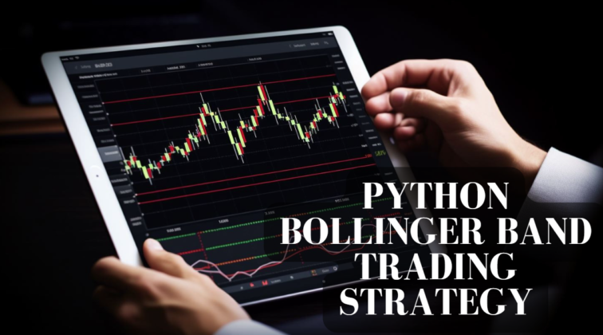

In the world of trading, finding an effective strategy is paramount to success. Technical analysis plays a crucial role in developing such strategies by providing insights into price movements and market conditions. Among the numerous tools available to traders, the combination of the Relative Strength Index (RSI) and Bollinger Bands stands out for its effectiveness.

The RSI, a momentum oscillator, measures the speed and change of price movements, helping traders identify overbought and oversold conditions. It is calculated using the formula:



$$

RSI = 100 - \left(\frac{100}{1 + RS}\right)
$$

where $RS$ is the average of $x$ days' up closes divided by the average of $x$ days' down closes. Values above 70 generally indicate overbought conditions, while values below 30 suggest an oversold market.

Bollinger Bands, on the other hand, consist of a Simple Moving Average (SMA) and two standard deviation lines. These bands expand and contract based on market volatility, offering a visual guide to potential price ranges. The upper band is calculated as:

$$

\text{Upper Band} = \text{SMA} + k \times \text{Standard Deviation}
$$

and the lower band as:

$$

\text{Lower Band} = \text{SMA} - k \times \text{Standard Deviation}
$$

where $k$ is often set to 2 in practice.

This article aims to guide readers on leveraging RSI and Bollinger Bands as components of an [algorithmic trading](/wiki/algorithmic-trading) strategy. By using these indicators together, traders can better refine their entry and [exit](/wiki/exit-strategy) points, enhancing overall trading outcomes. The synergy between RSI and Bollinger Bands provides a comprehensive framework for evaluating market [momentum](/wiki/momentum) and [volatility](/wiki/volatility-trading-strategies) simultaneously, ultimately leading to more informed trading decisions.

## Table of Contents

## Understanding Bollinger Bands

Bollinger Bands are a widely utilized technical analysis tool designed to measure market volatility. Created by John Bollinger in the early 1980s, they consist of three lines that encapsulate price action. The middle line of the Bollinger Bands is a Simple Moving Average (SMA) which typically uses a 20-day period. This SMA provides a baseline around which the upper and lower bands are constructed.

The upper and lower bands are calculated as follows:

- Upper Band = SMA + (k × Standard Deviation)
- Lower Band = SMA - (k × Standard Deviation)

where 'k' is a multiplier that determines the distance of the bands from the SMA, commonly set to 2. These bands adjust to market volatility, expanding when volatility increases and contracting during periods of reduced volatility. This dynamic behavior offers traders a visual representation of potential price ranges and helps highlight overbought or oversold conditions.

Python code to calculate Bollinger Bands might look like this:

```python
import pandas as pd

def calculate_bollinger_bands(prices, window=20, num_sd=2):
    sma = prices.rolling(window=window).mean()
    rolling_std = prices.rolling(window=window).std()
    upper_band = sma + (rolling_std * num_sd)
    lower_band = sma - (rolling_std * num_sd)
    return sma, upper_band, lower_band

# Example usage with a pandas Series of prices
prices = pd.Series([...])  # Add your list of prices here
sma, upper_band, lower_band = calculate_bollinger_bands(prices)
```

The primary purpose of these bands is to help traders identify potential reversal points by observing where the price is relative to the bands. Prices touching or breaching the upper band may suggest an overbought market, whereas interactions with the lower band could indicate an oversold market. This visualization allows traders to make informed decisions regarding entry and exit points based on the prevailing market conditions.

## Decoding the Relative Strength Index (RSI)

The Relative Strength Index (RSI) is a widely-utilized momentum oscillator within the field of technical analysis, providing insights into the speed and magnitude of recent price changes. Developed by J. Welles Wilder Jr. in 1978, this indicator is instrumental for traders to ascertain potential entry and exit points in the market. The RSI operates within a numerical range of 0 to 100, offering a standardized method to judge the underlying strength or weakness of a financial instrument over a specific period, typically 14 days.

The core function of the RSI is to identify overbought or oversold conditions within the market. When the RSI value surpasses 70, it is indicative of overbought conditions, suggesting that the asset may be overvalued and a price correction could be imminent. Conversely, an RSI reading below 30 signals oversold conditions, implying that the asset may be undervalued and a price increase might be forthcoming.

The formula for calculating the RSI is as follows:

$$

RSI = 100 - \left( \frac{100}{1 + RS} \right)
$$

Where $RS$ (Relative Strength) is the average of $n$ days' up closes divided by the average of $n$ days' down closes. It is important to ensure that the correct period is selected for calculation, as shorter periods increase sensitivity to price movements, while longer periods provide a smoother indicator.

By effectively capturing market momentum, the RSI serves as a critical tool to forecast potential price reversals, allowing traders to optimize their trading strategies. This predictive capability makes the RSI indispensable for traders aiming to harness volatility and capitalize on market inefficiencies.

## Combining RSI and Bollinger Bands in Trading

The combination of Bollinger Bands and the Relative Strength Index (RSI) offers traders a robust framework to develop effective trading strategies. This approach capitalizes on both volatility and momentum indicators to generate reliable trading signals. When the price of an asset reaches the Bollinger Bands' extremes, that is, the upper or lower bands, it signifies potential overbought or oversold market conditions. Coupling this with the RSI, which indicates overbought conditions when its value is above 70 and oversold conditions when below 30, provides a powerful confirmation tool.

For instance, consider a scenario where the price touches the upper Bollinger Band and simultaneously, the RSI reading is above 70. This suggests that the asset might be overbought, presenting a potential opportunity for traders to sell or short. Conversely, when the price hits the lower Bollinger Band and the RSI drops below 30, it indicates oversold conditions, suggesting a possible buying opportunity. This dual approach helps filter out false positives, as the convergence of signals from both Bollinger Bands and RSI is rarer and generally signals stronger market patterns than either indicator alone.

Utilizing these indicators in tandem enhances trading confidence by providing a more comprehensive view of market dynamics, thus empowering traders to make more informed decisions. This methodology also mitigates the risks associated with relying on a single indicator, which might lead to premature or delayed market entry and exits. By confirming signals through the alignment of volatility and momentum indicators, traders can achieve greater consistency and potentially improve their overall trading performance.

## Algorithmic Trading with RSI and Bollinger Bands

Algorithmic trading leverages predefined rules often informed by indicators such as the Relative Strength Index (RSI) and Bollinger Bands to systematically execute trades. This automation allows traders to capitalize on market opportunities swiftly and efficiently, reducing the influence of human emotions and errors. The process involves the integration of these technical indicators into a trading algorithm that automatically analyzes market data and executes buy or sell orders when specified conditions are met.

To effectively implement a trading algorithm using RSI and Bollinger Bands, traders must first establish the specific rules that trigger trade signals. For instance, a trade might be initiated when the RSI crosses below 30, indicating oversold conditions, and concurrently, the market price touches or falls below the lower Bollinger Band. In contrast, a sell signal might be triggered when the RSI exceeds 70, denoting overbought conditions, while the price touches or exceeds the upper Bollinger Band.

The implementation can be articulated through a simple Python script using popular libraries such as Pandas for data manipulation and TA-Lib for technical analysis:

```python
import pandas as pd
import talib

# Retrieve historical market data
data = pd.read_csv('historical_data.csv')
close_prices = data['close']

# Calculate Bollinger Bands
upper_band, middle_band, lower_band = talib.BBANDS(close_prices, timeperiod=20, nbdevup=2, nbdevdn=2, matype=0)

# Calculate RSI
rsi = talib.RSI(close_prices, timeperiod=14)

# Define trading signals
buy_signals = (rsi < 30) & (close_prices <= lower_band)
sell_signals = (rsi > 70) & (close_prices >= upper_band)

# Execute trades based on signals
data['Buy'] = buy_signals
data['Sell'] = sell_signals
```

A critical phase of this algorithmic trading approach is [backtesting](/wiki/backtesting), which involves running the algorithm on historical data to assess its performance. Backtesting provides insights into the algorithm's strengths and weaknesses and helps refine the trading rules before real-time implementation. Optimization follows, where the parameters, such as RSI thresholds or the Bollinger Bands' moving average period, are adjusted to enhance strategy performance.

A comprehensive backtesting framework ensures that the strategy is robust and can withstand various market conditions. It often involves detailed analysis of metrics such as the Sharpe ratio, maximum drawdown, and win-loss ratio. This iterative process of testing and optimization is crucial for developing an effective trading strategy that aligns with the trader's risk tolerance and market perspective.

## Practical Example of Trading Strategy

To illustrate the power of combining RSI and Bollinger Bands in a trading strategy, consider the following practical example using historical stock data. For this example, assume we are working with daily price data of a hypothetical stock over a six-month period.

### Buy Signal Example

A potential buy moment is indicated when the RSI falls below 30 and the price touches the lower Bollinger Band. This combination suggests the stock is currently oversold and trading near the lower edge of its recent volatility range. Upon these conditions being met, traders might consider entering a long position.

#### Step-by-Step Python Code

```python
import pandas as pd
import numpy as np
import talib

# Load your data
data = pd.read_csv('stock_data.csv')  # Replace with your data source
close_prices = data['Close']

# Calculate Bollinger Bands
upper_band, middle_band, lower_band = talib.BBANDS(close_prices, timeperiod=20, nbdevup=2, nbdevdn=2, matype=0)

# Calculate RSI
rsi = talib.RSI(close_prices, timeperiod=14)

# Identify Buy Conditions
buy_signals = (rsi < 30) & (close_prices <= lower_band)

# Output buy signal dates
buy_dates = data.index[buy_signals].tolist()
print("Buy on these dates:", buy_dates)
```

### Sell Signal Example

Conversely, a potential sell signal occurs when the RSI exceeds 70 and the price touches the upper Bollinger Band, indicating the stock is overbought and trading near the upper edge of its volatility range.

#### Continuation of Python Code

```python
# Identify Sell Conditions
sell_signals = (rsi > 70) & (close_prices >= upper_band)

# Output sell signal dates
sell_dates = data.index[sell_signals].tolist()
print("Sell on these dates:", sell_dates)
```

### Analysis

In this hypothetical example, the strategy signals a buy when the market may be ready to rebound and a sell when it could be poised to decline. By consistently applying these technical signals, traders seek to capitalize on temporary mispricings in the market, potentially leading to profitable trades.

This approach can be backtested using historical data to evaluate its effectiveness over time. Parameter optimization, such as testing different RSI levels or adjusting the Bollinger Bands' standard deviation, can further refine the strategy to accommodate varying market conditions.

## Benefits and Challenges

Using the Relative Strength Index (RSI) and Bollinger Bands in trading strategies is beneficial as it provides traders with systematic and rule-based approaches for entry and exit points, which can lead to increased accuracy. The synergy of these two indicators enables traders to navigate market dynamics with an informed perspective rather than relying on emotions or speculative judgments.

One primary advantage of utilizing RSI and Bollinger Bands is the ability to interpret market signals with greater precision. By focusing on specific thresholds such as the RSI levels of 30 and 70, traders can objectively assess potential overbought or oversold conditions. This method reduces the likelihood of impulsive decisions that often result from emotional trading. The use of these indicators in tandem provides traders with clear guidelines for reacting to price movements that reach the upper or lower bounds of the Bollinger Bands, thereby enhancing the execution of trades at optimal moments.

However, the strategy is not without its challenges. One significant challenge is the necessity for ongoing parameter adjustments. Market conditions are dynamic, requiring traders to continually assess and refine the parameters used in both the RSI and Bollinger Bands to ensure continued efficacy. This often involves adjusting the period settings or the standard deviation levels used in the Bollinger Bands, as well as the period for calculating the RSI to match volatility and price trends.

Another challenge is the potential for rapid and significant changes in the market, which can adversely impact the performance of established models. For instance, during periods of heightened market volatility, the parameters that were effective in calmer conditions might lead to false signals or missed opportunities. Consequently, traders must be vigilant in monitoring market changes and be prepared to recalibrate their strategies in response.

To illustrate, let’s consider a basic Python implementation for dynamically adjusting RSI and Bollinger Bands parameters based on recent historical data:

```python
import pandas as pd

def calculate_bollinger_bands(prices, window=20, num_std_dev=2):
    sma = prices.rolling(window).mean()
    std_dev = prices.rolling(window).std()

    upper_band = sma + (std_dev * num_std_dev)
    lower_band = sma - (std_dev * num_std_dev)

    return upper_band, lower_band

def calculate_rsi(prices, window=14):
    delta = prices.diff()
    gain = (delta.where(delta > 0, 0)).rolling(window).mean()
    loss = (-delta.where(delta < 0, 0)).rolling(window).mean()
    rs = gain / loss
    rsi = 100 - (100 / (1 + rs))

    return rsi

# Example usage
historical_prices = pd.Series([/* historical price data */])
upper_band, lower_band = calculate_bollinger_bands(historical_prices)
rsi = calculate_rsi(historical_prices)

# Dynamic adjustment logic could be added here as needed
```

Traders can use and adapt similar scripts to automate parameter adjustments, thereby maintaining the robustness of their trading strategies. Both the benefits and challenges underscore the importance of a disciplined, informed approach when applying technical indicators like RSI and Bollinger Bands in trading.

## Conclusion

Mastering the combination of Bollinger Bands and RSI can open new opportunities in trading. This dynamic duo offers traders a comprehensive toolset for making informed decisions by capturing both market volatility and momentum. Through effectively utilizing these indicators, traders can develop strategies that are responsive to market conditions.

Whether incorporated into manual or automated trading strategies, the synergy between Bollinger Bands and RSI enhances the precision of entry and exit points. By providing a clearer picture of potential price reversals and trends, this approach empowers traders to act with greater confidence and reduces the likelihood of emotional decisions often driven by market noise.

The flexibility of combining these indicators is beneficial for a variety of trading styles, from short-term [scalping](/wiki/gamma-scalping) to long-term investments. Traders are advised to continue testing and refining their strategies to align with their specific needs and risk profiles. The iterative process of backtesting and optimization is crucial to adapt the strategy to changing market environments. 

To demonstrate, a straightforward Python script for backtesting a basic strategy using Bollinger Bands and RSI could look like this:

```python
import pandas as pd
import numpy as np

# Function to calculate Bollinger Bands
def bollinger_bands(data, window=20, num_std=2):
    rolling_mean = data['Close'].rolling(window).mean()
    rolling_std = data['Close'].rolling(window).std()
    data['Upper Band'] = rolling_mean + (rolling_std * num_std)
    data['Lower Band'] = rolling_mean - (rolling_std * num_std)
    return data

# Function to calculate RSI
def rsi(data, periods=14):
    delta = data['Close'].diff(1)
    gain = delta.where(delta > 0, 0)
    loss = -delta.where(delta < 0, 0)
    avg_gain = gain.rolling(window=periods).mean()
    avg_loss = loss.rolling(window=periods).mean()
    rs = avg_gain / avg_loss
    data['RSI'] = 100 - (100 / (1 + rs))
    return data

# Example applying both functions
data = pd.read_csv('historical_data.csv')
data = bollinger_bands(data)
data = rsi(data)

# Sample strategy using the calculated indicators
def generate_signals(data):
    data['Signal'] = np.where((data['Close'] < data['Lower Band']) & (data['RSI'] < 30), 'Buy', 
                      np.where((data['Close'] > data['Upper Band']) & (data['RSI'] > 70), 'Sell', 'Hold'))
    return data

signals = generate_signals(data)
```

This simple script illustrates the calculation of Bollinger Bands and RSI, and subsequently generates buy and sell signals based on their confluence. It underscores the importance of ongoing refinement to ensure relevance across different market scenarios. By continually testing and adjusting their strategies, traders can confidently navigate the complexities of the financial markets.

## References & Further Reading

[1]: Wilder, J. W. (1978). ["New Concepts in Technical Trading Systems."](https://archive.org/details/newconceptsintec00wild) Trend Research.

[2]: Bollinger, J. (2002). ["Bollinger on Bollinger Bands."](https://archive.org/download/BollingerOnBollingerBands/Bollinger%20On%20Bollinger%20Bands.pdf) McGraw-Hill Education.

[3]: Aronson, D. R. (2007). ["Evidence-Based Technical Analysis: Applying the Scientific Method and Statistical Inference to Trading Signals."](https://onlinelibrary.wiley.com/doi/book/10.1002/9781118268315) Wiley.

[4]: Pring, M. J. (1991). ["Technical Analysis Explained: The Successful Investor's Guide to Spotting Investment Trends and Turning Points."](https://archive.org/details/technicalanalysi00prin) McGraw Hill Professional.

[5]: Murphy, J. J. (1999). ["Technical Analysis of the Financial Markets: A Comprehensive Guide to Trading Methods and Applications."](https://archive.org/details/technicalanalysi0000murp) New York Institute of Finance.