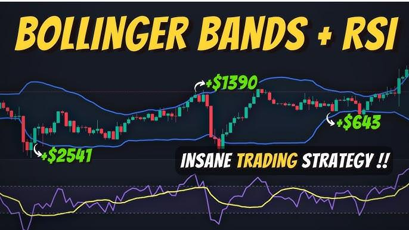

## Table of Contents

## What are Bollinger Bands and how are they calculated?

Bollinger Bands are a tool used in trading to help understand how a stock or other financial thing is moving. They were made by a guy named John Bollinger. The bands are made up of three lines: the middle line is the average price of the thing over a certain time, and the other two lines are above and below this middle line. These outer lines show how much the price can go up or down from the average.

To calculate Bollinger Bands, you start by finding the moving average of the price over a certain number of days, usually 20 days. This moving average is the middle line. Then, you figure out how much the price changes from this average, which is called the standard deviation. The top band is the moving average plus two times the standard deviation, and the bottom band is the moving average minus two times the standard deviation. This way, the bands show a range where the price is likely to stay.

## What is the Relative Strength Index (RSI) and how is it used in trading?

The Relative Strength Index (RSI) is a tool traders use to see if a stock or other thing they are trading is being bought a lot or sold a lot. It gives a number between 0 and 100. If the RSI is above 70, it might mean the thing is being bought too much and could go down in price soon. If it's below 30, it might mean it's being sold too much and could go up in price soon.

Traders use the RSI to help them decide when to buy or sell. For example, if the RSI goes below 30, a trader might think it's a good time to buy because the price might go up soon. If the RSI goes above 70, they might think it's a good time to sell because the price might go down. But, the RSI is just one tool, and traders usually look at other things too before making a decision.

## How can Bollinger Bands be used to identify overbought and oversold conditions?

Bollinger Bands can help traders see if a stock or another thing they're trading is overbought or oversold. When the price touches or goes above the top band, it might mean the thing is overbought. This means a lot of people are buying it, and the price might be too high and could go down soon. On the other hand, when the price touches or goes below the bottom band, it might mean the thing is oversold. This means a lot of people are selling it, and the price might be too low and could go up soon.

Traders use these signals to make decisions. If the price is near the top band, a trader might think about selling because the price might drop. If the price is near the bottom band, they might think about buying because the price might rise. But, it's important to remember that Bollinger Bands are just one tool. Traders usually look at other things too before they decide to buy or sell.

## What are the typical settings for Bollinger Bands and RSI, and how can they be adjusted for different trading strategies?

The typical settings for Bollinger Bands are a 20-day period for the moving average and two standard deviations for the upper and lower bands. For the Relative Strength Index (RSI), the typical setting is a 14-day period, which gives a number between 0 and 100. These settings are what most people start with when they use these tools to look at how a stock or other thing is doing.

But, traders can change these settings to fit different trading strategies. If a trader wants to see how a stock is doing over a shorter time, they might use a shorter period for the Bollinger Bands, like 10 days, or for the RSI, like 7 days. This can help them see quicker changes in the price. If they want to see how it's doing over a longer time, they might use a longer period, like 50 days for Bollinger Bands or 21 days for RSI. Also, some traders might change the number of standard deviations for Bollinger Bands, like using 2.5 or 1.5, to make the bands wider or narrower. This can help them see different levels of overbought or oversold conditions.

## How do you combine Bollinger Bands and RSI to create a basic trading strategy?

You can use Bollinger Bands and RSI together to make a simple trading plan. When the price of a stock touches the bottom Bollinger Band and the RSI is below 30, it might be a good time to buy. This means the stock could be oversold, and the price might go up soon. On the other hand, if the price touches the top Bollinger Band and the RSI is above 70, it might be a good time to sell. This means the stock could be overbought, and the price might go down soon.

But, it's important to not just rely on these two tools. You should also look at other things like the news about the company, how the whole market is doing, and other signs that might tell you more about the stock. Using Bollinger Bands and RSI together can help you make better guesses about when to buy or sell, but they are just part of a bigger picture in trading.

## What are the entry and exit signals when using Bollinger Bands and RSI together?

When you use Bollinger Bands and RSI together, you look for certain signs to know when to buy or sell a stock. A good time to buy might be when the stock's price touches the bottom Bollinger Band and the RSI is below 30. This means the stock could be oversold, and it might be a good time to buy because the price could go up soon. On the other hand, a good time to sell might be when the stock's price touches the top Bollinger Band and the RSI is above 70. This means the stock could be overbought, and it might be a good time to sell because the price could go down soon.

It's important to remember that these signs are just part of making a trading plan. You should also look at other things like news about the company, how the whole market is doing, and other signs that might tell you more about the stock. Using Bollinger Bands and RSI together can help you make better guesses about when to buy or sell, but they are just tools to help you make decisions, not the only things you should look at.

## How can you backtest a trading strategy that uses Bollinger Bands and RSI?

To backtest a trading strategy that uses Bollinger Bands and RSI, you need to look at past data to see how well your plan would have worked. You can use a computer program or a special tool to do this. First, you set up your strategy rules, like buying when the price touches the bottom Bollinger Band and the RSI is below 30, and selling when the price touches the top Bollinger Band and the RSI is above 70. Then, you run the program with old stock data to see if your strategy would have made money or lost money in the past.

When you backtest, you should also think about things like how much money you would have made or lost, how often you would have bought and sold, and how long you would have held onto the stock. This helps you see if your strategy is good or if you need to change it. Remember, just because a strategy worked in the past doesn't mean it will work in the future, but [backtesting](/wiki/backtesting) can give you a good idea of how well your plan might work.

## What are common pitfalls and mistakes to avoid when using Bollinger Bands and RSI in trading?

One common mistake when using Bollinger Bands and RSI is relying on them too much. These tools are helpful, but they don't tell you everything. They are just part of the puzzle, and you should also look at other things like the news about the company, how the whole market is doing, and other signs that might tell you more about the stock. If you only use Bollinger Bands and RSI, you might miss important information that could affect your trading decisions.

Another pitfall is not adjusting the settings of Bollinger Bands and RSI to fit your trading strategy. The typical settings might not work for everyone. If you're looking at shorter time periods, you might want to change the settings to see quicker changes in the price. If you're looking at longer time periods, you might want to use different settings. Not adjusting these settings can lead to bad trading decisions because the tools might not be showing you the right information for your strategy.

Lastly, it's easy to get too excited when you see a signal from Bollinger Bands or RSI, like buying when the price touches the bottom band and the RSI is below 30. But, these signals can be misleading sometimes. The price might keep going down even after you buy, or it might not go up as much as you expect. It's important to wait for more signs or use other tools to confirm that it's really a good time to buy or sell. Always remember that no tool is perfect, and you should use them carefully.

## How can you optimize a Bollinger Bands and RSI strategy for different market conditions?

To make a Bollinger Bands and RSI strategy work well in different market conditions, you need to change the settings of these tools. In a market that moves a lot, you might want to use a shorter time period for Bollinger Bands, like 10 days instead of 20, and a shorter time period for RSI, like 7 days instead of 14. This helps you see quick changes in the price. In a market that doesn't move much, you might want to use a longer time period for Bollinger Bands, like 50 days, and a longer time period for RSI, like 21 days. This helps you see bigger trends and avoid getting tricked by small changes.

Another way to optimize your strategy is to look at other signs along with Bollinger Bands and RSI. For example, in a market that's going up a lot, you might want to wait for more signs that the price will keep going up before you buy. You could look at things like the overall market trend or news about the company. In a market that's going down a lot, you might want to wait for more signs that the price will stop going down before you sell. Using other tools like moving averages or [volume](/wiki/volume-trading-strategy) can help you make better decisions in different market conditions.

## What advanced techniques can be applied to enhance a Bollinger Bands and RSI trading strategy?

One advanced technique to enhance a Bollinger Bands and RSI strategy is to use different time frames. You can look at the stock's price on a daily chart to see the big picture and on a shorter time frame like an hourly chart to find the best time to buy or sell. This can help you make better decisions because you're looking at both the long-term trend and the short-term changes. Another technique is to use Bollinger Bandwidth, which measures how wide the Bollinger Bands are. When the bands are very close together, it might mean the price is about to move a lot, and you can use this information to get ready for a big change.

Another way to improve your strategy is to use something called Bollinger Band Squeeze. This happens when the bands get very close together, showing that the price isn't moving much. When this happens, and the RSI is in the middle range, like between 40 and 60, it might mean a big move is coming soon. You can get ready to buy or sell when you see the price start to move out of the squeeze. Also, using other tools like the Moving Average Convergence Divergence (MACD) can help confirm the signals from Bollinger Bands and RSI. If the MACD also shows a buy or sell signal at the same time as the Bollinger Bands and RSI, it can give you more confidence in your decision.

## How do you manage risk and set stop-losses in a strategy involving Bollinger Bands and RSI?

Managing risk and setting stop-losses in a strategy that uses Bollinger Bands and RSI is important to protect your money. A stop-loss is a price level where you decide to sell a stock to stop losing more money. When you use Bollinger Bands and RSI, you can set your stop-loss just below the bottom Bollinger Band if you're buying, or just above the top Bollinger Band if you're selling. This way, if the price moves against you and goes past the band, your stop-loss will kick in and help you limit your losses.

Another way to manage risk is to not put all your money into one stock. You can spread your money across different stocks or other things you're trading. This is called diversification, and it can help you not lose all your money if one stock does badly. Also, you can use a smaller part of your money for each trade, so if you lose, you don't lose a lot. By using these methods along with Bollinger Bands and RSI, you can make smarter choices and keep your money safer.

## Can you provide case studies or examples of successful trades using Bollinger Bands and RSI?

One example of a successful trade using Bollinger Bands and RSI happened with a stock called XYZ Corporation. The stock's price had been going down for a while, and it touched the bottom Bollinger Band. At the same time, the RSI was below 30, which meant the stock was oversold. A trader saw this as a good time to buy, thinking the price might go up soon. They bought the stock and set a stop-loss just below the bottom Bollinger Band to limit their risk. A few days later, the stock's price started to go up, and the RSI moved back above 30. The trader sold the stock when it touched the middle Bollinger Band, making a nice profit.

Another example involved a stock called ABC Inc. The stock's price had been going up and it touched the top Bollinger Band. At the same time, the RSI was above 70, which meant the stock was overbought. A trader saw this as a good time to sell, thinking the price might go down soon. They sold the stock and set a stop-loss just above the top Bollinger Band in case the price kept going up. A few days later, the stock's price started to go down, and the RSI moved back below 70. The trader bought back the stock when it touched the middle Bollinger Band, making a profit on the trade.

## What is the process for decoding the Relative Strength Index (RSI)?

The Relative Strength Index (RSI) is a widely-utilized [momentum](/wiki/momentum) oscillator within the field of technical analysis, providing insights into the speed and magnitude of recent price changes. Developed by J. Welles Wilder Jr. in 1978, this indicator is instrumental for traders to ascertain potential entry and [exit](/wiki/exit-strategy) points in the market. The RSI operates within a numerical range of 0 to 100, offering a standardized method to judge the underlying strength or weakness of a financial instrument over a specific period, typically 14 days.

The core function of the RSI is to identify overbought or oversold conditions within the market. When the RSI value surpasses 70, it is indicative of overbought conditions, suggesting that the asset may be overvalued and a price correction could be imminent. Conversely, an RSI reading below 30 signals oversold conditions, implying that the asset may be undervalued and a price increase might be forthcoming.

The formula for calculating the RSI is as follows:

$$

RSI = 100 - \left( \frac{100}{1 + RS} \right)
$$

Where $RS$ (Relative Strength) is the average of $n$ days' up closes divided by the average of $n$ days' down closes. It is important to ensure that the correct period is selected for calculation, as shorter periods increase sensitivity to price movements, while longer periods provide a smoother indicator.

By effectively capturing market momentum, the RSI serves as a critical tool to forecast potential price reversals, allowing traders to optimize their trading strategies. This predictive capability makes the RSI indispensable for traders aiming to harness [volatility](/wiki/volatility-trading-strategies) and capitalize on market inefficiencies.

## References & Further Reading

[1]: Wilder, J. W. (1978). ["New Concepts in Technical Trading Systems."](https://archive.org/details/newconceptsintec00wild) Trend Research.

[2]: Bollinger, J. (2002). ["Bollinger on Bollinger Bands."](https://archive.org/download/BollingerOnBollingerBands/Bollinger%20On%20Bollinger%20Bands.pdf) McGraw-Hill Education.

[3]: Aronson, D. R. (2007). ["Evidence-Based Technical Analysis: Applying the Scientific Method and Statistical Inference to Trading Signals."](https://onlinelibrary.wiley.com/doi/book/10.1002/9781118268315) Wiley.

[4]: Pring, M. J. (1991). ["Technical Analysis Explained: The Successful Investor's Guide to Spotting Investment Trends and Turning Points."](https://archive.org/details/technicalanalysi00prin) McGraw Hill Professional.

[5]: Murphy, J. J. (1999). ["Technical Analysis of the Financial Markets: A Comprehensive Guide to Trading Methods and Applications."](https://archive.org/details/technicalanalysi0000murp) New York Institute of Finance.