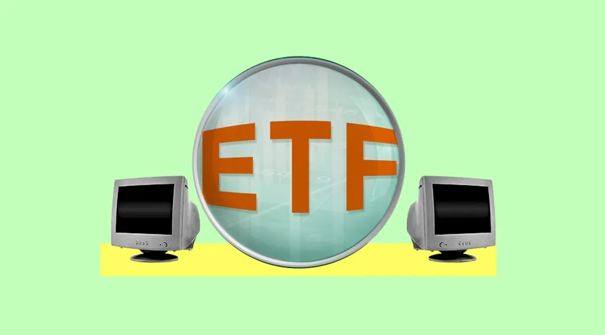

## Table of Contents

## What is an ETF and how does it work?

An ETF, or Exchange-Traded Fund, is a type of investment that works a lot like a mutual fund but trades on a stock exchange like a stock. It's a basket of securities, such as stocks, bonds, or commodities, that you can buy or sell throughout the trading day at market prices. ETFs are popular because they offer diversification, which means you're not putting all your eggs in one basket, and they often have lower fees than mutual funds.

When you buy shares of an ETF, you're essentially buying a small piece of each of the investments held by the fund. The value of the ETF goes up or down based on the performance of the underlying assets. For example, if an ETF tracks the S&P 500, its value will rise and fall with the overall performance of the companies in that index. ETFs can be a great way to invest in a broad market or a specific sector without having to pick individual stocks.

## How have ETFs evolved over time?

ETFs started in the early 1990s. The first one was called the SPDR S&P 500 ETF, which people also call "Spyder." It was made to follow the S&P 500 index. At first, ETFs were just about tracking indexes, which means they tried to do as well as a specific group of stocks or bonds. They were popular because they were easy to buy and sell and had low costs.

Over time, ETFs have changed a lot. Now, there are many different kinds of ETFs. Some still track indexes, but others focus on specific industries, like tech or health care. There are also ETFs that use special strategies to try to beat the market, called actively managed ETFs. Plus, ETFs have become very popular around the world, not just in the U.S. This has made it easier for people everywhere to invest in different markets and try new investment ideas.

In recent years, ETFs have kept growing and changing. They now include things like cryptocurrencies and environmental, social, and governance (ESG) factors. This means people can invest in things like Bitcoin or companies that are good for the planet. The variety of ETFs has made them a big part of many people's investment plans, and they keep getting more popular as more people learn about them.

## What role do computers play in the development of ETFs?

Computers have been really important in the development of ETFs. They help create and manage ETFs by doing a lot of the math and tracking needed to make sure the ETFs work right. For example, when an ETF is made to follow an index, computers use special programs to figure out which stocks or bonds to include and how much of each to buy. This helps keep the ETF's value in line with the index it's supposed to track. Without computers, it would be much harder and take a lot longer to do all this work.

Also, computers make it easier for people to buy and sell ETFs. They run the stock exchanges where ETFs are traded, making sure everything happens quickly and smoothly. When you want to buy or sell an ETF, you can do it online through a computer or a smartphone. Computers also help keep track of how much money you have in your ETFs and how well they are doing. This makes investing in ETFs easier and more accessible for everyone.

## What are computer-built ETFs and how do they differ from traditional ETFs?

Computer-built ETFs are a new type of ETF that use computer algorithms and artificial intelligence to create and manage the fund's investments. Instead of having people decide which stocks or bonds to include, these ETFs use computers to make those choices based on a lot of data and math. This can help the ETF find new ways to invest that people might not think of, and it can also help the ETF change its investments quickly if the market changes.

Traditional ETFs are usually made by people who decide which stocks or bonds to include based on certain rules or goals. For example, an ETF that tracks the S&P 500 will include the same stocks that are in the S&P 500, and people will make sure it stays up to date. The main difference between computer-built ETFs and traditional ETFs is how the investments are chosen and managed. Computer-built ETFs use technology to make decisions, which can be faster and might find new opportunities, while traditional ETFs rely on people to make those choices.

## What are the key technologies used in the creation of computer-built ETFs?

The main technology used in making computer-built ETFs is called machine learning. This is a kind of artificial intelligence where computers can learn from data and make decisions on their own. For ETFs, machine learning helps the computer look at a lot of information about stocks, like how they have done in the past and what people think about them now. Then, the computer can pick which stocks to include in the ETF and how much of each one to buy. This can help the ETF do better than if people were choosing the stocks.

Another important technology is called big data. This means the computer can handle and use a lot of information at once. For ETFs, big data lets the computer look at more things than a person could, like news articles, social media posts, and financial reports. By using all this information, the computer can find patterns and make better choices about what to invest in. Together, machine learning and big data help make computer-built ETFs smart and able to change quickly if the market does something unexpected.

## How do algorithms contribute to the management of computer-built ETFs?

Algorithms are like special recipes that computers follow to manage computer-built ETFs. They help the computer look at a lot of information, like how stocks have done before and what people are saying about them now. The algorithms use this information to decide which stocks to buy or sell and how much of each one to have in the ETF. This can make the ETF do better because the computer can find patterns and opportunities that people might miss.

These algorithms also help the ETF change quickly if something in the market changes. For example, if a company's stock suddenly goes down because of bad news, the algorithm can decide to sell that stock fast. This helps keep the ETF's value from going down too much. By using algorithms, computer-built ETFs can be smart and quick, making them a good choice for people who want to invest in a way that can adapt to what's happening in the market.

## What are the benefits of using computer-built ETFs for investors?

Computer-built ETFs can help investors in many ways. One big benefit is that they use computers to make smart choices about what to invest in. These computers look at a lot of information, like how stocks have done in the past and what people are saying about them now. This means the ETF can find good opportunities that might be hard for people to see. Also, because computers can look at so much information quickly, they can change the ETF's investments fast if something in the market changes. This can help keep the ETF's value from going down too much.

Another benefit is that computer-built ETFs can be easier for people to use. You don't need to know a lot about investing to use them because the computer does a lot of the work. This makes it simpler for anyone to start investing in a way that can adapt to what's happening in the market. Plus, these ETFs often have lower fees than ones managed by people, which means you get to keep more of your money. So, computer-built ETFs can be a good choice if you want an easy and smart way to invest.

## What are the potential risks and challenges associated with computer-built ETFs?

Computer-built ETFs use computers to make choices about what to invest in. But this can be risky because computers might make mistakes. They look at a lot of information, but sometimes they can miss important things or make the wrong guesses. If the computer makes a bad choice, it could hurt the value of the ETF and your investment. Also, because computers can change the ETF's investments quickly, it might make the ETF's value go up and down a lot, which can be scary for some investors.

Another challenge is that these ETFs can be hard to understand. They use fancy math and computer tricks that might be confusing for people who are new to investing. If you don't know how the computer is making its choices, it can be hard to trust the ETF. Plus, if something goes wrong with the computer or the information it uses, it can be hard to fix. So, it's important for investors to learn about how these ETFs work before they put their money in them.

## How do regulatory bodies oversee the development and operation of computer-built ETFs?

Regulatory bodies like the Securities and Exchange Commission (SEC) in the United States keep an eye on computer-built ETFs to make sure they follow the rules. They check the information that the ETFs share with investors to make sure it's honest and clear. They also look at how the ETFs are made and managed to make sure everything is done the right way. If a computer-built ETF does something wrong, the regulatory body can step in and make them fix it or even stop them from working.

These regulatory bodies also work to understand the new technology used in computer-built ETFs. They want to make sure that the computers are not doing anything risky or unfair. They might ask the people who make the ETFs to explain how their computers work and what they do. This helps the regulators make sure that the ETFs are safe for people to invest in. By keeping a close watch, regulatory bodies help protect investors and make sure that the market stays fair and honest.

## What case studies illustrate successful implementations of computer-built ETFs?

One good example of a successful computer-built ETF is the AQR Large Cap Defensive Style ETF (ADEF). This ETF uses computers to pick stocks that are less likely to go down a lot when the market is not doing well. The computers look at things like how much a company's earnings go up and down and how much debt the company has. By using this information, the ETF has been able to do better than the overall market during tough times. This makes it a good choice for people who want to protect their money when the market is risky.

Another example is the iMGP DBi Managed Futures Strategy ETF (DBMF). This ETF uses computers to invest in things like stocks, bonds, and commodities, but it can also bet that these things will go down in value. The computers use a lot of information to decide what to buy and sell, and they can change their choices quickly if the market changes. This ETF has been able to make money even when the market is going down, which is hard to do. It shows how computers can help find new ways to invest that can work well in different kinds of markets.

## How might advancements in AI and machine learning further influence the development of computer-built ETFs?

Advancements in AI and machine learning could make computer-built ETFs even better. As AI gets smarter, it can look at more information and find new patterns that people might miss. This means the ETFs can make better choices about what to buy and sell. Also, AI can learn from what it does, so it can get better over time. This could help the ETFs do better than the market and make more money for investors. Plus, with new technology, the ETFs can change their investments even faster when the market changes, which can help keep the value of the ETF from going down too much.

Another way AI and machine learning could help is by making ETFs easier for everyone to use. As the technology gets better, the computers can explain their choices in a simple way, so investors can understand what the ETF is doing. This can make people feel more comfortable investing in these ETFs. Also, AI can help make the ETFs cheaper to run, which means lower fees for investors. So, as AI and machine learning keep getting better, computer-built ETFs could become a smarter and easier way for people to invest their money.

## What future trends can we expect in the field of computer-built ETFs?

In the future, we might see more computer-built ETFs that use even smarter AI. These ETFs could look at even more information and find new ways to invest that people might not think of. They could also get better over time as they learn from what they do. This could help the ETFs make more money for investors and keep the value of the ETF from going down too much when the market is not doing well. Plus, with better technology, these ETFs could be cheaper to run, which means lower fees for people who invest in them.

Another trend we might see is that computer-built ETFs become easier for everyone to use. As AI gets better, it can explain its choices in simple ways, so people can understand what the ETF is doing. This can make people feel more comfortable putting their money into these ETFs. Also, we might see more types of computer-built ETFs, like ones that focus on new things like space travel or clean energy. This would give investors more choices and help them find ETFs that match what they care about.

## References & Further Reading

[1]: Bergstra, J., Bardenet, R., Bengio, Y., & Kégl, B. (2011). ["Algorithms for Hyper-Parameter Optimization."](https://dl.acm.org/doi/10.5555/2986459.2986743) Advances in Neural Information Processing Systems 24.

[2]: ["Advances in Financial Machine Learning"](https://www.amazon.com/Advances-Financial-Machine-Learning-Marcos/dp/1119482089) by Marcos Lopez de Prado

[3]: ["Evidence-Based Technical Analysis: Applying the Scientific Method and Statistical Inference to Trading Signals"](https://www.amazon.com/Evidence-Based-Technical-Analysis-Scientific-Statistical/dp/0470008741) by David Aronson

[4]: ["Machine Learning for Algorithmic Trading"](https://github.com/stefan-jansen/machine-learning-for-trading) by Stefan Jansen

[5]: ["Quantitative Trading: How to Build Your Own Algorithmic Trading Business"](https://www.amazon.com/Quantitative-Trading-Build-Algorithmic-Business/dp/1119800064) by Ernest P. Chan