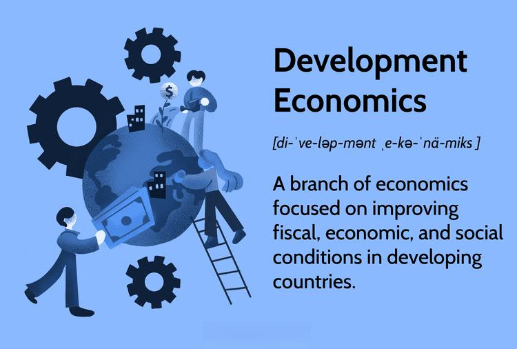

In the globalized world of today, understanding the various facets of economics is crucial for comprehending how nations progress and flourish. Economics plays a fundamental role in shaping societies, influencing both the everyday lives of individuals and the strategic decisions of governments and businesses. As economies become increasingly interconnected, the need to comprehend diverse economic systems and mechanisms becomes paramount. 

This article provides an insight into different economic types, the importance of economic development, the nuances of development economics, and the role of algorithmic trading. Each of these aspects uniquely contribute to the economic landscape, influencing policy-making and strategic development. The classification of economies into traditional, command, market, and mixed systems allows for a more structured approach to evaluating how various economic structures impact growth and societal progress. Understanding these distinctions can aid in crafting informed policies that are tailored to specific economic environments.

Economic development, meanwhile, represents a strategic transformation aimed at improving living standards by boosting labor productivity, infrastructure, and sustainable technology. Development economics supports this transition by creating policies that focus on reducing poverty and fostering sustainable growth in developing countries. Theoretical frameworks such as mercantilism, economic nationalism, and structural-change theory offer historical and modern perspectives on these economic processes.

Furthermore, algorithmic trading introduces a technological dimension to financial markets, revolutionizing the speed and efficiency of trading through automated processes. This advancement is significant as it plays a pivotal role in modern economic frameworks, influencing market dynamics and shaping financial strategies.

By exploring these themes, the article aims to equip policymakers, economists, and financial experts with the knowledge required to navigate and harness the intricacies of contemporary economic systems, ultimately working towards sustainable economic advancement. Future trends suggest an increasing reliance on technology in economic planning and execution, indicating the ongoing evolution of global economic strategies.

## Table of Contents

## Different Economic Types and Their Impact

Economies can be characterized into several distinct types, each possessing unique structures and operational frameworks that influence both economic growth and societal progress. These types include traditional, command, market, and mixed economies.

**Traditional Economies** operate based on customs, traditions, and beliefs, often relying on subsistence agriculture, hunting, and fishing for the provision of goods and services. Economic activities in traditional economies are typically guided by ancestral methods, and technological advancement plays a minimal role. Consequently, such economies tend to experience slow growth due to limited production capacity and a heavy reliance on environmental conditions. Traditional economies are found in rural, non-industrial areas where community stability and cultural values are prioritized over economic gain.

**Command Economies** rely on centralized government control to determine the production and distribution of goods and services. In these economies, the government makes all economic decisions, such as what products are produced, the quantity of production, and pricing. This type of economy can quickly mobilize resources on a large scale, as seen historically in the Soviet Union and other socialist states. However, the lack of competition and consumer choice often leads to inefficiencies, shortages, and a lack of innovation. Over time, the rigidity of command economies can stifle growth, as government planning may not adequately respond to consumer needs and productivity incentives.

**Market Economies** are characterized by limited government intervention, where supply and demand dictate production and prices. Entrepreneurs and businesses operate freely, which enhances competition, innovation, and efficiency. Market economies are driven by the pursuit of profit, leading to economic dynamism and growth. However, without regulation, market economies can result in inequalities and market failures, such as monopolies, environmental degradation, and financial instability. The foundation of market economies is the belief in individual property rights and capitalism, with countries like the United States exemplifying this system.

**Mixed Economies** combine elements of both market and command economies, allowing for both private enterprise and government intervention. This hybrid system aims to harness the benefits of market efficiency while addressing its shortcomings through regulation and social welfare programs. Mixed economies balance economic growth with social objectives such as equity and public welfare. Countries like Sweden and France operate under mixed economies, blending free market principles with comprehensive social safety nets.

Understanding these various economic types is crucial for crafting policies tailored to specific societal goals and economic conditions. Policymakers use insights from each system to develop best practices, adapting strategies to suit cultural, social, and environmental contexts. This understanding helps in optimizing resource allocation, enhancing productivity, and improving the overall quality of life for citizens.

## The Concept of Economic Development

Economic development is a multifaceted process that entails the structural transformation of an economy with the aim of enhancing the standard of living. This involves several key components that are crucial for driving progress and ensuring that improvements are sustainable and inclusive.

Enhancing labor productivity is fundamental to economic development. This can be achieved through investment in education and skill development, which not only improves the quality of the workforce but also increases the competitiveness of the economy. Higher productivity leads to greater output per worker, which can translate into higher incomes and improved living standards. An example of this can be seen in the implementation of vocational training programs that equip workers with skills relevant to industries where there is a high demand, thereby aligning labor supply with labor market needs.

Infrastructure development is another critical element. This includes the construction and maintenance of transportation networks, communication systems, and energy supply channels. Efficient infrastructure reduces the costs of doing business, facilitates trade, and connects markets, which in turn stimulates economic activity. For instance, building roads and railways in rural areas can provide farmers with access to larger markets, allowing them to sell their products more widely and at better prices.

Sustainable technological advancements play a pivotal role in economic development as well. Innovation and the adoption of new technologies can lead to increased efficiency and the creation of new industries. This not only supports economic diversification but also helps mitigate environmental impact, a critical concern in contemporary development debates. Transitioning towards green technologies, for example, can reduce carbon footprints and drive growth in the renewable energy sector, creating jobs and fostering environmental sustainability.

Developing economies often utilize these elements to address poverty and boost employment. By focusing on areas such as educational reform, infrastructure investment, and technological innovation, these countries can create more job opportunities and enhance economic resilience. Programs aimed at providing microfinance to small and medium enterprises can help stimulate entrepreneurship, while government policies that incentivize research and development can encourage technological progress.

In summary, economic development is a comprehensive process that relies on improving labor productivity, building robust infrastructure, and fostering technological innovation. These efforts are crucial for enhancing the quality of life and ensuring that growth is both equitable and sustainable. Developing economies that effectively integrate these components into their economic strategies are better positioned to reduce poverty and improve employment outcomes for their populations.

## Exploring Development Economics

Development economics is a vital field dedicated to enhancing the economic, fiscal, and social conditions in developing nations. It provides insightful analyses of both macroeconomic and microeconomic factors, aiming to craft policies that effectively reduce poverty and promote sustainable development. By understanding the complexities of developing economies, policies can be more precisely tailored to ensure long-term growth and stability.

One foundational theory in development economics is mercantilism, which emphasizes the accumulation of wealth, primarily precious metals, and advocates for a favorable balance of trade. This historical perspective laid the groundwork for understanding national economic policies geared towards strengthening state power through economic means. Although no longer applicable in its original form, the influence of mercantilism is still observed in modern economic nationalism, where countries prioritize domestic industries and protect them from foreign competition to achieve economic sovereignty and self-sufficiency.

A critical modern concept is the linear stages of growth model, which suggests that countries progress through a series of developmental stages. Developed by economists like Walt Rostow, this theory proposes that nations begin in a traditional society stage, relying on subsistence agriculture, and progress to a mature, high-consumption society as economic investment and technological improvements take hold. While influential, this theory has faced criticism for oversimplifying the complexities and unique paths of different nations.

The structural-change theory offers a more nuanced approach by focusing on transforming economic structures to shift resources from traditional agriculture to modern industrial sectors. This transition is crucial for boosting productivity and economic output. The Lewis Model, a cornerstone of this theory, describes how labor moves from a low-productivity agricultural sector to a high-productivity industrial sector, driving economic development and growth. The assumption is that this labor shift leads to industrial expansion and higher wages over time.

Development economics utilizes these theories' insights alongside empirical evidence to adapt strategies to the particular context of each developing country. The goal is to address specific challenges such as infrastructure deficits, education gaps, and poor governance that often hinder growth. Policies informed by development economics aim not just for economic growth but also for improvements in living standards, income distribution, and social welfare, ensuring that development is both inclusive and sustainable.

In summary, development economics serves as a critical tool in understanding and navigating the path to prosperity for developing nations. By examining historical theories and modern approaches, this branch of economics provides the necessary framework for policymakers to implement effective and sustainable development strategies.

## Algorithmic Trading: Revolutionizing Finance

Algorithmic trading represents a significant evolution in modern financial markets by automating the execution of trades through pre-programmed instructions. This technological advancement enhances trading efficiency by ensuring rapid execution, accuracy, and cost-effectiveness. The utilization of algorithms in trading allows for the processing of vast amounts of market data at speeds far beyond human capability, offering distinct advantages in fast-moving markets.

In financial markets, the primary benefits of [algorithmic trading](/wiki/algorithmic-trading) are speed and precision. Trades can be executed within fractions of a second, taking advantage of even the slightest market fluctuations. This speed is crucial for high-frequency trading ([HFT](/wiki/high-frequency-trading-strategies)), where even a millisecond can impact the profitability of a trade. Algorithms also eliminate the risk of human error, ensuring that trades are executed according to pre-defined strategies without the influence of emotion or judgment.

Cost reduction is another significant advantage of algorithmic trading. By automating trading processes, firms can reduce the need for human traders, leading to savings on labor costs. Additionally, algorithms can minimize transaction costs by optimizing order execution, ensuring trades occur at the most favorable prices. This efficiency contributes to increased profitability for trading firms and enhances market [liquidity](/wiki/liquidity-risk-premium) overall.

The implications of algorithmic trading extend beyond operational efficiency. Strategically, algorithms analyze market data to identify trends and opportunities, supporting informed decision-making and strategy development. For instance, quantitative models within algorithms may rely on statistical analysis, [machine learning](/wiki/machine-learning), or other data-driven methodologies to forecast market movements and adapt trading strategies accordingly.

Algorithmic trading also influences broader economic frameworks by contributing to market dynamics such as pricing efficiency and [volatility](/wiki/volatility-trading-strategies). Increasing market efficiency involves tightening bid-ask spreads and improving price discovery mechanisms, thus enhancing overall market quality. However, algorithmic trading can also contribute to market volatility, particularly in instances of erroneous trades or when algorithms operate on similar signals, leading to intense periods of buying or selling.

Despite these benefits, the reliance on algorithms requires robust governance to mitigate risks such as algorithmic malfunctions or market manipulations. Regulatory bodies face the challenge of balancing innovation with oversight to ensure algorithms contribute positively to market integrity and stability.

In summary, algorithmic trading is reshaping modern financial strategies by providing speed, precision, and cost reductions. Its integration into global markets offers significant potential to enhance efficiency and contribute to strategic economic objectives, although it also requires prudent management to mitigate potential risks and ensure robust market function.

## The Intersection of Economic Development and Algorithmic Trading

Economic development policies and algorithmic trading can align to create a powerful synergy that enhances market efficiency and stimulates growth, particularly in emerging markets. This intersection can optimize resource allocation by utilizing complex algorithms to process vast amounts of financial data, identifying trends and patterns which might be elusive to human analysts. By automating decision-making processes, algorithmic trading enables rapid responses to market fluctuations, ensuring more stable and efficient financial markets.

One of the key areas where this synergy is beneficial is financial inclusivity. With algorithmic trading's ability to function across different markets and platforms, financial services can be more accessible to a broader audience. This promotes inclusivity by reducing transaction costs and opening opportunities for individuals and businesses in underserved or remote areas. Additionally, algorithmic trading systems can help financial institutions offer better products tailored to the needs of different economic demographics, fostering a more inclusive economy.

Case studies across various countries illustrate how the integration of algorithmic trading into economic strategies supports growth. For instance, India's adoption of algorithmic trading has facilitated increased market liquidity and transparency. The Indian government implemented policies encouraging technological advancements in trading, resulting in a more efficient distribution of capital within the economy and boosting investor confidence.

Another example is Brazil, where the application of algorithmic trading in their financial markets has led to significant improvements in trade execution times and market efficiency. By leveraging technology through policy measures, Brazil has managed to attract foreign investment and empower local businesses with access to global markets, leading to substantial economic benefits.

The synergy also supports the allocation of investments into sustainable development projects. Algorithmic trading can analyze and forecast financial and economic indicators, guiding investments towards sectors that yield long-term economic benefits. This approach aligns with economic development policies that focus on sustainability and addressing social and environmental challenges.

In summary, the integration of economic development policies with algorithmic trading creates avenues for enhanced market efficiency, focus on inclusive growth, and strategic allocation of resources. Through thoughtful application and policy support, countries can harness this synergy to foster economic resilience and equitable growth, particularly vital for emerging markets poised for transformation.

## Conclusion

The dynamic interplay between different economic types, development strategies, and modern trading mechanisms like algorithmic trading continues to shape the economic landscape. Each component provides unique contributions, influencing how economies evolve and address critical issues such as poverty reduction, employment growth, and financial inclusivity. As globalization intensifies, the integration of diverse economic models helps policymakers and economists recognize patterns, allocate resources effectively, and harness best practices to promote economic stability and growth.

Understanding these concepts is pivotal for stakeholders like policymakers, economists, and financial experts who are tasked with crafting sustainable economic policies. These stakeholders must consider the distinct advantages and limitations of each economic type, along with innovative trading approaches, to formulate strategies that drive national and global prosperity. An example of such integration could be seen in how algorithmic trading enhances market efficiency, which benefits policy frameworks by providing more accurate, data-driven economic projections and analysis.

Future trends indicate an increasing reliance on technology in economic planning and execution. Technological advancements offer unprecedented tools for data analysis, decision-making, and strategic implementation, ensuring that economic initiatives are responsive and adaptive to complex global changes. As such, continued investment in technology-driven economic strategies is essential for fostering resilient economic development. This reliance on technology will likely transform traditional economic theories and practices, prompting an evolution in how economic performance is measured, understood, and enhanced in a rapidly changing world.

## FAQs

What is the importance of understanding economic types?

Understanding economic types such as traditional, command, market, and mixed economies is essential for several reasons. Each type has unique characteristics that influence how resources are allocated, how production is organized, and how wealth is distributed within a society. For instance, in a market economy, the forces of supply and demand largely determine prices and production, promoting efficiency and innovation. Conversely, a command economy relies heavily on government intervention, which can lead to efficient large-scale mobilization of resources but may also stifle individual initiative. By comprehending these differences, policymakers and economists can craft tailored strategies that harness the strengths and address the weaknesses of each type, thereby promoting sustainable economic growth and societal advancement.

How does economic development differ from simple economic growth?

Economic development and economic growth are related yet distinct concepts that are often misconstrued as synonymous. Economic growth typically refers to an increase in a country's output of goods and services, as measured by Gross Domestic Product (GDP). It is quantitative and indicates a rise in the overall size of an economy. On the other hand, economic development is a qualitative concept encompassing improvements in living standards, reduction in poverty, and enhancement in education and infrastructure. While growth can occur without development, true development invariably involves sustainable progress across multiple sectors, addressing social and economic challenges, and uplifting the quality of life for all citizens.

What role does algorithmic trading play in modern economies?

Algorithmic trading, which involves using computer programs with pre-defined criteria for trading decisions, has revolutionized modern financial markets. It provides significant benefits like increased trade speed, precision, and cost reduction due to its capacity for processing large datasets rapidly and executing orders more efficiently than human traders. This can lead to enhanced market liquidity and reduced bid-ask spreads, thereby improving overall market efficiency. Additionally, algorithmic trading helps mitigate human errors and emotional biases, streamlining the decision-making process. As modern economies increasingly integrate technology into financial strategies, algorithmic trading is becoming pivotal in shaping contemporary financial landscapes and investment strategies.

How can developing countries benefit from economic development theories?

Developing countries can significantly benefit from various economic development theories by using them as frameworks to formulate effective policies. Theories such as the linear stages of growth model and structural-change theory provide pathways for transitioning from agrarian-based economies to industrialized ones, focusing on capital accumulation, advancements in technology, and institutional development. These theories help identify critical stages and strategies necessary for sustainable development, enabling policymakers to design interventions that address local economic challenges, enhance productivity, and improve living standards. By grounding their policies in these theories, developing nations can efficiently mobilize resources, reduce poverty, and stimulate holistic economic transformation.

## References & Further Reading

[1]: Todaro, M. P., & Smith, S. C. (2014). ["Economic Development"](https://books.google.com/books/about/Economic_Development.html?id=VU0WyQEACAAJ). Addison-Wesley.

[2]: Rostow, W. W. (1990). ["The Stages of Economic Growth: A Non-Communist Manifesto"](https://www.cambridge.org/core/books/stages-of-economic-growth/9CB46055035A1915509CE15A57848A07) Cambridge University Press.

[3]: Lewis, W. A. (1954). ["Economic Development with Unlimited Supplies of Labour"](https://onlinelibrary.wiley.com/doi/abs/10.1111/j.1467-9957.1954.tb00021.x) The Manchester School.

[4]: Barro, R. J., & Sala-i-Martin, X. (2004). ["Economic Growth"](http://piketty.pse.ens.fr/files/BarroSalaIMartin2004Chap1-2.pdf) MIT Press.

[5]: Fernald, J. G., & Jones, C. I. (2014). ["The Future of US Economic Growth"](https://www.nber.org/papers/w19830) American Economic Review.

[6]: Gomber, P., Arndt, B., Lutat, M., & Uhle, T. (2011). ["High-Frequency Trading"](https://papers.ssrn.com/sol3/papers.cfm?abstract_id=1858626) Electronic Markets.

[7]: Hull, J. (2012). ["Risk Management and Financial Institutions"](https://books.google.com/books/about/Risk_Management_and_Financial_Institutio.html?id=1J1QDwAAQBAJ) Wiley Finance.

[8]: Lopez de Prado, M. (2018). ["Advances in Financial Machine Learning"](https://www.amazon.com/Advances-Financial-Machine-Learning-Marcos/dp/1119482089) Wiley.

[9]: Debreu, G. (1959). ["Theory of Value: An Axiomatic Analysis of Economic Equilibrium"](https://cowles.yale.edu/research/cfm-17-theory-value-axiomatic-analysis-economic-equilibrium) Yale University Press.

[10]: Das, S. (2015). ["The Dark Side of Valuation: Valuing Young, Distressed, and Complex Businesses"](https://pages.stern.nyu.edu/~adamodar/pdfiles/country/darkside.pdf) Pearson FT Press.