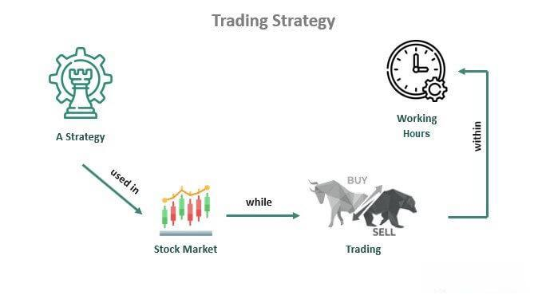

In the rapidly evolving world of finance, mastering various strategies is crucial for achieving success. This article sets out to explore and simplify the complexities of financial strategies, investment techniques, trading strategies, and algorithmic trading. These concepts, when effectively integrated, empower individuals and organizations to maximize their financial outcomes. By outlining key aspects of each strategy, we seek to illustrate how they can combine to form a cohesive and effective financial plan. The intricate world of modern finance demands adaptability and strategic insight, offering multiple pathways to financial optimization through the convergence of these methodologies. Whether you are an individual investor or a financial institution, understanding these strategies will enhance your ability to navigate the financial landscape efficiently and effectively. Join us as we explore this critical aspect of finance.

## Table of Contents

## Understanding Financial Strategies

Financial strategies are essential blueprints crafted to achieve specific monetary objectives. These strategic plans play a crucial role in managing financial resources efficiently and include a variety of components such as budgeting, saving, investing, and risk management. By thoroughly understanding and implementing these strategies, individuals and businesses can better navigate economic uncertainties and enhance their financial stability.

A fundamental aspect of financial strategies is budgeting, which involves planning future income and expenses to ensure that goals are met without overspending. Effective budgeting requires a clear understanding of current financial standing and the ability to forecast future financial needs. This process lays a strong foundation for saving, which is another critical component of financial strategies. Saving involves setting aside a portion of income for future use, providing a cushion for unforeseen expenses or opportunities.

Investing is yet another vital element that forms a part of a comprehensive financial strategy. By allocating resources into various financial instruments, individuals can potentially increase their wealth over time. Investments must be selected based on individual risk tolerance, financial goals, and market conditions. Risk management, closely tied to investing, involves identifying, assessing, and prioritizing risks to minimize their impact. It ensures that the financial strategy remains robust against uncertainties such as market volatility or economic downturns.

The development of an effective financial strategy involves identifying financial goals clearly. These goals provide direction and serve as milestones for measuring progress. Once defined, it becomes essential to assess risk tolerance, which helps determine the appropriate level of risk to incorporate into the investment portfolio. A diversified portfolio, on the other hand, spreads investments across various asset classes, minimizing risk while aiming for optimal returns.

Mistakes in crafting or executing a financial strategy can lead to adverse outcomes. Common pitfalls include lack of diversification, inadequate risk assessment, and unrealistic goal-setting. Therefore, consulting with financial experts can be invaluable, providing insights into market trends and personalized advice tailored to individual circumstances.

In summary, financial strategies are comprehensive plans that incorporate budgeting, saving, investing, and risk management to meet specific monetary goals. By integrating these components into a unified approach and seeking expert guidance, individuals and businesses can better manage resources and achieve financial success amidst economic uncertainties.

## Investment Techniques for Optimized Returns

Investment techniques are the various approaches and methods employed to allocate resources effectively into different financial instruments and asset classes. These techniques aim to maximize returns while managing and mitigating risk. Understanding and applying the right investment techniques is vital for enhancing portfolio performance and achieving financial objectives.

One of the most prevalent techniques is value investing, which involves selecting stocks that appear to be trading for less than their intrinsic or book value. Investors utilizing this approach rely on [fundamental analysis](/wiki/fundamental-analysis) to identify undervalued stocks, aiming to capitalize on market inefficiencies. Value investing can be quantitively modeled using metrics such as the price-to-earnings (P/E) ratio, price-to-book (P/B) ratio, and other financial indicators.

Growth investing, on the other hand, focuses on companies that exhibit signs of above-average growth, even if the share price appears high in terms of metrics like the P/E ratio. Investors prioritize future potential and earnings growth over current undervaluation. Growth stocks often belong to technology and other innovative sectors and can be characterized by rapid revenue or profit expansion.

Income investing aims to generate regular income through dividends or interest payments, focusing primarily on securities like dividend-paying stocks, bonds, and real estate investment trusts (REITs). This technique is especially appealing to retirees or those needing a steady cash flow. The yield is a crucial [factor](/wiki/factor-investing) investors examine, with the dividend yield serving as a standard measure of income generation.

A cornerstone of modern investment strategy is diversification and asset allocation. Diversification involves spreading investments across various asset classes—such as stocks, bonds, and commodities—to reduce exposure to any single asset's risk. Asset allocation refers to the process of determining the percentage of each asset class within a portfolio, often guided by factors like the investor's risk tolerance, investment horizon, and financial goals. Diversification can be quantitatively represented through the construction of a covariance matrix, which measures how different securities' returns move in relation to each other.

The advent of technology has introduced new investment techniques, such as socially responsible investing (SRI) and its broader cousin, environmental, social, and governance ([ESG](/wiki/esg-investing)) investing. These approaches consider not only financial returns but also the impact of investments on society and the environment. Metrics like carbon footprint, board diversity, and ethical labor practices are evaluated alongside traditional financial metrics.

Incorporating these investment techniques requires a thorough understanding of both market conditions and individual risk profiles. Knowledge of these varied strategies enables investors to tailor their portfolios to align with personal financial goals and market opportunities, thereby enhancing potential returns while navigating market [volatility](/wiki/volatility-trading-strategies). As the financial landscape evolves, staying informed on emerging methods and technological advancements remains imperative for optimized investment performance.

## Exploring Trading Strategies

Trading strategies involve speculating on short-term market movements with the aim of generating profits. These strategies encompass a range of approaches, each requiring specific skills and an understanding of market dynamics. Key strategies include [day trading](/wiki/day-trading-spy), swing trading, [momentum](/wiki/momentum) trading, and [arbitrage](/wiki/arbitrage).

Day trading is characterized by the buying and selling of financial instruments within a single trading day. Traders using this strategy often rely on technical analysis and utilize chart patterns to make quick decisions. The primary goal is to capitalize on small price movements, often using leverage to amplify returns. The success of day trading hinges on high strategic discipline, as the volatility of intraday markets can lead to rapid gains or losses.

Swing trading targets capturing gains from price swings over several days or weeks. Unlike day traders, swing traders hold positions longer to benefit from expected upwards or downwards corrections in the market trend. This strategy requires identifying patterns through technical analysis and maintaining a balance between risk and reward. Indicators such as moving averages and relative strength index (RSI) are commonly used to inform decisions.

Momentum trading involves purchasing securities that show an upward price trend and selling those with declining trends, capitalizing on continuous market movements. Momentum traders typically seek to ride established trends rather than anticipate shifts, necessitating a keen understanding of market signals and sentiment.

Arbitrage exploits price discrepancies of the same asset in different markets. An arbitrageur may, for example, simultaneously buy a stock in one market where it's underpriced and sell it in another where it's overpriced, securing a profit from the price differential. This strategy relies on sophisticated algorithms and real-time data analytics to swiftly identify opportunities, highlighting the importance of speed and precision.

Traders often employ a combination of technical analysis, which involves evaluating statistical trends from trading activity, and market signals, to guide their strategies. Tools such as moving averages, Bollinger Bands, and MACD (Moving Average Convergence Divergence) are frequently used to predict future price movements.

The volatility inherent in trading markets necessitates strategic discipline. Traders must consistently adhere to their trading plans, manage risk effectively, and maintain an emotional detachment from their investments. This discipline involves setting stop-loss orders to prevent significant losses and adhering to predetermined [exit](/wiki/exit-strategy) strategies to secure profits.

In conclusion, trading strategies require not only a solid grasp of market patterns but also the strategic discipline to execute trades effectively amidst market volatility. Understanding and employing these strategies, combined with technical analysis, can significantly enhance one's ability to profit from short-term market movements.

## The Rise of Algorithmic Trading

Algorithmic trading, often abbreviated as algo trading, leverages computational algorithms to automate trading decisions with minimal human intervention. This technological advancement in the financial markets provides distinct advantages, including the rapid execution of trades, enhanced accuracy, and the capacity to analyze and process large volumes of complex data. These benefits have revolutionized trading by reducing the latency in trade execution and ensuring precision in the deployment of trading strategies.

The basic framework of [algorithmic trading](/wiki/algorithmic-trading) involves the use of pre-defined instructions or algorithms that dictate how trades are executed based on criteria such as timing, price, or [volume](/wiki/volume-trading-strategy). The ability to execute orders at specified parameters allows traders to achieve the best prices, which is particularly beneficial in high-frequency trading scenarios.

Among the various strategies employed in algorithmic trading, some of the most prevalent include:

1. **Market Making**: This strategy involves placing buy and sell orders to capitalize on the spread between the bid and ask prices. By continuously offering quotes on both sides of the market, a market maker ensures liquidity while earning the bid-ask spread as profit.

2. **Statistical Arbitrage**: This involves exploiting pricing inefficiencies between related financial instruments by employing statistical and econometric techniques. As prices eventually revert to their mean, traders can profit from temporary discrepancies.

3. **Trend Following**: This strategy bases decisions on trends and patterns in market data. By identifying patterns that signal future price movements, traders can capitalize on the continuation of existing trends.

Algorithmic trading minimizes human error and reduces emotional biases inherent in manual trading. For instance, it eliminates the propensity for impulsive decisions driven by market volatility or trader sentiment. The algorithms execute trades based entirely on data and preset rules, enhancing objectivity and consistency in trading performance.

Despite its advantages, algorithmic trading is not without challenges. One significant concern is its reliance on historical data for model training and strategy development. There is a risk that these models may not perform effectively in real-time due to unforeseen market changes or anomalies. Additionally, the technological infrastructure required for algo trading is complex, and any technical failures, such as connectivity issues, software bugs, or errors in the algorithm, can lead to significant financial losses.

Moreover, the increasing sophistication of algo trading requires substantial computational resources and expertise in quantitative finance and programming. As a result, barriers to entry are higher compared to traditional trading, and maintaining competitive advantage demands continuous adaptation and refinement of trading strategies.

In summary, algorithmic trading represents a significant evolution in the financial markets, offering enhanced efficiency and new opportunities for traders. However, it necessitates careful consideration of its inherent risks and a commitment to ongoing innovation and development to harness its full potential effectively.

## Integrating Strategies for Holistic Financial Management

Integrating financial strategies, investment techniques, and trading strategies is a crucial step in creating a robust financial plan. This integration facilitates better diversification and optimization of resource allocation. Diversification, a fundamental principle in finance, involves spreading investments across various assets to reduce risk. This is often achieved through asset allocation, where resources are distributed across different asset classes such as stocks, bonds, and real estate. By integrating various strategies, investors can systematically enhance diversification, thereby minimizing exposure to any single type of risk.

Adapting to market changes and emerging technologies is essential in this process. Financial markets are continually evolving due to macroeconomic shifts, regulatory changes, and technological advances. This requires dynamic financial planning that can swiftly adjust to new conditions. Technologies such as [artificial intelligence](/wiki/ai-artificial-intelligence) and [machine learning](/wiki/machine-learning) play a significant role in analyzing vast amounts of financial data to identify patterns and trends, thereby informing strategic decisions. The use of technology enables real-time data processing, which is crucial for executing trades efficiently and optimizing portfolio management.

Collaboration with financial advisors is another key component of developing a comprehensive financial strategy. Financial advisors provide expert insights into market conditions, investment opportunities, and risk assessment. Their expertise can be invaluable in aligning financial strategies with an individual's or an organization's goals and risk appetite. Advisors often utilize sophisticated financial modeling tools and software to project future financial scenarios, helping clients make informed decisions.

Aligning strategies with individual goals and risk tolerance is fundamental for achieving financial success. Each investor has unique objectives and constraints, such as retirement planning, wealth preservation, or capital growth. Moreover, risk tolerance varies among investors, influenced by factors such as age, financial stability, and market experience. Thus, a tailored approach that considers these factors is essential. This customization involves assessing an investor's financial situation, defining clear objectives, and evaluating the appropriate balance between risk and return.

An integrated approach to financial management not only enhances stability but also positions investors to capitalize on growth opportunities. Through continuous learning and adaptation, investors can maintain a competitive edge in the finance industry. The synergy of sophisticated strategies and advanced technologies holds the key to navigating the complex financial landscape effectively.

## Conclusion

Understanding and applying diverse financial strategies have become indispensable in today's dynamic financial landscape. Each strategic approach, from investment techniques to trading strategies and algorithmic trading, provides unique benefits alongside inherent challenges. Integrating these strategies into a cohesive financial plan can significantly enhance financial stability and foster growth for both individuals and organizations.

Investment techniques, such as value investing, growth investing, and diversification, have traditionally formed the backbone of sound financial planning. These techniques help manage risk and optimize returns by intelligently allocating resources across various asset classes. On the other hand, trading strategies, including day trading and swing trading, offer ways to capitalize on short-term market inefficiencies. Each trading strategy requires a nuanced understanding of market patterns and a disciplined approach to execute trades effectively.

Algorithmic trading represents a significant technological advancement, leveraging computer programs to automate and optimize trading decisions. It enhances trading speed and accuracy while minimizing human error and emotional biases. Despite these advantages, it presents challenges—reliance on historical data, technological risks, and the need for advanced infrastructure. Overcoming these hurdles is essential to fully harness the potential of algorithmic trading.

To remain competitive, continual learning and adaptation to evolving financial environments are crucial. This involves not only staying informed about emerging trends and technologies but also revisiting and revising financial strategies to ensure alignment with individual or organizational goals. Financial markets are inherently uncertain and dynamic, necessitating a proactive and flexible approach to financial management.

The future of finance will undoubtedly depend on sophisticated strategies and advanced technologies working in synergy. As old paradigms shift and new opportunities arise, the integration of comprehensive financial strategies will be key to navigating these changes efficiently. This holistic approach promises a trajectory toward enhanced financial outcomes and sustained economic growth.

## References & Further Reading

[1]: ["Advances in Financial Machine Learning"](https://www.amazon.com/Advances-Financial-Machine-Learning-Marcos/dp/1119482089) by Marcos Lopez de Prado

[2]: ["Evidence-Based Technical Analysis: Applying the Scientific Method and Statistical Inference to Trading Signals"](https://www.amazon.com/Evidence-Based-Technical-Analysis-Scientific-Statistical/dp/0470008741) by David Aronson

[3]: ["Machine Learning for Algorithmic Trading"](https://github.com/stefan-jansen/machine-learning-for-trading) by Stefan Jansen

[4]: ["Quantitative Trading: How to Build Your Own Algorithmic Trading Business"](https://www.amazon.com/Quantitative-Trading-Build-Algorithmic-Business/dp/1119800064) by Ernest P. Chan

[5]: Bergstra, J., Bardenet, R., Bengio, Y., & Kégl, B. (2011). ["Algorithms for Hyper-Parameter Optimization."](https://dl.acm.org/doi/10.5555/2986459.2986743) Advances in Neural Information Processing Systems 24.