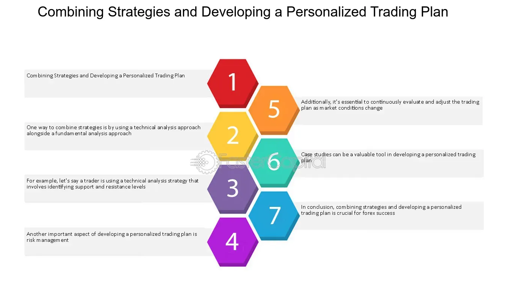

## Table of Contents

## What is a trading strategy and why is it important?

A trading strategy is a set of rules and guidelines that a trader uses to decide when to buy and sell assets like stocks, currencies, or commodities. It helps traders make decisions based on careful analysis rather than emotions. A good trading strategy might look at things like price movements, market trends, and economic indicators to figure out the best times to trade.

Having a trading strategy is important because it helps traders stay disciplined and manage their risks. Without a strategy, traders might make impulsive decisions that lead to big losses. A strategy provides a clear plan, which can increase the chances of making profits over time. It also helps traders learn from their experiences by keeping track of what works and what doesn't, allowing them to improve their approach in the future.

## How do you identify your trading goals and risk tolerance?

To identify your trading goals, start by thinking about what you want to achieve. Do you want to make a little extra money each month, or are you aiming for big profits over time? Write down your goals and make them clear and specific. For example, you might want to earn a certain amount of money each month or grow your account by a certain percentage each year. Your goals should be realistic based on how much time and money you can put into trading.

Next, figuring out your risk tolerance is about understanding how much money you can afford to lose. Think about your financial situation and how much you're willing to risk on each trade. If losing money would make you feel stressed or unable to pay your bills, you might want to be more cautious. A good way to find your risk tolerance is to start with small trades and see how you feel when the market goes up and down. Over time, you'll learn how much risk you're comfortable with, and you can adjust your trading strategy accordingly.

## What are the basic components of a trading strategy?

A trading strategy has a few main parts that help you decide when to buy and sell. First, you need clear entry and exit rules. This means knowing exactly when to get into a trade and when to get out. You might use things like price levels, technical indicators, or market news to make these decisions. Second, you need a way to manage your risks. This can include setting stop-loss orders to limit how much you can lose on a trade and deciding how much of your money to risk on each trade.

Another important part of a trading strategy is your trading goals and risk tolerance. You need to know what you want to achieve and how much risk you're willing to take. This helps you set realistic targets and stick to your plan, even when the market gets tough. Finally, you need a way to track and review your trades. This means keeping a record of your trades and looking back at them to see what worked and what didn't. By doing this, you can learn from your mistakes and improve your strategy over time.

## How can you use technical analysis in developing a trading strategy?

Technical analysis is a way to study the market by looking at charts and patterns. It helps traders guess where prices might go next. To use technical analysis in your trading strategy, you can look at things like moving averages, support and resistance levels, and chart patterns. For example, if you see a stock price bouncing off a certain level many times, that level is called support. You might decide to buy the stock when it reaches that support level because it might go up again. Or, if you see a stock breaking above a resistance level, you might decide to buy it because it could keep going up.

Another way to use technical analysis is by using indicators like the Relative Strength Index (RSI) or the Moving Average Convergence Divergence (MACD). These tools can help you see if a stock is overbought or oversold, which means it might be time to sell or buy. For example, if the RSI is above 70, the stock might be overbought, so you might want to sell. If it's below 30, the stock might be oversold, so you might want to buy. By combining these indicators with chart patterns and levels, you can make a plan for when to enter and exit trades. This helps you make more informed decisions and stick to your trading strategy.

## What role does fundamental analysis play in custom trading strategies?

Fundamental analysis is a way to look at the real value of a company or an asset by studying things like its earnings, the economy, and other big factors. When you use fundamental analysis in your trading strategy, you're trying to find out if a stock or another asset is priced too high or too low. For example, if a company's earnings are growing but its stock price isn't, you might think the stock is a good buy because it could go up in the future. By understanding the basics of a company, you can make smarter choices about when to buy or sell.

Using fundamental analysis can help you create a long-term trading strategy. Instead of just looking at short-term price changes, you focus on the bigger picture. This means you might hold onto stocks for months or years, waiting for their value to grow. Combining fundamental analysis with your trading goals and risk tolerance helps you build a strategy that fits your style. You can use it alongside technical analysis to make even better decisions, giving you a more complete view of the market.

## How do you backtest a trading strategy and why is it crucial?

Backtesting a trading strategy means testing it on past data to see how it would have worked. You take your rules for buying and selling and apply them to old market data. This helps you see if your strategy would have made money or lost money in the past. To do this, you can use special software or even a spreadsheet. You go through the data step by step, following your strategy's rules to see what would have happened. This can show you if your strategy is good or if you need to change it.

Backtesting is really important because it helps you know if your strategy will work before you use real money. It lets you see how your strategy might do in different market conditions, like when the market goes up or down a lot. By looking at past results, you can fix any problems with your strategy and make it better. This way, you're more likely to make money when you start trading for real. Backtesting gives you confidence in your strategy and helps you avoid big mistakes.

## What are common pitfalls to avoid when developing a trading strategy?

When you're making a trading strategy, one big mistake to avoid is being too emotional. It's easy to get excited or scared when the market moves, and this can make you do things that aren't in your plan. Stick to your rules, even when the market is going crazy. Another common problem is not having a clear plan for managing risk. You need to know how much money you can lose on each trade and set stop-loss orders to protect yourself. If you don't do this, you could lose a lot of money very quickly.

Another pitfall is overcomplicating your strategy. It might be tempting to use lots of different indicators and rules, but this can make things confusing and hard to follow. Keep your strategy simple so you can stick to it. Also, don't forget to test your strategy with backtesting. If you don't check how your strategy would have worked in the past, you might be surprised by how it does in real trading. Lastly, not keeping track of your trades and learning from them is a big mistake. Always review your trades to see what worked and what didn't, so you can keep improving your strategy.

## How can you incorporate automated trading systems into your strategy?

You can use automated trading systems to help with your trading strategy by setting up rules that a computer program follows to buy and sell things. These systems can look at lots of information very quickly and make trades without you having to do it yourself. You tell the system what to do based on your strategy, like when to buy or sell based on certain prices or signals. This can save you time and help you stick to your plan, even when the market is moving fast.

Using an automated trading system can also help you avoid making decisions based on your feelings. Sometimes, traders might get too excited or scared and make bad choices, but a computer doesn't feel emotions. It just follows the rules you set. This can make your trading more consistent and help you manage your risks better. Just remember, you still need to check on the system and make sure it's working the way you want it to.

## What advanced statistical methods can enhance trading strategy development?

Advanced statistical methods can make your trading strategy better by helping you understand the market in more detail. One useful method is regression analysis, which looks at how different things in the market are connected. For example, you can use it to see how a company's stock price changes with its earnings or with big economic news. Another method is time series analysis, which helps you study how prices change over time. This can show you patterns or trends that you might not see just by looking at the charts. By using these methods, you can make more accurate guesses about where prices might go next and set up your trading rules based on solid data.

Another advanced method is machine learning, which can help you find patterns in big sets of data that are too hard to see with simpler methods. Machine learning can learn from past trades and market data to predict what might happen in the future. This can be really helpful for figuring out when to buy or sell. Also, Monte Carlo simulations can be used to test your trading strategy in many different made-up situations. This helps you see how well your strategy might work in all kinds of market conditions, not just the ones you've seen before. Using these advanced statistical methods can make your trading strategy stronger and give you a better chance of making money.

## How do you adapt your trading strategy to different market conditions?

Adapting your trading strategy to different market conditions is important because the market can change a lot. Sometimes the market goes up a lot, sometimes it goes down a lot, and sometimes it stays the same. You need to change your strategy to fit these different situations. For example, if the market is going up a lot, you might want to buy more and hold onto your trades longer. But if the market is going down a lot, you might want to sell more quickly or use strategies that make money when prices fall.

One way to adapt your strategy is by using different indicators and rules for different market conditions. You can use technical analysis to spot trends and patterns that tell you what the market is doing. For example, if you see the market is moving sideways, you might use a strategy that works well in a range-bound market, like buying low and selling high within that range. Another way to adapt is by changing how much risk you take. In a very volatile market, you might want to risk less money on each trade to protect yourself from big losses. By keeping an eye on the market and being ready to change your approach, you can make your trading strategy work better no matter what the market is doing.

## What are the latest trends in algorithmic trading strategies?

One of the latest trends in algorithmic trading strategies is the use of machine learning and artificial intelligence. These technologies help traders make better predictions about the market by learning from lots of data. For example, machine learning can look at past trades and market news to find patterns that humans might miss. This can help traders decide when to buy or sell more accurately. Many big trading firms are using these smart systems to get an edge in the market.

Another trend is the rise of high-frequency trading (HFT). This is when computers make a lot of trades very quickly, sometimes in just a few seconds. HFT uses powerful computers and special software to take advantage of tiny changes in the market. Traders using HFT can make money from small price differences that happen in the blink of an eye. This kind of trading needs a lot of technology and can be risky, but it's becoming more popular because it can make big profits.

Lastly, there's a growing interest in combining different types of data for trading strategies. Traders are not just looking at stock prices anymore; they're also using things like social media posts, news articles, and even weather reports to make better trading decisions. This is called alternative data. By looking at all these different pieces of information, traders can get a fuller picture of what's happening in the market and make smarter trades. This trend is making trading strategies more complex but also more powerful.

## How can machine learning and AI be utilized to optimize trading strategies?

Machine learning and AI can help make trading strategies better by learning from lots of data. They can look at past trades, market news, and other information to find patterns that are hard for people to see. For example, AI can predict how a stock might move based on things like company earnings, economic reports, and even what people are saying on social media. This helps traders decide when to buy or sell more accurately. By using these smart systems, traders can make better guesses about the market and set up their trading rules to take advantage of these patterns.

Another way AI can help is by automating parts of the trading process. Instead of having to watch the market all the time, traders can set up AI systems to make trades for them based on the strategy they've created. This can save a lot of time and help traders stick to their plan, even when the market is moving fast. AI can also keep learning and improving over time, so the trading strategy gets better and better. By using machine learning and AI, traders can make their strategies more powerful and increase their chances of making money in the market.

## References & Further Reading

[1]: ["Advances in Financial Machine Learning"](https://www.amazon.com/Advances-Financial-Machine-Learning-Marcos/dp/1119482089) by Marcos Lopez de Prado

[2]: ["Evidence-Based Technical Analysis: Applying the Scientific Method and Statistical Inference to Trading Signals"](https://www.amazon.com/Evidence-Based-Technical-Analysis-Scientific-Statistical/dp/0470008741) by David Aronson

[3]: ["Machine Learning for Algorithmic Trading"](https://github.com/stefan-jansen/machine-learning-for-trading) by Stefan Jansen

[4]: ["Quantitative Trading: How to Build Your Own Algorithmic Trading Business"](https://www.amazon.com/Quantitative-Trading-Build-Algorithmic-Business/dp/1119800064) by Ernest P. Chan

[5]: Bergstra, J., Bardenet, R., Bengio, Y., & Kégl, B. (2011). ["Algorithms for Hyper-Parameter Optimization."](https://dl.acm.org/doi/10.5555/2986459.2986743) Advances in Neural Information Processing Systems 24.