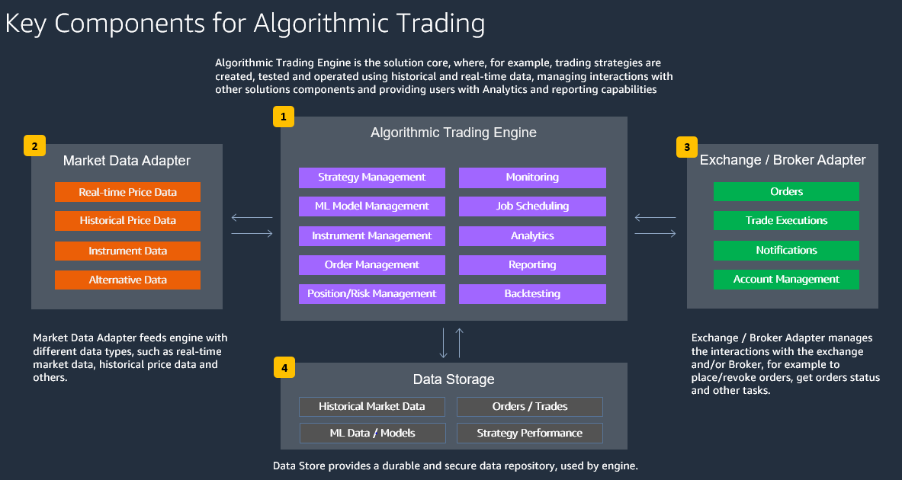

## Table of Contents

## What is a trading algorithm?

A trading algorithm is a computer program that follows a set of rules to buy and sell stocks, currencies, or other financial items. It uses math and data to make decisions quickly, often faster than a human could. People use trading algorithms because they can handle lots of information and make trades without getting tired or emotional.

These algorithms can be simple or very complex. A simple one might just buy a stock when its price goes below a certain level and sell it when it goes above another level. More complex algorithms might use many different pieces of information, like news events or economic reports, to decide when to trade. They help traders make more consistent decisions and can work all the time, even when markets are closed.

## Why are trading algorithms important in financial markets?

Trading algorithms are important in financial markets because they help make trading faster and more efficient. They can look at a lot of information very quickly and make decisions based on that information. This means they can buy or sell things at the best possible times, often faster than a person could. This speed and efficiency can help traders make more money and can also make the market work better overall.

Another reason trading algorithms are important is that they can help remove emotions from trading. People can sometimes make bad decisions because they get too excited or too worried. Algorithms follow set rules and don't get emotional, so they can stick to a plan better than a person might. This can lead to more consistent results over time. Plus, because algorithms can trade all the time, they can take advantage of opportunities that might happen when markets are open in different parts of the world.

## What are the basic components of a trading algorithm?

A trading algorithm has a few basic parts that work together to make it work. The first part is the data input. This is where the algorithm gets all the information it needs to make decisions, like stock prices, news, or economic reports. The second part is the set of rules or strategies. These are like instructions that tell the algorithm when to buy or sell something. For example, a rule might say to buy a stock if its price goes below a certain amount.

The third part is the execution system. This is what actually makes the trades happen. Once the algorithm decides it's time to buy or sell, this part sends the order to the market. The last part is the performance monitoring and adjustment. This means the algorithm keeps track of how well it's doing and can change its rules if needed to do better. All these parts work together to help the algorithm make smart trading choices.

## How do you start developing a simple trading algorithm?

To start developing a simple trading algorithm, you first need to decide what you want the algorithm to do. Think about what kind of trading you want to do, like buying and selling stocks, and what rules you want to follow. For example, you might want to buy a stock when its price drops to a certain level and sell it when it goes up to another level. Once you have your idea, you need to gather the data that your algorithm will use. This could be stock prices, news, or other information that helps make decisions.

Next, you'll need to write the code for your algorithm. You can use a programming language like Python, which is popular for trading algorithms because it's easy to learn and has many tools for working with data. Your code will include the rules for when to buy and sell, and it will need to connect to a trading platform to actually make the trades. Start with a simple version of your algorithm and test it with old data to see how it would have worked in the past. This is called [backtesting](/wiki/backtesting). If it works well, you can try it with real money, but start small to be safe. As you learn more, you can make your algorithm more complex and better at trading.

## What programming languages are commonly used for trading algorithms?

The most common programming language used for trading algorithms is Python. Python is popular because it's easy to learn and has lots of tools that help with making trading algorithms. Libraries like Pandas help with handling data, and NumPy helps with math. There are also special libraries like Zipline and Backtrader that are made just for testing trading ideas. Python can connect to trading platforms, so it can send buy and sell orders to the market.

Another language often used is C++. C++ is faster than Python and good for algorithms that need to make decisions very quickly. It's harder to learn than Python, but it's powerful for high-frequency trading where speed is very important. Some traders also use R, which is good for analyzing data and making models, but it's not as fast as C++ for making trades.

Java is also used sometimes. It's good for big trading systems because it can handle a lot of information at once. Each language has its own strengths, so the choice depends on what the trader needs the algorithm to do.

## What are the different types of trading algorithms?

There are several types of trading algorithms that traders use. One common type is the trend-following algorithm. This kind of algorithm looks at the direction that prices are moving and tries to buy when prices are going up and sell when they are going up even more. Another type is the mean reversion algorithm. This one works on the idea that prices will go back to their average after they move away from it. So, it might buy when a price is low and sell when it goes back to normal. There are also [arbitrage](/wiki/arbitrage) algorithms, which look for small differences in prices between different markets and try to make money from those differences.

Another type is the high-frequency trading algorithm. These algorithms make a lot of trades very quickly, often in just a few seconds. They use their speed to take advantage of small changes in the market. Market-making algorithms are also used a lot. These algorithms help keep the market running smoothly by always being ready to buy or sell, which makes it easier for other traders to trade. Each type of algorithm has its own way of trying to make money, and traders choose the one that fits their goals and the way they like to trade.

## How can you backtest a trading algorithm?

Backtesting a trading algorithm means testing it with old data to see how it would have worked in the past. You take your algorithm and run it on data from a long time ago, like stock prices from years back. This helps you see if your rules for buying and selling would have made money. To do this, you need a computer program that can handle a lot of data and follow your trading rules. You can use special software or write your own code to do this.

When you backtest, you look at things like how much money your algorithm would have made or lost, and how often it made good trades. It's important to use a lot of different data to make sure your algorithm works well in different situations. But remember, just because it worked in the past doesn't mean it will work the same way in the future. Markets change, so you need to keep checking and changing your algorithm to make sure it keeps working well.

## What are common pitfalls to avoid when developing trading algorithms?

When developing trading algorithms, one common pitfall is overfitting. This happens when you make your algorithm fit too closely to past data. It might work really well on that old data, but then it doesn't work well in real life because the market changes. To avoid this, use different sets of data for testing and don't make your rules too complicated. Another mistake is not thinking about trading costs. Every time you buy or sell, there are fees or other costs. If your algorithm trades too much, these costs can eat into your profits.

Another big pitfall is not having good risk management. Your algorithm needs rules to stop trading if it's losing too much money. Without these rules, you could lose a lot. Also, some people forget to test their algorithm in different market conditions. Markets can be calm or very wild, and your algorithm should work well in both. Lastly, relying too much on backtesting without trying your algorithm in real markets can be a mistake. Backtesting is useful, but real markets can be different, so always start with small amounts of real money to see how it goes.

## How do you optimize a trading algorithm for better performance?

To optimize a trading algorithm for better performance, you need to keep testing and changing it. Start by looking at how well it's doing with real data. If it's not making as much money as you want, try changing the rules a bit. Maybe you need to buy or sell at different prices, or maybe you should trade less often to save on costs. You can also use more data to see how your algorithm would have done in different times, like when the market was going up or down a lot. This helps you make sure your algorithm works well no matter what the market is doing.

Another important thing is to make your algorithm faster. If it can make decisions quicker, it might be able to take advantage of more opportunities in the market. You can do this by using a faster computer or by writing your code in a way that runs more smoothly. Also, don't forget to keep an eye on how much risk you're taking. Sometimes, making changes to get more profit can also mean taking more risk. So, always check if your changes are making your algorithm safer or riskier. By doing all these things, you can make your trading algorithm work better over time.

## What advanced techniques can be used to enhance trading algorithms?

One advanced technique to enhance trading algorithms is using [machine learning](/wiki/machine-learning). Machine learning lets your algorithm learn from data and get better over time. It can look at a lot of information, like news, social media, and past prices, to find patterns that are hard for people to see. By using machine learning, your algorithm can change its rules to work better in different market conditions. This can help it make smarter decisions and maybe make more money.

Another technique is using more complex math models, like those used in quantitative finance. These models can help your algorithm understand how different things in the market are connected. For example, they can show how the price of one stock might affect another. By using these models, your algorithm can make trades that take advantage of these connections. This can help it find opportunities that simpler algorithms might miss.

Lastly, you can enhance your trading algorithm by using high-frequency trading strategies. These strategies make a lot of trades very quickly, often in just a few seconds. They use special computers and fast internet connections to buy and sell at the best times. By doing this, your algorithm can take advantage of small changes in the market that happen very fast. This can help it make more money, but it also needs a lot of careful planning to make sure it works well and doesn't take too much risk.

## How do regulatory considerations affect the development of trading algorithms?

Regulatory considerations are very important when you're developing trading algorithms. Different countries have rules about how you can trade and what information you need to share. For example, some places have rules to stop people from using secret information to make money. This means your algorithm can't use certain kinds of data. Also, there are rules about how much you can trade in a short time, to keep the market fair for everyone. If you don't follow these rules, you could get in trouble or have to pay fines.

Because of these rules, you need to think about them when you're making your algorithm. You might need to add checks to make sure your trades follow the law. This can make your algorithm more complicated, but it's important to stay out of trouble. Also, the rules can change, so you need to keep up to date and maybe change your algorithm to follow new rules. By thinking about these things, you can make sure your trading algorithm works well and stays legal.

## What are the future trends in trading algorithm development?

In the future, trading algorithms will likely use more advanced technology like [artificial intelligence](/wiki/ai-artificial-intelligence) and machine learning. These tools can help algorithms learn from lots of data and get better at making decisions. For example, an algorithm might use AI to read news articles and figure out how they could affect the market. This could make trading algorithms smarter and better at finding good opportunities to buy and sell. Also, as computers get faster and can handle more information, algorithms will be able to make more trades quickly and take advantage of small changes in the market.

Another trend will be more focus on ethical trading and following rules. Governments and organizations are making more rules about how trading can be done to keep markets fair. This means that people making trading algorithms will need to think about these rules from the start. They might need to add special checks to make sure their algorithms follow the law. Also, there will be more interest in using algorithms to trade in a way that helps the environment or society, like investing in green energy. By thinking about these things, trading algorithms can be made to work well and do good at the same time.

## References & Further Reading

[1]: Bergstra, J., Bardenet, R., Bengio, Y., & Kégl, B. (2011). ["Algorithms for Hyper-Parameter Optimization."](https://dl.acm.org/doi/10.5555/2986459.2986743) Advances in Neural Information Processing Systems 24.

[2]: ["Advances in Financial Machine Learning"](https://www.amazon.com/Advances-Financial-Machine-Learning-Marcos/dp/1119482089) by Marcos Lopez de Prado

[3]: ["Evidence-Based Technical Analysis: Applying the Scientific Method and Statistical Inference to Trading Signals"](https://www.amazon.com/Evidence-Based-Technical-Analysis-Scientific-Statistical/dp/0470008741) by David Aronson

[4]: ["Machine Learning for Algorithmic Trading"](https://github.com/stefan-jansen/machine-learning-for-trading) by Stefan Jansen

[5]: ["Quantitative Trading: How to Build Your Own Algorithmic Trading Business"](https://www.amazon.com/Quantitative-Trading-Build-Algorithmic-Business/dp/1119800064) by Ernest P. Chan