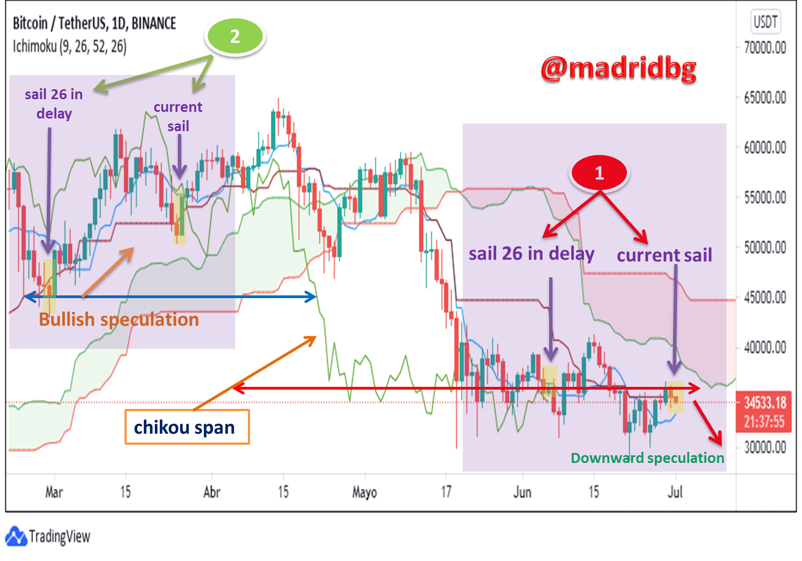

The Ichimoku Kinko Hyo (IKH) trading model, often simply known as Ichimoku, is a comprehensive technical analysis tool that provides insights into market trends, momentum, and support and resistance levels. Developed by the Japanese journalist Goichi Hosoda in the late 1930s and published in 1968, this model is designed to offer a clearer view of potential trading signals compared to traditional candlestick charts. One of the five key components of the Ichimoku system is the Chikou Span, also known as the Lagging Span, which plays a crucial role in validating trends and identifying potential reversals in the market.

Technical analysis is a cornerstone of modern trading, providing traders with visual representations of historical price actions that help predict future movements. The Chikou Span is vital for traders because it offers a lagging perspective on the market, plotting the current price 26 periods back on the chart. This allows traders to compare today's price against the historical backdrop, helping them gauge the prevailing market sentiment. By visualizing this comparison, traders can better understand whether the current trend is supported by historical data, thus enhancing their ability to make informed trading decisions.



In trading strategies, the Chikou Span serves as both a confirmatory tool and a signal provider. When the span crosses current prices, it can indicate potential bullish or bearish momentum shifts. For example, if the Chikou Span crosses above the price action from below, it may suggest a bullish trend, while a cross below may hint at bearish developments. This functionality makes it an indispensable component for traders looking to bolster their trading strategies with Ichimoku analysis.

The article aims to provide readers with a comprehensive understanding of utilizing the Chikou Span within technical analysis and algorithmic trading. By offering insights into its mechanics and strategic applications, traders are better equipped to incorporate the Chikou Span into their setups, from discretionary trading to sophisticated algorithmic systems.

Understanding the relevance of the Chikou Span is essential for traders, particularly in trend identification and confirmation. By analyzing how it juxtaposes current prices against historical data, traders can discern market conditions more effectively. This capability is instrumental in making informed decisions, mitigating risks, and optimizing trading outcomes. Whether used alone or in conjunction with other technical indicators, the Chikou Span remains a valuable tool in the trader's arsenal, aiding in the nuanced art of trend analysis.

## Table of Contents

## Understanding Chikou Span

The Chikou Span is a crucial component of the Ichimoku Kinko Hyo system, a comprehensive trading model developed by Japanese journalist Goichi Hosoda in the late 1930s and published in the 1960s. The Ichimoku Kinko Hyo system aims to provide a clear perspective of market trends, support, and resistance levels by utilizing multiple lines on a chart. The Chikou Span, sometimes referred to as the “lagging line”, is a key element of this system. It provides traders with an uncomplicated means of assessing the relationship between current price levels and historical market sentiments.

The Chikou Span acts as a lagging indicator by plotting the closing price of an asset 26 periods behind the current period. This delay does not represent a drawback but rather serves to align current price action with historical data, providing insights into how the price compares with prior market conditions. The formula for calculating the Chikou Span is simple:

$$
\text{Chikou Span} = \text{Close}_{t-26}
$$

where $\text{Close}_{t-26}$ is the closing price of the asset 26 periods ago.

By comparing the Chikou Span with the current price and the other components of the Ichimoku system, traders can gauge market sentiment and potential shifts in trends. When the Chikou Span is above the current price and the other Ichimoku lines, it suggests bullish sentiment. Conversely, if it is below, it may indicate bearish sentiment. This comparative positioning helps traders discern whether the market is leaning towards bullish or bearish trends, thus aiding in decision-making processes.

The importance of visualizing past trends lies in its ability to provide context for current price movements. The Chikou Span grants traders a historical lens through which they observe the consistency of the current trend with past market behavior. This perspective is invaluable for predicting future price movements, as it indicates whether the current trend is likely to continue or reverse based on historical patterns.

Plotting the Chikou Span on trading charts is straightforward. On most charting platforms, it can be overlaid with other components of the Ichimoku Kinko Hyo system, such as the Tenkan-sen, Kijun-sen, Senkou Span A, and Senkou Span B. This visualization helps traders quickly ascertain whether the market is in a trend or a state of equilibrium, aiding in the swift interpretation of trading signals.

Overall, the Chikou Span is a vital tool in the Ichimoku Kinko Hyo system, allowing traders to visually compare current and historical prices, thereby facilitating informed trading decisions based on the market's historical behavior and current trends.

## Chikou Span Trading Strategies

The Chikou Span, an integral component of the Ichimoku Kinko Hyo trading system, offers traders unique insights into market sentiment through its backward-looking analysis. By plotting the current closing price 26 periods back on the chart, the Chikou Span effectively shows whether the underlying asset's price today is above or below its level 26 periods ago. This historical juxtaposition enables traders to discern bullish and bearish signals through crossover patterns.

### Identifying Bullish and Bearish Signals Through Chikou Span Crossovers

Chikou Span crossovers are vital signals that traders use to determine potential market direction. A bullish signal occurs when the Chikou Span crosses above the price line, indicating potential upward [momentum](/wiki/momentum), as the current price exceeds the price of 26 periods ago. Conversely, a bearish signal is identified when the Chikou Span crosses below the price line, suggesting potential downward momentum. This straightforward crossover mechanism provides clear signals that align with existing trends.

### Using the Chikou Span with Other Ichimoku Components for Trend Confirmation

Successful traders often combine the Chikou Span with the other key Ichimoku components, such as the Tenkan-sen, Kijun-sen, Senkou Span A, and Senkou Span B, for robust trend confirmation. By comparing the position of the Chikou Span against the Kumo (cloud), traders can evaluate the strength of a trend. A Chikou Span above the cloud suggests a strong bullish trend, while a position below the cloud indicates a strong bearish trend. This holistic view enhances the accuracy of signal interpretation.

### Practical Tips for Leveraging Chikou Span 

Traders can optimize the Chikou Span's utility by incorporating it into their trading strategies with a few practical tips. First, ensure that crossovers occur in conjunction with confirming signals from other Ichimoku components. Second, consider the position of the Chikou Span relative to the cloud to gauge the trend's strength. Third, utilize Chikou Span signals in harmony with broader market analysis to avoid relying solely on lagging indicators.

### Integrating Chikou Span with Other Indicators

For enhanced signal confirmation, traders can integrate Chikou Span signals with additional technical indicators. For instance, combining the Chikou Span with popular indicators like the Relative Strength Index (RSI) or Moving Average Convergence Divergence (MACD) can provide momentum and trend validation. Consider the following example for using Python to automate this strategy:

```python
# Python snippet for integrating Chikou Span with RSI

import pandas as pd
import numpy as np

# Sample data frame
data = pd.read_csv('sample_data.csv')
data['Chikou_Span'] = data['Close'].shift(-26)

# Compute RSI
def compute_rsi(data, window=14):
    delta = data.diff()
    gain = (delta.where(delta > 0, 0)).rolling(window=window).mean()
    loss = (-delta.where(delta < 0, 0)).rolling(window=window).mean()
    rs = gain / loss
    rsi = 100 - 100 / (1 + rs)
    return rsi

data['RSI'] = compute_rsi(data['Close'])

# Generate buy/sell signals
data['Signal'] = np.where((data['Chikou_Span'] > data['Close']) & (data['RSI'] < 30), 'Buy',
                          np.where((data['Chikou_Span'] < data['Close']) & (data['RSI'] > 70), 'Sell', 'Hold'))

print(data[['Chikou_Span', 'RSI', 'Signal']])
```

By strategically amalgamating the Chikou Span with other indicators, traders can enhance the reliability of entry and [exit](/wiki/exit-strategy) signals, thereby optimizing trading performance.

## The Role of Chikou Span in Algo Trading

Algorithmic trading, often termed algo trading, utilizes computational models to automate the buying and selling of securities. The Chikou Span, a component of the Ichimoku Kinko Hyo system, is often utilized in these models for its ability to provide traders with a lagging perspective on market trends. Its unique characteristic of plotting the closing price 26 periods behind the current price action makes it a valuable tool for algorithmic systems seeking to analyze historical price movements and predict future trends.

**Advantages in Automated Trading**

The Chikou Span offers several advantages for automated trading strategies. Primarily, its design as a lagging indicator helps algorithms confirm trends by comparing current prices against past performance. This backward-looking approach allows trading systems to avoid false signals that might arise from short-term [volatility](/wiki/volatility-trading-strategies). Additionally, by integrating Chikou Span with other components of the Ichimoku Kinko Hyo system, such as the Kijun-sen and Tenkan-sen, traders can program more robust strategies that consider multiple data points for confirmation of market trends.

**Programming Challenges and Considerations**

Incorporating the Chikou Span into algorithmic models requires careful consideration. One challenge is its lagging nature, which may result in missed opportunities if a market trend abruptly changes. To effectively utilize the Chikou Span, traders must balance its signals with real-time data, potentially introducing other indicators for a comprehensive system. Additionally, the inherent delay in its signals necessitates meticulous tuning of parameters to prevent inefficiencies, particularly in fast-moving markets.

A sample Python script for plotting the Chikou Span might look as follows:

```python
import matplotlib.pyplot as plt
import pandas as pd

def compute_chikou_span(close_prices, period=26):
    return close_prices.shift(periods=-period)

# Sample data
data = {'Close': [145, 147, 148, 150, 152, 154, 159, 160, 162, 165]}
df = pd.DataFrame(data)

df['Chikou Span'] = compute_chikou_span(df['Close'])
plt.plot(df.index, df['Close'], label='Close Price')
plt.plot(df.index, df['Chikou Span'], label='Chikou Span', linestyle='--')
plt.legend()
plt.show()
```

**Successful Strategies and Optimization**

Successful algo trading strategies often integrate the Chikou Span with other indicators to enhance signal reliability. For instance, a common strategy might use Chikou Span crossovers with the price line as a confirmation tool alongside momentum-based indicators to time entries and exits. By employing [backtesting](/wiki/backtesting) methodologies, traders can refine strategies to adapt to different market conditions, optimizing the Chikou Span's parameters for volatility or trend strength.

Optimizing the Chikou Span for various market conditions involves adjusting its period to suit specific asset classes and trading environments. For instance, shorter intervals may be preferable in highly volatile markets, whereas longer periods might better capture trends in stable environments.

In conclusion, the Chikou Span, with its ability to provide a historical context to current price movements, constitutes a significant aspect of an algorithmic trader’s toolkit. Despite challenges posed by its lagging nature, when effectively programmed and optimized, it can enhance the reliability of automated trading strategies.

## Pros and Cons of Chikou Span Trading

The Chikou Span offers unique benefits to traders by providing straightforward signals derived from historical price data. As a key component of the Ichimoku Kinko Hyo system, its core function is to serve as a lagging indicator by plotting the current closing price 26 periods back on the chart. This functionality assists traders in easily identifying market sentiment and potential trend confirmations. The simplicity of this visualization makes it an efficient tool for those looking to quickly ascertain the underlying trend direction.

The effectiveness of the Chikou Span stems from its ability to provide a clear visual representation of how current prices relate to past prices. When the Chikou Span is above historical prices, it suggests a bullish market sentiment. Conversely, when it is below, it indicates bearish conditions. This straightforward assessment aids traders in confirming trends without the complexity often associated with other indicators.

Despite its benefits, the Chikou Span has notable drawbacks. Due to its lagging nature, it may delay responses to rapid market changes. This characteristic can be a limitation, especially in sideways or choppy markets where prices fluctuate within a range, failing to establish clear trends. In such conditions, reliance solely on the Chikou Span may result in false signals, prompting misplaced trades.

To mitigate false signals, traders can incorporate risk management strategies such as stop-loss orders to minimize potential losses. Additionally, combining the Chikou Span with other technical indicators like moving averages or the other components of the Ichimoku system (Tenkan-sen, Kijun-sen, Senkou Span A, and B) can enhance signal accuracy and ensure more reliable trend confirmations. This multifaceted approach can filter out noise created by market volatility.

The Chikou Span performs best during strong trending markets where its lagging properties have minimal impact on signal effectiveness. In such scenarios, the historical connection it makes becomes a powerful tool for staying aligned with prevailing market momentum. However, during periods of market consolidation or indecisiveness, traders should remain cautious and consider complementary indicators for a fuller market analysis.

In summary, while the Chikou Span offers a simple and efficient method for trend confirmation, its lagging nature necessitates careful application, especially in non-trending markets. Strategic integration with additional technical tools and robust risk management practices can significantly enhance trading outcomes and mitigate potential downsides.

## Conclusion

In summary, the Chikou Span plays a significant role in enhancing trading strategies by providing traders with valuable insights into historical price movements. As part of the Ichimoku Kinko Hyo system, it offers a unique perspective on market sentiment by illustrating where the current price stands in relation to past data. This lagging indicator helps traders identify potential trends and confirm signals, making it a useful tool for those looking to refine their technical analysis approach. 

Traders are encouraged to integrate the Chikou Span into their broader trading strategies. Its simplicity and efficiency in trend confirmation can complement other indicators and trading methodologies. However, reliance on any single tool is ill-advised; hence, utilizing the Chikou Span alongside various technical analysis instruments can lead to more robust decision-making. 

Continuous learning and adaptation to evolving market conditions are crucial for any trader aiming for long-term success. The dynamics of financial markets are ever-changing, and staying updated with new techniques and strategies can make a significant difference. The Chikou Span, despite being a traditional tool, remains relevant when applied thoughtfully within modern trading strategies. 

For traders seeking to explore the full potential of the Chikou Span, various resources and tools are available for mastering technical analysis. Books on Ichimoku Kinko Hyo, online courses, and trading platforms with charting capabilities can provide further insights and hands-on experience. Understanding Python programming for backtesting strategies involving the Chikou Span might also offer traders a deeper comprehension of its impact within [algorithmic trading](/wiki/algorithmic-trading) frameworks. Investing the time to understand such concepts can lead to improved trading outcomes and a more comprehensive approach to technical analysis.

## References & Further Reading

[1]: Nison, S. (1991). ["Japanese Candlestick Charting Techniques."](https://drive.google.com/file/d/0B_CADMk621uLNDEyZTEzZjYtMmZjOS00ZmUyLTlhYmYtN2E1YTViOWRiOTdi/view) New York Institute of Finance.

[2]: Hosoda, G. (1968). ["Ichimoku Kinko Hyo."](https://en.wikipedia.org/wiki/Ichimoku_Kink%C5%8D_Hy%C5%8D) Trading Publication of Japan. (A book by Goichi Hosoda explaining the Ichimoku system in detail)

[3]: Kirkpatrick, C. D., & Dahlquist, J. R. (2011). ["Technical Analysis: The Complete Resource for Financial Market Technicians."](https://ptgmedia.pearsoncmg.com/images/9780134137049/samplepages/9780134137049.pdf) FT Press.

[4]: Murphy, J. J. (1999). ["Technical Analysis of the Financial Markets: A Comprehensive Guide to Trading Methods and Applications."](https://archive.org/details/technicalanalysi0000murp) New York Institute of Finance.

[5]: Jansen, S. (2020). ["Machine Learning for Algorithmic Trading: Predictive Models to Extract Signals from Market and Alternative Data."](https://www.amazon.com/Machine-Learning-Algorithmic-Trading-alternative/dp/1839217715) Packt Publishing.

[6]: Lopez de Prado, M. (2018). ["Advances in Financial Machine Learning."](https://www.amazon.com/Advances-Financial-Machine-Learning-Marcos/dp/1119482089) Wiley.

[7]: Chan, E. P. (2008). ["Quantitative Trading: How to Build Your Own Algorithmic Trading Business."](https://github.com/justinchou/books-quantitative-trading) Wiley.