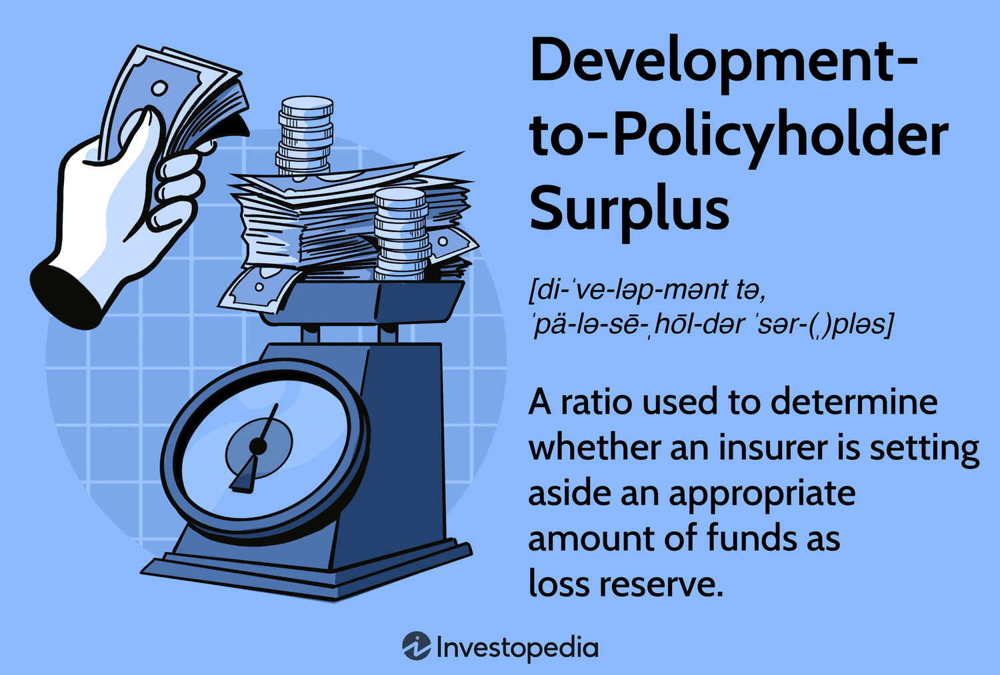

The financial health of insurance companies is a critical factor in ensuring the stability and confidence of their policyholders. An important aspect of understanding this financial health is through the analysis of financial ratios, among which the policyholder surplus ratio is fundamental. This ratio is a measure of an insurer’s ability to cover its policyholders’ claims and obligations, providing insight into the company's financial robustness and resilience. A strong surplus ratio indicates a healthier company that is better equipped to handle liabilities and unforeseen claims, thereby securing the interests of its policyholders.

In addition to financial ratios, algorithmic trading (algo trading) within financial markets now plays an instrumental role in shaping an insurer's financial stability. Algo trading involves the use of advanced algorithms and automated systems to execute trading decisions with precision and speed, optimizing investment strategies. By leveraging algorithmic trading, insurance companies can potentially enhance their investment returns, thereby bolstering their financial health and policyholder surplus.



This article will explore the interconnectedness of financial ratios, notably the policyholder surplus ratio, alongside the role of algorithmic trading in managing and amplifying the financial stability of insurance companies. Understanding these dimensions is vital for both insurers and policyholders to ensure stability and cultivate trust in the market.

## Table of Contents

## What is Policyholder Surplus?

Policyholder surplus is a fundamental measure within the insurance industry, representing the difference between an insurer's total assets and total liabilities. This calculation effectively indicates the net worth of an insurance company, serving as a critical indicator of its financial health and stability.

The formula to calculate policyholder surplus is as follows:

$$
\text{Policyholder Surplus} = \text{Assets} - \text{Liabilities}
$$

This surplus acts as a financial buffer, allowing insurance companies to absorb losses, pay out claims, and support growth initiatives. A higher policyholder surplus is indicative of a robust financial position, providing assurance of greater capacity to cover claims and absorb potential shocks in the business environment. It signals an insurer's soundness and reliability, crucial for maintaining policyholder trust.

Maintaining a healthy policyholder surplus is essential not only for the protection of policyholders but also for the overall financial stability of the insurance company. It ensures that the insurer has enough financial resources to meet its obligations, even during periods of high claims or unexpected financial stress. Thus, regulators closely monitor policyholder surplus levels to ensure that insurers remain solvent and capable of fulfilling their commitments to policyholders.

Through prudent management of assets and liabilities, insurers can safeguard and potentially increase their policyholder surplus, reinforcing their capacity to thrive amidst competitive market conditions and ensuring long-term sustainability.

## Importance of Financial Ratios in Insurance

Financial ratios are essential analytical tools that provide meaningful insights into the operational and financial health of insurance companies. By assessing an insurer's ability to meet its current and future obligations, these ratios play a vital role in ensuring solvency and protecting policyholders.

One of the core financial ratios is the policyholder surplus ratio, which quantifies the proportion of an insurer's assets to its liabilities. This ratio is crucial for evaluating an insurer’s capacity to absorb losses and manage claims effectively. A robust policyholder surplus signifies a solid financial foundation, enabling the insurer to withstand significant claims without jeopardizing its financial position.

The loss ratio is another critical metric, representing the percentage of premiums collected that are paid out in claims. This ratio is calculated as:

$$
\text{Loss Ratio} = \frac{\text{Incurred Losses}}{\text{Earned Premiums}} \times 100
$$

A high loss ratio can signal poor underwriting practices or a surge in claim payouts due to unforeseen events, which may threaten an insurer's profitability and stability.

Furthermore, the combined ratio combines both loss and expense ratios to present a holistic view of an insurer's operational efficiency. It is expressed as:

$$
\text{Combined Ratio} = \text{Loss Ratio} + \text{Expense Ratio}
$$

A combined ratio of less than 100% indicates that an insurance company is making an underwriting profit, while a ratio above 100% suggests a loss, highlighting areas for improvement in cost management or pricing strategies.

These financial ratios are pivotal not only for insurers but also for regulatory bodies. Regulators examine these ratios to monitor the financial viability of insurance firms, ensuring that they adhere to standards that promote market integrity and stability. By regularly analyzing these ratios, stakeholders can identify trends, detect potential issues early, and implement corrective measures to mitigate risks, thereby maintaining trust and confidence in the insurance market.

## Understanding Loss Ratios

The loss ratio is a fundamental metric in the insurance industry, primarily calculated by comparing the claims paid by an insurer to the premiums earned. It is expressed as:

$$
\text{Loss Ratio} = \left( \frac{\text{Claims Paid}}{\text{Premiums Earned}} \right) \times 100
$$

A loss ratio provides a straightforward measure of an insurer's profitability. It effectively highlights how much of each premium dollar is used for paying claims, thereby indicating the efficiency and risk management efficacy of insurance operations.

A high loss ratio can signal potential red flags for an insurance company. It suggests that a significant portion of the premium income goes towards covering claims, which could stem from suboptimal underwriting procedures. Poor underwriting practices can result in the acceptance of excessively risky policies that lead to a higher incidence of claims. Furthermore, unexpected catastrophic events, such as natural disasters or large-scale accidents, can drastically increase the number of claims, thereby inflating the loss ratio.

Moreover, a persistently high loss ratio may threaten the insurer's financial health by squeezing the funds available to cover operational costs, contribute to reserves, and maintain a healthy policyholder surplus. Therefore, insurers must adopt robust mechanisms to monitor and manage loss ratios regularly. 

Effective loss ratio management involves various strategies, including prudent underwriting, where insurers assess and price risks accurately. It also necessitates the implementation of comprehensive reinsurance programs to mitigate the impact of large losses. By keeping track of the loss ratio, insurance companies can ensure they maintain a sufficient policyholder surplus, enhancing their capacity to fulfill future claims and thereby sustaining long-term financial stability.

## Influence of Algo Trading on Insurance Stability

Algorithmic trading, often referred to as algo trading, employs automated systems for executing trades based on predefined criteria, and has become increasingly prevalent across financial markets, including within the insurance sector. This trading strategy is characterized by its ability to process vast amounts of data rapidly and execute large volumes of trades with precision. For insurance companies, implementing algo trading can lead to optimized investment strategies, which in turn enhances returns and contributes positively to their policyholder surplus.

Algorithmic trading systems utilize mathematical models and complex algorithms to make trading decisions. These systems can analyze multiple markets and numerous financial instruments simultaneously, identifying patterns and executing trades that align with the insurer's investment strategy. By refining the timing and pricing of trades, algo trading helps insurers capitalize on favorable market conditions swiftly and efficiently, potentially increasing their investment returns. Such enhancements in returns bolster the policyholder surplus, thereby fortifying the company's ability to meet future policyholder claims and obligations.

However, while leveraging algo trading can present significant advantages, insurance companies must judiciously balance the associated risks and opportunities to sustain their financial stability. Algo trading is inherently affected by market [volatility](/wiki/volatility-trading-strategies), which can lead to abrupt fluctuations in asset values. Additionally, the reliance on automated systems introduces risks related to system failures or errors in the algorithmic model, which could result in substantial financial losses if not properly managed.

To mitigate these risks, insurance firms need to develop robust risk management frameworks. This includes regular [backtesting](/wiki/backtesting) and simulation of trading strategies to ensure algorithms perform under diverse market conditions, continuous monitoring for system errors, and implementing fallback procedures in case of unexpected system failures. Moreover, maintaining a diverse portfolio can help spread risk and minimize potential losses due to the failure of a specific trading strategy.

By integrating comprehensive risk management measures with their investment strategies, insurance companies can leverage the benefits of algo trading while safeguarding their policyholder surplus and overall financial health. This strategic approach allows insurers to harness technological advancements in trading to support stability and confidence in their financial operations.

## Challenges and Risks Associated with Algo Trading

Algorithmic trading, while advantageous for its speed and precision, presents several challenges and risks that insurance firms must manage effectively. One primary concern is market volatility, which can be exacerbated by high-frequency trading. During periods of extreme volatility, automated systems can amplify price movements, potentially leading to rapid and significant financial losses. For instance, the "Flash Crash" of May 6, 2010, illustrated how algorithmically-driven trades can contribute to drastic market fluctuations within short timeframes.

Another risk [factor](/wiki/factor-investing) associated with algo trading is systems failure. Automated trading systems rely heavily on technology and infrastructure, and a failure in these systems can result in the inability to execute trades or, worse, executing trades erratically. Such failures can emanate from software bugs, hardware malfunctions, or even cyber attacks, threatening the financial stability of the trading firm.

Insurance companies employing [algorithmic trading](/wiki/algorithmic-trading) need robust risk management frameworks to counter these vulnerabilities. This involves implementing comprehensive monitoring systems capable of real-time oversight of trading activities, ensuring that deviations from expected patterns are quickly identified and addressed. Additionally, firms must develop layered risk controls such as setting circuit breakers, which halt trading under certain conditions to prevent catastrophic losses.

Continuous evaluation and fine-tuning of trading algorithms are crucial. Financial markets are dynamic, influenced by countless variables, and static algorithms may become obsolete if not regularly updated. Insurance firms should adopt a feedback loop mechanism, where market data is continuously analyzed to refine algorithmic strategies. This can be implemented through [machine learning](/wiki/machine-learning) techniques, enabling algorithms to adapt autonomously to changing market conditions.

Here is an example of a simple feedback mechanism in Python that updates the parameters of a trading algorithm based on new market data:

```python
import numpy as np

def update_trading_algorithm(current_params, market_data):
    # Simulate parameter adjustment logic using learning rate
    learning_rate = 0.01
    new_params = current_params - learning_rate * np.gradient(market_data)
    return new_params

# Initial parameters of the algorithm
initial_params = np.array([0.5, 1.5])

# Simulated market data that might influence algorithm changes
market_data = np.array([2.0, 2.1, 1.9, 2.05, 2.2])

# Update trading algorithm parameters with new market data
updated_params = update_trading_algorithm(initial_params, market_data)

print("Updated algorithm parameters:", updated_params)
```

In conclusion, while algorithmic trading provides numerous benefits in enhancing efficiency and returns, it necessitates a vigilant approach to risk management. By implementing robust systems and continuously updating algorithmic strategies, insurance firms can harness the potential of algorithmic trading while safeguarding against its inherent risks.

## Maintaining a Healthy Policyholder Surplus Ratio

Insurance companies must strategically manage their resources to maintain a healthy policyholder surplus ratio, which is vital for ensuring their financial health and capability to meet policyholder claims. A key component of this strategy involves the effective management of premiums, investments, and claims.

1. **Strategic Management of Premiums, Investments, and Claims**:
   - Insurance companies need to optimize their premium collections to ensure they are adequately priced to cover future claims while remaining competitive in the market. This involves understanding the risk profiles of policyholders and employing actuarial methods to adjust premiums accordingly.
   - Investment strategies play a crucial role in maintaining the surplus ratio. Companies should focus on diversifying their investment portfolios across different asset classes such as equities, bonds, real estate, and alternative investments. Diversification helps to spread risk and potentially increase returns.
   - Prudent risk management is essential to ensure that the investments are aligned with the company's risk appetite and regulatory requirements. This involves continuously assessing the market conditions and adjusting the investment strategies as needed.

2. **Diversification and Risk Management**:
   - Diversification across asset classes, industries, and geographies can help mitigate the impacts of market volatility on an insurer’s portfolio. By not placing all financial resources in a single type of asset, insurance companies can protect themselves against sector-specific downfalls.
   - Employing advanced risk management tools and methodologies can aid in identifying and mitigating potential financial risks. This includes stress testing the investment portfolios to analyze their performance under different economic scenarios.

3. **Regular Monitoring and Regulatory Compliance**:
   - Continuous monitoring of financial ratios and the overall financial health of the company is necessary to preemptively address potential declines in surplus ratios. This involves regular audits and reviews of financial statements and ratio analyses.
   - Adhering to regulatory standards set by financial and insurance regulatory bodies ensures that firms remain compliant with the laws aimed at protecting policyholders and maintaining market stability. Regulations may dictate specific capital requirements and investment limitations to preserve financial stability.

Insurance companies can maintain a robust policyholder surplus ratio by strategically managing their financial responsibilities and embracing proactive risk management and compliance strategies. These efforts are indispensable in fostering confidence among policyholders and sustaining the insurer's market position.

## Conclusion

The interplay between financial ratios, policyholder surplus, and algorithmic trading is complex yet crucial for maintaining insurance stability. Financial ratios such as the policyholder surplus ratio, loss ratio, and combined ratio provide key insights into an insurer's capability to fulfill its obligations and maintain solvency. These ratios ensure transparency and regulatory compliance, thereby fostering market confidence.

A robust policyholder surplus acts as a buffer, enhancing an insurer's ability to cover unexpected claims, thereby safeguarding policyholder interests. By closely monitoring and optimizing these financial ratios, insurers can effectively manage their financial health.

Algorithmic trading further enriches this dynamic by optimizing investment strategies through automated systems, maximizing returns on investment portfolios, and positively impacting policyholder surplus. However, the integration of algo trading requires a careful balancing of risks, including market volatility and potential systems failures. Insurance firms must adopt rigorous risk management and continuous assessment protocols to mitigate such risks.

In conclusion, the strategic management of these financial elements is vital for insurers to protect policyholders and maintain market stability. As the financial landscape evolves, ongoing innovation in financial technologies and updated regulatory frameworks will play pivotal roles in shaping the future of insurance financial management, ensuring both insurer resilience and policyholder security.

## References & Further Reading

[1]: ["Insurance Company Policyholders' Surplus: Analysis and Management"](https://theinsuranceuniverse.com/policyholder-surplus/) by the Society of Actuaries.

[2]: ["Basic Insurance Accounting—Selected Topics"](https://www.casact.org/sites/default/files/old/studynotes_7us_blanchard_july2008.pdf) by Charles M. Lech

[3]: Rechenthin, Michael D. (2014). ["Machine Learning in Algorithmic Trading."](https://scholar.google.com/citations?user=kPV20AUAAAAJ&hl=en) The Journal of Trading.

[4]: ["Algorithmic Trading and DMA: An introduction to direct access trading strategies"](https://www.amazon.com/Algorithmic-Trading-DMA-introduction-strategies/dp/0956399207) by Barry Johnson

[5]: ["Quantitative Analysis, Derivatives Modeling, and Trading Strategies"](https://worldscientific.com/worldscibooks/10.1142/4228) by Yi Tang, and Ben Charoenwong

[6]: ["The Use of Financial Ratios in Insurance Risk Management"](https://www.careratings.com/pdf/resources/Financial%20Ratios%20-%20Insurance%20Sector.pdf) by Eliliane Aparecida Jabur, and Cláudio Antônio Pinheiro Gallucci