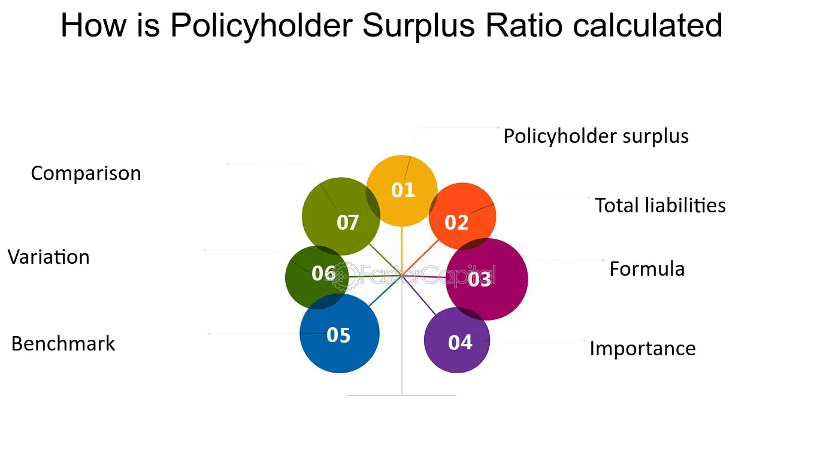

## Table of Contents

## What is the Development to Policyholder Surplus Ratio?

The Development to Policyholder Surplus Ratio is a financial measure used in the insurance industry. It shows how much an insurance company's reserves for claims might change compared to the money it has left after paying claims and expenses. This ratio helps to see if an insurance company is taking too much risk. If the ratio is high, it means the company might not have enough money to cover future claims if they end up being more than expected.

This ratio is important for insurance companies and their regulators. It helps them understand if the company is managing its risks well. A low ratio means the company is likely safe and can handle unexpected increases in claims. On the other hand, a high ratio can be a warning sign that the company might struggle if claims are higher than planned. By keeping an eye on this ratio, insurance companies can make better decisions about how much risk to take and how to protect their policyholders.

## Why is the Development to Policyholder Surplus Ratio important for insurance companies?

The Development to Policyholder Surplus Ratio is important for insurance companies because it helps them understand if they have enough money to cover future claims. This ratio compares how much their reserves for claims might change to the money they have left after paying claims and expenses. If this ratio is low, it means the company is likely safe and can handle any unexpected increases in claims. But if the ratio is high, it's a warning sign that the company might struggle if claims end up being more than expected.

By keeping an eye on this ratio, insurance companies can make better decisions about how much risk to take. It helps them manage their risks well and protect their policyholders. Regulators also use this ratio to check if insurance companies are being responsible with their money. This way, they can make sure that the companies are strong enough to pay out claims when needed, which is important for keeping the insurance industry stable and trustworthy.

## How is the Development to Policyholder Surplus Ratio calculated?

The Development to Policyholder Surplus Ratio is calculated by dividing the development of reserves by the policyholder surplus. The development of reserves is the change in the amount of money set aside for claims over time. This change can be positive if claims end up being more than expected or negative if they are less. The policyholder surplus is what's left after the insurance company pays all its claims and expenses. It's like the company's savings that can be used if something unexpected happens.

To find the ratio, you take the development of reserves and divide it by the policyholder surplus. For example, if the development of reserves is $10 million and the policyholder surplus is $100 million, the ratio would be 10% ($10 million divided by $100 million). This ratio helps show how much risk the insurance company is taking. A smaller ratio means the company has more money to cover unexpected claims, while a larger ratio might mean the company could struggle if claims are higher than expected.

## What does a high Development to Policyholder Surplus Ratio indicate?

A high Development to Policyholder Surplus Ratio means that an insurance company might not have enough money to cover future claims if they end up being more than expected. This ratio compares the change in the money set aside for claims to the money the company has left after paying claims and expenses. If this ratio is high, it shows that the change in the money set aside for claims is big compared to the company's savings. This can be a warning sign that the company might struggle if claims are higher than planned.

This ratio is important for insurance companies to watch because it helps them understand how much risk they are taking. If the ratio is high, the company might need to change its policies or take steps to lower its risk. Regulators also look at this ratio to make sure insurance companies are being responsible with their money. By keeping the ratio low, insurance companies can better protect their policyholders and make sure they have enough money to pay out claims when needed.

## What does a low Development to Policyholder Surplus Ratio suggest?

A low Development to Policyholder Surplus Ratio suggests that an insurance company is in a good position to handle any unexpected increases in claims. This ratio compares the change in the money set aside for claims to the money the company has left after paying claims and expenses. When this ratio is low, it means the change in the money set aside for claims is small compared to the company's savings. This is a good sign that the company has enough money to cover future claims, even if they are higher than expected.

This ratio is important for insurance companies because it helps them understand their financial health and how much risk they are taking. If the ratio is low, it shows that the company is managing its risks well and is likely to be stable. Regulators also look at this ratio to make sure insurance companies are being responsible and have enough money to pay out claims when needed. A low ratio gives peace of mind to both the company and its policyholders, knowing that the company can handle unexpected situations.

## How does the Development to Policyholder Surplus Ratio affect an insurance company's financial stability?

The Development to Policyholder Surplus Ratio helps show how financially stable an insurance company is. This ratio compares the change in money set aside for claims to the money the company has left after paying claims and expenses. If this ratio is low, it means the company has a lot of money saved up compared to the changes in its claims. This is good because it means the company can handle any unexpected claims without running out of money. A low ratio shows the company is financially stable and can keep paying its policyholders even if things don't go as planned.

On the other hand, if the Development to Policyholder Surplus Ratio is high, it can be a warning sign. A high ratio means the change in the money set aside for claims is big compared to the company's savings. This could mean the company might not have enough money to cover all its claims if they are higher than expected. A high ratio suggests the company might be taking too much risk and could face financial problems. By keeping an eye on this ratio, insurance companies can make better decisions to stay financially stable and protect their policyholders.

## Can you provide an example of how to interpret the Development to Policyholder Surplus Ratio in a real-world scenario?

Imagine an insurance company called SafeGuard Insurance. They have a Development to Policyholder Surplus Ratio of 5%. This means that the change in the money they set aside for claims is small compared to the money they have left after paying claims and expenses. A 5% ratio is low, which is good news for SafeGuard. It shows that they have a lot of money saved up and can handle any unexpected claims without running into financial trouble. This makes SafeGuard a stable company that can keep paying its policyholders even if things don't go as planned.

Now, let's look at another company, Risky Ventures Insurance, with a Development to Policyholder Surplus Ratio of 20%. This high ratio means that the change in the money they set aside for claims is big compared to their savings. A 20% ratio is a warning sign that Risky Ventures might not have enough money to cover all its claims if they are higher than expected. This could mean they are taking too much risk and might face financial problems. By comparing these two companies, we can see how the Development to Policyholder Surplus Ratio helps us understand their financial stability and how well they can protect their policyholders.

## What are the industry benchmarks for the Development to Policyholder Surplus Ratio?

In the insurance industry, the Development to Policyholder Surplus Ratio is used to check how much risk a company is taking. A good benchmark for this ratio is usually around 5% to 10%. If the ratio is within this range, it means the company has enough money to cover any unexpected claims. This shows that the company is managing its risks well and is likely to be financially stable.

If the ratio is higher than 10%, it can be a warning sign. A high ratio means the company might not have enough money to pay all its claims if they are more than expected. This could mean the company is taking too much risk and might face financial problems. By keeping the ratio below 10%, insurance companies can show they are being responsible and can protect their policyholders.

## How does the Development to Policyholder Surplus Ratio vary across different types of insurance?

The Development to Policyholder Surplus Ratio can be different for different types of insurance. For example, property and casualty insurance, which covers things like car accidents and home damage, might have a higher ratio than life insurance. This is because property and casualty claims can change a lot and be hard to predict. If a big storm hits, the company might need to pay out a lot more money than they expected. So, they need to keep a close eye on their ratio to make sure they have enough money saved up.

On the other hand, life insurance usually has a lower Development to Policyholder Surplus Ratio. This is because life insurance claims are more predictable. People usually know when they want to start a life insurance policy, and the company can plan for the claims better. Because life insurance claims don't change as much, the ratio stays lower, showing that the company is taking less risk and is more financially stable. By understanding how this ratio works for different types of insurance, companies can manage their money better and make sure they can pay out claims when needed.

## What strategies can insurance companies use to manage their Development to Policyholder Surplus Ratio?

Insurance companies can manage their Development to Policyholder Surplus Ratio by being careful about the risks they take. They can do this by setting their prices right and making sure they have enough money set aside for claims. If they think claims might be higher than expected, they can raise their prices a bit or save more money. This helps keep the ratio low and makes sure they have enough money to pay out claims, even if something unexpected happens.

Another way insurance companies can manage this ratio is by spreading out their risks. They can do this by selling different types of insurance policies. For example, if they sell both car insurance and life insurance, a big storm might make car insurance claims go up, but life insurance claims might stay the same. By having different types of insurance, the company can balance out the risks and keep the ratio stable. This helps them stay financially healthy and protect their policyholders.

## How does regulatory oversight impact the Development to Policyholder Surplus Ratio?

Regulatory oversight plays a big role in making sure insurance companies keep their Development to Policyholder Surplus Ratio in check. Regulators watch this ratio to see if insurance companies are being responsible with their money. If the ratio is too high, it might mean the company is taking too much risk. Regulators can step in and tell the company to change its policies or save more money. This helps make sure the company can pay out claims when needed and keeps the insurance industry stable.

By keeping an eye on the Development to Policyholder Surplus Ratio, regulators help protect policyholders. If a company's ratio is too high, it might not have enough money to cover all its claims. This could be bad for people who have insurance with that company. Regulators make sure companies manage their risks well so that policyholders can trust that their claims will be paid. This oversight helps keep the insurance market strong and trustworthy.

## What are the advanced analytical methods used to forecast changes in the Development to Policyholder Surplus Ratio?

Insurance companies use advanced analytical methods to forecast changes in the Development to Policyholder Surplus Ratio. One common method is using predictive modeling. This involves using past data to make predictions about future claims. By looking at how claims have changed over time, companies can guess how much money they might need to set aside for future claims. They use computer programs to analyze this data and come up with the best guess for what might happen. This helps them keep their Development to Policyholder Surplus Ratio low and stable.

Another method is stress testing. This means the company tries to see what would happen if something really bad happened, like a big storm or a lot of people making claims at the same time. They use computer simulations to see how their money would hold up in these tough situations. By doing this, they can plan better and make sure they have enough money saved up. This helps them manage their risks and keep their Development to Policyholder Surplus Ratio in a good range, even if things don't go as planned.

## What is Policyholder Surplus?

Policyholder surplus is a fundamental measure within the insurance industry, representing the difference between an insurer's total assets and total liabilities. This calculation effectively indicates the net worth of an insurance company, serving as a critical indicator of its financial health and stability.

The formula to calculate policyholder surplus is as follows:

$$
\text{Policyholder Surplus} = \text{Assets} - \text{Liabilities}
$$

This surplus acts as a financial buffer, allowing insurance companies to absorb losses, pay out claims, and support growth initiatives. A higher policyholder surplus is indicative of a robust financial position, providing assurance of greater capacity to cover claims and absorb potential shocks in the business environment. It signals an insurer's soundness and reliability, crucial for maintaining policyholder trust.

Maintaining a healthy policyholder surplus is essential not only for the protection of policyholders but also for the overall financial stability of the insurance company. It ensures that the insurer has enough financial resources to meet its obligations, even during periods of high claims or unexpected financial stress. Thus, regulators closely monitor policyholder surplus levels to ensure that insurers remain solvent and capable of fulfilling their commitments to policyholders.

Through prudent management of assets and liabilities, insurers can safeguard and potentially increase their policyholder surplus, reinforcing their capacity to thrive amidst competitive market conditions and ensuring long-term sustainability.

## What is the Importance of Financial Ratios in Insurance?

Financial ratios are essential analytical tools that provide meaningful insights into the operational and financial health of insurance companies. By assessing an insurer's ability to meet its current and future obligations, these ratios play a vital role in ensuring solvency and protecting policyholders.

One of the core financial ratios is the policyholder surplus ratio, which quantifies the proportion of an insurer's assets to its liabilities. This ratio is crucial for evaluating an insurer’s capacity to absorb losses and manage claims effectively. A robust policyholder surplus signifies a solid financial foundation, enabling the insurer to withstand significant claims without jeopardizing its financial position.

The loss ratio is another critical metric, representing the percentage of premiums collected that are paid out in claims. This ratio is calculated as:

$$
\text{Loss Ratio} = \frac{\text{Incurred Losses}}{\text{Earned Premiums}} \times 100
$$

A high loss ratio can signal poor underwriting practices or a surge in claim payouts due to unforeseen events, which may threaten an insurer's profitability and stability.

Furthermore, the combined ratio combines both loss and expense ratios to present a holistic view of an insurer's operational efficiency. It is expressed as:

$$
\text{Combined Ratio} = \text{Loss Ratio} + \text{Expense Ratio}
$$

A combined ratio of less than 100% indicates that an insurance company is making an underwriting profit, while a ratio above 100% suggests a loss, highlighting areas for improvement in cost management or pricing strategies.

These financial ratios are pivotal not only for insurers but also for regulatory bodies. Regulators examine these ratios to monitor the financial viability of insurance firms, ensuring that they adhere to standards that promote market integrity and stability. By regularly analyzing these ratios, stakeholders can identify trends, detect potential issues early, and implement corrective measures to mitigate risks, thereby maintaining trust and confidence in the insurance market.

## What are Loss Ratios and How Do We Understand Them?

The loss ratio is a fundamental metric in the insurance industry, primarily calculated by comparing the claims paid by an insurer to the premiums earned. It is expressed as:

$$
\text{Loss Ratio} = \left( \frac{\text{Claims Paid}}{\text{Premiums Earned}} \right) \times 100
$$

A loss ratio provides a straightforward measure of an insurer's profitability. It effectively highlights how much of each premium dollar is used for paying claims, thereby indicating the efficiency and risk management efficacy of insurance operations.

A high loss ratio can signal potential red flags for an insurance company. It suggests that a significant portion of the premium income goes towards covering claims, which could stem from suboptimal underwriting procedures. Poor underwriting practices can result in the acceptance of excessively risky policies that lead to a higher incidence of claims. Furthermore, unexpected catastrophic events, such as natural disasters or large-scale accidents, can drastically increase the number of claims, thereby inflating the loss ratio.

Moreover, a persistently high loss ratio may threaten the insurer's financial health by squeezing the funds available to cover operational costs, contribute to reserves, and maintain a healthy policyholder surplus. Therefore, insurers must adopt robust mechanisms to monitor and manage loss ratios regularly. 

Effective loss ratio management involves various strategies, including prudent underwriting, where insurers assess and price risks accurately. It also necessitates the implementation of comprehensive reinsurance programs to mitigate the impact of large losses. By keeping track of the loss ratio, insurance companies can ensure they maintain a sufficient policyholder surplus, enhancing their capacity to fulfill future claims and thereby sustaining long-term financial stability.

## References & Further Reading

[1]: ["Insurance Company Policyholders' Surplus: Analysis and Management"](https://theinsuranceuniverse.com/policyholder-surplus/) by the Society of Actuaries.

[2]: ["Basic Insurance Accounting—Selected Topics"](https://www.casact.org/sites/default/files/old/studynotes_7us_blanchard_july2008.pdf) by Charles M. Lech

[3]: Rechenthin, Michael D. (2014). ["Machine Learning in Algorithmic Trading."](https://scholar.google.com/citations?user=kPV20AUAAAAJ&hl=en) The Journal of Trading.

[4]: ["Algorithmic Trading and DMA: An introduction to direct access trading strategies"](https://www.amazon.com/Algorithmic-Trading-DMA-introduction-strategies/dp/0956399207) by Barry Johnson

[5]: ["Quantitative Analysis, Derivatives Modeling, and Trading Strategies"](https://worldscientific.com/worldscibooks/10.1142/4228) by Yi Tang, and Ben Charoenwong

[6]: ["The Use of Financial Ratios in Insurance Risk Management"](https://www.careratings.com/pdf/resources/Financial%20Ratios%20-%20Insurance%20Sector.pdf) by Eliliane Aparecida Jabur, and Cláudio Antônio Pinheiro Gallucci