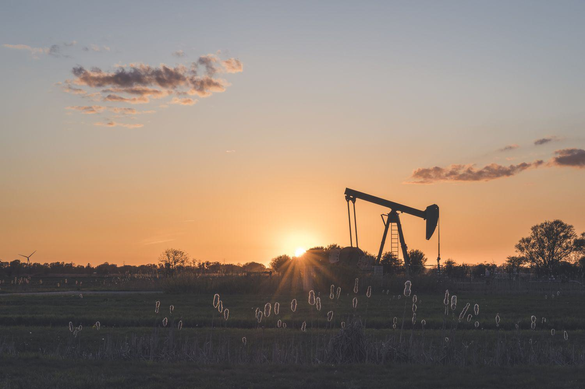

## Table of Contents

## What is a development well?

A development well is a type of oil or gas well that is drilled after the discovery of a hydrocarbon reservoir. The main purpose of a development well is to extract oil or gas from the reservoir to produce it commercially. Unlike exploratory wells, which are used to find new oil or gas deposits, development wells are drilled in areas where the presence of hydrocarbons has already been confirmed.

Development wells are crucial for the efficient extraction of oil and gas. They are often drilled in patterns to maximize the recovery of the hydrocarbons from the reservoir. The number and placement of development wells depend on the size and characteristics of the reservoir, as well as the production strategy of the company operating the field. By drilling multiple development wells, companies can increase the overall production rate and extend the life of the oil or gas field.

## How does a development well differ from an exploratory well?

A development well and an exploratory well have different purposes in the oil and gas industry. An exploratory well, also known as a wildcat well, is drilled to find new oil or gas deposits. It is used to explore areas where there might be hydrocarbons but it's not certain yet. Companies drill these wells to see if there is oil or gas in a new area. If they find something, it helps them decide if it's worth investing more money to develop the area.

On the other hand, a development well is drilled after a hydrocarbon reservoir has already been discovered. Its main job is to extract the oil or gas that was found. Development wells are drilled in places where the presence of oil or gas is already known, and the goal is to get as much of it out of the ground as possible. Companies use these wells to produce oil or gas on a larger scale and make money from the reservoir they found with exploratory wells.

## What are the primary functions of a development well?

The main job of a development well is to take out oil or gas from a place where we know it exists. After people find oil or gas with an exploratory well, they use development wells to get more of it out. These wells help companies make money by turning the oil or gas into something they can sell.

Development wells are placed in patterns to get as much oil or gas as possible from the ground. The number of wells and where they are put depends on how big the oil or gas area is and what the company wants to do. By using many development wells, companies can get more oil or gas out faster and keep the area producing for a longer time.

## What are the key stages in the lifecycle of a development well?

The lifecycle of a development well starts with planning and design. This is when people decide where to put the well and how deep it needs to go. They look at the information from exploratory wells to figure out the best spots. After planning, they drill the well. Drilling can take a long time and needs big machines. Once the well is drilled, they put in the equipment needed to get the oil or gas out. This is called well completion.

After the well is completed, it goes into the production stage. This is when the well starts to bring up oil or gas. Companies keep an eye on the well to make sure it's working right and to get as much oil or gas as possible. Over time, the amount of oil or gas the well can produce goes down. When it gets too low, the well moves into the final stage, which is called abandonment or decommissioning. This is when they stop using the well and make sure it's safe and doesn't harm the environment.

## What technologies are commonly used in the drilling of development wells?

Drilling development wells uses a lot of technology to make the process better and safer. One common technology is rotary drilling, where a big drill bit spins to cut through rock. This is often done with a drilling rig, which is like a big machine that can drill very deep into the ground. Another important technology is directional drilling, which lets people drill wells that are not straight down but can go sideways or at an angle. This helps reach oil or gas that is spread out in different directions.

Another technology used is called mud logging. This involves using a special kind of mud that helps cool the drill bit and [carry](/wiki/carry-trading) away pieces of rock. The mud also helps keep the hole from collapsing. While drilling, people check the mud to learn about the rocks they are drilling through and find out where the oil or gas might be. Also, companies use logging tools that go down the well to measure things like temperature and pressure. This information helps them understand the well better and make good decisions about how to get the oil or gas out.

Lastly, there are technologies like hydraulic fracturing, or "fracking," which is used to get more oil or gas out of the ground. Fracking involves pumping water, sand, and chemicals into the well to break up the rock and let the oil or gas flow out easier. And there are also technologies for well completion, like installing casing and tubing, which are pipes that help control the flow of oil or gas and keep the well safe and working well.

## How is the location of a development well determined?

The location of a development well is chosen by looking at a lot of information from exploratory wells and other studies. People use data from seismic surveys, which are like special pictures of what's under the ground, to see where the oil or gas is. They also look at the results from the exploratory wells to find out how big the oil or gas area is and where it is exactly. By putting all this information together, they can decide the best spots to drill development wells to get the most oil or gas out.

Once they have the data, experts use computer models to plan where to put the wells. These models help them see how the oil or gas will flow and how many wells they need. They think about things like the shape of the oil or gas area, how the rock layers are arranged, and how the oil or gas moves through the rock. By using all this information, they can pick the best locations for the development wells to make sure they can produce a lot of oil or gas for a long time.

## What are the environmental considerations when drilling a development well?

When drilling a development well, people need to think about how it might affect the environment. One big worry is how the drilling might harm the land, water, and air. Drilling can make a lot of noise and dust, and it can also use a lot of water. If the drilling waste, like the mud and chemicals, is not handled right, it can pollute the soil and water around the well. Also, if there's a spill or leak, oil or gas can get into rivers or lakes, which can hurt plants, animals, and people.

Another important thing to consider is how drilling affects the air. When they drill, they might release gases like methane, which can add to climate change. Burning the oil or gas that comes out of the well also puts more carbon dioxide into the air. To help with these problems, companies use special rules and technology to try to reduce the harm. They might use things like better drilling methods, ways to capture and reuse water, and systems to control air pollution. By doing these things, they hope to make drilling safer for the environment.

## What are the economic factors that influence the development of a well?

The cost of drilling a development well is a big economic [factor](/wiki/factor-investing). Companies need to spend a lot of money on things like drilling rigs, equipment, and workers. They also have to pay for things like permits and following environmental rules. Before they start drilling, they need to make sure the oil or gas they find will be worth more than what they spend. If the price of oil or gas goes down, it might not be a good idea to drill because they might not make enough money back.

Another important thing is how much oil or gas the well can produce. Companies want to make sure the well will keep producing for a long time. If they think the well will run out of oil or gas quickly, they might decide not to drill it. They also look at how easy it will be to get the oil or gas to people who will buy it. If it's hard to get the oil or gas to market, it might cost too much and not be worth it. All these economic factors help companies decide if drilling a development well makes sense.

## How do regulations impact the operation of development wells?

Regulations have a big impact on how companies operate development wells. Governments make rules to make sure drilling is safe for people and the environment. These rules can say things like where companies can drill, how they have to handle waste, and what they need to do if there's a spill or leak. Companies have to follow these rules, which can cost a lot of money and time. They might need to use special equipment or do extra checks to make sure they are following the law.

These regulations can also affect how fast companies can start drilling and how much oil or gas they can produce. Sometimes, getting all the permits and approvals can take a long time. This can slow down the whole process and make it harder for companies to make money from the well. But, following the rules is important because it helps protect the environment and keep people safe. Even though it can be hard and expensive, companies have to make sure they do everything the right way.

## What are the common challenges faced during the drilling of development wells?

Drilling development wells can be tricky because there are many challenges that can come up. One big problem is that the rock underground can be hard and tough to drill through. Sometimes, the drill bit can get stuck or break, which means the drilling has to stop until they can fix it. Another challenge is dealing with high pressure and temperatures deep underground. This can make the equipment wear out faster and can be dangerous if not handled right. Also, the oil or gas might not be where people thought it would be, so they might have to change their plans and drill in a different spot.

Another common issue is managing the drilling fluids, or mud, which are used to cool the drill and carry away rock pieces. If the mud is not right, it can cause problems like the well collapsing or the mud not being able to carry away the rock pieces well. Keeping the environment safe is also a big challenge. Drilling can make a lot of waste and noise, and if not done carefully, it can harm the land, water, and air. Companies need to follow strict rules to make sure they do not cause too much harm. All these challenges make drilling development wells a complicated job that needs a lot of planning and care.

## How can the performance of a development well be optimized?

To make a development well work better, companies need to plan carefully and use the right technology. They can use special computer programs to figure out the best places to drill the wells. These programs help them see how the oil or gas will move underground and how many wells they should drill. They also use better drilling methods like directional drilling, which lets them reach oil or gas that is spread out in different directions. By using these tools and methods, companies can get more oil or gas out of the ground and make the well last longer.

Another way to improve a development well is by taking good care of it while it's producing. Companies need to keep an eye on the well to make sure it's working right. They can use special tools to check the pressure and temperature inside the well and make changes if needed. Sometimes, they might use techniques like hydraulic fracturing, or fracking, to break up the rock and let more oil or gas flow out. By keeping the well in good shape and using the right techniques, companies can get the most out of their development wells.

## What advanced techniques are used for enhancing the productivity of development wells?

One advanced technique for making development wells more productive is called hydraulic fracturing, or fracking. This method involves pumping a mix of water, sand, and chemicals into the well to break up the rock underground. By breaking the rock, fracking creates tiny cracks that let the oil or gas flow out easier. This can help get more oil or gas out of the ground, especially from rocks that are hard to drill through. Another technique is called horizontal drilling, where the well is drilled not just straight down but also sideways. This allows the well to reach more of the oil or gas that is spread out underground, making it possible to produce more from the same well.

Another way to boost the productivity of development wells is by using enhanced oil recovery (EOR) methods. One common EOR technique is injecting steam into the well to heat up the oil and make it flow better. This can be really helpful for heavy oils that are hard to get out of the ground. Another EOR method involves injecting gases like carbon dioxide into the well. The gas mixes with the oil and helps push it out. By using these advanced techniques, companies can get more oil or gas from their wells, which can help them make more money and keep the wells producing for a longer time.

## References & Further Reading

[1]: Cahn, D. (2017). ["The Oil and Gas Industry: A Nontechnical Guide"](https://www.academia.edu/31493533/The_oil_and_gas_industry_a_nontechnical_pdf). PennWell Corporation.

[2]: Durbin, M. (2011). ["All About High-Frequency Trading"](https://www.mhebooklibrary.com/doi/book/10.1036/9780071743457). McGraw-Hill Education.

[3]: ["Introduction to Algorithms, 3rd Edition"](https://drive.google.com/file/d/0B3RHrbxFb7PfYjk4ZG01Z3lrbnc/view) by Thomas H. Cormen, Charles E. Leiserson, Ronald L. Rivest, and Clifford Stein

[4]: ["Oil 101"](https://www.amazon.com/Oil-101-Morgan-Downey/dp/0982039204) by Morgan Downey

[5]: Pardo, R. A. (2008). ["The Evaluation and Optimization of Trading Strategies"](https://onlinelibrary.wiley.com/doi/book/10.1002/9781119196969). Wiley Trading.