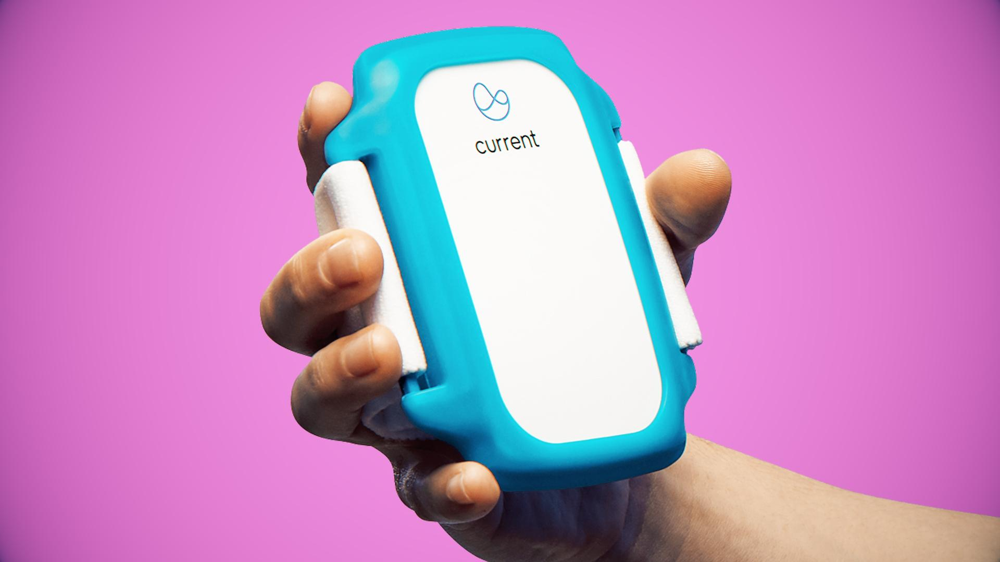

## Table of Contents

## What is device machine learning?

Device machine learning is when a gadget, like your phone or a smartwatch, learns and makes decisions on its own without needing to send data to the internet. This means the device can recognize your voice, understand your habits, or detect movements right where it is, keeping your information private and making things work faster.

For example, when you use a voice command on your phone, the phone itself figures out what you're saying instead of sending your voice to a faraway server. This makes the response quicker and keeps your voice data safe on your device. It's like having a tiny, smart brain in your gadgets that helps them understand and react to you better, all while keeping your data secure and private.

## How does device machine learning differ from traditional machine learning?

Device machine learning and traditional machine learning differ mainly in where the learning and processing happen. With traditional machine learning, data is usually sent to powerful computers or servers in the cloud where the learning happens. These computers can handle lots of data and do complex calculations. After the learning is done, the results might be sent back to the device or used elsewhere. This means the device itself doesn't need to be very smart, but it relies on the internet to work.

On the other hand, device machine learning happens right on the device, like your phone or a smartwatch. The learning and processing are done using the device's own power, without sending data to the internet. This can be slower and the device needs to be smart enough to do the learning. But it's great for privacy because your data stays on your device, and it can work even without an internet connection. It's like having a little brain in your gadget that can learn and make decisions all by itself.

## What are the common applications of device machine learning?

Device [machine learning](/wiki/machine-learning) is used a lot in things like smartphones and smart home gadgets. For example, when you talk to your phone and it understands what you're saying, that's device machine learning at work. It listens to your voice and figures out your words without sending your voice to the internet. This makes things faster and keeps your voice private. Also, when your phone recognizes your face to unlock it, it's using device machine learning to match your face to the one it has saved, all on the phone itself.

Another common use is in fitness trackers and smartwatches. These devices learn to recognize your movements and can tell if you're walking, running, or sleeping. They do all this learning right on your wrist, without needing to send your data away. This helps keep your health information private and lets the device work even when you're not connected to the internet. It's like having a little coach on your wrist that gets smarter over time about your habits and health.

## What types of devices typically use machine learning?

Many everyday gadgets use machine learning to make life easier and more fun. Smartphones are a big one. They use machine learning to understand your voice when you talk to them, recognize your face to unlock the phone, and even suggest what you might want to do next based on what you usually do. Smart speakers like Amazon Echo or Google Home also use machine learning. They listen to what you say and figure out how to help you, like playing music or answering questions, all without sending your voice to the internet.

Fitness trackers and smartwatches are another type of device that uses machine learning. They learn to recognize your movements and can tell if you're walking, running, or even sleeping. This helps them give you better advice on staying healthy. Also, some cars now use machine learning to help with driving. They can learn to recognize road signs and help you drive better and safer. All these devices do their learning right on the device itself, keeping your information private and making things work faster.

## What are the benefits of implementing machine learning on devices?

One big benefit of using machine learning on devices is privacy. When your phone or smartwatch learns and makes decisions on its own, it doesn't need to send your data to the internet. This means your personal information, like your voice or health data, stays safe on your device. It's like having a little brain in your gadget that can learn and help you without sharing your secrets with anyone else.

Another benefit is speed and reliability. When machine learning happens right on the device, it can work much faster because it doesn't have to wait for the internet. This makes things like voice commands or unlocking your phone with your face happen quickly. Plus, it can still work even if you don't have an internet connection. So, whether you're in a place with no Wi-Fi or just want things to happen fast, device machine learning makes your gadgets more useful and dependable.

## What are the challenges faced when deploying machine learning models on devices?

One big challenge of putting machine learning models on devices is that these gadgets usually don't have as much power as big computers. This means they can't handle really complicated math or big sets of data very well. So, when we make machine learning models for devices, we need to make them smaller and simpler. This can be hard because we want the models to still work well and give good answers, even though they're not as powerful as the ones used in the cloud.

Another challenge is that devices have limited space for storing data. When a machine learning model learns, it needs room to keep track of what it's learning. On a device, there's not as much room as on a big computer, so we have to be careful about how much data we use. This means we might need to find clever ways to teach the model with less data or to make it forget old information to learn new things. It's a bit like trying to fit a lot of stuff into a small backpack - you have to be really smart about what you pack.

Also, keeping the models up to date can be tricky. When machine learning models are on devices, it's harder to change them or fix them if they're not working right. We can't just update them easily like we can with models that live on the internet. So, we have to plan ahead and make sure the models we put on devices are as good as they can be from the start, and think of ways to update them without causing too much trouble for the people using the devices.

## How does edge computing relate to device machine learning?

Edge computing and device machine learning are closely connected because they both focus on doing things closer to where the action happens, instead of relying on faraway servers. Edge computing means using the power of devices like smartphones, smartwatches, or even cars to process data right where it's collected. This is important for device machine learning because it allows these gadgets to learn and make decisions on their own without sending data to the internet. For example, when your phone recognizes your face to unlock it, that's edge computing at work, making the machine learning happen right on your device.

The main benefit of combining edge computing with device machine learning is that it helps keep your data private and makes things work faster. When your device can learn and process information without needing to send it over the internet, your personal information stays safe on your gadget. Plus, because the data doesn't have to travel back and forth to a faraway server, the responses from your device can be quicker. This means your phone can understand your voice commands faster, or your fitness tracker can give you health advice more quickly, all while keeping your data secure.

## What are the key considerations for choosing a machine learning model for a device?

When choosing a machine learning model for a device, the first thing to think about is how much power the device has. Devices like smartphones or smartwatches don't have as much power as big computers, so you need a model that can work well with less. This means the model should be small and simple enough to run on the device without using too much of its energy or memory. You also need to think about how much space the model will take up on the device. Since devices have limited storage, the model should be compact and efficient, so it doesn't fill up all the space.

Another important thing to consider is how well the model will work on the device. It needs to be accurate enough to do its job, like recognizing your voice or tracking your movements, but it also has to be fast. If the model takes too long to process information, it won't be very useful. You also need to think about how easy it will be to update the model. Since devices can't be updated as easily as cloud-based models, you want a model that can still work well even if it can't be changed often. Balancing these factors - power, space, accuracy, speed, and updatability - is key to choosing the right machine learning model for a device.

## How can one optimize machine learning models for resource-constrained devices?

To make machine learning models work well on devices with limited resources, you need to make them smaller and faster. One way to do this is by using model compression techniques. This means making the model take up less space and use less power. For example, you can use a method called quantization, which changes the numbers the model uses to simpler ones that take up less space. Another way is pruning, which removes parts of the model that aren't very important. These methods help the model fit better on the device and work faster, so it can still do a good job even with less power.

Another important thing is to choose the right kind of model from the start. Some models are made to be smaller and more efficient, like MobileNet, which is good for smartphones. These models are designed to use less power and memory, so they work well on devices. You can also train the model to focus on the most important tasks it needs to do on the device. This way, the model doesn't waste time or space on things it doesn't need. By [picking](/wiki/asset-class-picking) the right model and making it smaller and faster, you can make sure it works well on a device with limited resources.

## What are the security and privacy concerns associated with device machine learning?

One big worry about device machine learning is keeping your data safe and private. When a device like your phone or smartwatch learns and makes decisions on its own, it doesn't need to send your data to the internet. This is good because your personal information, like your voice or health data, stays on your device. But if someone hacks into your device, they could still get to your private information. So, it's important to have strong security measures on the device itself, like good passwords and up-to-date software, to keep your data safe.

Another concern is how the device handles updates and changes to the machine learning model. If the model needs to be updated, it might need to connect to the internet to get the new information. This could be a weak spot where someone might try to sneak in bad code or steal your data. So, it's important to make sure updates are done safely and securely. Also, if the device is lost or stolen, someone else might use the machine learning model to learn things about you, like your habits or voice. This is why it's important to have ways to protect your device and erase your data if it gets into the wrong hands.

## How do you update and maintain machine learning models on devices?

Updating and maintaining machine learning models on devices can be tricky because these gadgets don't have as much power as big computers. To update a model, the device might need to connect to the internet to get the new information. This is where things can get risky because someone might try to sneak in bad code or steal your data during the update. To keep things safe, it's important to make sure the updates are done securely. This can be done by using strong encryption and making sure the device checks that the update is coming from a trusted source before accepting it. Also, the update process should be designed to use as little power and memory as possible, so it doesn't slow down the device or use up too much of its resources.

Once the model is updated, it needs to be maintained to keep working well. This means making sure the model is still accurate and fast enough to do its job. Sometimes, the device might need to retrain the model with new data it collects. But since devices have limited space, you have to be careful about how much new data you use. One way to do this is by using techniques like incremental learning, where the model learns a little bit at a time without needing to store a lot of new data. Another way is to have the device send some data back to the cloud for processing and then get a small update back. This helps keep the model up to date without using too much of the device's resources. By keeping the model updated and maintained properly, you can make sure it keeps working well on the device.

## What future trends are expected in the field of device machine learning?

In the future, device machine learning is expected to become even more common and powerful. As devices get more advanced, they will be able to handle bigger and better machine learning models right on the device itself. This means your phone or smartwatch will be able to learn and make decisions faster and more accurately without needing to connect to the internet. This will make things like voice recognition and health tracking even better because the device can use all its power to focus on what you need. Also, as more devices become connected, they will be able to share what they learn with each other, making the whole system smarter over time.

Another trend we might see is the use of more specialized hardware for machine learning on devices. Right now, devices use general-purpose chips, but in the future, they might have special chips just for machine learning. These chips would make the device even faster and more efficient at learning and making decisions. This could lead to new kinds of gadgets that can do things we can't even imagine yet, like smart glasses that can understand what you're looking at and help you in real-time. As these trends continue, device machine learning will become a bigger part of our everyday lives, making our gadgets more helpful and personal.