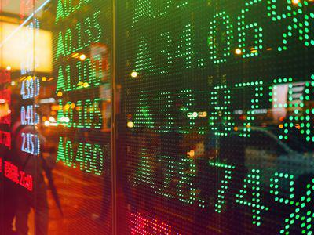

## Table of Contents

## What is the Dhaka Stock Exchange (DSE)?

The Dhaka Stock Exchange (DSE) is the main stock market in Bangladesh. It is located in the capital city, Dhaka. People and companies can buy and sell shares of different businesses through the DSE. This helps businesses get money to grow and helps people invest their money to possibly earn more.

The DSE was started in 1954 and has grown a lot since then. It has many companies listed on it, from banks to technology firms. The exchange is important for the economy of Bangladesh because it helps money move around and supports new businesses. People can check how the market is doing through the DSE index, which shows if the overall value of the stocks is going up or down.

## How was the Dhaka Stock Exchange founded and when did it start operating?

The Dhaka Stock Exchange (DSE) was founded in 1954. A group of people who wanted to help businesses in Bangladesh get money to grow came together to start it. They thought it would be a good idea to have a place where people could buy and sell parts of companies, called shares. At first, it was a small group working to set everything up.

The DSE officially started operating on April 28, 1956. This was when the first shares were traded. It began with just a few companies, but over time, more and more businesses joined. The DSE helped the economy of Bangladesh by making it easier for people to invest in companies and for companies to get the money they needed to expand.

## What are the main indices of the Dhaka Stock Exchange?

The Dhaka Stock Exchange (DSE) has several main indices that help people understand how the market is doing. The most important one is the DSE Broad Index (DSEX). This index shows the overall performance of all the companies listed on the DSE. It includes almost all the companies and gives a good picture of how the whole market is moving.

Another important index is the DSE 30 Index (DS30). This one only looks at the 30 biggest and most traded companies on the DSE. It helps people see how the biggest companies are doing, which can be different from the overall market. The DS30 is useful because it can show trends among the top companies that might not be as clear in the broader DSEX.

There is also the DSE Shariah Index (DSES). This index follows companies that follow Islamic financial rules. People who want to invest according to these rules can use this index to see how those companies are doing. Each of these indices helps different kinds of investors understand the market better and make smart choices.

## How can someone start investing in the Dhaka Stock Exchange?

To start investing in the Dhaka Stock Exchange, someone needs to open a trading account with a brokerage firm that is registered with the DSE. These firms help people buy and sell shares. To open an account, you'll need to fill out some forms and give the firm some personal information, like your ID and address. You might also need to put some money into the account to start trading. It's a good idea to pick a brokerage firm that you trust and that has good customer service, because they will help you make your trades.

Once your trading account is set up, you can start buying and selling shares. You can do this online through the brokerage firm's website or app, or you can call them to place your orders. It's important to do some research before you start investing. Look at the companies listed on the DSE and see which ones you think might do well. You can check the main indices like the DSEX, DS30, and DSES to get an idea of how the market is doing. Remember, investing in the stock market can be risky, so it's smart to start small and learn as you go.

## What types of securities are traded on the Dhaka Stock Exchange?

The Dhaka Stock Exchange (DSE) has different types of securities that people can buy and sell. The main type is shares, which are parts of a company that people can own. When you buy a share, you become a part-owner of that company. The DSE also has bonds, which are like loans that people give to companies or the government. Companies or the government pay back the loan with interest over time.

Besides shares and bonds, the DSE also has mutual funds. These are a way for people to invest in a mix of different securities, like shares and bonds, all at once. It's like a basket of investments managed by experts. The DSE also offers debentures, which are similar to bonds but are usually issued by companies to raise money. All these securities help people invest their money and help companies and the government get the money they need to grow.

## What are the trading hours of the Dhaka Stock Exchange?

The Dhaka Stock Exchange (DSE) has specific times when people can buy and sell shares. The main trading hours are from 10:00 AM to 2:30 PM, from Sunday to Thursday. This is when most of the trading happens, and it's the time when people can see the prices of shares change a lot.

There is also a pre-opening session that starts at 9:00 AM and ends at 10:00 AM. During this time, people can put in their orders, but no trades happen yet. It's like getting ready for the main trading time. After the main session ends at 2:30 PM, there's a post-closing session from 2:30 PM to 2:45 PM where the final prices are set.

## How does the Dhaka Stock Exchange regulate trading and ensure market integrity?

The Dhaka Stock Exchange (DSE) works hard to make sure that trading is fair and honest. They do this by following rules set by the Bangladesh Securities and Exchange Commission (BSEC). The DSE watches over all trades to make sure no one is cheating or doing anything wrong. They use special computer systems to check for any strange trading patterns. If they find something that looks fishy, they can stop it and look into it more. The DSE also makes sure that all the companies listed on the exchange follow the rules and give honest information to investors.

Another way the DSE keeps the market fair is by making sure everyone has the same information. They do this by having strict rules about when and how companies can share news that might affect their stock prices. The DSE also has a system called the Central Depository System (CDS) that keeps track of who owns which shares. This helps prevent mistakes and fraud. By doing all these things, the DSE tries to make sure that the stock market is a safe place for people to invest their money.

## What role does the Dhaka Stock Exchange play in the Bangladesh economy?

The Dhaka Stock Exchange (DSE) is very important for Bangladesh's economy. It helps companies get money they need to grow by letting them sell shares to people. When people buy these shares, they are giving money to the companies, which can then use it to build new things, hire more workers, or start new projects. This helps the whole country's economy grow because more businesses are doing well and creating jobs.

The DSE also helps people in Bangladesh save and invest their money. By buying shares, people can hope to make more money if the companies do well. This encourages people to save and invest, which is good for the economy. The DSE also keeps an eye on the market to make sure it is fair and honest, which helps build trust. When people trust the market, more of them will invest, and that helps the economy even more.

## How has the performance of the Dhaka Stock Exchange evolved over the last decade?

Over the last ten years, the Dhaka Stock Exchange (DSE) has seen a lot of ups and downs. At the start of the decade, the DSE was recovering from a big crash in 2010-2011. It slowly got better, and by 2013, the market started to grow again. The DSEX, which is the main index that shows how the whole market is doing, went up a lot during this time. But then, in 2014 and 2015, there were some problems again, and the market went down. After that, the DSE worked hard to make rules stricter and make the market safer. By the end of the decade, the DSE was doing better again, with more people wanting to invest.

In the last few years of the decade, the DSE saw steady growth. More companies started listing their shares on the exchange, and more people from Bangladesh and other countries started investing. The government and the Bangladesh Securities and Exchange Commission (BSEC) helped by making new rules to keep the market fair and safe. Even though there were still some ups and downs, the overall trend was positive. The DSE became a more important part of Bangladesh's economy, helping businesses grow and giving people more ways to invest their money.

## What are some major challenges faced by the Dhaka Stock Exchange?

The Dhaka Stock Exchange (DSE) faces several big challenges. One major problem is keeping the market fair and honest. Even though the DSE tries hard to stop cheating and fraud, sometimes people still find ways to do bad things. This can make people not trust the market, and if people don't trust it, they might not want to invest their money. Another challenge is making sure the market keeps growing and stays strong. The DSE has to work hard to get more companies to list their shares and to get more people to invest. This can be hard, especially when the economy is not doing well.

Another challenge for the DSE is dealing with technology. The DSE needs good computer systems to keep track of all the trades and make sure everything is working smoothly. But sometimes, these systems can have problems or get hacked, which can cause big trouble. Also, the DSE has to keep up with new technology to make trading easier and faster for people. Finally, the DSE has to balance the needs of different kinds of investors. Some people want to invest for a long time, while others want to buy and sell quickly. The DSE has to make rules that work for everyone and keep the market fair for all.

## How does the Dhaka Stock Exchange compare to other stock exchanges in South Asia?

The Dhaka Stock Exchange (DSE) is one of the main stock markets in South Asia, but it is smaller than some others like the Bombay Stock Exchange (BSE) in India and the Pakistan Stock Exchange (PSX). The BSE is much bigger and has more companies listed on it. It also has more people investing and trading. The PSX is also bigger than the DSE and has a longer history. Both the BSE and PSX have more money moving through them every day, which shows they are more active markets.

Even though the DSE is smaller, it is still important for Bangladesh's economy. It helps local businesses get money to grow and gives people in Bangladesh a place to invest their savings. The DSE has been working to improve its rules and systems to make it more trustworthy and attractive to investors. Compared to the National Stock Exchange of India (NSE), which is very modern and uses a lot of technology, the DSE is still catching up but making progress. Overall, while the DSE may not be as big or advanced as some of its neighbors, it plays a key role in its own country and is working to get better.

## What future developments are planned for the Dhaka Stock Exchange to enhance its operations and market efficiency?

The Dhaka Stock Exchange (DSE) is planning to make some big changes to work better and help more people. One big plan is to use more technology to make trading easier and faster. They want to make a new trading system that can handle more trades without any problems. They also want to make it easier for people to buy and sell shares online, so more people can join in from home or their phones. Another thing they are working on is making the rules stronger to stop cheating and keep the market fair. They want to use new ways to check for any strange trading and make sure everyone follows the rules.

Another important plan for the DSE is to help more companies list their shares on the exchange. They want to make it easier for small businesses to join the market and get money to grow. This will help the economy of Bangladesh because more businesses will be able to expand and create jobs. The DSE also wants to attract more investors from other countries. They are trying to make the market more open and easier for foreigners to invest in. By doing all these things, the DSE hopes to become a bigger and more important part of South Asia's economy.

## References & Further Reading

[1]: Chakraborty, C., & Chuan, T. C. (2015). ["E-Commerce and Algo Trading in Asia: A Look at Emerging Markets."](https://www.semanticscholar.org/paper/Urbanization-Impact-on-Regional-Climate-and-Extreme-Qian-Chakraborty/9dd534512d0c16c1726734218cbfe5e321356ebc) Asia-Pacific Financial Markets.

[2]: Faruqee, H., & Svensson, L. E. O. (2002). ["Bangladesh: Recent Economic Developments and Selected Issues."](https://www.semanticscholar.org/paper/Population-Aging-and-its-Macroeconomic-A-Framework-Faruqee/e92ba16b168ce313388b8b1aa54fb3c3188b4165) International Monetary Fund.

[3]: Patel, S. A., & Sarkar, A. (1998). ["Stock Market Development and Economic Growth: Evidence from Developing Countries."](https://www.scirp.org/reference/referencespapers?referenceid=2720578) European Economic Review.

[4]: Hasbrouck, J., & Saar, G. (2013). ["Low-Latency Trading."](https://www.sciencedirect.com/science/article/abs/pii/S1386418113000165) Journal of Financial Markets.

[5]: Bangia, A., Diebold, F. X., & Schuermann, T. (2000). ["Managing Market Risk in Algorithmic Trading: The Role of Regulation and Cybersecurity."](https://law-journals-books.vlex.com/vid/rating-agencies-as-gatekeepers-855620060) Journal of Financial Economics.