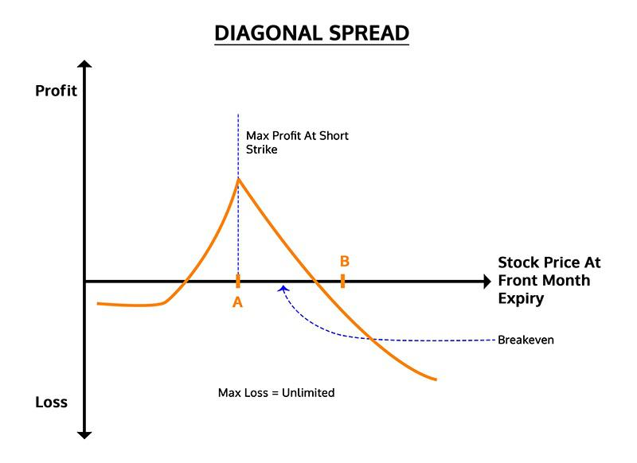

## Table of Contents

## What is a diagonal spread in trading?

A diagonal spread is a type of options trading strategy that involves buying and selling options with different expiration dates and strike prices. In this strategy, the options are not only different in their expiration dates but also in their strike prices, which is why it's called a "diagonal" spread. Traders use this strategy to take advantage of differences in time decay and price movements of the underlying asset.

The main goal of a diagonal spread is to profit from the changes in the price of the underlying asset over time, while also benefiting from the different rates of time decay between the two options. For example, a trader might buy a long-term option with a lower strike price and sell a short-term option with a higher strike price. If the price of the underlying asset moves favorably and the short-term option expires worthless, the trader can keep the premium from the short-term option and still hold the long-term option, which could potentially increase in value.

## How does a diagonal spread differ from other options strategies like vertical or calendar spreads?

A diagonal spread is different from a vertical spread and a calendar spread because it combines elements of both. In a vertical spread, you buy and sell options of the same type (both calls or both puts) and expiration date but with different strike prices. For example, you might buy a call option with a lower strike price and sell a call option with a higher strike price, both expiring on the same date. A calendar spread, on the other hand, involves buying and selling options of the same type and strike price but with different expiration dates. You might buy a long-term call option and sell a short-term call option, both with the same strike price.

A diagonal spread takes aspects from both of these strategies. It involves buying and selling options with different strike prices and different expiration dates. So, you might buy a long-term call option with a lower strike price and sell a short-term call option with a higher strike price. This means you're betting on the price movement of the underlying asset over time and also taking advantage of the different rates of time decay between the two options. By combining these elements, a diagonal spread offers more flexibility and potential profit opportunities compared to a vertical or calendar spread alone.

## What are the key components of a diagonal spread?

A diagonal spread has two main parts: the options you buy and the options you sell. The options have different expiration dates and different strike prices. For example, you might buy a call option that expires in three months with a strike price of $50, and sell a call option that expires in one month with a strike price of $55. This means you are betting on the price of the underlying asset to move in a certain way over time.

The key to a diagonal spread is that it combines two strategies: a vertical spread and a calendar spread. A vertical spread uses options with the same expiration date but different strike prices. A calendar spread uses options with the same strike price but different expiration dates. By mixing these two, a diagonal spread gives you more ways to make money. You can take advantage of how the price of the asset changes over time and how the value of the options changes as they get closer to expiring.

## What are the potential benefits of using a diagonal spread?

One of the main benefits of using a diagonal spread is that it can help you make money in different ways. You can profit from the price of the underlying asset going up or down over time. If the price moves in the direction you expect, you can make money from the long-term option you bought. At the same time, if the short-term option you sold expires worthless, you get to keep the money you received from selling it. This gives you more chances to make a profit compared to simpler strategies.

Another advantage is that diagonal spreads can help you manage risk better. Because you are using options with different expiration dates and strike prices, you can adjust your position as the market changes. This flexibility can help you reduce losses if the market moves against you. Plus, the different rates at which the options lose value over time can work in your favor, allowing you to benefit from time decay in a way that other strategies might not.

## What are the risks associated with diagonal spreads?

One big risk with diagonal spreads is that they can be hard to understand and manage. Because you are dealing with options that have different expiration dates and strike prices, it can be tricky to keep track of everything. If the market moves in a way you didn't expect, you might lose money on both the option you bought and the option you sold. This can make the strategy more complicated and risky than simpler options strategies.

Another risk is that diagonal spreads can be affected by changes in the market's [volatility](/wiki/volatility-trading-strategies). If the market becomes more volatile, the value of your options can change quickly, which might lead to bigger losses. Also, you need to be careful about the costs involved. The commissions and fees for buying and selling options can add up, and if the spread doesn't work out as planned, these costs can eat into your profits or increase your losses.

## How do you set up a basic diagonal spread?

To set up a basic diagonal spread, you need to buy and sell options that have different expiration dates and different strike prices. For example, you might buy a call option that expires in three months with a strike price of $50. At the same time, you would sell a call option that expires in one month with a higher strike price, like $55. This means you are betting that the price of the underlying asset will go up over time, but not so much that the short-term option you sold will end up in the money.

Once you have chosen your options, you need to place your trades. You can do this through a brokerage account that allows options trading. Make sure to check the costs, like commissions and fees, because these can affect how much money you make or lose. After setting up the diagonal spread, you need to keep an eye on the market and be ready to make changes if the price of the asset moves differently than you expected. This might mean closing out the spread early or adjusting the options to manage your risk.

## What are the best market conditions for implementing a diagonal spread?

Diagonal spreads work best when the market is moving slowly and steadily in one direction. If you think the price of a stock will go up over time but not too fast, a diagonal spread can be a good choice. This is because you can make money from the long-term option you bought as the price goes up, while the short-term option you sold might expire worthless, letting you keep the money you got from selling it.

You also want to use a diagonal spread when the market isn't too up and down. If the market is very volatile, the value of your options can change a lot, which can be risky. A diagonal spread can help you manage this risk better because you can adjust your position as the market changes. So, a steady market with a clear direction is the best time to use this strategy.

## How do you manage and adjust a diagonal spread position over time?

Managing a diagonal spread means keeping an eye on the market and making changes when needed. If the price of the stock goes up like you expected, you might want to keep the long-term option you bought and let the short-term option you sold expire worthless. This way, you can keep the money you got from selling the short-term option. But if the price goes up too fast and the short-term option is about to be in the money, you might need to buy it back to avoid losing money. This can cost you, but it's better than letting the option be exercised against you.

If the market goes down or stays the same, you might need to make other changes. You could roll the short-term option to a later date or a different strike price. Rolling means closing the current option and opening a new one. This can help you keep the spread going without losing too much money. It's important to always think about the costs of making these changes, like commissions and fees, because they can add up and affect your profits or losses. By staying on top of things and being ready to adjust, you can manage a diagonal spread better and maybe make more money.

## What are advanced techniques for optimizing a diagonal spread?

One advanced technique for optimizing a diagonal spread is to use delta hedging. Delta is a measure of how much the price of an option changes when the price of the stock changes. By keeping an eye on the delta of your options, you can buy or sell shares of the stock to balance out the risk. This can help you make the spread more stable and less affected by big moves in the stock price. For example, if the delta of your long-term option is 0.5, you might buy 50 shares of the stock to hedge it. This way, if the stock price goes up, the gain in the stock can offset any loss in the option, and vice versa.

Another technique is to roll the short-term option. Rolling means closing the current short-term option and opening a new one with a later expiration date or a different strike price. This can help you keep the spread going and maybe make more money. For example, if the short-term option you sold is about to expire and it's out of the money, you can buy it back and sell a new one with a later expiration date. This way, you can keep collecting money from selling options while still holding onto your long-term option. It's important to think about the costs of rolling, like commissions and fees, because they can affect how much money you make or lose.

## How can you use diagonal spreads for income generation?

Diagonal spreads can be a good way to make money over time. You do this by selling short-term options and buying long-term options. The money you get from selling the short-term option is like a regular payment. If the stock price stays where you want it to, the short-term option you sold might expire without being worth anything. This means you get to keep the money you got from selling it. At the same time, you still have the long-term option, which could go up in value if the stock price moves the right way.

To keep making money, you can keep selling new short-term options as the old ones expire. This is called rolling the options. Each time you roll, you get more money from selling the new short-term option. But you need to be careful. If the stock price moves too much, you might lose money on the short-term option you sold. So, you need to watch the market and be ready to make changes to your spread. By doing this right, you can keep getting income from the diagonal spread over time.

## What are the tax implications of trading diagonal spreads?

When you trade diagonal spreads, you need to think about taxes. The money you make from diagonal spreads is usually seen as capital gains. If you hold the spread for less than a year, it's a short-term capital gain, and you'll pay taxes on it at your regular income tax rate. If you hold it for more than a year, it's a long-term capital gain, and the tax rate is usually lower. But, things can get tricky because you are dealing with two different options that might be treated differently for tax purposes.

You also need to know about the wash-sale rule. This rule says that if you sell an option at a loss and buy a similar option within 30 days, you can't use that loss to lower your taxes right away. With diagonal spreads, you might buy and sell options that are similar but not exactly the same, so it's not always clear if the wash-sale rule applies. It's a good idea to talk to a tax professional to make sure you're doing everything right and not missing out on any tax benefits or getting into trouble with the tax rules.

## Can you provide a case study or example of a successful diagonal spread trade?

Let's look at a simple example of a successful diagonal spread trade. Imagine you think the price of XYZ stock, which is currently at $50, will go up slowly over the next few months. You decide to buy a call option with a strike price of $50 that expires in three months for $3. At the same time, you sell a call option with a strike price of $55 that expires in one month for $1. This means you spent $2 to set up the spread ($3 to buy the long-term option minus $1 from selling the short-term option).

After one month, the price of XYZ stock goes up to $53. The short-term option you sold expires worthless because the stock price is below the $55 strike price. You get to keep the $1 you made from selling that option. Now, you still have the long-term option you bought, which is now worth more because the stock price went up. If you decide to sell it, you might get $4 for it, making you a profit of $2 ($4 from selling the long-term option minus the $2 you spent to set up the spread). This example shows how a diagonal spread can make money from both the price of the stock going up and the short-term option expiring worthless.

## What are the advantages of diagonal spreads?

Diagonal spreads are an options trading strategy that offers several key advantages to traders, especially those who seek to optimize their financial activities through precision and strategic foresight.

**Flexibility**

One of the primary advantages of diagonal spreads is their inherent flexibility. Traders can tailor these spreads to align with specific market expectations and timeframes. By combining elements of both calendar and vertical spreads, diagonal spreads allow traders to navigate market directions while considering the impact of time on their positions. This dual consideration facilitates more comprehensive strategy development, enabling traders to adjust their outlooks based on evolving market conditions. For instance, traders can position themselves to benefit from both the anticipated movement of the underlying asset and time decay, optimizing their potential returns.

**Time Decay Benefits**

Diagonal spreads offer significant advantages related to time decay (theta), particularly with regards to the short option in the spread. Time decay refers to the reduction in the price of options as they approach expiration, a phenomenon that traders can strategically exploit. In a diagonal spread, the shorter-term option experiences accelerated time decay, which can be used to generate income that partially offsets the premium paid for the longer-term option. This results in a net gain if the time decay of the short option outweighs the premium of the long option, enhancing overall profitability. The mathematical expression for time decay ($\theta$) in options is:

$$
\theta = \frac{\partial V}{\partial t}
$$

**Potential for Enhanced Returns**

Strategically positioned diagonal spreads can also capture the benefits of volatility changes and directional price movements, potentially leading to enhanced returns. By selectively choosing strike prices and expiration dates, traders can take advantage of conditions where the market is expected to move significantly in a particular direction, while also benefiting from predictable volatility shifts. This quality makes diagonal spreads a preferred strategy for traders who aim to achieve superior returns by dynamically responding to market rhythms.

Overall, diagonal spreads offer a sophisticated and effective toolset for traders seeking both directional and time-based market advantages. By adeptly managing these elements, traders can refine their approach, leading to optimized outcomes in varying market environments.

## References & Further Reading

[1]: ["Option Volatility and Pricing: Advanced Trading Strategies and Techniques"](https://www.amazon.com/Option-Volatility-Pricing-Strategies-Techniques/dp/0071818774) by Sheldon Natenberg

[2]: ["Trading Options Greeks: How Time, Volatility, and Other Pricing Factors Drive Profits"](https://www.amazon.com/Trading-Options-Greeks-Volatility-Pricing/dp/1118133161) by Dan Passarelli

[3]: Hull, J. C. (2022). ["Options, Futures, and Other Derivatives"](https://www.pearson.com/en-us/subject-catalog/p/options-futures-and-other-derivatives/P200000005938/9780136939917). Pearson Education.

[4]: ["Quantitative Finance for Dummies"](https://www.amazon.com/Quantitative-Finance-Dummies-Steve-DPhil/dp/1118769465) by Steve Bell

[5]: ["Options, Futures, and Exotic Derivatives: Theory, Application, and Practice"](https://archive.org/details/optionsfuturesex0000unse) by Vineer Bhansali