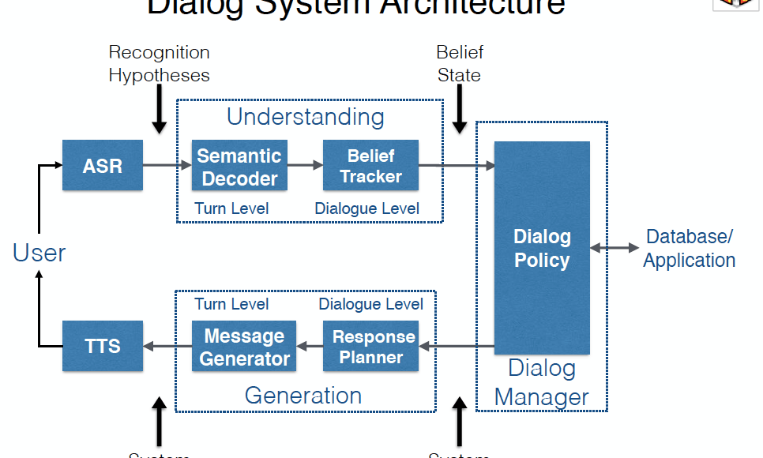

## Table of Contents

## What is Dialog Adaptation in the context of machine learning?

Dialog Adaptation in machine learning refers to the process of adjusting a conversational AI system to better fit the needs and context of a specific user or group of users. This involves modifying the system's responses, language, and interaction style to make the conversation more natural and effective. For example, if a user frequently asks about sports, the system might adapt to provide more detailed sports-related information and use sports terminology.

The adaptation can be done in various ways, such as through machine learning algorithms that learn from past interactions. These algorithms analyze the user's language, preferences, and behavior to tailor the AI's responses. This could mean changing the tone, the level of formality, or even the topics discussed. By continuously learning and adapting, the system becomes more personalized and useful over time, enhancing the overall user experience.

## Why is Dialog Adaptation important for conversational AI systems?

Dialog Adaptation is important for conversational AI systems because it helps make the conversations feel more natural and personal. When a system adapts to a user's way of talking and their interests, it can respond in a way that feels more like talking to a friend. This makes people more likely to keep using the system because it feels more helpful and engaging. For example, if someone often talks about cooking, the AI can start giving more cooking tips and using cooking terms, which makes the conversation more relevant and interesting.

Additionally, Dialog Adaptation can improve the effectiveness of the AI in understanding and meeting user needs. By learning from past interactions, the system can better predict what a user might want to know or do next. This means it can provide more accurate and useful information or services. Over time, this continuous learning and adapting can lead to a better overall experience, as the AI becomes more tuned to the specific needs and preferences of each user.

## What are the basic components of a Dialog Adaptation system?

A Dialog Adaptation system includes several key parts that work together to make the conversation better. One important part is the user model, which keeps track of what the user likes, how they talk, and what they usually ask about. This model helps the system understand the user better over time. Another part is the language processing unit, which listens to what the user says and figures out what they mean. It then uses this understanding to choose the best way to respond.

The system also has a response generator, which creates the actual answers or questions that the AI says. This part uses information from the user model and the language processing unit to make sure the responses fit the user's style and needs. Finally, there's a learning component that helps the system get better over time. It looks at past conversations and adjusts how the system works to make future talks even more natural and helpful. Together, these parts help the AI adapt and make each conversation more personal and effective.

## How does Dialog Adaptation differ from traditional dialogue systems?

Dialog Adaptation is different from traditional dialogue systems because it focuses on changing and improving how it talks to users over time. Traditional dialogue systems follow a set script or set of rules. They do not change much even if they talk to the same person many times. Dialog Adaptation systems, on the other hand, learn from each conversation. They remember what a user likes and how they talk, and then use this information to make future conversations better and more personal.

For example, if a user often asks about the weather, a traditional system might always give the same kind of weather update. But a Dialog Adaptation system would notice this and start giving more detailed weather information or even suggest activities based on the weather. This makes the conversation feel more like talking to a friend who knows you well. By adapting, the system becomes more helpful and engaging, which can make users want to keep using it.

## What are some common challenges faced when implementing Dialog Adaptation?

One big challenge when implementing Dialog Adaptation is understanding what the user really means. It's hard for the system to figure out if a user is joking, being serious, or just saying something in a different way. This can lead to the system giving answers that don't make sense or aren't what the user wanted. Another challenge is keeping the user's information private and safe. As the system learns more about the user, it needs to make sure this information doesn't get into the wrong hands.

Another issue is making sure the system can adapt quickly enough to be useful. If it takes too long for the system to learn and change, users might get frustrated and stop using it. Also, the system has to work well for many different people, not just one type of user. This means it has to be smart enough to adapt to lots of different ways of talking and different interests. Balancing all these things can be really tough, but it's important for making a good Dialog Adaptation system.

## Can you explain the role of machine learning in Dialog Adaptation?

Machine learning plays a big role in Dialog Adaptation by helping the system learn from past conversations. It looks at what the user says and does, and then uses this information to get better at understanding and talking to them. For example, if a user often talks about cooking, [machine learning](/wiki/machine-learning) helps the system recognize this and start giving more cooking tips. This makes the conversation feel more personal and useful because the system adapts to what the user likes.

The process of machine learning in Dialog Adaptation involves using algorithms to analyze lots of data from past talks. These algorithms can find patterns in how the user speaks and what they are interested in. Over time, the system gets better at predicting what the user might want to know or do next. This means it can give more accurate and helpful answers, making the user's experience better. By constantly learning and changing, the system becomes more like a friend who knows the user well.

## What are the typical algorithms used in Dialog Adaptation?

The typical algorithms used in Dialog Adaptation include supervised learning algorithms like decision trees and support vector machines (SVMs), which help the system learn from labeled data. For example, if a user often talks about sports, these algorithms can label that data and help the system recognize and respond to sports-related queries better. Another common approach is using [reinforcement learning](/wiki/reinforcement-learning), where the system learns by getting feedback on its responses. If the user likes a certain type of response, the system will use that type more often in the future.

Unsupervised learning algorithms like clustering can also be used to group similar user behaviors and preferences together. This helps the system adapt its responses to different groups of users. For instance, it might recognize that one group of users likes short, direct answers while another prefers more detailed explanations. Neural networks, especially [deep learning](/wiki/deep-learning) models like recurrent neural networks (RNNs) and [long short](/wiki/equity-long-short)-term memory (LSTM) networks, are also widely used. These models are good at understanding the context of a conversation and can predict what a user might say next based on past interactions.

## How do you measure the performance of a Dialog Adaptation system?

To measure the performance of a Dialog Adaptation system, we look at how well it understands and responds to users. One common way is to use metrics like accuracy, which tells us how often the system gives the right answer. Another important metric is user satisfaction, which we can measure with surveys or feedback forms where users rate how happy they are with the system. We also look at engagement, which shows how long users keep talking to the system and how often they come back. These metrics help us see if the system is adapting well to different users and making conversations better over time.

Another way to measure performance is through more technical metrics like the F1 score, which balances precision and recall. The F1 score can be calculated using the formula $$F1 = 2 \times \frac{\text{precision} \times \text{recall}}{\text{precision} + \text{recall}}$$. Precision measures how many of the system's responses were correct, while recall measures how many of the correct responses the system actually gave. Additionally, we can use automatic evaluation methods like BLEU or ROUGE scores, which compare the system's responses to human-generated responses to see how similar they are. By combining these different measures, we get a full picture of how well the Dialog Adaptation system is working and where it needs to improve.

## What is the DAPO framework and how does it contribute to Dialog Adaptation?

The DAPO framework, which stands for Dialog Adaptation with Policy Optimization, is a way to make conversational AI systems better at talking to users. It uses a method called reinforcement learning to help the system learn from its conversations. In DAPO, the system tries different ways of responding to see what works best. It gets feedback from the user, like if they keep talking or if they seem happy with the answers. This feedback helps the system figure out the best way to adapt its responses over time. By doing this, the system can become more personalized and useful for each user.

DAPO contributes to Dialog Adaptation by making the system more flexible and smart. It uses a policy optimization approach to keep improving how the system talks to users. This means the system can change its way of responding based on what it learns from past conversations. For example, if a user often asks about cooking, the system can start giving more cooking tips and using cooking words. This makes the conversation feel more natural and helpful. By using DAPO, the system can keep getting better at understanding and meeting the needs of different users.

## How can Dialog Adaptation be personalized for individual users?

Dialog Adaptation can be personalized for individual users by learning from their past conversations. The system keeps track of what the user likes to talk about, how they talk, and what kind of answers they prefer. For example, if a user often asks about cooking, the system can start giving more cooking tips and using cooking words. This makes the conversation feel more like talking to a friend who knows you well. The system uses machine learning algorithms to analyze these past talks and figure out the best way to respond to each user. Over time, the system gets better at understanding what the user might want next, making the conversation more helpful and interesting.

To make this personalization work, the system uses different methods like reinforcement learning. This means it tries different ways of responding and sees which ones the user likes best. If a user enjoys a certain type of response, the system will use that type more often. The DAPO framework, which stands for Dialog Adaptation with Policy Optimization, is one way to do this. It helps the system keep improving its responses by using feedback from the user. By constantly learning and changing, the system becomes more tuned to the specific needs and preferences of each user, making every conversation feel more personal and useful.

## What are the latest advancements in Dialog Adaptation research?

Recent advancements in Dialog Adaptation research have focused on improving how systems understand and respond to users in a more personalized way. One key area is the use of advanced [neural network](/wiki/neural-network) models, like transformer architectures, which are better at understanding the context of a conversation. These models help the system predict what a user might say next and respond in a way that feels more natural. Researchers are also working on better ways to use reinforcement learning to make the system adapt more quickly. This means the system can try different responses and learn from user feedback to improve over time.

Another important advancement is the integration of multi-modal inputs, where the system can use not just text but also voice, images, and even video to understand and adapt to users. This makes the conversation more engaging and personalized because the system can pick up on more cues from the user. For example, if a user shows a picture of a dish they cooked, the system can give feedback based on what it sees. These advancements are making Dialog Adaptation systems more effective and user-friendly, helping them feel more like talking to a real person who knows you well.

## How can Dialog Adaptation be integrated with other AI technologies to enhance conversational experiences?

Dialog Adaptation can be integrated with other AI technologies like natural language processing (NLP) and machine learning to make conversations better. NLP helps the system understand what the user is saying by breaking down the words and figuring out the meaning. When this is combined with Dialog Adaptation, the system can not only understand the user better but also respond in a way that fits the user's style and interests. For example, if a user often talks about sports, the system can use NLP to understand sports terms and adapt its responses to be more sports-focused. Machine learning helps the system learn from past conversations, so it gets better at predicting what the user might want next.

Another way to enhance conversational experiences is by integrating Dialog Adaptation with voice recognition and sentiment analysis. Voice recognition lets the system understand spoken words, making it easier for users to talk to the AI without typing. When combined with Dialog Adaptation, the system can pick up on the user's tone of voice and adapt its responses to sound more natural and friendly. Sentiment analysis can tell if the user is happy, sad, or frustrated, and the system can then adjust its responses to match the user's mood. By working together, these technologies make the conversation feel more like talking to a real person who knows you well and cares about how you feel.

## References & Further Reading

[1]: Chen, Y. N., Zhu, F., & Rudnicky, A. I. (2011). ["An ensemble approach to user simulation for Dialog Strategy Learning."](https://onlinelibrary.wiley.com/doi/abs/10.1002/adfm.201404357) Proceedings of the SIGDIAL 2011 Conference.

[2]: Li, J., Monroe, W., Shi, T., Jean, S., Ritter, A., & Jurafsky, D. (2017). ["Adversarial Learning for Neural Dialogue Generation."](https://arxiv.org/abs/1701.06547) arXiv preprint arXiv:1701.06547.

[3]: Vinyals, O., & Le, Q. (2015). ["A neural conversational model."](https://arxiv.org/abs/1506.05869) arXiv preprint arXiv:1506.05869.

[4]: Gao, J., Galley, M., & Li, L. (2018). ["Neural Approaches to Conversational AI."](https://aclanthology.org/P18-5002/) ACM SIGKDD Explorations Newsletter, 19(1), 25-35.

[5]: Serban, I. V., Sordoni, A., Bengio, Y., Courville, A. C., & Pineau, J. (2016). ["Building End-To-End Dialogue Systems Using Generative Hierarchical Neural Network Models."](https://dl.acm.org/doi/10.5555/3016387.3016435) Proceedings of the Thirtieth AAAI Conference on Artificial Intelligence.

[6]: Williams, J. D., & Zweig, G. (2016). ["End-to-End LSTM-based Dialog Control Optimized with Supervised and Reinforcement Learning."](https://arxiv.org/abs/1606.01269) arXiv preprint arXiv:1606.01269.

[7]: Young, S., Gašić, M., Thomson, B., & Williams, J. D. (2013). ["POMDP-based statistical spoken dialog systems: A review."](https://ieeexplore.ieee.org/document/6407655) Proceedings of the IEEE, 101(5), 1160-1179.