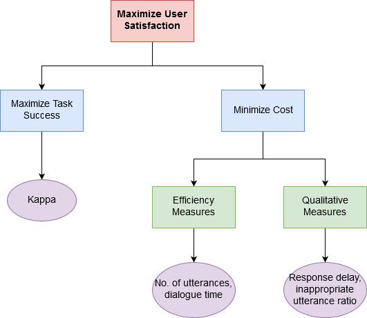

## Table of Contents

## What is a dialog system in the context of machine learning?

A dialog system in the context of machine learning is a computer program designed to engage in conversations with human users. These systems use techniques from natural language processing (NLP) and machine learning to understand and generate human-like responses. They are commonly used in applications like virtual assistants, customer service chatbots, and interactive voice response systems. The goal of a dialog system is to provide helpful and relevant information or perform tasks based on the user's input.

Dialog systems can be categorized into two main types: rule-based and machine learning-based. Rule-based systems follow predefined scripts and rules to respond to user inputs, which can be limiting in handling diverse and complex conversations. On the other hand, machine learning-based systems, such as those using deep learning models, can learn from large amounts of conversational data to improve their understanding and responses over time. These systems often employ models like recurrent neural networks (RNNs) or transformers to process and generate language, making them more adaptable and capable of handling a wider range of conversational scenarios.

## Why is evaluation important for dialog systems?

Evaluation is important for dialog systems because it helps to check if the system is working well and meeting the needs of users. By evaluating a dialog system, developers can find out what the system does well and where it needs to improve. This helps to make the system better over time. For example, if users often have trouble understanding the system's responses, evaluation can show this problem, and developers can then work on making the responses clearer.

Evaluation also helps to compare different dialog systems or different versions of the same system. This is important for deciding which system to use or which changes to keep. For example, if one system answers questions more accurately than another, evaluation can show this, and that system can be chosen. Without evaluation, it would be hard to know if changes to a dialog system are actually making it better or worse.

## What are the basic metrics used to evaluate dialog systems?

The basic metrics used to evaluate dialog systems include accuracy, which measures how often the system gives the right answer to a user's question. Another important metric is the response time, which looks at how quickly the system can respond to the user. These two metrics help to see if the system is working well and fast enough for users.

Other metrics include user satisfaction, which can be measured through surveys or ratings where users say how happy they are with the system. There is also the metric of task completion rate, which checks if the system can help users finish what they want to do. For example, if a user wants to book a flight, this metric would see if the system can successfully complete that task.

Some more technical metrics include BLEU (Bilingual Evaluation Understudy) score, which compares the system's responses to human responses to see how similar they are. The formula for BLEU score is quite complex, but it basically looks at how many words in the system's response match the words in a human's response. Another technical metric is perplexity, which measures how well the system predicts the next word in a conversation. Lower perplexity means the system is better at guessing what comes next.

## How do you measure user satisfaction in dialog system evaluation?

User satisfaction in dialog system evaluation is often measured through surveys or ratings. After interacting with the system, users are asked to rate their experience on a scale, like from 1 to 5, where 1 means they were not happy at all and 5 means they were very happy. These ratings help developers understand how well the system is meeting user needs. Sometimes, users are also asked to answer specific questions about the system, like if the responses were clear or if the system was helpful.

Another way to measure user satisfaction is by looking at how long users keep using the system. If users come back to use the system many times, it might mean they are satisfied with it. Developers can also look at how often users complete their tasks with the system. If users can finish what they want to do, like booking a ticket or getting an answer to a question, it suggests they are happy with the system's performance.

## What is the difference between objective and subjective evaluation methods for dialog systems?

Objective evaluation methods for dialog systems use clear, measurable metrics to judge how well the system is doing. These metrics include things like accuracy, which checks how often the system gives the right answer, and response time, which measures how quickly the system responds. Another example is the BLEU score, which compares the system's responses to human responses to see how similar they are. Objective methods are good because they give clear numbers that can be easily compared, but they might not tell the whole story about how users feel about the system.

Subjective evaluation methods, on the other hand, focus on the users' feelings and opinions about the system. These methods often involve surveys or ratings where users say how satisfied they are with the system. For example, users might rate the system on a scale from 1 to 5, where 1 means they were not happy at all and 5 means they were very happy. Subjective methods are important because they can show things that objective methods might miss, like how easy the system is to use or how helpful the responses are. However, these methods can be less consistent because different people might have different opinions.

## Can you explain the role of automatic evaluation metrics like BLEU and ROUGE in dialog system assessment?

Automatic evaluation metrics like BLEU (Bilingual Evaluation Understudy) and ROUGE (Recall-Oriented Understudy for Gisting Evaluation) play a crucial role in assessing the performance of dialog systems. BLEU is commonly used to measure the similarity between the system's generated text and a set of human reference texts. It calculates a score based on how many words and phrases in the system's output match those in the reference texts. A higher BLEU score suggests that the system's responses are more similar to what a human might say. The formula for BLEU score involves calculating precision for different n-grams and applying a brevity penalty to account for differences in length between the system's output and the reference texts. 

ROUGE, on the other hand, focuses on measuring the overlap between the system's output and the reference texts, but it emphasizes recall rather than precision. ROUGE is particularly useful in assessing the completeness of the system's responses. It calculates scores based on the longest common subsequence or the number of overlapping n-grams between the system's output and the reference texts. Both BLEU and ROUGE provide a way to automatically evaluate dialog systems without needing human judges, which can be time-consuming and expensive. While these metrics are helpful, they have limitations and should be used alongside other evaluation methods to get a full picture of the system's performance.

## What are some common challenges faced when evaluating dialog systems?

Evaluating dialog systems can be tricky because it's hard to measure how well they understand and respond to people. One big challenge is that these systems need to handle a lot of different ways of talking. People might ask the same thing in many different ways, and the system should understand them all. This makes it hard to use simple metrics like accuracy because what counts as the "right" answer can change a lot. Also, the system might give a good answer to one question but not to another, making it hard to say if the whole system is working well.

Another challenge is that automatic metrics like BLEU and ROUGE might not tell the whole story. These metrics look at how similar the system's answers are to what a person might say, but they don't check if the answers are helpful or make sense in the conversation. For example, a system might give an answer that is very similar to a human's answer but not useful for the user. This means that using these metrics alone might not show if the system is really helping users. To get a better picture, it's important to use a mix of automatic metrics and human evaluations, which can take more time and effort.

## How does the ENIGMA framework contribute to dialog system evaluation?

The ENIGMA framework helps evaluate dialog systems by looking at how well they understand and respond to different ways of talking. It uses a special way to score the system's answers based on how good and helpful they are, not just how similar they are to what a person might say. ENIGMA stands for "Evaluation of Natural Interaction with Generative Models and Assessments." It tries to see if the system can keep a conversation going in a way that feels natural to the user. This is important because just matching words isn't enough; the system needs to understand what the user means and give answers that make sense in the conversation.

ENIGMA uses a mix of automatic and human evaluations to get a full picture of how well the dialog system is doing. It looks at things like how relevant the system's answers are to the user's questions and how well the system can keep the conversation on track. By using both automatic scores and human feedback, ENIGMA can tell if the system is really helping users or if it's just giving answers that look good on paper. This makes it a useful tool for making dialog systems better because it focuses on what matters most: helping users in a natural and helpful way.

## What advanced techniques can be used to evaluate the naturalness of dialog systems?

One advanced technique to evaluate the naturalness of dialog systems is through the use of human judges who rate the system's responses based on how human-like they sound. These judges can use scales to score the system on aspects like coherence, relevance, and fluency. For example, they might rate how well the system keeps the conversation flowing naturally or how well it understands and responds to the user's intent. This method can be more reliable than automatic metrics because it captures the nuances of human conversation that machines might miss. However, it is time-consuming and can be expensive, so it's often combined with automatic methods to get a full picture of the system's performance.

Another technique involves using more advanced automatic metrics that go beyond simple word matching, like BLEU and ROUGE. One such metric is BERTScore, which uses embeddings from the BERT model to compare the system's responses to human references. BERTScore measures semantic similarity, which means it looks at the meaning behind the words, not just the words themselves. This can give a better idea of how natural and relevant the system's responses are. The formula for BERTScore is $$ \text{BERTScore} = \frac{1}{N} \sum_{i=1}^{N} \max_{j} \cos(\text{emb}(w_i), \text{emb}(r_j)) $$ where $$ \text{emb} $$ represents the embedding function, $$ w_i $$ is a word in the system's response, and $$ r_j $$ is a word in the reference text. By focusing on the meaning and context of the conversation, these advanced metrics can help developers understand how well the system mimics natural human dialogue.

## How do you incorporate multi-modal aspects into the evaluation of dialog systems?

When evaluating dialog systems, incorporating multi-modal aspects means looking at more than just text. It involves considering other forms of communication like voice, images, and gestures. For example, a system might use voice to talk to the user and show pictures to help explain things. To evaluate this, we can use both human judges and automatic methods. Human judges can watch or listen to the interaction and rate how well the system uses different types of communication to make the conversation feel natural and helpful. Automatic methods can use advanced metrics like BERTScore to compare the system's responses to human references, but they need to be adjusted to handle different types of data.

One way to adjust automatic metrics for multi-modal evaluation is by using embeddings that can handle different types of data. For example, you can use a model that creates embeddings for both text and images. This way, the system can compare the meaning of a picture with the meaning of the words used in the conversation. The formula for BERTScore can be modified to include multi-modal embeddings: $$ \text{Multi-modal BERTScore} = \frac{1}{N} \sum_{i=1}^{N} \max_{j} \cos(\text{emb}(w_i), \text{emb}(r_j)) $$ where $$ \text{emb} $$ now represents a function that can create embeddings for text, images, or other types of data. By using these advanced techniques, developers can get a better idea of how well the system uses different forms of communication to make the conversation more natural and engaging for users.

## What are the latest trends in dialog system evaluation research?

The latest trends in dialog system evaluation research focus on making evaluations more realistic and user-centered. Researchers are working on new ways to measure how well dialog systems understand and respond to users in real-life situations. One trend is using more human judges to evaluate the systems. These judges rate the system's responses based on how natural and helpful they sound. This helps developers see if the system is really meeting users' needs. Another trend is using advanced automatic metrics like BERTScore, which looks at the meaning behind the words, not just the words themselves. The formula for BERTScore is $$ \text{BERTScore} = \frac{1}{N} \sum_{i=1}^{N} \max_{j} \cos(\text{emb}(w_i), \text{emb}(r_j)) $$. This can give a better idea of how well the system is doing, especially when compared to just looking at word matches.

Another important trend is incorporating multi-modal aspects into evaluations. This means looking at how the system uses different types of communication like voice, images, and gestures. For example, a system might use voice to talk to the user and show pictures to help explain things. Researchers are adjusting automatic metrics to handle these different types of data. They use embeddings that can work with text, images, and other forms of communication. This helps evaluate how well the system uses all these types of communication to make the conversation feel natural and helpful. By focusing on these trends, researchers are trying to make sure that dialog systems are evaluated in a way that reflects how people actually use them in real life.

## How can reinforcement learning be applied to improve dialog system evaluation?

Reinforcement learning can help improve how we evaluate dialog systems by making them learn from their interactions with users. In reinforcement learning, the system gets rewards or penalties based on how well it does in a conversation. If it gives a good answer, it gets a reward, and if it gives a bad answer, it gets a penalty. Over time, the system learns to give better answers because it wants to get more rewards. This means the system can get better at understanding what users want and giving helpful responses, which makes the evaluation more accurate because it shows how well the system is doing in real conversations.

One way to use reinforcement learning in evaluation is by setting up a reward function that matches what we want the system to do. For example, if we want the system to give short and clear answers, the reward function could give more points for short and clear responses. The formula for the reward function might look like this: $$ \text{Reward} = \alpha \times \text{Relevance} + \beta \times \text{Clarity} + \gamma \times \text{Brevity} $$, where $$ \alpha $$, $$ \beta $$, and $$ \gamma $$ are weights that show how important each part is. By using reinforcement learning with a good reward function, we can make sure the dialog system is evaluated in a way that really shows how helpful it is to users.