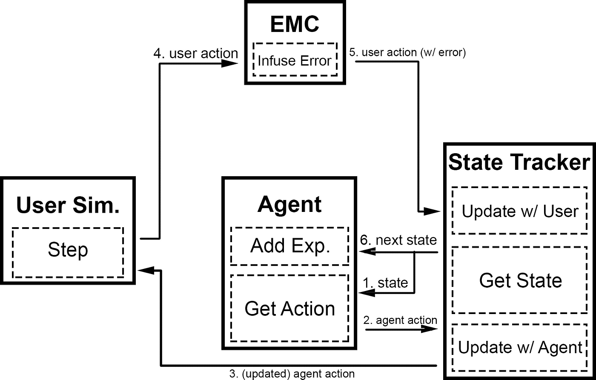

## Table of Contents

## What is a Dialogue State Tracker in the context of machine learning?

A Dialogue State Tracker is a key component in conversational AI systems that helps keep track of the conversation between a user and a machine. It works by maintaining and updating a set of beliefs about the user's goals and the current state of the dialogue. Think of it like a memory bank that the system uses to understand what the user wants and to respond appropriately. For example, if a user is booking a flight, the Dialogue State Tracker would remember details like the departure city, destination, and preferred travel date.

The Dialogue State Tracker updates its beliefs based on the user's inputs and the system's responses. It uses various techniques, such as machine learning models, to predict the most likely state of the dialogue at any given moment. This helps the system to stay on topic and provide relevant responses. For instance, if the user mentions they want to change their flight, the tracker would update its understanding and adjust the conversation accordingly. By doing this, the Dialogue State Tracker plays a crucial role in making conversations with machines feel more natural and helpful.

## Why are Dialogue State Trackers important in conversational AI?

Dialogue State Trackers are important in conversational AI because they help the system understand and remember what the user is talking about. Imagine you're talking to a friend about planning a trip. Your friend needs to remember where you want to go, when you want to leave, and other details. A Dialogue State Tracker does the same thing for a machine. It keeps track of all the important information from the conversation, so the machine can respond in a way that makes sense and helps the user.

Without a Dialogue State Tracker, the machine might forget what the user said earlier in the conversation, leading to confusing or irrelevant responses. For example, if a user asks about the weather in New York and then asks about good restaurants, the machine needs to remember that the user is still talking about New York. The Dialogue State Tracker makes sure the machine can connect these pieces of information and provide a helpful answer. This makes the conversation feel more natural and improves the user's experience with the AI system.

## How does a basic Dialogue State Tracker function?

A basic Dialogue State Tracker works by keeping track of what the user is talking about during a conversation. Imagine you're telling a friend about your day. Your friend remembers what you said earlier and uses that information to keep the conversation going. In the same way, a Dialogue State Tracker listens to what the user says and updates its understanding of the conversation. For example, if a user is booking a hotel and mentions they want a room with a sea view, the tracker will remember this detail and use it to help find the right hotel.

The tracker updates its beliefs about the user's goals and the current state of the conversation based on new information. It does this by using simple rules or more advanced machine learning models. For instance, if the user says, "I want to book a flight to Paris," the tracker will update its beliefs to reflect that Paris is the destination. As the conversation continues, the tracker keeps adjusting its understanding, ensuring that the system can respond in a way that makes sense and helps the user achieve their goals. This process makes the conversation feel more natural and helpful.

## What are the key components of a Dialogue State Tracker?

A Dialogue State Tracker has a few main parts that work together to keep track of a conversation. The first part is the belief state, which is like a memory of what the user wants and what has been talked about so far. For example, if a user is booking a flight, the belief state would remember the destination, the date, and other details. The second part is the update mechanism, which changes the belief state based on new information from the user. If the user says they want to change their flight, the update mechanism will adjust the belief state to reflect this new goal.

The third part is the representation of the dialogue state, which can be simple or complex depending on the system. A simple representation might just list the key pieces of information, while a more complex one might use probabilities to show how certain the system is about each piece of information. The final part is the integration with the rest of the conversational AI system. The Dialogue State Tracker needs to work well with other parts like the natural language understanding module, which figures out what the user is saying, and the dialogue policy, which decides what the system should say next. Together, these components help the system have a smooth and helpful conversation with the user.

## Can you explain the difference between rule-based and machine learning-based Dialogue State Trackers?

A rule-based Dialogue State Tracker works by following a set of rules to keep track of the conversation. Imagine a game where you move pieces on a board according to specific rules. In the same way, a rule-based tracker uses if-then statements to update its understanding of what the user wants. For example, if the user says they want to book a flight to Paris, the tracker might have a rule that says, "If the user mentions a destination, update the destination in the belief state." This method is simple and easy to understand, but it can struggle with conversations that don't follow the expected rules or when users say things in different ways.

On the other hand, a machine learning-based Dialogue State Tracker uses data to learn how to understand and track conversations. It's like a student who gets better at a subject by studying many examples. These trackers use models, such as neural networks, to predict what the user is talking about based on what they've said so far. For instance, if a user says, "I want to go to Paris," the machine learning model might recognize "Paris" as a destination and update the belief state accordingly. This approach can handle more complex and varied conversations because it can learn from many different examples, but it requires a lot of data and can be harder to understand and control compared to rule-based systems.

## What is FastSGT and how does it improve upon traditional Dialogue State Trackers?

FastSGT stands for Fast Semantic Graph-based Dialogue State Tracker. It's a new way to keep track of conversations that is both faster and more accurate than older methods. Traditional Dialogue State Trackers often use a lot of rules or complicated machine learning models, which can make them slow and hard to manage. FastSGT, on the other hand, uses a simpler approach called semantic graphs. These graphs help the tracker understand the meaning of what the user is saying and keep track of it more easily. This makes the tracker quicker and better at handling different types of conversations.

FastSGT improves on traditional trackers by using less memory and being able to process conversations faster. It does this by focusing on the most important parts of the conversation and ignoring the less important details. This means it can work well even on devices with limited resources, like smartphones. Also, because it's easier to understand and change, developers can update and improve FastSGT more easily than they can with more complex systems. Overall, FastSGT makes conversations with AI feel more natural and helpful without needing a lot of time or computer power.

## How does FastSGT handle dialogue state tracking in real-time applications?

FastSGT, or Fast Semantic Graph-based Dialogue State Tracker, is designed to handle dialogue state tracking efficiently in real-time applications. It does this by using semantic graphs, which are simple ways to show the meaning of what the user is saying. Instead of using a lot of complicated rules or heavy machine learning models, FastSGT focuses on the most important parts of the conversation. This makes it faster because it doesn't need to think about every little detail. For example, if a user is booking a flight and mentions they want to go to Paris, FastSGT quickly updates its understanding to reflect that Paris is the destination.

Because FastSGT is lightweight, it can work well on devices with limited resources, like smartphones. This is important for real-time applications where the conversation needs to keep moving without any delays. FastSGT's ability to process information quickly and accurately helps make the conversation feel more natural and helpful to the user. By keeping track of the dialogue state in real-time, FastSGT ensures that the system can respond to the user's needs without slowing down the conversation.

## What are the challenges faced when implementing FastSGT in a new conversational system?

When implementing FastSGT in a new conversational system, one of the main challenges is ensuring that the semantic graphs used by FastSGT can accurately represent the wide variety of user inputs. Different users might say the same thing in many different ways, and FastSGT needs to understand all these variations. This means the system needs a lot of examples to learn from, which can be time-consuming to gather and label. Another challenge is integrating FastSGT with other parts of the conversational system, like the natural language understanding and dialogue policy modules. These parts need to work well together for the conversation to flow smoothly, and any mismatch can lead to errors or confusing responses.

Another difficulty is optimizing FastSGT for real-time performance on devices with limited resources. While FastSGT is designed to be lightweight, it still needs to be fine-tuned to work quickly and efficiently on smartphones or other devices. This involves balancing the need for speed with the need for accuracy, which can be tricky. Additionally, developers need to make sure that FastSGT can be easily updated and maintained. Because FastSGT uses simpler models, it's easier to change than more complex systems, but it still requires careful management to keep it working well over time.

## How can the performance of a Dialogue State Tracker like FastSGT be evaluated?

The performance of a Dialogue State Tracker like FastSGT can be evaluated by looking at how well it understands and keeps track of conversations. One way to do this is by using something called "Joint Goal Accuracy." This measures how often the tracker correctly understands all the important parts of what the user wants at the end of a conversation. For example, if a user is booking a flight, the tracker needs to remember the destination, date, and other details correctly. Another way to evaluate FastSGT is by using "Slot Accuracy," which looks at how well the tracker understands each piece of information the user gives. If the user says they want to go to Paris, the tracker should remember "Paris" as the destination correctly.

Another important thing to check is how fast FastSGT can process information. This is called "Inference Speed," and it's really important for real-time applications where the conversation needs to keep moving without delays. You can measure this by seeing how long it takes for FastSGT to update its understanding after the user says something. Also, it's good to see how well FastSGT works on devices with limited resources, like smartphones. This is called "Resource Efficiency," and it's about making sure FastSGT can run quickly and accurately even on smaller devices. By looking at these different measures, you can get a good idea of how well FastSGT is doing its job in keeping track of conversations.

## What are some advanced techniques used in FastSGT to enhance dialogue state tracking accuracy?

FastSGT uses advanced techniques like attention mechanisms to focus on the most important parts of what the user is saying. Imagine you're reading a book and you need to pay more attention to certain sentences to understand the story better. FastSGT does something similar by using attention to highlight key words or phrases in the conversation. This helps the tracker understand the user's goals more accurately. Another technique FastSGT uses is graph-based reasoning, which helps connect different pieces of information in the conversation. For example, if a user mentions they want to book a flight to Paris and then asks about hotels, FastSGT can use its graph to understand that the user is still talking about Paris and update the dialogue state accordingly.

In addition to these techniques, FastSGT also uses pre-trained language models to improve its understanding of the user's input. These models are trained on a lot of text data and can help FastSGT recognize different ways users might say the same thing. This makes the tracker more flexible and able to handle a wider variety of conversations. By combining these advanced techniques, FastSGT can keep track of the dialogue state more accurately and make conversations with the user feel more natural and helpful.

## How does FastSGT integrate with other components of a dialogue system?

FastSGT integrates with other components of a dialogue system by working closely with the natural language understanding (NLU) module and the dialogue policy module. When a user speaks, the NLU module figures out what the user means and sends this information to FastSGT. FastSGT then updates its understanding of the conversation based on this information. For example, if the user says they want to book a flight to Paris, the NLU module would recognize "Paris" as the destination, and FastSGT would update its belief state to reflect this. This close integration helps FastSGT stay on track with what the user wants and keeps the conversation flowing smoothly.

After FastSGT updates the dialogue state, it shares this information with the dialogue policy module. The dialogue policy module uses the updated state to decide what the system should say next. For instance, if FastSGT has noted that the user wants to go to Paris, the dialogue policy might choose to ask about the travel date or preferred airline. This back-and-forth between FastSGT and the other components ensures that the system can respond in a way that makes sense and helps the user achieve their goals. By working together, these components make the conversation with the user feel more natural and helpful.

## What future developments can we expect in the field of Dialogue State Trackers beyond FastSGT?

In the future, we can expect Dialogue State Trackers to become even better at understanding and tracking conversations. One big change might be the use of more advanced machine learning models, like transformer-based models, which can understand the context of a conversation even better than current models. These models could help Dialogue State Trackers handle longer and more complex conversations by remembering more details and understanding the relationships between different pieces of information. For example, if a user is planning a trip and mentions several cities they want to visit, the tracker could keep track of all these details and help plan the trip more effectively.

Another development could be the integration of Dialogue State Trackers with other AI technologies, like emotion recognition and personalization. This means that the tracker could not only understand what the user is saying but also how they are feeling and what they might prefer based on past conversations. This could make conversations with AI feel more personal and helpful. For instance, if a user sounds frustrated, the system could adjust its responses to be more comforting. As these technologies improve, Dialogue State Trackers will become more powerful and versatile, making interactions with AI more natural and enjoyable for users.