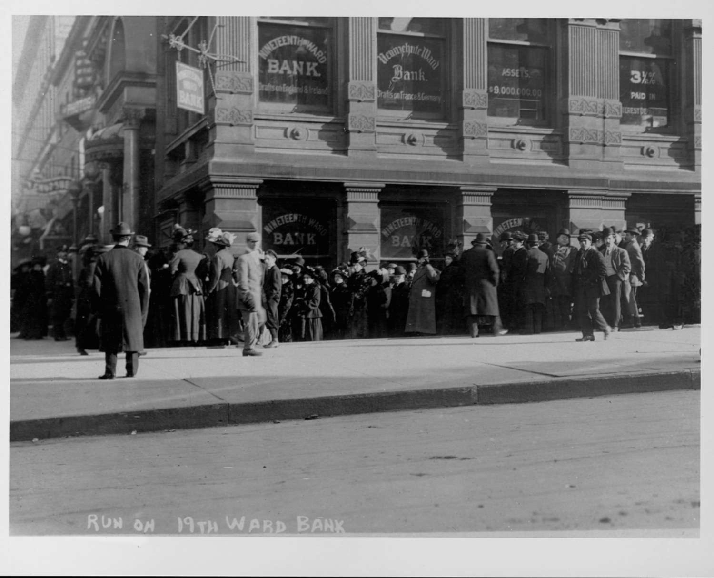

## Table of Contents

## What is the Diamond-Dybvig Model?

The Diamond-Dybvig Model is a way to understand how banks work and why people might rush to take their money out of banks, which is called a bank run. This model was created by economists Douglas Diamond and Philip Dybvig. They explained that banks take money from people who want to save it and then lend that money to others who need it for a longer time. This system works well because it helps people who need money at different times. But, if everyone suddenly wants their money back at the same time, the bank might not have enough money to give to everyone because it has lent out most of the money.

In the model, people can choose to take their money out early or wait until later. If everyone thinks that others will take their money out early, they might also want to take their money out early, even if they don't need it right away. This can cause a bank run, where everyone rushes to get their money, and the bank fails because it can't give money to everyone. The Diamond-Dybvig Model shows that banks need to be careful and that having a system to protect banks, like deposit insurance, can help stop bank runs from happening.

## Who are Douglas Diamond and Philip Dybvig?

Douglas Diamond and Philip Dybvig are economists who came up with the Diamond-Dybvig Model. Douglas Diamond is a professor at the University of Chicago. He has done a lot of research on how banks work and how they can be safe. Philip Dybvig is a professor at Washington University in St. Louis. He also studies how banks and financial systems work. They both won the Nobel Prize in Economics in 2022 for their work on understanding banks and bank runs.

Their most famous work is the Diamond-Dybvig Model, which explains why people might rush to take their money out of banks all at once. This is called a bank run. Their model shows that banks take money from people who want to save it and lend it to others who need it for a longer time. But if everyone suddenly wants their money back, the bank might not have enough money to give to everyone. Their work has helped us understand how to make banks safer and stop bank runs from happening.

## What is a bank run and how does it relate to the Diamond-Dybvig Model?

A bank run is when a lot of people rush to take their money out of a bank all at once. They do this because they are worried that the bank might not have enough money to give back to everyone. If too many people take their money out, the bank can run out of money and fail. This can happen even if the bank was doing fine before, because the bank uses the money people deposit to lend to others, so it doesn't have all the money sitting in the bank ready to give back.

The Diamond-Dybvig Model explains why bank runs happen and how they can be stopped. In the model, people can choose to take their money out early or wait until later. If people think others will take their money out early, they might also want to take their money out, even if they don't need it right away. This can start a bank run. The model shows that banks need to be careful and that having things like deposit insurance, which promises to give people their money back even if the bank fails, can help stop bank runs from happening.

## Can you explain the basic assumptions of the Diamond-Dybvig Model?

The Diamond-Dybvig Model makes some simple assumptions to explain how banks work and why bank runs happen. It assumes that people can put their money into a bank and choose to take it out early or wait until later. Some people might need their money right away, while others can wait. The bank takes the money people deposit and lends it to others for a longer time. This way, the bank can make money by charging interest on the loans, but it means the bank doesn't have all the money sitting in the bank ready to give back to depositors.

The model also assumes that people might start to worry if they think others will take their money out early. If everyone starts to think this, they might all want to take their money out at the same time, even if they don't need it right away. This can cause a bank run, where the bank doesn't have enough money to give to everyone because it has lent out most of the money. The Diamond-Dybvig Model helps us understand that banks need to be careful and that having systems like deposit insurance can stop bank runs by making people feel safer about leaving their money in the bank.

## How does the Diamond-Dybvig Model illustrate the role of banks in liquidity provision?

The Diamond-Dybvig Model shows how banks help people by providing liquidity, which means they can get their money when they need it. In the model, some people might need their money right away, while others can wait. Banks take the money people deposit and lend it to others who need it for a longer time. This way, the bank can help people who need money at different times. If someone needs money quickly, they can take it out of the bank, and if someone can wait, the bank can lend their money to someone else and still give it back later.

But, the model also shows that this system can have problems. If everyone suddenly wants their money back at the same time, the bank might not have enough money to give to everyone because it has lent out most of the money. This can cause a bank run, where people rush to take their money out of the bank. The Diamond-Dybvig Model helps us understand that banks are important for providing liquidity, but they need to be careful and have systems like deposit insurance to stop bank runs and keep people's money safe.

## What are the key components of the Diamond-Dybvig Model?

The Diamond-Dybvig Model has a few main parts that help explain how banks work and why people might rush to take their money out. First, the model says that people can put their money into a bank and choose to take it out early or wait until later. Some people might need their money right away, while others can wait. The bank takes the money people deposit and lends it to others who need it for a longer time. This way, the bank can make money by charging interest on the loans, but it means the bank doesn't have all the money sitting in the bank ready to give back to depositors.

Second, the model shows that people might start to worry if they think others will take their money out early. If everyone starts to think this, they might all want to take their money out at the same time, even if they don't need it right away. This can cause a bank run, where the bank doesn't have enough money to give to everyone because it has lent out most of the money. The Diamond-Dybvig Model helps us understand that banks need to be careful and that having systems like deposit insurance can stop bank runs by making people feel safer about leaving their money in the bank.

## How does the model predict the occurrence of bank runs?

The Diamond-Dybvig Model predicts bank runs by showing how people's behavior can lead to a rush to take money out of the bank. In the model, people can choose to take their money out early or wait until later. If people start to think that others will take their money out early, they might also want to take their money out, even if they don't need it right away. This can start a bank run because everyone is worried that the bank won't have enough money to give back to everyone if too many people want their money at the same time.

The model shows that banks lend out the money people deposit, so they don't have all the money sitting in the bank ready to give back. If everyone suddenly wants their money back, the bank can run out of money because it has lent most of it to others. The Diamond-Dybvig Model helps us see that banks need to be careful and that having systems like deposit insurance can stop bank runs by making people feel safer about leaving their money in the bank.

## What are the policy implications of the Diamond-Dybvig Model for preventing bank runs?

The Diamond-Dybvig Model shows that banks can be safer if there are good policies in place to stop bank runs. One important policy is deposit insurance. This means the government promises to give people their money back even if the bank fails. When people know their money is safe, they are less likely to rush to take it out of the bank all at once. This helps stop bank runs from happening and keeps the bank system stable.

Another policy is for banks to keep more money ready to give back to people who want it. This is called liquidity. If banks have more money on hand, they can give it back to people who need it right away, which can help stop a bank run. But, banks also need to be careful not to keep too much money sitting around because they can make money by lending it out. So, the right balance is important to keep the bank safe and working well.

## How have real-world bank runs, such as the 2007-2008 financial crisis, been explained using the Diamond-Dybvig Model?

The Diamond-Dybvig Model helps us understand what happened during the 2007-2008 financial crisis. During this time, many people started to worry about their money in banks because they heard about banks losing money on risky loans. This worry made people rush to take their money out of the banks, just like in the model. When everyone wanted their money back at the same time, the banks didn't have enough money to give to everyone because they had lent out most of it. This caused some banks to fail, which made the crisis even worse.

The model shows that having deposit insurance can help stop bank runs. During the 2007-2008 crisis, the government stepped in with programs like the Troubled Asset Relief Program (TARP) to help banks and reassure people that their money was safe. These actions were important to stop the bank runs from getting worse. The Diamond-Dybvig Model helps explain why these policies were needed and how they worked to calm people down and keep the bank system from collapsing.

## What are the criticisms and limitations of the Diamond-Dybvig Model?

The Diamond-Dybvig Model is very helpful for understanding bank runs, but it has some problems too. One big problem is that the model makes things simple and doesn't always show what happens in the real world. For example, the model says that people can choose to take their money out early or wait, but in real life, people might have other choices or reasons for what they do. The model also doesn't talk about how banks might be connected to each other or how problems in one bank can spread to others, which can make a crisis worse.

Another criticism is that the model doesn't look at all the things that can cause a bank run. It focuses a lot on what people think others will do, but there might be other reasons, like problems with the economy or bad news about a bank's loans. Also, the model doesn't always show how governments and banks can work together to stop a bank run. While the Diamond-Dybvig Model is good at explaining some things about bank runs, it doesn't cover everything, so we need to be careful when using it to understand real-world problems.

## How have extensions and modifications to the Diamond-Dybvig Model been used to address its limitations?

To make the Diamond-Dybvig Model better at explaining real-world bank runs, economists have added new ideas to it. One big change is adding more reasons why people might want to take their money out of the bank. Instead of just worrying about what others will do, people might also be worried about the economy or hear bad news about the bank's loans. These new ideas help the model show more of what happens in real life. Another change is looking at how banks are connected to each other. If one bank has problems, it can affect other banks too. By adding this, the model can show how a bank run in one place can spread and make things worse.

These changes help the model explain more about why bank runs happen and how they can be stopped. For example, some new versions of the model look at how the government and banks can work together to stop a bank run. They show that having good rules and working together can help keep the bank system safe. Even with these changes, the Diamond-Dybvig Model is still a simple way to understand bank runs, but it's getting better at showing the real world.

## What are the latest research developments related to the Diamond-Dybvig Model and bank runs?

Recent research on the Diamond-Dybvig Model and bank runs has focused on making the model more realistic by adding new ideas. One big development is looking at how social media and news can make bank runs worse. If people hear bad news about a bank quickly through social media, they might rush to take their money out even faster. This shows that the speed of information can change how bank runs happen. Another development is studying how different kinds of people, like those who are more or less worried about their money, can affect bank runs. By understanding these differences, we can see how to stop bank runs better.

Researchers are also working on new ways to stop bank runs by using the ideas from the Diamond-Dybvig Model. One idea is using technology, like blockchain, to make banks safer. Blockchain can help banks keep track of money better and make people feel more secure about leaving their money in the bank. Another idea is looking at how banks can work together to help each other during a crisis. If banks share information and help each other, they can stop a bank run from spreading. These new ideas show that the Diamond-Dybvig Model is still important for understanding bank runs, but we need to keep updating it to fit the changing world.

## References & Further Reading

[1]: Diamond, D. W., & Dybvig, P. H. (1983). ["Bank Runs, Deposit Insurance, and Liquidity."](https://www.bu.edu/econ/files/2012/01/DD83jpe.pdf) Journal of Political Economy, 91(3), 401-419.

[2]: Krugman, P. (2009). ["The Return of Depression Economics and the Crisis of 2008."](https://archive.org/details/returnofdepressi0000krug) W. W. Norton & Company.

[3]: Allen, F., & Gale, D. (2007). ["Understanding Financial Crises."](https://academic.oup.com/book/51928) Oxford University Press.

[4]: Hull, J. C. (2021). ["Risk Management and Financial Institutions."](https://www.wiley.com/en-us/Risk+Management+and+Financial+Institutions%2C+6th+Edition-p-9781119932482) Wiley.

[5]: Lopez de Prado, M. (2018). ["Advances in Financial Machine Learning."](https://www.amazon.com/Advances-Financial-Machine-Learning-Marcos/dp/1119482089) Wiley.

[6]: Mishkin, F. S. (2018). ["The Economics of Money, Banking, and Financial Markets."](https://www.pearsonhighered.com/assets/preface/0/1/3/4/0134855388.pdf) Pearson.

[7]: Aikman, D., Haldane, A. G., & Nelson, B. D. (2014). ["Curbing the Credit Cycle."](https://onlinelibrary.wiley.com/doi/full/10.1111/ecoj.12113) Bank of England Quarterly Bulletin.