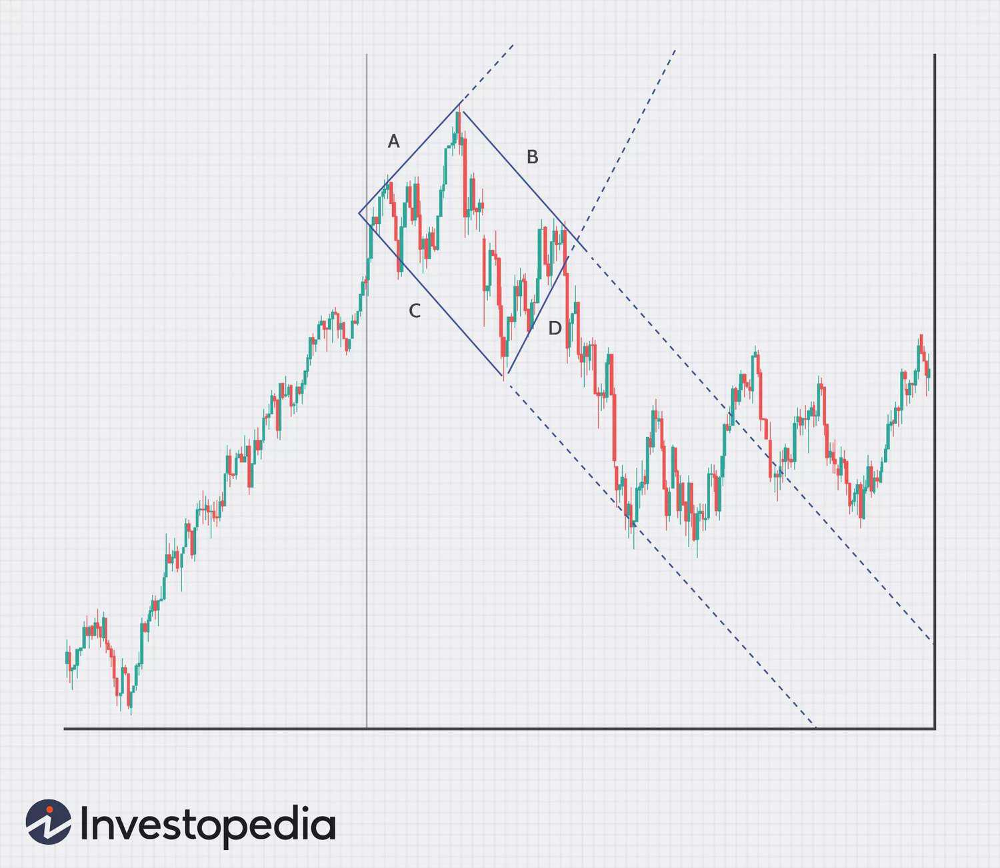

## Table of Contents

## What is a Diamond Top Formation in technical analysis?

A Diamond Top Formation is a pattern that appears on stock charts and other financial charts. It is called a "diamond" because it looks like a diamond shape. This pattern usually means that the price of the stock or asset might go down soon. Traders watch for this pattern because it can help them decide when to sell their investments.

The Diamond Top Formation starts with a broadening pattern, where the price moves up and down in wider swings. Then, it changes into a narrowing pattern, where the price swings get smaller. When you connect the highs and lows of these price movements, they form a diamond shape. Once the price breaks out of the bottom of the diamond, it often means that a big drop in price is coming. Traders use this signal to sell their stocks before the price goes down.

## How can you identify a Diamond Top Formation on a chart?

To spot a Diamond Top Formation on a chart, you need to look for a special shape that looks like a diamond. This shape starts with the price of the stock moving up and down in bigger swings. Imagine drawing lines that connect the highest points and the lowest points of these swings. At first, these lines will spread out, making a wider shape at the top of the pattern. This part is called the broadening formation.

Next, the price starts to swing in smaller ranges. You keep drawing lines to connect the highs and lows, but now these lines start to come closer together, forming a narrower shape at the bottom of the pattern. This part is called the narrowing formation. When you put these two parts together, they make a diamond shape. If the price then breaks out of the bottom of this diamond, it's a sign that the price might go down soon.

Remember, the key to identifying a Diamond Top Formation is seeing the price first move in wider swings and then in narrower swings, creating a diamond shape. Once you see this shape and the price breaks below it, it's a warning that the price might drop, and traders often use this signal to sell their stocks.

## What are the key components of a Diamond Top Formation?

A Diamond Top Formation has two main parts that you need to spot on a chart. The first part is the broadening formation. This happens when the price of the stock starts moving up and down in bigger swings. You can see this by drawing lines that connect the highest and lowest points of these swings. At the start, these lines spread out, making a wide shape at the top of the pattern. This shows that the price is getting more unpredictable and moving more wildly.

The second part is the narrowing formation. After the price has been swinging widely, it starts to move in smaller swings. You keep drawing lines to connect the highs and lows, but now these lines start to come closer together, making a narrow shape at the bottom of the pattern. When you put these two parts together, they form a diamond shape. If the price then breaks out of the bottom of this diamond, it's a sign that the price might go down soon. Traders look for this pattern to decide when to sell their stocks before the price drops.

## What does a Diamond Top Formation indicate about market trends?

A Diamond Top Formation tells us that the market might be getting ready for a big change. It starts when the price of a stock or asset moves up and down in bigger swings, making a wide shape at the top. This part is called the broadening formation. It shows that the market is getting more unpredictable and people are unsure about where the price will go next.

Then, the price starts to move in smaller swings, making a narrow shape at the bottom. This part is called the narrowing formation. When you put these two parts together, they make a diamond shape. If the price breaks out of the bottom of this diamond, it means the market trend might be about to go down. Traders watch for this pattern because it can help them decide when to sell their investments before the price drops.

## How reliable is the Diamond Top Formation as a trading signal?

The Diamond Top Formation is seen as a good signal for traders, but it's not perfect. It can help traders guess when a big drop in price might happen. When the price breaks out of the bottom of the diamond shape, it's a warning that the price could go down soon. Many traders have used this pattern to sell their stocks before the price drops, and it has worked well for them sometimes.

However, no pattern is always right. Sometimes the price might not drop after the Diamond Top Formation appears. Other things like news or big events can change what the market does. So, traders often use the Diamond Top Formation with other tools and signs to make better choices. It's a helpful hint, but it's smart to look at more than just this one pattern when making trading decisions.

## Can you explain the psychology behind the Diamond Top Formation?

The Diamond Top Formation shows what people are thinking and feeling about a stock's price. At first, the price moves up and down a lot, making a wide shape at the top. This happens because some people think the price will keep going up, so they buy more. But others start to worry that the price is too high, so they sell. This back-and-forth makes the price swing more and more.

Then, the price starts to move in smaller swings, making a narrow shape at the bottom. This happens because people start to agree more about the price. They see that it's not going up as much anymore, so they sell more. When the price breaks out of the bottom of the diamond, it means more people are selling than buying. They think the price will go down, so they want to get out before it drops too much.

## What are the typical entry and exit points when trading a Diamond Top Formation?

When trading a Diamond Top Formation, the typical entry point for a short position happens when the price breaks out of the bottom of the diamond shape. Traders watch closely for this break to happen because it suggests that the price might start going down soon. They enter their short position right after the price moves below the lower trendline of the diamond, confirming the breakout. This is when they start betting that the price will drop.

The typical exit point for a short position is a bit trickier. Traders often set a target price for their exit based on the height of the diamond. They measure the distance from the highest point to the lowest point inside the diamond and then project that distance downward from the breakout point. This gives them a target price where they might close their short position to take profits. Some traders also use other signs, like a change in the price trend or other patterns, to decide when to exit their trade.

## How does volume play a role in confirming a Diamond Top Formation?

Volume is important when looking at a Diamond Top Formation. It helps make sure the pattern is real and not just a trick. When the price is making the wide swings at the top of the diamond, you want to see high volume. This means lots of people are trading, and it shows that the market is really unsure about where the price will go next. If the volume is low during this time, the pattern might not be as strong.

When the price starts making smaller swings and the diamond shape narrows, you want to see the volume start to drop. This shows that fewer people are trading, and it means the market is starting to agree more about the price. If the price then breaks out of the bottom of the diamond with a big jump in volume, it's a strong sign that the price will go down. This high volume confirms that the Diamond Top Formation is a good signal to sell.

## What are common mistakes traders make when interpreting a Diamond Top Formation?

One common mistake traders make when looking at a Diamond Top Formation is jumping into a trade too early. They might see the diamond shape starting to form and decide to sell their stocks before the price has actually broken out of the bottom of the diamond. This can lead to missed opportunities because the price might not drop right away. It's important to wait for the price to clearly break below the lower trendline of the diamond before making a move.

Another mistake is not paying attention to volume. Volume is like a check to make sure the Diamond Top Formation is real. If traders don't see high volume during the wide swings at the top of the diamond and a big jump in volume when the price breaks out of the bottom, the pattern might not be as strong. Ignoring volume can lead to false signals and bad trades. It's always good to use volume as a tool to confirm what the pattern is telling you.

## How does the Diamond Top Formation differ from other chart patterns like the Head and Shoulders?

The Diamond Top Formation and the Head and Shoulders pattern both show that a stock's price might go down soon, but they look different on a chart. The Diamond Top Formation starts with the price moving up and down in bigger swings, making a wide shape at the top, and then it moves in smaller swings, making a narrow shape at the bottom. When you connect these highs and lows, they make a diamond shape. Traders watch for the price to break out of the bottom of the diamond to sell their stocks. On the other hand, the Head and Shoulders pattern has three peaks: a higher peak in the middle (the head) and two lower peaks on the sides (the shoulders). The price then breaks below a line called the neckline, which is drawn across the lows between the peaks, signaling that the price might drop.

The main difference between these patterns is their shapes and how they form. The Diamond Top Formation shows the market getting more unsure at first, with big swings, and then more sure, with smaller swings. It's like the market is making up its mind to go down. The Head and Shoulders pattern, however, shows the market trying to go up three times but failing to keep going higher each time. This pattern tells traders that the market has tried to go up but can't, so it's likely to go down. Both patterns help traders guess when to sell, but they give different clues about why the price might drop.

## Can the Diamond Top Formation be used effectively in different time frames?

Yes, the Diamond Top Formation can be used in different time frames, like daily, weekly, or even hourly charts. It works the same way in all these time frames. You look for the price to make big swings first, then smaller swings, forming a diamond shape. When the price breaks out of the bottom of the diamond, it's a sign that the price might go down soon. Traders can use this pattern on short-term charts to make quick trades or on long-term charts to make bigger decisions about their investments.

The key is to make sure the pattern is clear no matter what time frame you're using. On a shorter time frame, like an hourly chart, the pattern might show up more often, but the price changes might be smaller. On a longer time frame, like a weekly chart, the pattern might take longer to form, but the price changes could be bigger. Traders need to check the volume too, to make sure the pattern is strong. No matter the time frame, the Diamond Top Formation can help traders guess when a price drop might happen.

## What advanced strategies can be employed to enhance trading outcomes with a Diamond Top Formation?

To make the most out of trading with a Diamond Top Formation, traders can use other tools to check if the pattern is real. One way is to use something called technical indicators, like the Relative Strength Index (RSI) or Moving Averages. If these indicators also show that the price might go down, it can make the Diamond Top Formation a stronger signal. Another way is to look at the overall trend of the market. If the market has been going up for a long time, a Diamond Top Formation might be a good sign that the trend is about to change. Traders can also use stop-loss orders to limit their losses if the price doesn't go down like they thought it would.

Another advanced strategy is to combine the Diamond Top Formation with other patterns. For example, if you see a Diamond Top Formation and then a Head and Shoulders pattern right after, it can make the signal even stronger. Traders can also watch for other signs that the price might go down, like if the volume gets really high when the price breaks out of the bottom of the diamond. This can mean more people are selling, making the price drop more likely. By using these extra checks and combining patterns, traders can feel more sure about when to sell their stocks and might make better trades.

## References & Further Reading

[1]: ["Technical Analysis of the Financial Markets"](https://drive.google.com/file/d/1OcDrGakDhaejT7J7xGEE3HHKy7xmrafy/preview) by John J. Murphy

[2]: Howard B. Bandy. (2011). ["Quantitative Trading Systems: Practical Methods for Design, Testing, and Validation."](https://www.amazon.com/Quantitative-Trading-Systems-Howard-Bandy/dp/0979183839)

[3]: Bulkowski, Thomas N. (2005). ["Encyclopedia of Chart Patterns."](https://www.amazon.com/Encyclopedia-Chart-Patterns-Thomas-Bulkowski/dp/0471668265)

[4]: Kirkpatrick, Charles D., and Dahlquist, Julie R. (2010). ["Technical Analysis: The Complete Resource for Financial Market Technicians."](https://ptgmedia.pearsoncmg.com/images/9780134137049/samplepages/9780134137049.pdf)

[5]: Rachev, Svetlozar T., et al. (2007). ["Bayesian Methods in Finance."](https://onlinelibrary.wiley.com/doi/book/10.1002/9781119202141)

[6]: Robert Engle. (2001). ["GARCH 101: The Use of ARCH/GARCH Models in Applied Econometrics."](https://www.jstor.org/stable/2696523) Journal of Economic Perspectives, 15(4), 157-168. 

[7]: Steven P. Greiner. (2011). ["Ben Graham Was a Quant: Raising the IQ of the Intelligent Investor."](https://onlinelibrary.wiley.com/doi/book/10.1002/9781118267042) 

[8]: ["Algorithmic Trading: Winning Strategies and Their Rationale"](https://www.wiley.com/en-us/Algorithmic+Trading%3A+Winning+Strategies+and+Their+Rationale-p-9781118746912) by Ernie Chan

[9]: Narang, Rishi K. (2009). ["Inside the Black Box: The Simple Truth About Quantitative Trading."](https://www.amazon.com/Inside-Black-Box-Quantitative-Trading/dp/0470432063)