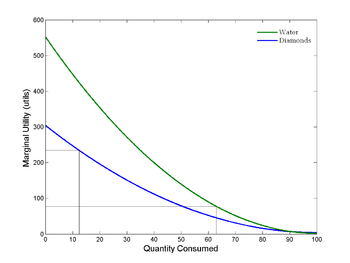

## Table of Contents

## What is the Diamond-Water Paradox?

The Diamond-Water Paradox is a concept in economics that questions why diamonds, which are not essential for survival, are more expensive than water, which is crucial for life. This paradox was first noted by the philosopher Adam Smith in the 18th century. He observed that while water is vital and diamonds are not, diamonds often have a higher market value. This seemed counterintuitive because, logically, something essential like water should be more valuable than a luxury like diamonds.

The explanation for this paradox lies in the concepts of total utility and marginal utility. Total utility refers to the overall satisfaction or benefit a person gets from using a product. Water has a high total utility because we need it to live. However, marginal utility is the additional satisfaction gained from using one more unit of a product. Because water is abundant, the marginal utility of an extra glass of water is low. On the other hand, diamonds are rare, so the marginal utility of an extra diamond is high. This means people are willing to pay more for the additional satisfaction they get from owning a diamond, even though water is more essential overall.

## Who first described the Diamond-Water Paradox?

The Diamond-Water Paradox was first described by Adam Smith, a famous philosopher and economist, in the 1700s. He noticed something strange: diamonds, which people don't need to live, were much more expensive than water, which is essential for life. This didn't make sense to him because he thought things that are necessary should be more valuable.

The reason for this paradox is explained by the ideas of total utility and marginal utility. Total utility is how much happiness or benefit you get from something overall. Water has a high total utility because we need it to survive. But marginal utility is the extra happiness you get from one more unit of something. Since water is everywhere, the extra happiness from one more glass of water is small. Diamonds are rare, so the extra happiness from one more diamond is big. That's why people are willing to pay more for diamonds, even though water is more important for life.

## Can you explain the concept of marginal utility in relation to the Diamond-Water Paradox?

Marginal utility is about how much more happiness or satisfaction you get from having one more of something. In the Diamond-Water Paradox, water is super important for life, so it has a lot of total happiness or utility. But because water is everywhere, having one more glass of water doesn't make you much happier. That's why the marginal utility of water is low. You already have enough water, so another glass doesn't change much.

Diamonds are different. They're not needed for life, but they're rare. When you get one more diamond, it makes you a lot happier because it's special and hard to find. So, the marginal utility of a diamond is high. Even though water is more important overall, people are willing to pay more for diamonds because that extra diamond adds a lot more to their happiness than another glass of water. That's why diamonds are more expensive, even though water is essential.

## How does the Diamond-Water Paradox illustrate the difference between total utility and marginal utility?

The Diamond-Water Paradox shows how total utility and marginal utility can be different. Total utility is all the happiness or usefulness you get from something. Water has a high total utility because we need it to live. Without water, we can't survive, so it's really important. But because water is everywhere, the happiness we get from one more glass of water is small. That's what we call marginal utility – the extra happiness from one more unit of something. So, the marginal utility of water is low because we already have enough of it.

Diamonds, on the other hand, are not needed to live, so their total utility is lower than water's. But diamonds are rare and special. When you get one more diamond, it makes you a lot happier because it's hard to find. That means the marginal utility of a diamond is high. Even though water is more important overall, people are willing to pay more for diamonds because that extra diamond adds a lot more to their happiness than another glass of water. This explains why diamonds are more expensive, even though water is essential for life.

## What role does scarcity play in the Diamond-Water Paradox?

Scarcity is a big reason why diamonds are more expensive than water, even though water is more important for life. Diamonds are rare, which means there aren't many of them around. Because they're hard to find, people want them more. When something is scarce, people are willing to pay a lot to get it. So, the high price of diamonds comes from their scarcity.

Water, on the other hand, is not scarce. There's a lot of water everywhere, so people don't feel the need to pay a lot for more of it. Even though water is essential, its abundance means that having one more glass doesn't make people much happier. This is why the price of water stays low, even though it's so important. Scarcity makes diamonds valuable, while the abundance of water keeps its price down.

## How did Adam Smith address the Diamond-Water Paradox in his works?

Adam Smith talked about the Diamond-Water Paradox in his book "The Wealth of Nations." He noticed that diamonds, which people don't need to live, were more expensive than water, which is essential. This didn't make sense to him because he thought things that are necessary should be more valuable. He used this example to show that the price of something isn't just about how useful it is for survival.

Smith didn't fully explain the paradox in his time because the concept of marginal utility wasn't around yet. But he pointed out the problem and got people thinking about why diamonds could be so much more expensive than water. Later economists used ideas like marginal utility and scarcity to explain why people are willing to pay more for diamonds, even though water is more important for life.

## What is the economic theory that resolves the Diamond-Water Paradox?

The economic theory that solves the Diamond-Water Paradox is called marginal utility. This theory says that the value of something isn't just about how useful it is overall, but about how much more happiness or benefit you get from having one more of it. Water is super important for life, so it has a lot of total usefulness. But because there's so much water around, having one more glass doesn't make you much happier. That's why the extra happiness from one more glass of water, or its marginal utility, is low.

Diamonds, on the other hand, are not needed to live, but they're rare. When you get one more diamond, it makes you a lot happier because it's special and hard to find. So, the extra happiness from one more diamond, or its marginal utility, is high. Even though water is more important overall, people are willing to pay more for diamonds because that extra diamond adds a lot more to their happiness than another glass of water. This explains why diamonds are more expensive, even though water is essential for life.

## How does the theory of subjective value help explain the Diamond-Water Paradox?

The theory of subjective value says that something's worth depends on what people think it's worth to them personally. In the Diamond-Water Paradox, water is super important for life, but because it's everywhere, people don't value an extra glass of water very much. On the other hand, diamonds are not needed to live, but they're rare and special. People feel happier and more excited when they get a diamond because it's hard to find. So, even though water is more important for life, people are willing to pay more for diamonds because they value the extra happiness a diamond brings more than the extra water.

This theory helps explain why diamonds are more expensive than water. It's all about what people want and how much they want it. If someone thinks a diamond will make them much happier than another glass of water, they'll pay more for it. The price of something isn't just about how useful it is but how much people personally value it. So, the high price of diamonds comes from people's feelings and desires, not just from how necessary they are.

## Can you discuss any historical economic policies influenced by the understanding of the Diamond-Water Paradox?

The Diamond-Water Paradox helped economists understand how people value things, and this understanding influenced some economic policies over time. One big idea that came from this was about how to set prices. Economists realized that prices should be based on how much people want something and how much of it there is, not just how important it is for life. This led to policies that try to let the market decide prices, like in free-market systems. Governments started to see that letting people buy and sell things freely could help set prices that make sense to everyone, even if it means diamonds cost more than water.

Another way the Diamond-Water Paradox influenced policy was in how resources are used. If something is scarce but people want it a lot, like diamonds, then it makes sense to spend more time and money finding and selling it. This led to policies that encourage finding new resources or making them last longer. For example, some countries have policies to manage their natural resources better, like mining diamonds or conserving water, based on how much people value them and how scarce they are. This understanding helps governments make better decisions about how to use and protect important resources.

## How have modern economists critiqued or expanded upon the traditional explanations of the Diamond-Water Paradox?

Modern economists have looked at the Diamond-Water Paradox in new ways. They've pointed out that the traditional explanation, which focuses on marginal utility, might be too simple. Some economists say that the value of things like diamonds and water also depends on how people see them in society. For example, diamonds are often seen as symbols of love and status, which makes people want them more. Water, even though it's essential, doesn't have the same kind of social value. So, modern economists argue that understanding the social and cultural value of things is important too.

Another way modern economists have expanded on the Diamond-Water Paradox is by looking at how markets work. They've studied how prices can change based on supply and demand, not just the usefulness of a product. For instance, if there's a drought, the price of water can go up because it becomes scarce. This shows that the value of water can change based on how much there is, just like diamonds. Economists also talk about how marketing and branding can make people value certain things more, even if they're not necessary. This broader view helps explain why some things are more expensive than others in today's economy.

## What are some real-world applications or examples that demonstrate the principles of the Diamond-Water Paradox?

One real-world example of the Diamond-Water Paradox is in the luxury goods market. Think about designer handbags or high-end watches. These items, like diamonds, are not essential for life, but they're often very expensive. People are willing to pay a lot for them because they're rare and make people feel special or important. Just like with diamonds, it's not about how useful they are, but about the extra happiness or status they bring. On the other hand, everyday items like a bottle of water are much cheaper, even though water is vital for life. This shows how the value of something can depend more on its scarcity and the extra happiness it brings than on its total usefulness.

Another example is in the technology industry, where the latest gadgets can be very pricey. Take the newest smartphone models, for instance. They're not needed to live, but people line up to buy them because they're new and exciting. The marginal utility of getting the latest phone is high because it feels special and cutting-edge. Meanwhile, older models or basic phones that still work well are much cheaper. This is similar to the Diamond-Water Paradox because it's not about how useful the phone is for making calls or sending messages, but about the extra satisfaction and status that comes with having the newest model.

## How might the Diamond-Water Paradox be relevant to current economic debates or issues?

The Diamond-Water Paradox is still important today because it helps us understand why some things are expensive even if they're not needed for life. For example, people talk a lot about how much things like medicine or education should cost. Medicine is really important, like water, but sometimes it's very expensive. This can make people think about how much we should pay for things that are essential but might not be scarce, compared to luxury items like diamonds that cost a lot because they're rare and special.

Another way the Diamond-Water Paradox comes up in today's economic debates is about how we use our resources. People argue about whether we should focus more on things that are important for everyone, like clean water and good education, or if we should let the market decide what's valuable. If we only let the market decide, things like diamonds might always be more expensive than water, even though water is more important for life. This makes us think about how we can balance what's needed for survival with what people want to buy and sell.

## What is the Diamond-Water Paradox and how can it be understood?

The Diamond-Water Paradox, a fundamental question in economics, ponders why diamonds, which are non-essential, tend to have a higher market price compared to water, an essential resource for life. This apparent contradiction highlights the complexity of value and price, showcasing that utility and market value are not always aligned.

Adam Smith, a pivotal figure in economic thought, introduced the concepts of 'value in use' and 'value in exchange'. According to Smith, 'value in use' measures the utility or usefulness of an item, while 'value in exchange' refers to what can be obtained in the market through trade. Water, despite its immense usefulness, possesses a low exchange value due to its relative abundance. Conversely, diamonds, having limited practical use, exhibit a high exchange value due to their scarcity and desirability. Smith's distinction laid the groundwork for understanding human preferences and valuation, although it didn't fully explain the paradox itself.

Smith also proposed the labor theory of value, which suggests that the value of a good is determined by the amount of labor required to produce it. However, this theory was insufficient in explaining the value discrepancies between items like water and diamonds because it didn't account for consumer demand or individual preferences. The labor theory focused too narrowly on production costs, failing to incorporate the varying degrees of utility experienced by consumers.

The resolution to the Diamond-Water Paradox emerged with the concepts of subjective valuation and marginal utility. Subjective valuation posits that value is not inherent in objects but rather is determined by individual preferences and circumstances. Marginal utility further refines this notion by suggesting that the value of a good is determined by the additional satisfaction or utility it provides to a consumer. The marginal utility of water decreases as more is consumed due to its abundance, thus explaining its lower price. Diamonds, being rare, often have a higher marginal utility because they satisfy a different set of consumer preferences and social signals.

The marginal revolution, influenced by economists such as Carl Menger, William Stanley Jevons, and Leon Walras, embraced these ideas, transforming the understanding of value and price in economics. The concept of marginal utility, expressed mathematically as:

$$
MU = \frac{\Delta U}{\Delta Q}
$$

where $MU$ is marginal utility, $\Delta U$ is the change in utility, and $\Delta Q$ is the change in quantity consumed, provides a framework for predicting how changes in consumption levels can affect perceived value and pricing. This shift in perspective allowed economists to reconcile the paradox, illustrating that market prices reflect the subjective preferences and situational contexts of consumers, rather than just the intrinsic properties of the goods themselves.

Understanding the Diamond-Water Paradox through the lenses of subjective valuation and marginal utility is crucial, not only for economic theory but also for practical applications such as pricing strategies, policy formulation, and economic forecasting. These concepts continue to play a significant role in shaping contemporary economic thinking and remain relevant in analyzing market dynamics and consumer behavior.

## References & Further Reading

[1]: Smith, A. (1776). ["The Wealth of Nations."](https://en.wikipedia.org/wiki/The_Wealth_of_Nations) W. Strahan and T. Cadell.

[2]: Menger, C. (1871). ["Principles of Economics."](https://archive.org/details/PrinciplesOfEconomicsCarlMenger) Ludwig von Mises Institute.

[3]: Jevons, W. S. (1871). ["The Theory of Political Economy."](https://oll.libertyfund.org/titles/jevons-the-theory-of-political-economy) Palgrave Macmillan.

[4]: Walras, L. (1896). ["Elements of Pure Economics."](https://archive.org/details/elements-of-pure-economics_Leon-Walras) Routledge.

[5]: Jovanovic, F., & Le Gall, P. (2001). ["Does God practice a random walk? The 'financial physics' of a 19th century forerunner, Jules Regnault."](https://papers.ssrn.com/sol3/Delivery.cfm/SSRN_ID3294556_code3258977.pdf?abstractid=3294556&mirid=1)00021-6) The European Journal of Finance.

[6]: Lopez de Prado, M. (2018). ["Advances in Financial Machine Learning."](https://www.amazon.com/Advances-Financial-Machine-Learning-Marcos/dp/1119482089) Wiley.

[7]: Jansen, S. (2020). ["Machine Learning for Algorithmic Trading: Predictive models to extract signals from market and alternative data for systematic trading strategies with Python."](https://github.com/stefan-jansen/machine-learning-for-trading) Packt Publishing.