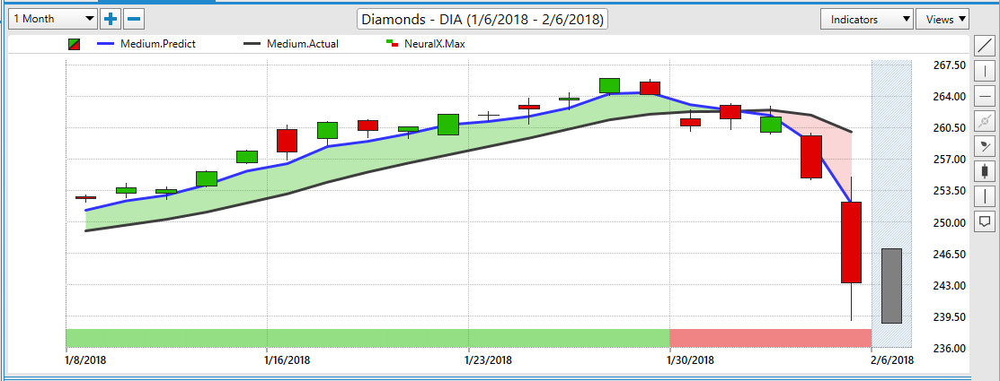

## Table of Contents

## What is a Diamonds ETF?

A Diamonds ETF, also known as the SPDR Dow Jones Industrial Average ETF Trust, is a type of exchange-traded fund that tracks the performance of the Dow Jones Industrial Average (DJIA). The DJIA is a well-known stock market index made up of 30 large, publicly-owned companies based in the United States. When you invest in a Diamonds ETF, you're essentially buying a small piece of each of these 30 companies, which helps spread out your investment risk.

The Diamonds ETF is popular among investors because it's an easy way to invest in the overall performance of the U.S. economy. Instead of buying stocks in each of the 30 companies separately, you can buy shares in the ETF, which trades on stock exchanges just like a regular stock. This makes it simple and convenient for investors to gain exposure to a broad range of industries and companies with just one investment.

## How does a Diamonds ETF track the performance of diamonds?

A Diamonds ETF doesn't actually track the performance of diamonds. Instead, it tracks the performance of the Dow Jones Industrial Average (DJIA), which is a stock market index made up of 30 big companies in the United States. The ETF is called "Diamonds" because its ticker symbol is DIA, and it's a way for people to invest in these 30 companies all at once.

So, if you buy shares in a Diamonds [ETF](/wiki/etf-trading-strategies), you're not investing in diamonds like the ones you might wear in jewelry. You're investing in a piece of the U.S. economy through these 30 companies. It's a simple way to spread your investment across different industries without having to buy each company's stock separately.

## What are the benefits of investing in a Diamonds ETF?

Investing in a Diamonds ETF is a good way to spread your money across many big companies in the U.S. without having to buy each company's stock one by one. The Diamonds ETF follows the Dow Jones Industrial Average, which includes 30 large companies from different industries. By buying shares in the ETF, you get a piece of all these companies, which helps lower your risk because your money isn't tied to just one company's performance.

Another benefit is that the Diamonds ETF is easy to buy and sell. It trades on stock exchanges just like a regular stock, so you can buy or sell it anytime during trading hours. This makes it convenient for people who want to invest in the overall health of the U.S. economy without having to do a lot of research on individual companies. Plus, the ETF usually has lower fees than if you were to buy each of the 30 stocks separately.

## What are the risks associated with investing in a Diamonds ETF?

Investing in a Diamonds ETF comes with some risks you should know about. One big risk is that the ETF follows the Dow Jones Industrial Average, which only includes 30 companies. If these companies don't do well, the value of your ETF can go down. Also, because it's focused on just 30 companies, it might not represent the whole U.S. economy as well as a broader index like the S&P 500.

Another risk is that the ETF can be affected by what's happening in the market and the economy. If there's a big drop in the stock market or if the economy goes into a recession, the value of the Diamonds ETF can fall too. It's also important to remember that while the ETF can help spread your risk across different companies, it's still tied to the performance of the stock market, so it's not completely safe from market ups and downs.

## How do Diamonds ETFs compare to other commodity ETFs?

Diamonds ETFs are different from other commodity ETFs because they don't actually track the price of diamonds or any other commodity. Instead, they follow the performance of the Dow Jones Industrial Average, which is made up of 30 big companies in the U.S. So, when you invest in a Diamonds ETF, you're putting your money into these companies, not into diamonds or other physical commodities. This makes it a way to invest in the overall health of the U.S. economy, rather than betting on the price of a specific commodity like gold, oil, or actual diamonds.

On the other hand, commodity ETFs usually focus on the price of a specific commodity, like gold, silver, or oil. These ETFs might hold the physical commodity or invest in futures contracts that track the commodity's price. The value of these ETFs goes up or down based on what's happening with the commodity they follow. So, if you're interested in investing in the price movements of a particular commodity, a commodity ETF would be more suitable than a Diamonds ETF, which is more about investing in the stock market through those 30 big companies.

## What are the major Diamonds ETFs available in the market?

The main Diamonds ETF available in the market is the SPDR Dow Jones Industrial Average ETF Trust, which is also known as the Diamonds ETF. It's the most popular one and is traded on the stock market with the ticker symbol DIA. This ETF follows the performance of the Dow Jones Industrial Average, which includes 30 big companies in the U.S. So, when you buy shares in this ETF, you're investing in a piece of all these companies.

There aren't many other ETFs that are exactly like the Diamonds ETF because it's unique in tracking the Dow Jones Industrial Average. However, there are other ETFs that track different stock market indexes or focus on specific sectors of the economy. If you're looking for something similar but different, you might consider ETFs that track the S&P 500 or the Nasdaq, which include a broader range of companies. These can be a good way to spread your investment across even more of the U.S. economy.

## How has the performance of Diamonds ETFs been over the past year?

Over the past year, the performance of the Diamonds ETF, which tracks the Dow Jones Industrial Average, has been up and down. The ETF's value can change a lot because it follows the stock prices of 30 big U.S. companies. If these companies do well, the ETF goes up, but if they struggle, the ETF can go down. In the last year, the stock market has seen some big swings, so the Diamonds ETF has felt those ups and downs too.

Looking at the numbers, the Diamonds ETF has had some good months and some not-so-good months. Overall, it's important to remember that investing in the stock market, even through an ETF like this, can be risky. But if you're looking at the long term, the Diamonds ETF can still be a good way to invest in the U.S. economy because it gives you a piece of those 30 big companies.

## What factors influence the price of diamonds and, consequently, Diamonds ETFs?

The price of diamonds doesn't actually affect the price of Diamonds ETFs because these ETFs don't track the price of diamonds. Instead, Diamonds ETFs follow the performance of the Dow Jones Industrial Average, which is made up of 30 big companies in the U.S. So, the price of a Diamonds ETF goes up or down based on how well these companies are doing, not on the price of diamonds.

The factors that influence the price of a Diamonds ETF are things like how well the companies in the Dow Jones Industrial Average are doing, what's happening in the overall stock market, and the health of the U.S. economy. If these companies are making more money and their stock prices go up, the ETF's value will go up too. But if the economy is struggling or if there's a big drop in the stock market, the ETF's value can go down. So, it's important to keep an eye on these big companies and the overall market if you're investing in a Diamonds ETF.

## How do global economic conditions affect the demand for diamonds and Diamonds ETFs?

Global economic conditions don't directly affect the demand for Diamonds ETFs because these ETFs don't track the price of actual diamonds. Instead, Diamonds ETFs follow the performance of the Dow Jones Industrial Average, which is made up of 30 big companies in the U.S. So, the value of a Diamonds ETF goes up or down based on how these companies are doing, not on how well diamonds are selling. If the global economy is doing well, these companies might do better, which could make the ETF's value go up. But if the global economy is struggling, the ETF might go down too.

On the other hand, global economic conditions can affect the demand for actual diamonds. When the economy is strong, people might have more money to spend on luxury items like diamonds, so the demand for them can go up. But when the economy is weak, people might not want to spend as much on expensive things, so the demand for diamonds could go down. However, this doesn't change the value of Diamonds ETFs because they're not connected to the price of diamonds. If you're investing in a Diamonds ETF, you're really investing in the performance of those 30 big U.S. companies, not in diamonds themselves.

## What are the latest market trends affecting Diamonds ETFs?

The latest market trends affecting Diamonds ETFs are closely tied to the performance of the Dow Jones Industrial Average, which these ETFs track. Recently, the stock market has seen a lot of ups and downs due to things like inflation, [interest rate](/wiki/interest-rate-trading-strategies) changes, and global economic news. When the market goes up, the value of the Diamonds ETF usually goes up too because it's made up of 30 big U.S. companies. But when the market goes down, the ETF can lose value as well. So, keeping an eye on these big economic trends can help you understand what might happen to your investment in a Diamonds ETF.

Another trend to watch is how different sectors of the economy are doing. The Dow Jones Industrial Average includes companies from various industries, like technology, healthcare, and finance. If one sector is doing really well, it can pull the whole index up, which is good for the Diamonds ETF. But if a key sector is struggling, it can drag the index down, affecting the ETF's value. Lately, there's been a lot of focus on tech companies and how they're doing, so that's something to pay attention to if you're invested in a Diamonds ETF.

## How can an investor incorporate Diamonds ETFs into a diversified investment portfolio?

An investor can incorporate Diamonds ETFs into a diversified investment portfolio by using them as a way to get a piece of the U.S. economy. Since the Diamonds ETF follows the Dow Jones Industrial Average, which includes 30 big companies from different industries, it can help spread out your investment risk. Instead of putting all your money into one or two stocks, you can buy shares in the Diamonds ETF and own a little bit of all these companies. This can be a good way to balance out your portfolio because it gives you exposure to a broad range of the economy without having to pick each stock yourself.

To make your portfolio even more diversified, you can mix the Diamonds ETF with other types of investments. For example, you could add some ETFs that track other indexes like the S&P 500 or the Nasdaq, which include a wider range of companies. You might also want to include some bond funds, real estate investments, or even international stocks to spread your risk across different types of assets. By combining the Diamonds ETF with these other investments, you can create a portfolio that's less likely to be hurt by problems in any one area of the market.

## What advanced strategies can be used to optimize returns from investing in Diamonds ETFs?

One advanced strategy to optimize returns from investing in Diamonds ETFs is to use dollar-cost averaging. This means you invest a fixed amount of money into the ETF at regular intervals, like every month. By doing this, you buy more shares when the price is low and fewer shares when the price is high. Over time, this can help you get a better average price for your shares and potentially increase your returns. It's a good way to smooth out the ups and downs of the market and reduce the risk of investing all your money at the wrong time.

Another strategy is to use a technique called rebalancing. This means you check your investment portfolio regularly and adjust it to keep your investments in line with your goals. For example, if the Diamonds ETF has done really well and now makes up a bigger part of your portfolio than you want, you might sell some of it and buy other investments to bring things back into balance. Rebalancing can help you manage risk and make sure your portfolio stays diversified. By keeping an eye on your investments and making small adjustments, you can work towards better long-term returns.

## What are the investment opportunities and risks?

Diamonds Exchange Traded Funds (ETFs) present distinct investment opportunities. These financial instruments offer a way to gain exposure to the diamonds industry without directly purchasing or trading in physical diamonds. For investors considering this market, several aspects and strategies are paramount to enhancing potential returns while mitigating associated risks.

### Potential Opportunities

1. **Diversification and Accessibility**: Diamonds ETFs provide investors with an avenue to diversify their portfolios through exposure to an asset class that traditionally exhibits low correlation with stocks and bonds. Such diversification can contribute to a reduction in overall portfolio risk.

2. **Market Growth Prospects**: The diamonds market has been bolstered by growing consumer demand, particularly from emerging markets. As economies grow, the demand for luxury items, including diamonds, often increases, providing ETFs with potential growth.

3. **Inflation Hedge**: Commodities, including diamonds, often serve as a hedge against inflation. Therefore, investing in diamonds ETFs can be protective in inflationary environments.

### Market Volatility and Risks

Diamonds ETFs are not immune to market [volatility](/wiki/volatility-trading-strategies). The value of these ETFs can fluctuate due to various factors, including:

- **Economic Conditions**: Global economic conditions impact consumer spending power, thereby influencing diamond demand and pricing.

- **Regulatory Changes**: Policy changes in major diamond-producing countries can affect supply and prices, thereby influencing ETF performance.

- **Exchange Rate Fluctuations**: As an international commodity, diamonds are sensitive to currency changes, which can affect the cost of imports and exports.

### Best Practices for Mitigating Risks

1. **Due Diligence**: Investors should diligently research to understand the ETF’s composition, including the weight of physically-backed diamonds versus contractual investments.

2. **Risk Assessment Tools**: Use financial tools to assess the risk profile of diamonds ETFs. Metrics such as beta coefficient, which measures the ETF's volatility relative to the overall market, are essential.
$$
   \text{Beta} = \frac{\text{Cov}(R_i, R_m)}{\text{Var}(R_m)}

$$

   Where $R_i$ is the return on the investment, and $R_m$ is the market return.

3. **Periodic Rebalancing**: Adjust portfolio allocations based on changes in market conditions and personal risk tolerance levels.

### Tools and Resources

Various tools can facilitate due diligence and risk assessment in the diamonds ETF market:

- **Investment Platforms**: Services like Bloomberg and Morningstar provide comprehensive insights and analytics on ETF compositions and performances.

- **Financial Advisories and Reports**: Engaging with financial advisors who specialize in commodities and reviewing industry reports can provide valuable market assessments.

### Expert Advice

Financial experts advise maintaining a balanced view when investing in diamonds ETFs. This involves setting clear investment goals, understanding market fundamentals, and being prepared for short-term fluctuations. Long-term holding strategies combined with informed decision-making can leverage the advantages provided by diamonds ETFs while safeguarding against inherent market risks.

In conclusion, while the allure of diamonds ETFs lies in their potential returns and unique market position, investors must approach with strategic foresight and a comprehensive understanding of the associated risks and tools available to them.

## References & Further Reading

[1]: Schweikert, L. (2017). ["Diamonds ETFs: Opportunities and Risks."](https://d3.harvard.edu/platform-rctom/submission/diamonds-are-foreverbut-their-supply-chains-are-not/) Nasdaq.

[2]: Lahart, J. (2020). ["Why Invest in Diamonds? ETFs Sparkle More."](https://advisor.morganstanley.com/sabia-balkey-lahart/articles/investing/why-having-a-goal-is-key-to-investing) The Wall Street Journal.

[3]: Silber, W.L. (1985). "The Economic Role of Financial Markets." *The McGraw-Hill Financial Times Series*.

[4]: Rosenblum, S. (2022). ["A New Paradigm for Diamonds: ESG Impacts on Investment."](https://tucson.com/opinion/column/mort-rosenblum-choosing-facts-over-the-validation-of-biases/article_bb1d23d2-b314-11ef-a126-77b4b110c4eb.html) Barron's.

[5]: Dsouza, J. (2019). ["Algorithmic Trading in Commodity Markets: An Overview with Applications."](https://en.wikipedia.org/wiki/Dinesh_D%27Souza) Journal of Commodity Markets.