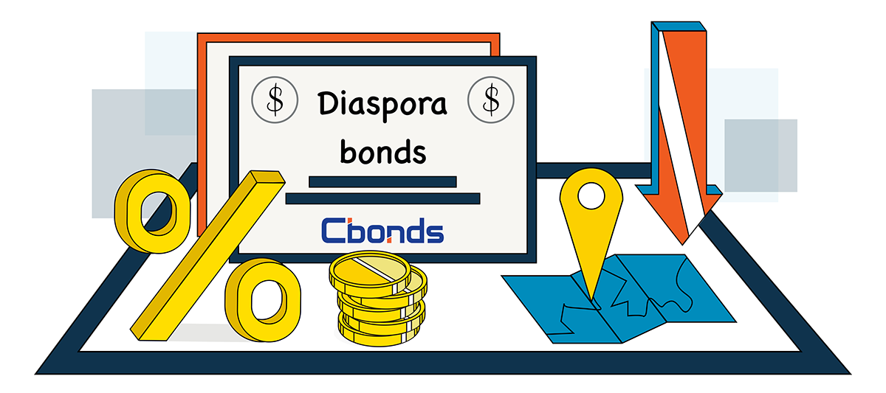

## Table of Contents

## What is a diaspora bond?

A diaspora bond is a type of bond that a country sells to people who have moved away from that country but still feel connected to it. These people are called the diaspora. The money raised from selling these bonds is used to help the country's economy. For example, Israel and India have used diaspora bonds to get money from their citizens living abroad.

Diaspora bonds are attractive because they let people invest in their home country and feel good about helping it grow. The bonds usually offer a good return on investment, which means the people who buy them can earn money. Governments like diaspora bonds because they can get money without borrowing from big banks or other countries. This can be especially helpful during tough economic times.

## Who typically issues diaspora bonds?

Governments of countries with large numbers of people living abroad usually issue diaspora bonds. These governments want to tap into the money their citizens have earned in other countries. For example, Israel and India have been successful in issuing these bonds. They reach out to their diaspora communities, which are groups of people living outside their home country but still connected to it.

The idea behind diaspora bonds is to get financial help from people who feel a strong connection to their home country. These bonds give people a chance to invest in their country's future and feel good about contributing to its development. At the same time, the governments can raise money without having to borrow from international banks or other countries, which can be expensive or come with strict conditions.

## How do diaspora bonds work?

Diaspora bonds are a way for a country to get money from people who used to live there but now live in other places. These people are called the diaspora. When a country issues diaspora bonds, it sells them to its diaspora, who buy them because they want to help their home country and also earn some money. The money from selling the bonds goes into the country's economy and can be used for things like building roads, schools, or helping the country during tough times.

The people who buy diaspora bonds get them at a certain price and are promised to get their money back with some extra, called interest, after a certain time. This interest is what makes the bonds attractive to buyers. For the country, it's a good way to borrow money without going to big banks or other countries that might charge high fees or set strict rules. It's a win-win situation where the diaspora feels good about helping their home country and the country gets the money it needs to grow and develop.

## What are the main purposes of issuing diaspora bonds?

The main purpose of issuing diaspora bonds is to raise money for the country's economy. When a country sells these bonds, it gets money from people who used to live there but now live in other places. This money can be used for important projects like building roads, schools, or hospitals. It can also help the country during tough economic times when it needs money to keep things running smoothly.

Another big reason for issuing diaspora bonds is to connect with the diaspora community. People who buy these bonds often feel a strong connection to their home country and want to help it grow. By buying the bonds, they not only invest in the country's future but also feel good about contributing to its development. This can strengthen the bond between the diaspora and their home country, making them feel more involved and valued.

## What are the advantages of diaspora bonds for issuing countries?

Diaspora bonds help countries get money without having to borrow from big banks or other countries. This is good because borrowing from big banks can be expensive and come with strict rules. With diaspora bonds, countries can get money more easily and use it for important things like building roads, schools, or helping the country during tough times. This can make the country's economy stronger and help it grow.

Another advantage is that diaspora bonds help countries stay connected with people who used to live there but now live in other places. These people, called the diaspora, often feel a strong connection to their home country and want to help it. When they buy diaspora bonds, they feel good about helping their country grow and develop. This can make the diaspora feel more involved and valued, which can be good for the country in the long run.

## What are the benefits for investors in diaspora bonds?

Investors in diaspora bonds can feel good about helping their home country while also making money. When they buy these bonds, they are giving money to their country to use for important things like building roads or schools. This makes them feel connected and proud to help their country grow. At the same time, they get paid back with interest, which means they earn money on their investment. It's like helping their country and getting a reward for it.

Another benefit for investors is that diaspora bonds can be a safe way to invest money. Since the bonds are backed by the government of their home country, there is less risk that the money won't be paid back. This makes it a good choice for people who want to invest in a way that feels secure. Plus, it's a chance to be part of their country's future and see it develop over time, which can be very satisfying.

## What are the potential risks and disadvantages for countries issuing diaspora bonds?

One risk for countries issuing diaspora bonds is that they might not be able to pay back the money they borrowed. If the country's economy gets worse, it might not have enough money to give back to the people who bought the bonds. This can make people lose trust in the country and make it harder to get money in the future. Also, if the country has a lot of debt already, adding more debt through diaspora bonds can make the problem even bigger.

Another disadvantage is that issuing diaspora bonds might not always bring in as much money as the country hopes. If the diaspora doesn't trust the country's government or economy, they might not want to buy the bonds. This can leave the country without the money it needs. Plus, if the interest rates on the bonds are too high, it can cost the country a lot of money to pay back the investors, which can strain the country's budget.

## What challenges might investors face when investing in diaspora bonds?

One challenge for investors in diaspora bonds is the risk that the country might not be able to pay back the money. If the country's economy goes through tough times, it might not have enough money to return to the investors. This can lead to the investors losing their money, which can be a big problem. Also, if the country already has a lot of debt, it might be even harder for it to pay back the diaspora bonds, making the investment riskier.

Another challenge is that the value of diaspora bonds can go up and down a lot. This can happen if there are big changes in the country's economy or if there are political problems. If the value goes down, investors might not be able to sell their bonds for as much money as they paid for them. This can make it hard for investors to know if they will make money or lose money on their investment. It's important for investors to think about these risks before they decide to buy diaspora bonds.

## How do diaspora bonds compare to other types of sovereign bonds?

Diaspora bonds are a special kind of sovereign bond that a country sells to people who used to live there but now live in other places. These bonds are different from regular sovereign bonds because they target a specific group of people—the diaspora—who often feel a strong connection to their home country. This means that diaspora bonds can be a good way for a country to get money without having to borrow from big banks or other countries. Also, people who buy diaspora bonds might be willing to accept lower interest rates because they want to help their home country.

On the other hand, regular sovereign bonds are sold to anyone who wants to buy them, not just people with a special connection to the country. These bonds can be bought by big banks, other countries, or anyone looking to invest money. Because they are open to everyone, regular sovereign bonds might have to offer higher interest rates to attract investors. They can also be riskier for the country if it has a lot of debt or if its economy is not doing well, because it has to pay back money to a wider group of people.

## Can you provide examples of countries that have successfully used diaspora bonds?

Israel has been very successful with diaspora bonds. They started selling these bonds in the 1950s to get money from Jewish people living in other countries. The money helped Israel build important things like roads and schools. It also helped during tough times, like wars. People who bought the bonds felt good about helping Israel, and they also made money from the interest. Israel's diaspora bonds are so popular that they have raised billions of dollars over the years.

India is another country that has used diaspora bonds well. They started selling these bonds in 1991 when they needed money to help their economy. They called them "India Development Bonds" and sold them to Indian people living abroad. The money helped India pay for important projects and keep their economy stable. Like in Israel, Indian people living in other countries felt proud to help their home country and also earned money from the bonds. India's success with diaspora bonds showed other countries how useful they can be.

## What are the regulatory and legal considerations for issuing diaspora bonds?

When a country wants to issue diaspora bonds, it needs to follow certain rules and laws. These rules can be different in each country, but they usually include things like getting approval from the government or a special agency. The country also needs to make sure that the bonds follow the rules of the places where the diaspora lives. This means they might need to work with lawyers and financial experts to make sure everything is done right. If the rules are not followed, the country might have trouble selling the bonds or could face legal problems.

Another important part is being clear and honest with the people who might buy the bonds. The country needs to tell the diaspora all the important details about the bonds, like how much money they will get back and when. This is called being transparent, and it helps build trust. If the country does not share all the information or if it is not clear, people might not want to buy the bonds. So, making sure to follow the rules and being open with investors are both very important for successfully issuing diaspora bonds.

## How can the effectiveness of diaspora bonds be measured and evaluated?

The effectiveness of diaspora bonds can be measured by looking at how much money the country raises from selling them. If the country gets a lot of money, it means the bonds are working well. Another way to measure effectiveness is to see if the money is used for good things, like building roads or schools. If these projects help the country's economy grow, then the bonds are successful. It's also important to see if the people who bought the bonds are happy with their investment. If they get their money back with interest, they will feel good about helping their home country.

Evaluating diaspora bonds also involves looking at how well the country connects with its diaspora. If more people from the diaspora buy the bonds, it shows that they feel connected to their home country and want to help it. This can make the diaspora feel more involved and valued. It's also important to see if the bonds help the country during tough times, like when the economy is not doing well. If the bonds bring in money when it's needed most, they are very effective. By looking at these things, a country can see how well its diaspora bonds are working.

## References & Further Reading

[1]: Ketkar, Suhas L., and Dilip Ratha. ["Diaspora Bonds: Tapping the Diaspora during Difficult Times."](https://papers.ssrn.com/sol3/papers.cfm?abstract_id=1913988) World Bank Policy Research Working Paper No. 4311, 2007.

[2]: Aykut, Dilek, and Dilip Ratha. ["South-South FDI Flows: How Big Are They?"](https://www.researchgate.net/publication/284627258_South-south_FDI_flows_How_big_are_they) Transnational Corporations 13, no. 1, 2004.

[3]: ["Algorithmic Trading and DMA: An Introduction to Direct Access Trading Strategies"](https://www.amazon.com/Algorithmic-Trading-DMA-introduction-strategies/dp/0956399207) by Barry Johnson

[4]: Debelle, Guy. ["Economic Consequences of Algorithms."](https://www.oxera.com/insights/agenda/articles/the-risks-of-using-algorithms-in-business-artificial-price-collusion/) Speech given at the UBS Thirty-First Annual Reserve Management Seminar, Thun, Switzerland, 2017.

[5]: Narayanaswamy, R., Annavajhula, C. J. H., & Ramakrishnan, R. ("Contribution of Diaspora Bonds in Economic Development of Nations."](https://bjohns.in/journal3/index.php/bjohns/article/view/201) Studies in Business and Economics, 2020.